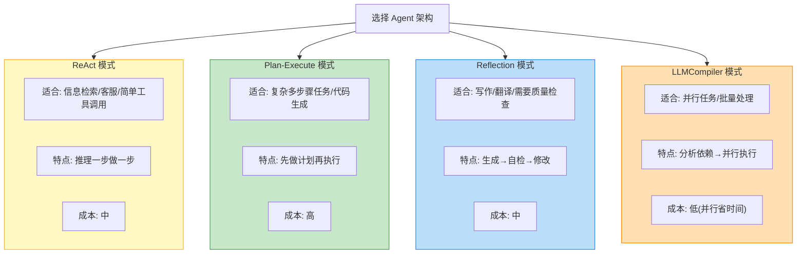
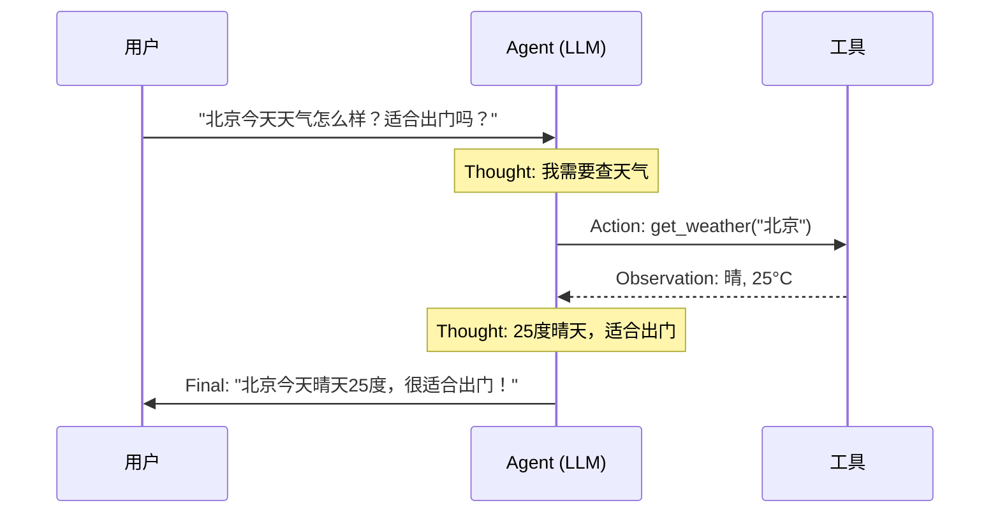
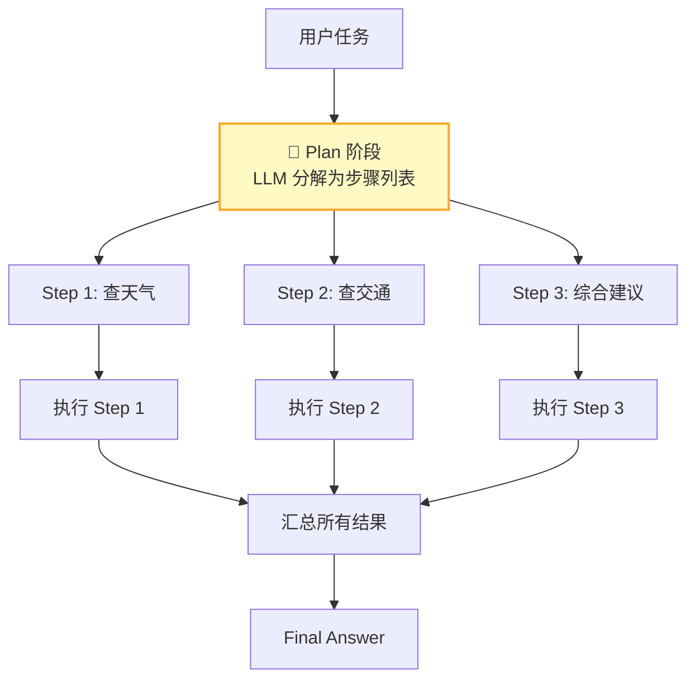
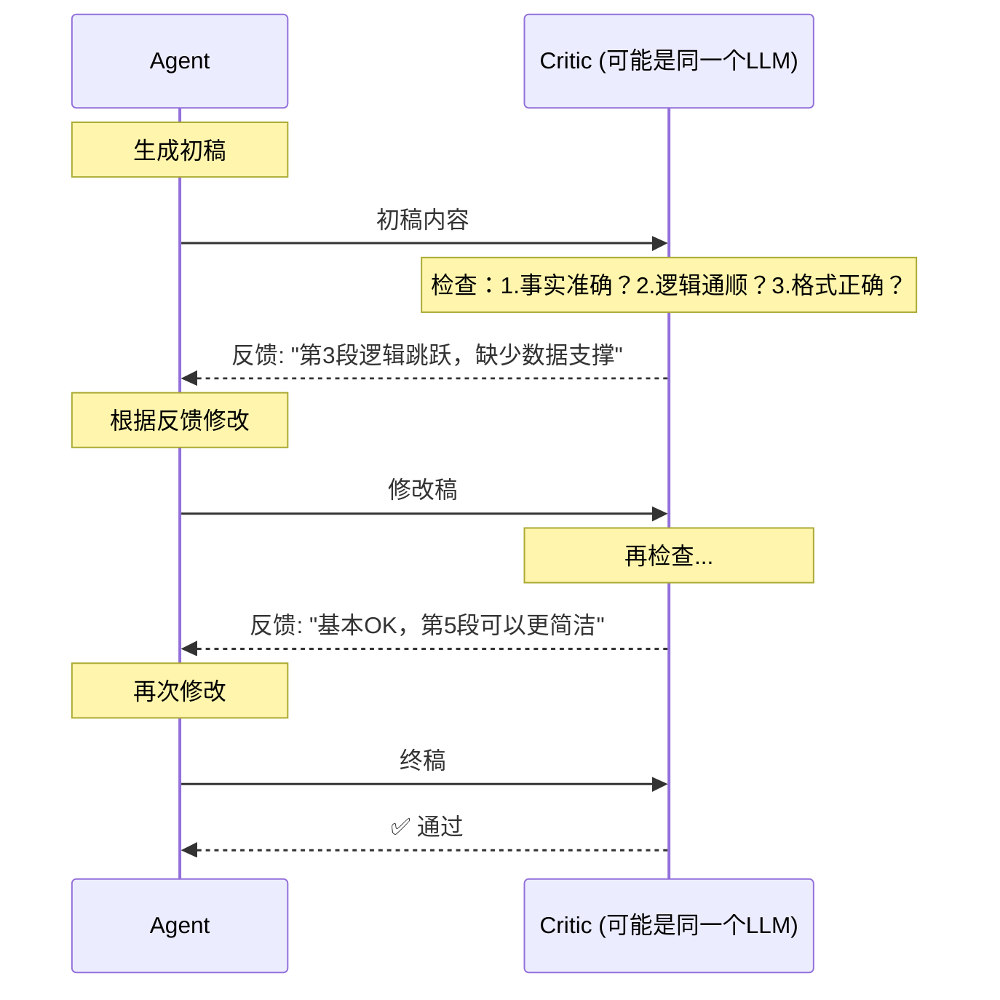
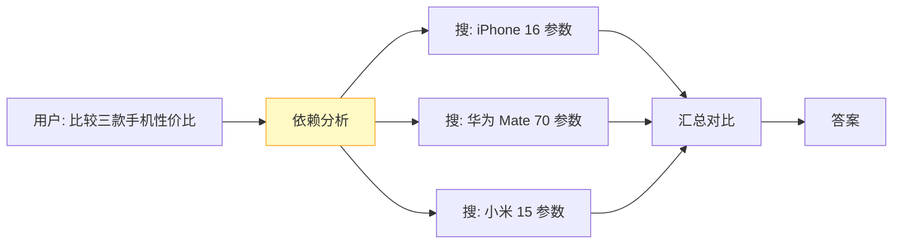
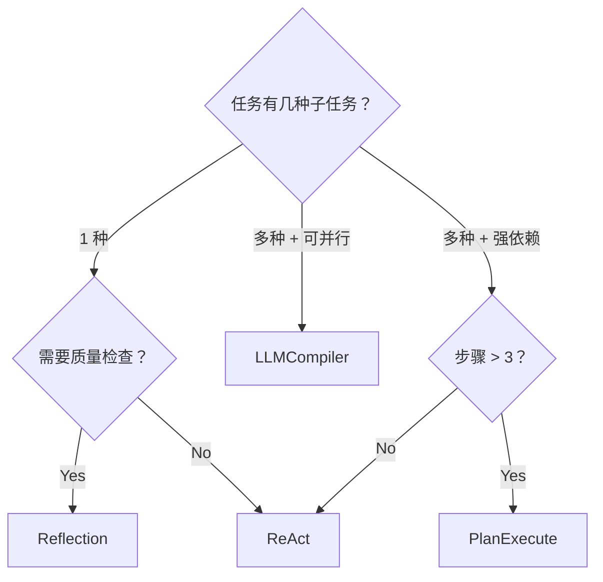

# Agent 架构模式全景

> **一句话**：不是所有任务都适合 ReAct。四种主流 Agent 架构各有最优场景，选错模式会导致 token 浪费 3 倍、任务失败率翻倍。

## 四种模式速览



---

## 模式一：ReAct（推理-行动循环）

### 原理

```
循环执行：Thought → Action → Observation → Thought → ... → Final Answer
```



### 适用场景

| ✅ 适合 | ❌ 不适合 |
|---------|----------|
| 单步/少步工具调用 | 需要先规划再执行的任务 |
| 信息检索类任务 | 步骤之间有复杂依赖关系 |
| 客服问答 | 需要并行执行的任务 |
| 简单代码生成+运行 | 需要自我检查质量的创作任务 |

### 实现骨架

```python
"""
ReAct Agent 核心实现
"""

import json

class ReActAgent:
    def __init__(self, llm, tools: dict):
        self.llm = llm
        self.tools = tools  # {"tool_name": func}
        self.max_steps = 10
        self.history = []

    def run(self, task: str) -> str:
        prompt = self._build_prompt(task)

        for step in range(self.max_steps):
            # 1. Think: LLM 推理下一步
            response = self.llm.chat(prompt)

            # 2. 解析输出：是 Action 还是 Final Answer？
            if "Final Answer:" in response:
                return response.split("Final Answer:")[1].strip()

            if "Action:" in response:
                action_str = response.split("Action:")[1].strip()
                tool_name, tool_input = self._parse_action(action_str)

                # 3. Act: 执行工具
                observation = self.tools[tool_name](tool_input)

                # 4. 把 Observation 追加到 prompt，继续下一轮
                prompt += f"\nObservation: {observation}\n"

                self.history.append({
                    "step": step,
                    "thought": response,
                    "action": tool_name,
                    "observation": observation
                })

        return "达到最大步数限制"

    def _build_prompt(self, task: str) -> str:
        return f"""你是一个 ReAct Agent。用以下格式回答：

Thought: 你的推理过程
Action: tool_name(tool_input)
Observation: 工具返回的结果

...（可重复 Thought/Action/Observation 多轮）

Final Answer: 最终答案

可用工具：
{self._tools_description()}

任务: {task}
"""

    def _tools_description(self) -> str:
        return "\n".join(
            f"- {name}: {func.__doc__}"
            for name, func in self.tools.items()
        )
```

### 优缺点

| 优点 | 缺点 |
|------|------|
| 简单直观，容易调试 | 没有全局规划，容易"走一步看一步" |
| 每步有思考记录，可追溯 | 复杂任务需要很多步，token 消耗大 |
| 适合大多数中等复杂度任务 | 不会"回头看"已经做过什么 |

---

## 模式二：Plan-Execute（先规划再执行）

### 原理

```
Plan → Execute Step 1 → Execute Step 2 → ... → Aggregate → Final Answer
```



### 适用场景

| ✅ 适合 | ❌ 不适合 |
|---------|----------|
| 多步骤复杂任务（3+ 步） | 简单单步任务 |
| 步骤之间有明确依赖关系 | 需要根据中间结果动态调整 |
| 可以提前确定完整计划 | 探索性任务（不知道要做什么） |
| 代码生成+执行+测试 | 纯信息检索 |

### 与 ReAct 的关键区别

```
ReAct:  做一步 → 看结果 → 决定下一步 → 做一步 → ...
        (串行，灵活但慢)

PlanEx: 先想全貌 → 列出步骤 → 依次执行 → 汇总
        (并行机会多，快但不灵活)
```

### 实现骨架

```python
"""
Plan-Execute Agent 实现
"""

class PlanExecuteAgent:
    def __init__(self, llm, tools: dict):
        self.llm = llm
        self.tools = tools

    def run(self, task: str) -> str:
        # ---- Phase 1: Plan ----
        plan = self._create_plan(task)
        # plan = [{"step": 1, "action": "get_weather", "input": "北京"},
        #         {"step": 2, "action": "get_traffic", "input": "北京"},
        #         {"step": 3, "action": "synthesize", "input": ["result1", "result2"]}]

        # ---- Phase 2: Execute ----
        results = {}
        for step in plan:
            if step["action"] == "synthesize":
                # 汇总步骤：把前面所有结果给 LLM 做最终合成
                context = "\n".join(
                    f"Step {s['step']} 结果: {results[s['step']]}"
                    for s in plan if s["step"] < step["step"]
                )
                answer = self._synthesize(task, context)
                return answer
            else:
                # 执行工具
                tool_func = self.tools[step["action"]]
                result = tool_func(step["input"])
                results[step["step"]] = result

        return "Plan execution completed but no synthesis step found"

    def _create_plan(self, task: str) -> list:
        """LLM 生成执行计划"""
        prompt = f"""将以下任务分解为具体步骤。每个步骤需要：
- step: 步骤编号
- action: 使用的工具名称
- input: 工具的输入参数
- depends_on: 依赖的前置步骤编号（列表）

最后一步 action 必须是 "synthesize"，用于汇总结果。

可用工具：
{self._tools_description()}

任务: {task}

只输出 JSON 数组："""
        response = self.llm.chat(prompt)
        return json.loads(response)
```

---

## 模式三：Reflection（反思模式）

### 原理

```
Generate → Critic → Revise → Generate → ... → Output
```



### 适用场景

| ✅ 适合 | ❌ 不适合 |
|---------|----------|
| 写作/翻译/文案生成 | 实时性要求高的任务 |
| 代码 Review/优化 | 简单工具调用 |
| 需要保证质量的输出 | 成本敏感的场景 |

### 核心：Critic 怎么设计？

```python
"""
Reflection Agent —— 关键是设计好的 Critic
"""

class ReflectionAgent:
    def __init__(self, llm):
        self.llm = llm
        self.max_iterations = 3

    def generate(self, task: str, quality_checklist: list = None) -> str:
        # 1. 生成初稿
        draft = self._generate_draft(task)

        for i in range(self.max_iterations):
            # 2. Critic 审查
            feedback = self._critique(draft, task, quality_checklist)

            if "PASS" in feedback:
                return draft  # 通过审查

            # 3. 根据反馈修改
            draft = self._revise(draft, feedback)

        return draft  # 达到最大迭代次数，返回当前版本

    def _critique(self, content: str, task: str, checklist: list) -> str:
        """审查器 —— 按检查清单逐项检查"""
        checklist_text = "\n".join(f"- {item}" for item in checklist or [])

        prompt = f"""你是严格的质量审查员。审查以下内容：

任务描述: {task}

质量检查清单:
{checklist_text}

审查内容:
---
{content}
---

请逐项检查，给出具体反馈。如果通过所有检查，回复 "PASS"。
如果不通过，指出具体哪里需要修改、怎么改。"""

        return self.llm.chat(prompt)

    def _generate_draft(self, task: str) -> str:
        prompt = f"请完成以下任务：{task}"
        return self.llm.chat(prompt)

    def _revise(self, content: str, feedback: str) -> str:
        prompt = f"""根据以下反馈修改内容：

原始内容:
{content}

反馈:
{feedback}

请输出修改后的完整内容："""
        return self.llm.chat(prompt)
```

### 典型检查清单

```python
# 技术文档检查清单
TECH_DOC_CHECKLIST = [
    "代码示例是否能正常运行？",
    "术语使用是否一致？",
    "是否有缺失的步骤或前置条件？",
    "逻辑是否通顺，没有跳跃？",
    "格式是否统一（标题、代码块、表格）？",
]

# 翻译检查清单
TRANSLATION_CHECKLIST = [
    "是否保留了原文的所有信息点？",
    "是否符合中文表达习惯（不是翻译腔）？",
    "专业术语翻译是否准确？",
    "长句是否拆分成了易读的短句？",
]
```

---

## 模式四：LLMCompiler（并行执行）

### 原理

LLMCompiler 的核心思想：**先分析依赖，能并行的全部并行**。

```
传统 ReAct（串行）：
Step 1 (2s) → Step 2 (2s) → Step 3 (2s) = 6s

LLMCompiler（并行）：
Step 1 ─┬─ Step 2（并行）── Step 3 = 4s
        └─ Step 3 依赖 Step 1
```



---

## 选型决策树



### 一句话选型

| 场景 | 推荐模式 | 原因 |
|------|---------|------|
| "帮我查一下 X" | ReAct | 1-2 步工具调用，简单直接 |
| "从零写一个电商系统" | Plan-Execute | 复杂多步骤，需要全局规划 |
| "帮我润色这篇文章" | Reflection | 需要质量审查和迭代改进 |
| "搜索 10 个数据源并汇总" | LLMCompiler | 搜索任务可完全并行 |
| "分析这个问题并告诉我原因" | ReAct | 探索性推理，边走边看 |

## 常见误区

- **误区1**："ReAct 能解决一切" → ReAct 在复杂多步骤任务中表现差，反复推理消耗大量 token。
- **误区2**："Plan-Execute 的计划一成不变" → 可以结合 ReAct：**宏观用 Plan，微观用 ReAct**。计划是指导，执行中允许调整。
- **误区3**："Reflection 就是多调几次 LLM" → Reflection 的核心是 **Critic 的质量**。Critic 太松=没效果，太严=死循环。
- **误区4**："LLMCompiler 只适合并行任务" → 即使任务不完全并行，依赖分析阶段也能减少无效等待。

## 参考来源

- ReAct 论文: https://arxiv.org/abs/2210.03629
- Plan-and-Execute: https://blog.langchain.dev/planning-agents/
- LLMCompiler: https://arxiv.org/abs/2312.04511
- Reflection (Self-Refine): https://arxiv.org/abs/2303.17651
