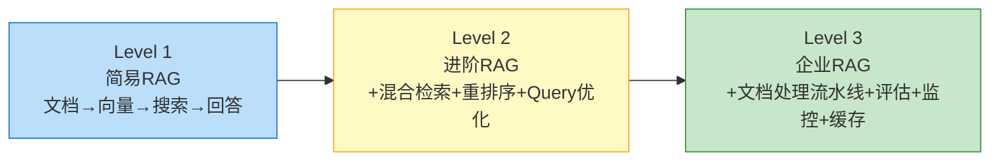
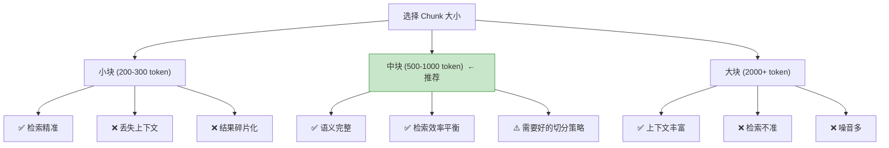

# RAG 系统架构设计

> **一句话**：RAG 不是"接个向量数据库就完事"。从 Demo 到生产环境，架构要经历三次升级——每一次解决一类新问题。

## 核心概念

写一个 RAG Demo 只需要 50 行代码（见 `05-RAG检索增强生成.md`）。但生产环境的 RAG 系统面临的问题完全不同：

| Demo 的假设 | 生产环境的现实 |
|-------------|---------------|
| 文档是干净的 Markdown | PDF 扫描件、表格、图片混合 |
| 10 篇文档 | 10 万篇文档，每天新增 500 篇 |
| 用户问什么搜什么 | 用户问"那个东西"——指代消解 |
| 检索到就行 | 检索到 ≠ 检索对 ≠ 答案对 |
| 一个人用 | 1000 人并发 |

**RAG 架构的本质，就是用结构性复杂度换取可靠性和可扩展性。**

## 架构演进三阶段



### Level 1：简易 RAG（Demo 级）

```
用户问题 → Embedding → 向量检索 Top-K → 拼进 Prompt → LLM 回答
```

**能解决的问题**：单文档问答、知识库 < 1000 篇、对精度要求不高的场景。

**不能解决的问题**：检索不准、文档更新、性能、评估。

**适用场景**：原型验证、内部小工具、个人知识库。

### Level 2：进阶 RAG（团队级）

```
                          ┌─ 文档预处理 ─┐
                          │  切分策略选型  │
                          │  元数据提取    │
                          └──────┬───────┘
                                 ↓
用户问题 → Query重写 → 混合检索 → 重排序 → LLM回答
              ↑            ↑         ↑
         [LLM优化]   [向量+BM25]  [Cross-Encoder]
```

**新增能力**：
- **Query 重写**：把"上次那个方案"改成"2024年Q3的用户增长方案"
- **混合检索**：向量 + BM25 互补，召回率提升 30-50%
- **重排序**：Top-30 → Reranker → Top-3，精准度提升明显

**适用场景**：团队内部知识库（几千到几万篇）、客服系统、文档助手。

### Level 3：企业 RAG（生产级）

```
                   ┌────────── 文档处理流水线 ──────────┐
                   │ 多格式解析 → 布局分析 → OCR → 表格提取 │
                   │ → 语义切分 → 实体识别 → 元数据标注     │
                   └────────────────┬───────────────────┘
                                    ↓
用户问题 → 意图识别 → 多路召回 → 融合排序 → 后处理 → LLM → 答案校验 → 输出
              │           │           │         │        │         │
              ↓           ↓           ↓         ↓        ↓         ↓
          [改写/扩展] [向量+BM25 [Reranker+  [引用/敏感 [缓存命中] [事实性
                      +图谱+ES]  多样性控制]  词过滤]             校验]
```

**新增能力**：
- **文档处理流水线**：PDF/Word/扫描件/表格 → 统一结构化
- **多路召回**：向量 + BM25 + 知识图谱 + Elasticsearch，不同问题走不同路
- **后处理**：引用标注、敏感词过滤、格式规范化
- **缓存层**：相同/相似问题直接返回缓存答案（省 80% API 费用）
- **评估监控**：RAGAS 指标 + 用户反馈闭环

## 关键设计决策

### 决策 1：单一向量库 vs 多路召回

```
问："HashMap 和 ConcurrentHashMap 的区别"

只走向量检索:
  → 能搜到 HashMap 相关文档
  → 也能搜到 ConcurrentHashMap 相关文档
  → 但可能漏掉专门讲"区别对比"的文档

多路召回:
  向量检索: "HashMap ConcurrentHashMap 区别" → 语义相关 Top-10
  BM25:     "HashMap" AND "ConcurrentHashMap" AND "区别" → 关键词命中 Top-10
  合并去重 → 覆盖更全
```

**结论**：文档量 > 1000 就用多路召回。向量 + BM25 是最低成本的混合方案，效果已经很好。

### 决策 2：Chunk 大小的权衡



**经验法则**：
- 中文文档：800-1200 字符（中文信息密度高）
- 英文文档：500-800 字符
- 代码文档：按函数/类边界切，不按固定长度

### 决策 3：用不用 RAG？—— 2026 年的新问题

```
你的文档总量 < 500K tokens？
  ├── YES → 直接塞 Context Window（DeepSeek V4 Pro 支持 1M）
  │         ✅ 更准确（无检索损失）
  │         ✅ 更简单（无 RAG 管线）
  │         ✅ 更便宜（无 Embedding + 向量库成本）
  │
  └── NO  → 用 RAG
            ├── 需要精确引用？ → 企业级 RAG + 引用标注
            ├── 需要实时更新？ → RAG（秒级更新 vs 微调天级）
            └── 需要审计追溯？ → RAG（每个答案可追溯到源文档）
```

## 架构代码骨架

```python
"""
企业级 RAG 系统架构骨架
展示各层之间的接口和数据流，不依赖具体实现
"""

from abc import ABC, abstractmethod
from dataclasses import dataclass, field
from typing import List, Optional
import hashlib
import time


# ============================================================
# 1. 数据模型
# ============================================================

@dataclass
class Document:
    """统一文档模型——所有格式解析后都转成这个"""
    doc_id: str
    content: str
    metadata: dict = field(default_factory=dict)
    chunks: List["Chunk"] = field(default_factory=list)


@dataclass
class Chunk:
    """文档切分后的最小检索单元"""
    chunk_id: str
    content: str
    doc_id: str
    metadata: dict = field(default_factory=dict)
    embedding: Optional[List[float]] = None


@dataclass
class RetrievalResult:
    """单条检索结果"""
    chunk: Chunk
    score: float
    source: str  # "vector" | "bm25" | "graph" | "es"


@dataclass
class RAGResponse:
    """RAG 完整响应"""
    answer: str
    sources: List[RetrievalResult]
    latency_ms: float
    cached: bool = False


# ============================================================
# 2. 文档处理层（Level 3 核心）
# ============================================================

class DocumentProcessor(ABC):
    """文档处理器接口"""

    @abstractmethod
    def parse(self, file_path: str) -> Document:
        """解析文件 → 统一 Document 格式"""
        ...

    @abstractmethod
    def chunk(self, doc: Document, strategy: str = "semantic") -> List[Chunk]:
        """切分文档 → Chunk 列表"""
        ...


class PDFProcessor(DocumentProcessor):
    """PDF 处理器：处理文字型 PDF、扫描件 OCR、表格提取"""

    def parse(self, file_path: str) -> Document:
        # 实际实现：PyPDF2 / pdfplumber / PaddleOCR
        ...

    def chunk(self, doc: Document, strategy: str = "semantic") -> List[Chunk]:
        ...


class MarkdownProcessor(DocumentProcessor):
    """Markdown 处理器：按标题层级切分"""

    def parse(self, file_path: str) -> Document:
        ...

    def chunk(self, doc: Document, strategy: str = "semantic") -> List[Chunk]:
        # 按 # / ## / ### 标题切分，保留层级元数据
        ...


# ============================================================
# 3. 检索层（多路召回 + 融合排序）
# ============================================================

class BaseRetriever(ABC):
    """检索器基类"""

    @abstractmethod
    def search(self, query: str, top_k: int) -> List[RetrievalResult]:
        ...


class VectorRetriever(BaseRetriever):
    """向量检索器"""

    def __init__(self, vector_store):
        self.store = vector_store

    def search(self, query: str, top_k: int) -> List[RetrievalResult]:
        results = self.store.similarity_search_with_score(query, k=top_k)
        return [
            RetrievalResult(chunk=c, score=s, source="vector")
            for c, s in results
        ]


class BM25Retriever(BaseRetriever):
    """关键词检索器"""

    def __init__(self, corpus: List[str], chunks: List[Chunk]):
        from rank_bm25 import BM25Okapi
        self.bm25 = BM25Okapi([c.split() for c in corpus])
        self.chunks = chunks

    def search(self, query: str, top_k: int) -> List[RetrievalResult]:
        scores = self.bm25.get_scores(query.split())
        top_indices = sorted(range(len(scores)),
                            key=lambda i: scores[i], reverse=True)[:top_k]
        return [
            RetrievalResult(chunk=self.chunks[i], score=scores[i], source="bm25")
            for i in top_indices
        ]


class FusionRanker:
    """融合排序器：合并多路结果 + 重排序"""

    @staticmethod
    def reciprocal_rank_fusion(
        result_lists: List[List[RetrievalResult]], k: int = 60
    ) -> List[RetrievalResult]:
        """
        RRF (Reciprocal Rank Fusion) 算法
        各路结果按排名加权合并，自动提升被多路共同认可的结果
        """
        scores = {}
        for results in result_lists:
            for rank, r in enumerate(results):
                scores[r.chunk.chunk_id] = (
                    scores.get(r.chunk.chunk_id, 0) + 1.0 / (k + rank + 1)
                )
        # 重排序...
        return sorted(
            list(set(r for results in result_lists for r in results)),
            key=lambda r: scores.get(r.chunk.chunk_id, 0),
            reverse=True
        )


# ============================================================
# 4. 缓存层（省 80% 费用）
# ============================================================

class RAGCache:
    """
    两级缓存：
    - L1：精确匹配（问题哈希 → 答案）
    - L2：语义匹配（相似问题 → 答案）
    """

    def __init__(self, vector_store):
        self.exact_cache = {}  # hash(question) -> answer
        self.vector_store = vector_store

    def get(self, question: str, threshold: float = 0.95) -> Optional[str]:
        # L1: 精确匹配
        q_hash = hashlib.md5(question.encode()).hexdigest()
        if q_hash in self.exact_cache:
            return self.exact_cache[q_hash]

        # L2: 语义相似匹配
        similar = self.vector_store.similarity_search_with_score(
            question, k=1
        )
        if similar and similar[0][1] > threshold:
            return similar[0][0].metadata.get("cached_answer")

        return None

    def set(self, question: str, answer: str):
        q_hash = hashlib.md5(question.encode()).hexdigest()
        self.exact_cache[q_hash] = answer


# ============================================================
# 5. 编排层（把所有组件串起来）
# ============================================================

class EnterpriseRAG:
    """企业级 RAG 编排器"""

    def __init__(
        self,
        retrievers: List[BaseRetriever],
        reranker,  # Cross-Encoder reranker
        llm_client,
        cache: RAGCache,
    ):
        self.retrievers = retrievers
        self.reranker = reranker
        self.llm = llm_client
        self.cache = cache
        self.fusion = FusionRanker()

    def query(self, question: str, top_k: int = 5) -> RAGResponse:
        start = time.time()

        # Step 1: 检查缓存
        cached = self.cache.get(question)
        if cached:
            return RAGResponse(
                answer=cached,
                sources=[],
                latency_ms=(time.time() - start) * 1000,
                cached=True
            )

        # Step 2: 多路召回（每路取 top_k * 2，融合后再取 top_k）
        all_results = []
        for retriever in self.retrievers:
            results = retriever.search(question, top_k * 2)
            all_results.append(results)

        # Step 3: 融合排序
        fused = self.fusion.reciprocal_rank_fusion(all_results)

        # Step 4: 重排序（Cross-Encoder 精排）
        reranked = self.reranker.rerank(question, [r.chunk for r in fused], top_k)

        # Step 5: LLM 生成
        context = "\n\n".join(
            f"[来源{i+1}] {r.chunk.content}" for i, r in enumerate(reranked)
        )
        answer = self.llm.generate(question, context)

        # Step 6: 写入缓存
        self.cache.set(question, answer)

        return RAGResponse(
            answer=answer,
            sources=reranked,
            latency_ms=(time.time() - start) * 1000,
        )
```

## 常见误区 / 设计陷阱

- **陷阱1**："一开始就上企业级架构" → 过度设计。先从 Level 1 开始，**哪痛治哪**。检索不准加混合检索，成本高加缓存，不要为了架构而架构。
- **陷阱2**："所有文档用同一种切分策略" → PDF 用按页切、Markdown 用按标题切、代码用按函数切。**不同文档类型不同策略**。
- **陷阱3**："向量数据库存了就行" → 文档有更新怎么办？要有 **upsert + 版本管理** 机制，否则旧知识污染新答案。
- **陷阱4**："Reranker 越强越好" → Reranker（Cross-Encoder）很慢。只对 Top-30 做重排，不要对全量做。
- **陷阱5**："缓存所有问题" → 带时间/状态的问题不能缓存（"今天天气""当前库存"），需要做**缓存键设计**。

## 参考来源

- 同目录 `05-RAG检索增强生成.md` — RAG 原理与进阶技术
- 同目录 `RAG企业级落地方案.md` — 完整落地案例
- LangChain RAG 文档: https://python.langchain.com/docs/tutorials/rag/
- RAGAS 评估框架: https://docs.ragas.io/
- Microsoft GraphRAG: https://github.com/microsoft/graphrag
