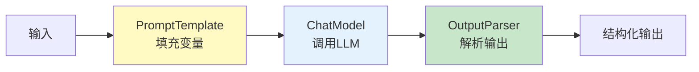
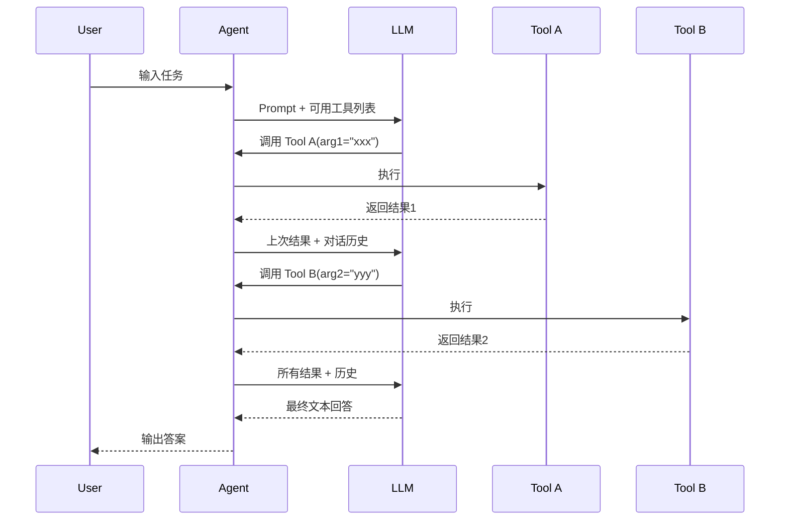

# LangChain 实战开发

> **一句话**:LangChain 是 Agent 开发的"Spring Boot"——它不是必须的，但提供了大量开箱即用的组件，能让你10分钟搭出一个能跑的 Agent。

## 核心概念

LangChain 的核心思想是**链式编排（Chain）**：把 LLM、Prompt、工具、输出解析器等组件像链条一样串起来，形成一个完整的数据处理流水线。



### LangChain 的六大核心抽象

| 抽象 | 作用 | 类比 Java |
|------|------|-----------|
| **Model (I/O)** | LLM 调用封装 | RestClient / RestTemplate |
| **PromptTemplate** | Prompt 模板，变量填充 | String.format() |
| **OutputParser** | 解析 LLM 输出为结构化数据 | JSON 反序列化 |
| **Tool** | 可被 LLM 调用的函数 | @Bean / Service |
| **Chain** | 串联多个步骤的执行链 | Filter Chain / Interceptor |
| **Agent** | LLM 自主决策 + 工具调用的循环 | 无直接对应（这是 AI 特有的） |

## 原理图解

### LangChain Agent 的执行流程



## 代码实例

### 环境准备

```bash
# 创建虚拟环境（推荐 uv，新一代 Python 包管理器）
pip install uv
uv venv agent-env
source agent-env/bin/activate  # Windows: agent-env\Scripts\activate

# 安装依赖
pip install langchain langchain-openai langchain-community chromadb
```

### 实战1: 基础 Chain — 结构化信息提取

```python
"""
LangChain 实战1: 结构化信息提取
从非结构化文本中提取结构化数据
"""

from langchain_openai import ChatOpenAI
from langchain_core.prompts import ChatPromptTemplate
from langchain_core.output_parsers import JsonOutputParser
from pydantic import BaseModel, Field

# ========== 定义输出结构 ==========
class CompanyInfo(BaseModel):
    """期望LLM输出的JSON结构"""
    name: str = Field(description="公司全称")
    industry: str = Field(description="所属行业")
    founded_year: int = Field(description="成立年份")
    headquarters: str = Field(description="总部所在城市")
    products: list[str] = Field(description="主要产品/服务列表")
    description: str = Field(description="一句话描述")

# ========== 创建组件 ==========
llm = ChatOpenAI(
    model="deepseek-chat",
    api_key="your-key",
    base_url="https://api.deepseek.com",
    temperature=0
)

parser = JsonOutputParser(pydantic_object=CompanyInfo)

# Prompt 模板（注意 {format_instructions} 会被自动填充）
prompt = ChatPromptTemplate.from_messages([
    ("system", "你是一个信息提取专家。从文本中精准提取公司信息。{format_instructions}"),
    ("user", "请提取以下文本中的公司信息:\n{text}")
])

# ========== 组装 Chain ==========
chain = prompt | llm | parser

# ========== 运行 ==========
text = """
阿里巴巴集团控股有限公司（Alibaba Group）成立于1999年，
总部位于中国浙江省杭州市，由马云等18位创始人创立。
阿里巴巴是全球领先的电子商务公司，旗下拥有淘宝、天猫、
阿里云、菜鸟网络等知名业务。公司业务涵盖电商零售、
云计算、数字媒体和创新项目等多个领域。
"""

result = chain.invoke({
    "text": text,
    "format_instructions": parser.get_format_instructions()
})

print("提取结果:")
for key, value in result.items():
    print(f"  {key}: {value}")

# 输出:
#   name: 阿里巴巴集团控股有限公司
#   industry: 电子商务
#   founded_year: 1999
#   headquarters: 杭州
#   products: ['淘宝', '天猫', '阿里云', '菜鸟网络']
#   description: 全球领先的电子商务公司
```

### 实战2: 带 RAG 的问答 Agent

```python
"""
LangChain 实战2: RAG 问答系统
用 LangChain 的标准组件搭建一个知识库问答Agent
"""

from langchain_openai import ChatOpenAI, OpenAIEmbeddings
from langchain_community.vectorstores import Chroma
from langchain.text_splitter import RecursiveCharacterTextSplitter
from langchain_core.prompts import ChatPromptTemplate
from langchain_core.runnables import RunnablePassthrough
from langchain_core.output_parsers import StrOutputParser

llm = ChatOpenAI(
    model="deepseek-chat",
    api_key="your-key",
    base_url="https://api.deepseek.com"
)

# 用 OpenAI 的 Embedding（或用 HuggingFaceEmbeddings 免费本地版）
# embeddings = HuggingFaceEmbeddings(model_name="all-MiniLM-L6-v2")

# ========== 1. 准备文档 ==========
documents = [
    "Spring Boot自动装配通过@EnableAutoConfiguration触发，读取META-INF/spring.factories中的配置类列表，按@Conditional条件过滤后注册Bean。",
    "Spring IoC容器核心是BeanFactory和ApplicationContext。BeanFactory是基础容器，ApplicationContext是高级容器，提供事件发布、资源加载等额外功能。",
    "Spring AOP使用动态代理实现。JDK动态代理针对接口，CGLIB针对类。Spring Boot默认使用CGLIB代理。@Around通知能控制目标方法是否执行。",
    "MyBatis的核心是SqlSessionFactory和SqlSession。Mapper XML中的#{}是预编译参数(安全)，${}是字符串拼接(SQL注入风险)。",
    "Redis集群方案: 主从(读写分离)、哨兵(自动故障转移)、Cluster(分片+高可用)。Cluster模式下数据分16384个slot。"
]

# ========== 2. 切分 + 向量化 + 存储 ==========
splitter = RecursiveCharacterTextSplitter(chunk_size=200, chunk_overlap=50)
chunks = splitter.create_documents(documents)

vectorstore = Chroma.from_documents(
    documents=chunks,
    embedding=OpenAIEmbeddings(api_key="your-key", base_url="https://api.deepseek.com/v1"),
    persist_directory="./langchain_rag_db"
)
retriever = vectorstore.as_retriever(search_kwargs={"k": 3})

# ========== 3. 构建RAG Chain ==========
template = """根据以下上下文回答问题。如果上下文中没有相关信息，请说"根据已知信息无法回答"。

上下文:
{context}

问题: {question}

回答:"""

prompt = ChatPromptTemplate.from_template(template)

def format_docs(docs):
    return "\n\n".join(f"[{i+1}] {d.page_content}" for i, d in enumerate(docs))

# LangChain 的链式语法 (LCEL - LangChain Expression Language)
rag_chain = (
    {"context": retriever | format_docs, "question": RunnablePassthrough()}
    | prompt
    | llm
    | StrOutputParser()
)

# ========== 4. 查询 ==========
questions = [
    "Spring Boot自动装配的原理是什么？",
    "MyBatis中#{}和${}有什么区别？",
    "Redis Cluster怎么分片的？",
]

for q in questions:
    print(f"\n问: {q}")
    print(f"答: {rag_chain.invoke(q)}")
```

### 实战3: 自定义工具 Agent

```python
"""
LangChain 实战3: 自定义工具 + Agent
让Agent能调用你定义的工具
"""

from langchain_openai import ChatOpenAI
from langchain.tools import tool
from langchain.agents import create_tool_calling_agent, AgentExecutor
from langchain_core.prompts import ChatPromptTemplate

# ========== 定义工具（@tool 装饰器最简洁）==========
@tool
def search_documentation(query: str) -> str:
    """搜索Java技术文档。输入搜索关键词，返回相关文档片段。
    当用户问Java技术问题时使用此工具。
    """
    docs = {
        "HashMap": "HashMap: 数组+链表+红黑树, 初始容量16, 负载因子0.75",
        "ArrayList": "ArrayList: 动态数组, 默认容量10, 扩容1.5倍",
        "Spring": "Spring: IoC容器 + AOP + 事务管理",
    }
    for key, val in docs.items():
        if key.lower() in query.lower():
            return val
    return f"未找到与'{query}'相关的文档"

@tool
def run_code(code: str) -> str:
    """执行Python代码片段并返回结果。用于计算和数据分析。
    输入: Python代码字符串。
    """
    try:
        local_vars = {}
        exec(code, {"__builtins__": __builtins__}, local_vars)
        return str(local_vars.get("result", "代码执行完成，无返回值"))
    except Exception as e:
        return f"代码执行错误: {e}"

@tool
def create_summary(text: str, max_length: int = 200) -> str:
    """对长文本进行摘要。输入文本和最大长度限制。
    """
    if len(text) <= max_length:
        return text
    return text[:max_length-3] + "..."

tools = [search_documentation, run_code, create_summary]

# ========== 创建 Agent ==========
llm = ChatOpenAI(
    model="deepseek-chat",
    api_key="your-key",
    base_url="https://api.deepseek.com"
)

prompt = ChatPromptTemplate.from_messages([
    ("system", "你是一个Java技术助手。可以使用工具来搜索文档、执行代码、生成摘要。"),
    ("human", "{input}"),
    ("placeholder", "{agent_scratchpad}"),  # Agent 的中间思考过程
])

agent = create_tool_calling_agent(llm, tools, prompt)
agent_executor = AgentExecutor(agent=agent, tools=tools, verbose=True)

# ========== 运行 ==========
result = agent_executor.invoke({"input": "HashMap的默认初始容量是多少？如果我要存1000个元素，帮我算一下合理的初始容量（负载因子0.75）"})

# Agent 会:
# 1. 调用 search_documentation("HashMap") → 获取HashMap信息
# 2. 调用 run_code("result = 1000/0.75") → 计算1333.33
# 3. 综合给出回答
```

## 常见误区 / 面试点

- **误区1**: "LangChain 一定能提升开发效率" —— 不一定。简单场景（1-2步API调用）直接用 OpenAI SDK 更简单。LangChain 的价值在于**复杂的编排场景**（多步骤、RAG、多工具）。
- **误区2**: "LangChain 版本更新要跟上" —— 不用追最新版。LangChain 版本变动频繁（Breaking Changes多），建议固定一个稳定版本（如 v0.2.x）。
- **面试追问方向**:
  - "LCEL 是什么？" → LangChain Expression Language，用 `|` 管道符串联组件，比旧的 `LLMChain` 更灵活
  - "RunnablePassthrough 是做什么的？" → 透传输入，不做任何变换，用于构建多个并行输入的 dict

## 参考来源

- LangChain 官方文档: https://python.langchain.com
- LangChain 教程: https://python.langchain.com/docs/tutorials/
- 相关笔记: `Java手册/06-AI与Agent/07-框架对比与选型.md`
