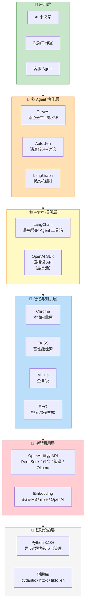

# Python AI 开发生态概览

> **一句话**：Python 是 AI Agent 开发的绝对主力语言。本文帮你理清整个 Python AI 技术栈——从底层模型调用到上层多 Agent 协作，每一层用什么、怎么选。

## 为什么 Python 主导 Agent 开发？

| 因素 | Python | Java |
|------|--------|------|
| LLM SDK 生态 | OpenAI/Anthropic 官方 SDK 都是 Python 优先 | 需第三方适配，更新慢 1-3 个月 |
| Agent 框架 | LangChain/LangGraph/CrewAI/AutoGen 原生 Python | Spring AI 仍在追赶 |
| 向量数据库 | Chroma/FAISS/Milvus Python SDK 最稳定 | Java 客户端功能少 |
| 社区热度 | GitHub AI 项目 80%+ 是 Python | 10% 不到 |
| 学习资源 | 教程/论文/示例代码几乎全是 Python | 稀少 |

> Java AI 的价值在于**将 AI 能力集成到已有 Java 系统中**（见 `../04-Java AI开发/`）。但从零做 Agent，Python 是首选。

## Python AI 技术栈全景



## 每一层怎么选

### 模型调用层：选哪个模型？

```python
# Python AI 开发的"万能钥匙"——OpenAI 兼容 API
# DeepSeek/通义/智谱/Ollama 全部兼容这种格式

from openai import OpenAI

# 方案 A: DeepSeek（推荐首选，性价比最高）
client = OpenAI(
    api_key="sk-xxx",
    base_url="https://api.deepseek.com"
)

# 方案 B: 通义千问（阿里云，国内生态好）
# client = OpenAI(
#     api_key="sk-xxx",
#     base_url="https://dashscope.aliyuncs.com/compatible-mode/v1"
# )

# 方案 C: Ollama 本地模型（离线/隐私场景）
# client = OpenAI(
#     api_key="ollama",
#     base_url="http://localhost:11434/v1"
# )
```

| 模型 | 价格(每M token) | 上下文 | Function Calling | 推荐场景 |
|------|----------------|--------|-----------------|---------|
| **DeepSeek V4-Pro** | ¥0.87/1M | 1M | ✅ 128 并发 | **日常 Agent 首选** |
| **DeepSeek V4-Flash** | ¥0.07/1M | 1M | ✅ | 极致低成本/简单任务 |
| Claude Opus 4.7 | ~$25/1M | 1M | ✅ 6 并发 | 复杂代码推理 |
| GPT-5.5 | ~$30/1M | 1M | ✅ 8+ 并发 | Agent 终端自动化 |
| Gemini 3.1 Pro | $12/1M | 1M | ✅ | 多模态长上下文 |
| Grok 4.20 | $2.50/1M | 2M | ✅ | 多 Agent 辩论抗幻觉 |
| Ollama(Qwen2.5) | 免费 | 128K | ⚠️ 有限 | 离线/隐私场景 |

> DeepSeek V4-Flash 比 GPT-5.5 便宜约 **429 倍**。生产策略：简单任务路由到 V4-Flash，复杂任务才用贵模型。

### Agent 框架层：从零开始 vs 用框架？

```
你的需求：
├── 简单工具调用（1-3个工具，线性流程）
│   → 直接用 openai SDK，不需要框架
│   ✅ 代码量 50-100 行
│   ✅ 无额外学习成本
│   ✅ 性能最优
│
├── 中等复杂度（多种工具，需要会话管理）
│   → LangChain
│   ✅ 丰富的工具链（文档加载、向量存储、Prompt模板）
│   ✅ 社区最大，资料最多
│   ⚠️ 抽象层多，Debug 困难
│
├── 复杂流程控制（循环、条件分支、并行）
│   → LangGraph
│   ✅ 状态机式编排，流程可视化
│   ✅ 适合有向无环图（DAG）式的工作流
│   ⚠️ 学习曲线陡
│
└── 多角色协作（研究+写作+审查，分工明确）
    → CrewAI
    ✅ 角色分工清晰，Agent 定义直觉化
    ✅ 内置任务依赖管理
    ⚠️ 每次调用 = 多次 LLM 请求，成本高

⚠️ AutoGen 已退役 → 替代者是 Microsoft Agent Framework (MAF)
   详见 `07-框架对比与选型.md`
```

### 记忆与知识层：向量数据库选型

| 需求 | 推荐 | 原因 |
|------|------|------|
| 本地开发/原型 | **Chroma** | 零配置，Python 原生 |
| 大量文档高性能检索 | **FAISS** | Meta 出品，C++ 核心极快 |
| 生产环境 | **Milvus** | 分布式、混合检索、国产 |
| 不想管运维 | **Pinecone** | 全托管，按量付费 |

## Python AI 项目最小模板

```bash
# 创建新项目
mkdir my-agent && cd my-agent
python -m venv .venv && source .venv/bin/activate  # Windows: .venv\Scripts\activate
```

```bash
# requirements.txt — Agent 项目最小依赖
openai>=1.0                       # LLM 调用（兼容所有主流模型）
chromadb>=0.4                     # 向量数据库
sentence-transformers>=2.0        # 本地 Embedding
python-dotenv>=1.0                # 环境变量
tiktoken>=0.5                     # Token 计数
```

```python
# main.py — 最小可运行 Agent 模板
import os
import json
from openai import OpenAI
from dotenv import load_dotenv

load_dotenv()

client = OpenAI(
    api_key=os.getenv("DEEPSEEK_API_KEY"),
    base_url="https://api.deepseek.com"
)

# 工具定义
def search(query: str) -> str:
    """搜索信息（真实项目替换为搜索API）"""
    return f"搜索结果: {query}"

tools = [{
    "type": "function",
    "function": {
        "name": "search",
        "description": "搜索互联网信息",
        "parameters": {
            "type": "object",
            "properties": {
                "query": {"type": "string", "description": "搜索关键词"}
            },
            "required": ["query"]
        }
    }
}]

tool_map = {"search": search}

def run_agent(task: str, max_steps: int = 5):
    messages = [{"role": "user", "content": task}]

    for _ in range(max_steps):
        response = client.chat.completions.create(
            model="deepseek-chat",
            messages=messages,
            tools=tools,
            tool_choice="auto"
        )
        msg = response.choices[0].message
        messages.append(msg)

        if msg.tool_calls:
            for tc in msg.tool_calls:
                result = tool_map[tc.function.name](
                    **json.loads(tc.function.arguments)
                )
                messages.append({
                    "role": "tool",
                    "tool_call_id": tc.id,
                    "content": result
                })
            continue

        return msg.content

    return "达到最大步数"


if __name__ == "__main__":
    print(run_agent("搜索 Python 3.13 新特性"))
```

## Python AI 开发 vs Java AI 开发

| 维度 | Python AI | Java AI |
|------|----------|---------|
| **主战场** | 构建 Agent 系统本身 | 将 AI 集成到已有 Java 系统 |
| **核心框架** | LangChain / LangGraph / CrewAI | Spring AI |
| **开发体验** | 快速原型，代码少 | 类型安全，重构友好 |
| **生态成熟度** | ⭐⭐⭐⭐⭐ | ⭐⭐⭐ |
| **性能** | 中等 | 高（JVM 优化） |
| **代表场景** | AI 小说家、视频工作室 | 企业系统加 AI 问答功能 |

> **结论**：做 Agent → Python。给 Java 系统加 AI → Java。两者不冲突，你已有的 `04-Java AI开发/` 和本目录就是互补关系。

## 学习路线

```
📅 第 1 周：Python 基础
  └── 04-Python知识/ 中的5篇 + 库速查

📅 第 2 周：Agent 核心
  └── 01-Agent核心/ → 理解 Agent 怎么思考、怎么记忆

📅 第 3 周：框架实战
  └── 本目录 08-LangChain实战 → 09-LangGraph状态机

📅 第 4 周：多 Agent + 项目
  └── 10-Multi-Agent → 06-项目案例/ 真实项目复盘
```

## 参考来源

- 本目录各篇专题文章
- `../04-Python知识/AI开发Python库速查.md` — 库使用速查
- `../04-Java AI开发/14-Java AI开发生态概览.md` — Java 侧对标文章
- OpenAI Python SDK: https://github.com/openai/openai-python
- LangChain 文档: https://python.langchain.com/docs
