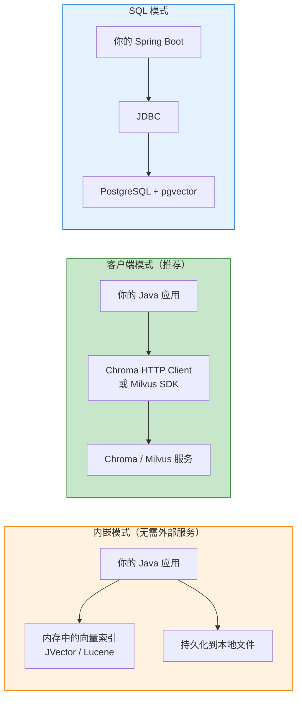

# Java 向量数据库与 RAG

> **一句话**:Java 做 RAG 有两种方式——用 Spring AI 的 VectorStore 一行代码搞定，或者用 Chroma/Milvus 的 Java 客户端手写完整链路。

## 核心概念

### Java 可用的向量数据库

| 数据库 | Java 集成方式 | 部署方式 | 推荐场景 |
|--------|-------------|---------|---------|
| **Chroma** | HTTP API（语言无关） + Java HttpClient | 独立服务/内嵌 | **开发测试首选** |
| **Milvus** | Java SDK `io.milvus:milvus-sdk-java` | 分布式服务 | 企业级生产 |
| **pgvector** | PostgreSQL + JDBC | PostgreSQL 插件 | 已有 Postgres 的项目 |
| **Qdrant** | Java 客户端 `io.qdrant:client` | 独立服务 | 高性能场景 |
| **Elasticsearch** | `elasticsearch-rest-client` + dense_vector | ES 集群 | 已有 ES 的项目 |
| **JVector** | 纯 Java 实现的向量库 | 内嵌式 | 不依赖外部服务 |

### 架构对比



## 代码实例

### 方案1: Spring AI 官方方案（推荐）

```yaml
# application.yml
spring:
  ai:
    vectorstore:
      chroma:
        client:
          host: http://localhost:8000
    openai:
      api-key: ${DEEPSEEK_API_KEY}
      base-url: https://api.deepseek.com
      embedding:
        options:
          model: deepseek-embedding  # DeepSeek 也支持 Embedding
```

```java
@Service
public class KnowledgeService {

    private final VectorStore vectorStore;
    private final ChatClient chatClient;

    public KnowledgeService(VectorStore vectorStore, ChatClient.Builder builder) {
        this.vectorStore = vectorStore;
        this.chatClient = builder
                .defaultAdvisors(new QuestionAnswerAdvisor(vectorStore))
                .build();
    }

    // ===== 导入文档 =====
    public void importDocs(List<String> texts) {
        List<Document> docs = texts.stream()
                .map(text -> new Document(text))
                .toList();

        // 自动切分 + 向量化 + 存入 Chroma
        vectorStore.write(docs);
    }

    // ===== 直接检索 =====
    public List<Document> search(String query, int topK) {
        return vectorStore.similaritySearch(
                SearchRequest.query(query).withTopK(topK));
    }

    // ===== RAG 问答 =====
    @GetMapping("/ask")
    public String ask(@RequestParam String question) {
        return chatClient.prompt()
                .user(question)
                .call()
                .content();
        // Spring AI 自动检索相关文档 + 生成答案
    }

    // ===== 自定义过滤 =====
    public List<Document> searchWithFilter(String query, String category) {
        return vectorStore.similaritySearch(
                SearchRequest.query(query)
                        .withTopK(5)
                        .withFilterExpression(STR."category == '\{category}'"));
    }
}
```

### 方案2: Chroma HTTP API（语言无关，最通用）

Chroma 的 API 是 HTTP 的，任何语言都能调。Java 用 RestTemplate 就行：

```java
/**
 * Chroma HTTP API 的 Java 客户端
 * Chroma 文档: https://docs.trychroma.com/api-reference
 */

@Service
public class ChromaClient {

    private final RestTemplate rest = new RestTemplate();
    private final String baseUrl = "http://localhost:8000/api/v1";

    // ===== 创建集合 =====
    public String createCollection(String name) {
        Map<String, Object> body = Map.of(
            "name", name,
            "metadata", Map.of("description", "Java 知识库")
        );
        JsonNode resp = rest.postForObject(
                STR."\{baseUrl}/collections",
                body, JsonNode.class);
        return resp.get("id").asText();
    }

    // ===== 添加文档 =====
    public void addDocuments(String collectionId,
                             List<String> texts,
                             List<String> ids,
                             List<Map<String, Object>> metadatas) {

        // 1. 用 Embedding API 把文本转成向量
        List<float[]> embeddings = texts.stream()
                .map(this::embedding)
                .toList();

        // 2. 存入 Chroma
        Map<String, Object> body = new HashMap<>();
        body.put("ids", ids);
        body.put("embeddings", embeddings);
        body.put("documents", texts);
        body.put("metadatas", metadatas);

        rest.postForObject(
                STR."\{baseUrl}/collections/\{collectionId}/add",
                body, String.class);
    }

    // ===== 相似度搜索 =====
    public List<String> search(String collectionId,
                                String query, int topK) {
        float[] queryEmbedding = embedding(query);

        Map<String, Object> body = Map.of(
            "query_embedding", queryEmbedding,
            "n_results", topK
        );

        JsonNode resp = rest.postForObject(
                STR."\{baseUrl}/collections/\{collectionId}/query",
                body, JsonNode.class);

        List<String> results = new ArrayList<>();
        for (JsonNode doc : resp.get("documents").get(0)) {
            results.add(doc.asText());
        }
        return results;
    }

    // ===== Embedding 调用（用 DeepSeek 的 Embedding API） =====
    private float[] embedding(String text) {
        // 调用 DeepSeek / OpenAI 的 Embedding API
        // 返回 float[]
        return new float[]{0.1f, 0.2f, 0.3f};  // 示意
    }

    // ===== 删除集合 =====
    public void deleteCollection(String collectionId) {
        rest.delete(STR."\{baseUrl}/collections/\{collectionId}");
    }
}
```

### 方案3: pgvector（PostgreSQL 插件，生产推荐）

```xml
<dependency>
    <groupId>org.springframework.boot</groupId>
    <artifactId>spring-boot-starter-jdbc</artifactId>
</dependency>
<dependency>
    <groupId>org.postgresql</groupId>
    <artifactId>postgresql</artifactId>
</dependency>
```

```sql
-- 1. 安装插件
CREATE EXTENSION vector;

-- 2. 建表
CREATE TABLE documents (
    id SERIAL PRIMARY KEY,
    content TEXT,
    embedding VECTOR(1536),  -- 1536 维向量
    metadata JSONB,
    created_at TIMESTAMP DEFAULT NOW()
);

-- 3. 创建索引（IVFFlat 或 HNSW）
CREATE INDEX ON documents
    USING ivfflat (embedding vector_cosine_ops)
    WITH (lists = 100);
```

```java
@Repository
public class DocumentRepository {

    private final JdbcTemplate jdbc;

    public DocumentRepository(JdbcTemplate jdbc) {
        this.jdbc = jdbc;
    }

    // 存入文档
    public void save(String content, float[] embedding, String metadata) {
        jdbc.update("""
            INSERT INTO documents (content, embedding, metadata)
            VALUES (?, ?::vector, ?::jsonb)
            """, content, Arrays.toString(embedding), metadata);
    }

    // 向量搜索（余弦相似度）
    public List<String> search(String queryEmbedding, int topK) {
        return jdbc.query("""
            SELECT content, 1 - (embedding <=> ?::vector) AS similarity
            FROM documents
            ORDER BY similarity DESC
            LIMIT ?
            """,
            new Object[]{queryEmbedding, topK},
            (rs, rowNum) -> rs.getString("content"));
    }
}
```

### 方案4: JVector（纯 Java 内嵌式）

```xml
<dependency>
    <groupId>io.jvector</groupId>
    <artifactId>jvector</artifactId>
    <version>5.0.0</version>
</dependency>
```

```java
import io.jvector.core.*;
import io.jvector.graph.*;

public class LocalVectorStore implements AutoCloseable {

    private VectorGraph graph;
    private final Map<String, float[]> vectors = new HashMap<>();

    public LocalVectorStore(int dimension) {
        // 创建内存中的向量索引
        this.graph = VectorGraph.build(dimension, 10000);
    }

    public void add(String id, float[] vector) {
        vectors.put(id, vector);
        graph.add(id, vector);
    }

    public List<String> search(float[] query, int topK) {
        return graph.search(query, topK, GraphIndex.SearchMethod.BRUTE_FORCE);
    }

    @Override
    public void close() {
        graph.close();
    }
}
```

## Java Embedding 模型选择

| 模型 | 维度 | 语言 | 调用方式 | 推荐场景 |
|------|------|------|---------|---------|
| DeepSeek Embedding | 1024 | 中英文 | HTTP API | 国内首选 |
| OpenAI text-embedding-3-small | 1536 | 中英文 | HTTP API | 质量最好 |
| 通义 text-embedding-v3 | 1024 | 中文为主 | HTTP API | 中文最佳 |
| BGE-M3 (本地) | 1024 | 多语言 | 本地 Java 推理 | 离线场景 |

## 常见误区

- **误区1**: "Java 不能用 Chroma" —— 错。Chroma 提供 HTTP API，任何语言都能调。Spring AI 已经封装好了 Java 客户端。
- **误区2**: "向量搜索一定要用专门的向量数据库" —— 小数据量（<1万条）用 JVector 或 pgvector 就够。不需要 Milvus 这样的大型分布式系统。
- **误区3**: "Java RAG 和 Python RAG 不一样" —— 核心流程完全一样：文档→切分→向量化→存储→检索→生成。只是语言实现不同。

## 参考来源

- Chroma HTTP API: https://docs.trychroma.com/api-reference
- pgvector 文档: https://github.com/pgvector/pgvector
- JVector GitHub: https://github.com/jvector/jvector
- 相关笔记: `Java手册/06-AI与Agent/15-Spring AI实战.md`

## 什么时候不需要向量数据库

> 2026 年 1M Token 上下文窗口改变了游戏规则。

| 场景 | 推荐方案 | 原因 |
|------|---------|------|
| 全文 < 500K tokens | 直接塞 context | 比检索更准确，无碎片化 |
| 需要全局连贯性 | 全文入 context | 向量检索是碎片化的 |
| 串行阅读/创作 | 全文入 context | 不需要随机检索 |
| 知识库 > 1M tokens | 向量数据库 + RAG | 超出窗口必须检索 |
| 精确片段查询 | 向量数据库 | "第三章主角说了什么" |

**原则**：1M 窗口让"全文直塞"成为很多场景的最优解——更简单、更准确、零额外依赖。向量数据库只在真正超出窗口时才需要。
