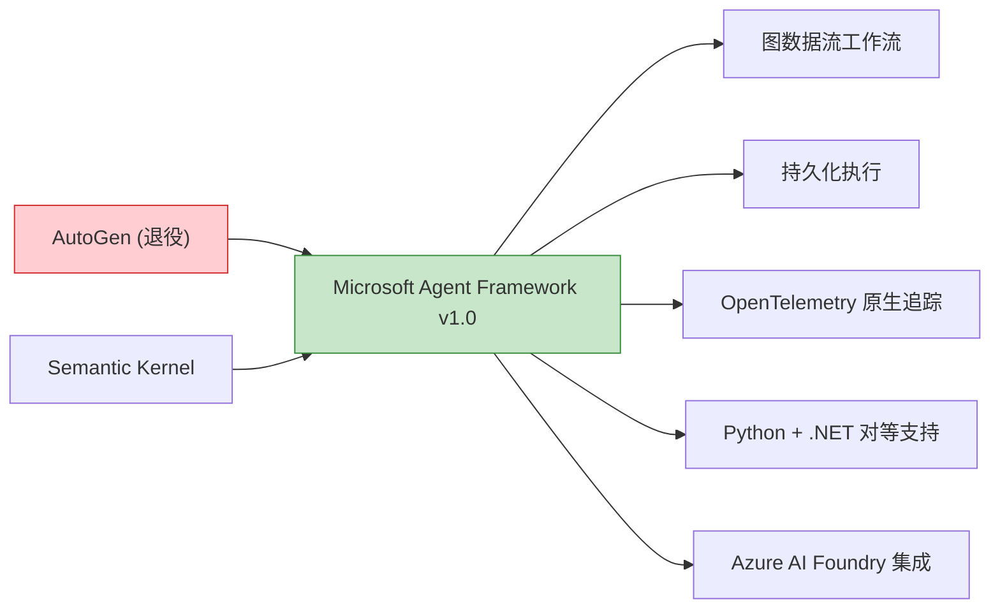
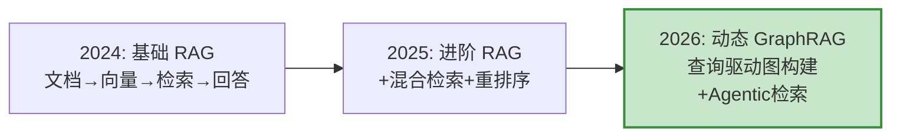

# 2026 AI Agent 技术前沿与生态更新

> **一句话**：2026 年 AI Agent 生态发生了三件大事——AutoGen 退役、MCP/A2A 成为行业标准、DeepSeek V4 把推理成本打到几乎免费。本文帮你快速对齐最新版图。

## 一、框架版图洗牌

### AutoGen 退役 → Microsoft Agent Framework 上位

2025 年底 Microsoft 宣布 AutoGen 进入维护模式（最终版 v0.7.5），取而代之的是 **Microsoft Agent Framework (MAF)**，融合了 AutoGen 的对话式多 Agent 能力和 Semantic Kernel 的企业特性。



### 2026 框架选型速查

| 框架 | 状态 | 核心理念 | 最适合 |
|------|------|---------|--------|
| **LangGraph** | 🔥 领导者 | 图状态机 + 持久化检查点 | 复杂长链路、可审计工作流 |
| **CrewAI** | 🔥 增长中 | 角色分工 + 流水线 | 内容生产、研究自动化、快速原型 |
| **MAF** | 🆕 新标准 | 数据流 + 企业治理 | Azure 原生、.NET 技术栈 |
| ~~AutoGen~~ | ⚠️ 退役 | — | 迁移到 MAF |

**成本对比**（1000任务/天）：
- LangGraph：**$12-18/天**（token 效率最高）
- CrewAI：$18-28/天
- 选错框架可能让推理成本翻 2-4 倍

### 新趋势：混合架构

2026 年 IEEE Access 论文提出 **LangGraph + CrewAI 混合架构**：用复杂度感知路由器把简单任务发给 CrewAI（快速便宜），复杂任务发给 LangGraph（持久可控）。实测 **96.1% 成功率 + 76.2% token 节省**。

---

## 二、MCP + A2A：Agent 世界的 HTTP 协议

2026 年最大的基础设施变化：**MCP（模型上下文协议）和 A2A（Agent 间协议）双双捐给 Linux 基金会，成为行业标准**。

```
┌──────────────────────────────────────────────────┐
│                  Agent 协议栈                      │
├──────────────────────────────────────────────────┤
│  A2A (Agent ↔ Agent)    ← 水平：委托、协调、联邦   │
│  MCP (Agent ↓ Tool)     ← 垂直：工具、数据、API    │
│  AG-UI (Agent → User)   ← 前端：可视化、交互       │
└──────────────────────────────────────────────────┘
```

| 协议 | 方向 | 用途 | 2026 状态 |
|------|------|------|----------|
| **MCP** | Agent → 工具 | 连接数据库、API、文件系统 | 月下载 1.64 亿次，1万+ 公开服务器 |
| **A2A** | Agent ↔ Agent | 跨组织 Agent 委托与协调 | 50+ 启动伙伴，Microsoft 加入 |
| **AG-UI** | Agent → 用户 | 可视化 Agent 思考过程 | CopilotKit 主导，IDE/BI 采用 |

**MCP 2026 新特性**：
- 结构化工具输出（验证 JSON，不再是不透明字符串）
- Elicitation（服务器可暂停请求用户输入）
- OAuth 2.0 资源绑定（RFC 8707）
- 工具级安全扫描成为基线要求

**生产部署模式**：先上 MCP（工具访问）→ 再加 A2A（多 Agent 协调）→ 最后加 AG-UI（用户界面）。

---

## 三、LLM 模型版图（2026 Q2）

### 主力模型速查

| 模型 | 上下文 | 输出价格/1M | 定位 |
|------|--------|------------|------|
| **DeepSeek V4-Pro** | 1M | **$0.87** | 成本性能之王，MIT 开源 |
| **DeepSeek V4-Flash** | 1M | **$0.07** | 极致低成本（比 GPT-5.5 便宜 429 倍） |
| **Claude Opus 4.7** | 1M | ~$25 | 多文件代码推理最强 |
| **GPT-5.5** | 1M | ~$30 | Agent 终端自动化 + 原生音频 |
| **Gemini 3.1 Pro** | 1M | $12 | 多模态长上下文 |
| **Grok 4.20** | 2M | $2.50 | 多 Agent 辩论抗幻觉 |

### 选型建议

```
日常 Agent 任务 → DeepSeek V4-Pro（$0.87，足够好）
极致省钱       → DeepSeek V4-Flash（$0.07，简单任务专用）
复杂代码推理   → Claude Opus 4.7
多模态理解     → Gemini 3.1 Pro
国内合规       → DeepSeek V4 系列（MIT 开源，可自部署）
```

### Function Calling 新进展

- **并行调用已成标配**：DeepSeek V4 支持最多 **128 并发**工具调用
- **思考+工具融合**：DeepSeek V4 首家在同一推理中完成思考和工具调用
- **协议碎片化**：OpenAI 格式是事实标准，但 Anthropic/Gemini 各有差异
- **流式工具调用**：三家（OpenAI/Anthropic/Gemini）累加逻辑完全不同

---

## 四、RAG 技术前沿

### 从静态 RAG → 动态 GraphRAG



### 2026 年 RAG 关键技术

| 技术 | 代表方案 | 亮点 |
|------|---------|------|
| **动态图构建** | Relink (AAAI 2026) | 根据查询实时构建证据图，不依赖预建知识图谱 |
| **Token 级图** | TIGRAG | 滑动窗口 token 共现建图，免 LLM 提取，多跳推理强 |
| **层次化图** | HyGRAG (WWW '26) | Chunk + 实体双层节点，多级抽象检索 |
| **Agentic RAG** | PathRouter | RL 训练 Agent 探索图，路径感知奖励 |
| **目标向量检索** | Tracert-RAG | 预测"目标向量"动态遍历，无需调 Top-K |

**核心趋势**：不再预建一个静态知识图谱，而是**按需构建、动态遍历、Agent 驱动**。

---

## 五、记忆系统工具成熟

### 专业记忆层工具崛起

不再需要自己用 Chroma 搭记忆系统。2026 年有成熟工具：

| 工具 | 架构 | 定位 |
|------|------|------|
| **Mem0** | 向量+图+KV 混合 | 即插即用记忆层，3 行代码集成 |
| **Letta (原 MemGPT)** | OS 风格三层记忆 | 长期自主 Agent，自己管理记忆 |
| **Zep** | 双时序知识图谱 | 需要时效性保证的企业场景 |
| **agentmemory** | BM25+向量+图+MCP | 编程 Agent 自动捕获上下文 |

### 记忆评估四维度

2026 年记忆系统评估不再是"能不能召回"，而是四维：

| 维度 | 测什么 | 典型问题 |
|------|--------|---------|
| **Recall** | 能否找到正确事实 | Mem0 49% vs agentmemory 95% (LongMemEval) |
| **Freshness** | 更新后是否用最新版本 | 大多工具不保证 |
| **Contradiction** | 矛盾事实选哪个 | 仅 Minta 工具明确处理 |
| **Forgetting** | 过期信息真的删了 | 多数框架跨租户泄露是 P0 问题 |

---

## 六、向量数据库新格局

| 场景 | 2024 推荐 | 2026 推荐 | 变化原因 |
|------|----------|----------|---------|
| 原型/学习 | Chroma | Chroma | 仍然最快上手 |
| 中型生产 | Milvus | **Qdrant** | Rust 性能 + 元数据过滤强 |
| 大型生产 | Milvus | Milvus | 十亿级分布式仍是王者 |
| 嵌入式/端侧 | — | **LanceDB** | 单文件，多模态 |
| 极致性能新秀 | — | **turbovec** | 4.4× 写入速度于 Chroma |

---

## 七、生产 Agent 六层栈（2026 标准）

```
┌─────────────────────────────────┐
│ 6. 追踪与评估   ← LangSmith / Langfuse / traceAI
├─────────────────────────────────┤
│ 5. 工具与集成   ← MCP 服务器
├─────────────────────────────────┤
│ 4. 检索与记忆   ← LlamaIndex / Qdrant / Mem0 / Letta
├─────────────────────────────────┤
│ 3. Agent 框架   ← LangGraph / CrewAI / MAF
├─────────────────────────────────┤
│ 2. 模型层       ← DeepSeek V4 / Claude Opus 4.7 / GPT-5.5
├─────────────────────────────────┤
│ 1. 模型服务     ← vLLM / Ollama / 云 API
└─────────────────────────────────┘
```

2026 年的共识：**只选框架不够，六层都配齐才算生产级**。

---

## 知识库更新对照

| 需更新的文章 | 问题 | 更新方向 |
|-------------|------|---------|
| `07-框架对比与选型.md` | AutoGen 还是主力 | AutoGen→MAF，加混合架构趋势 |
| `10-Multi-Agent多智能体.md` | MCP/A2A 只提了一嘴 | 扩展为完整的协议栈章节 |
| `05-RAG检索增强生成.md` | 停在基础 RAG | 加 GraphRAG / Agentic RAG / 动态图 |
| `03-记忆系统.md` | 只有 Chroma 自建 | 加 Mem0/Letta/Zep 等专业工具 |
| `记忆系统设计实战.md` | 未提专业工具 | 加工具选型 + 四维评估 |
| `Python AI开发生态概览.md` | 模型列表过时 | 更新到 DeepSeek V4 / Claude 4.7 等 |
| `AI开发Python库速查.md` | 部分版本陈旧 | 更新模型价格和向量库推荐 |

---

> 本文是对知识库中多篇文章的集中更新指南。各篇的具体修改见对应文章末尾的"2026 更新"章节。
