# 🎯 面试突击手册 — Java + AI 图解版

> 每道题「一句话 → 图解 → 原理 → 源码细节 → 面试话术」完整链路。所有图表用 Mermaid 渲染。

---

## 一、HashMap — 面试第一题，问到源码才算及格

### 数据结构全景

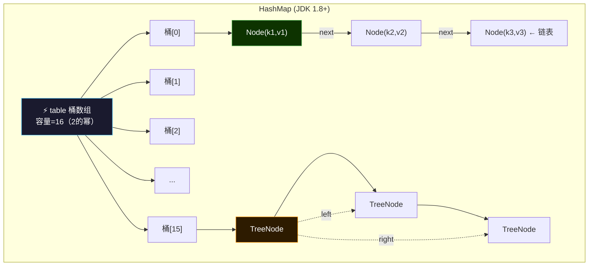

### 位运算：为什么容量必须是 2 的幂

HashMap 用 `(n - 1) & hash` 定位桶，代替 `hash % n`。

**位与 `&`**：两 bit 都是 1 结果才为 1。n 是 2 的幂 → n-1 二进制全是 1 → 保留 hash 全部低位 → 分布均匀。

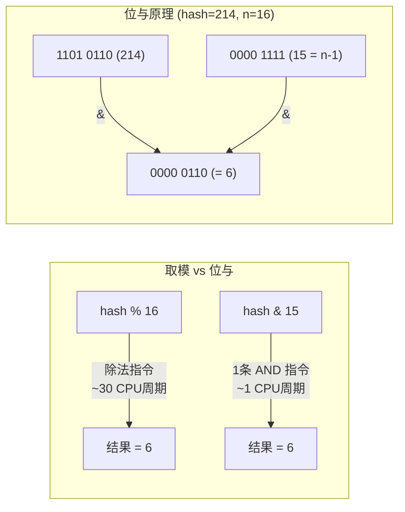

**扰动函数**：高 16 位和低 16 位做异或（XOR），让高位也参与定位：

```java
// HashMap.hash() 源码
static final int hash(Object key) {
    int h;
    return (key == null) ? 0 : (h = key.hashCode()) ^ (h >>> 16);
}
```

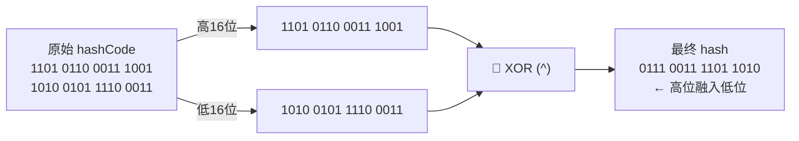

### 红黑树五条铁律

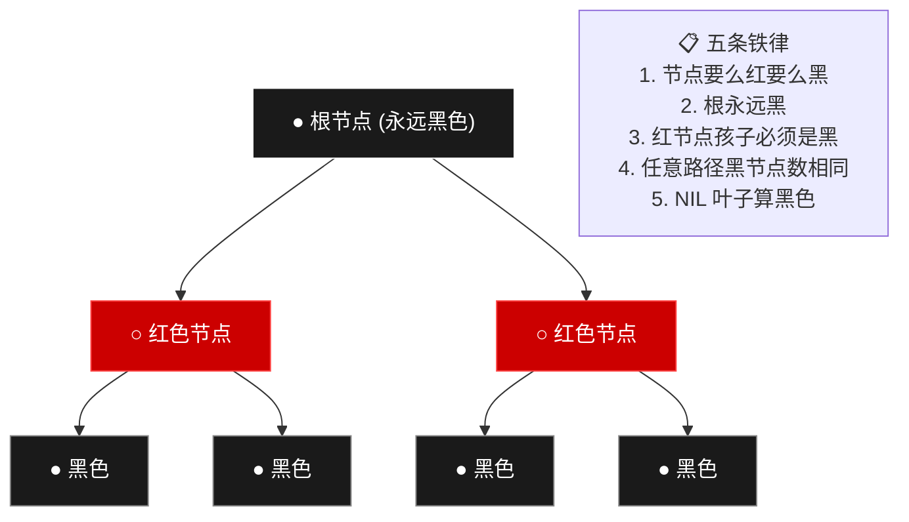

| 对比 | 链表 | 红黑树 | AVL 树 |
|------|:--:|:--:|:--:|
| 查找 | O(n) | O(log n) | O(log n) 稍快 |
| 插入 | O(1) | O(log n)，最多旋转 3 次 | O(log n)，可能多次旋转 |
| HashMap 的选择 | 短链表时用 | **链表 ≥8 时转** ✅ | 维护成本太高 |

### put 流程（源码级）

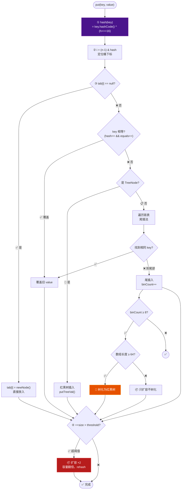

### 扩容时元素怎么搬（JDK 1.8 优化）

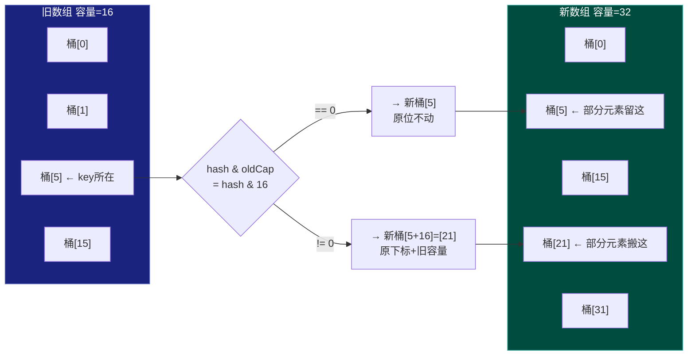

**面试话术**：「HashMap 有三个理解层次——第一层背数据结构，第二层讲清楚位运算和扰动函数，第三层能说出扩容时只需判断 `hash & oldCap` 决定去留、不需要重新 hash。面试官从你回答的深度就能判断你是背的还是真看过源码。」

---

## 二、ConcurrentHashMap — 高并发安全的精髓

### 锁策略演进

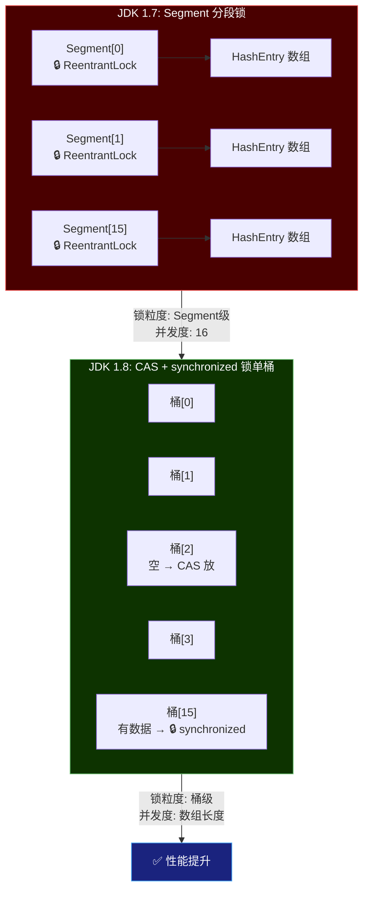

### CAS 原理

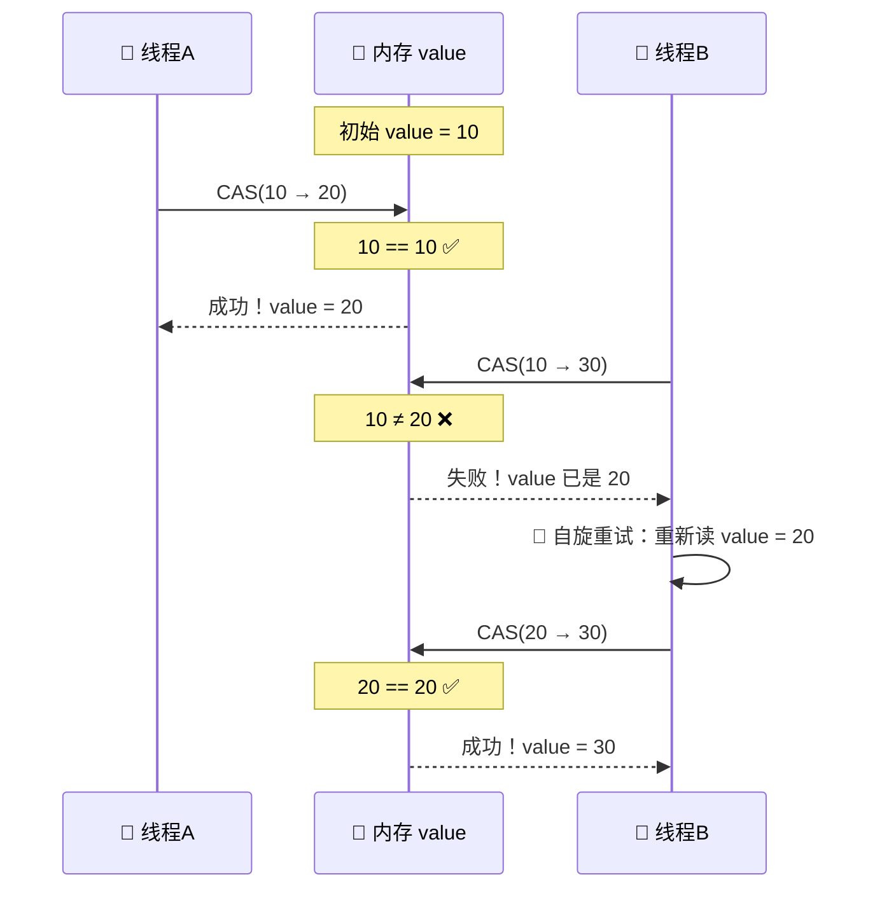

### put 流程（1.8 源码路径）

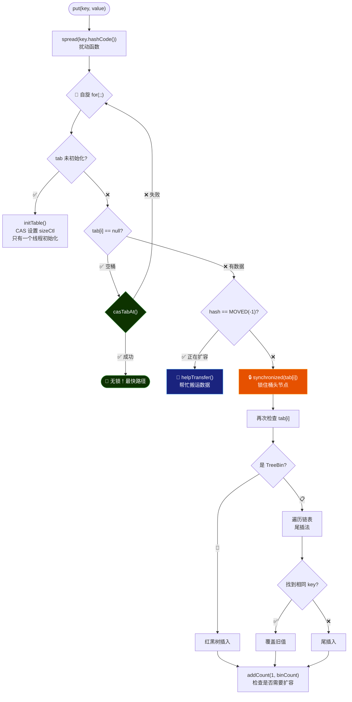

### 分段计数 — 怎么不靠锁统计 size

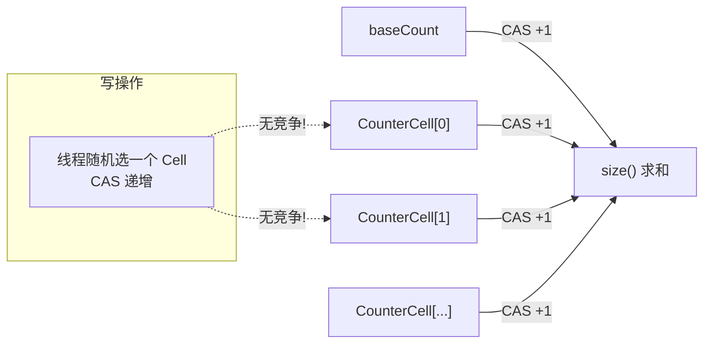

---

## 三、线程池 — 不只是背 7 参数

### 状态机

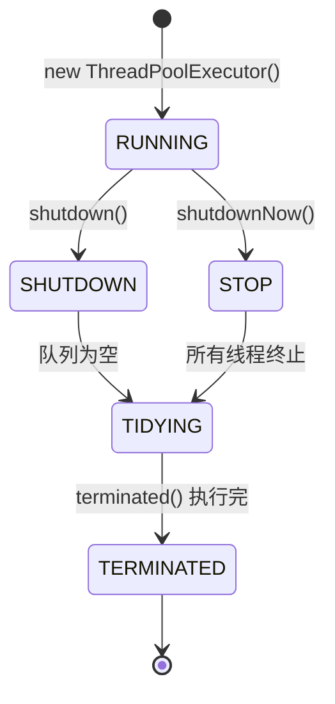

### ctl 位打包

```
一个 AtomicInteger ctl 同时存储状态 + 线程数：
┌──────────────┬─────────────────────────────────┐
│  高 3 位      │  低 29 位                        │
│  运行状态      │  工作线程数 (workerCount)          │
└──────────────┴─────────────────────────────────┘
  RUNNING  = 111 (-1)
  SHUTDOWN = 000 (0)
  STOP     = 001 (1)
  TIDYING  = 010 (2)
  TERMINATED=011 (3)
```

### 核心执行流程

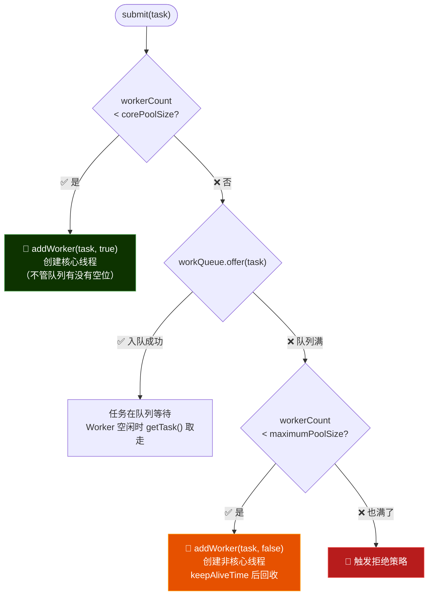

### Worker 怎么取任务

```java
// Worker.run() 里不断循环
while (task != null || (task = getTask()) != null) {
    task.run();  // 执行任务
    task = null;
}

// getTask() 核心逻辑：
Runnable r = timed ?
    workQueue.poll(keepAliveTime, NANOSECONDS) :  // 超时等待（非核心线程）
    workQueue.take();                               // 阻塞等待（核心线程）
if (r == null) return null;  // 超时没拿到 → Worker 退出
```

### 四种拒绝策略

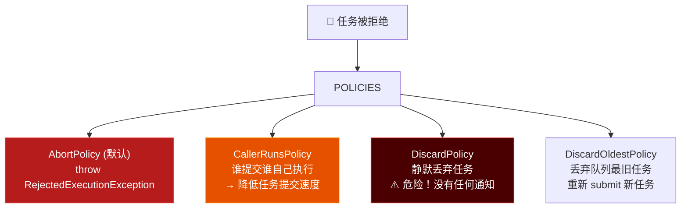

---

## 四、synchronized — 从 Mark Word 到锁升级

### Mark Word 内存布局（64位 JVM）

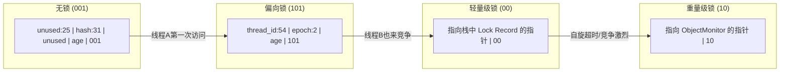

### 锁升级流程

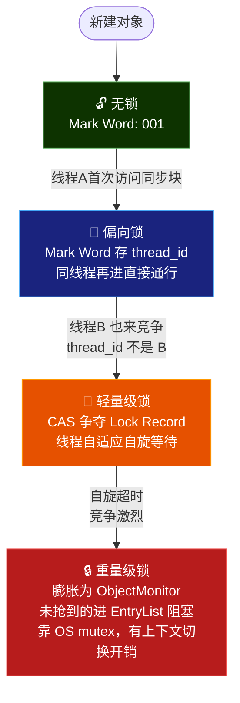

### synchronized vs ReentrantLock

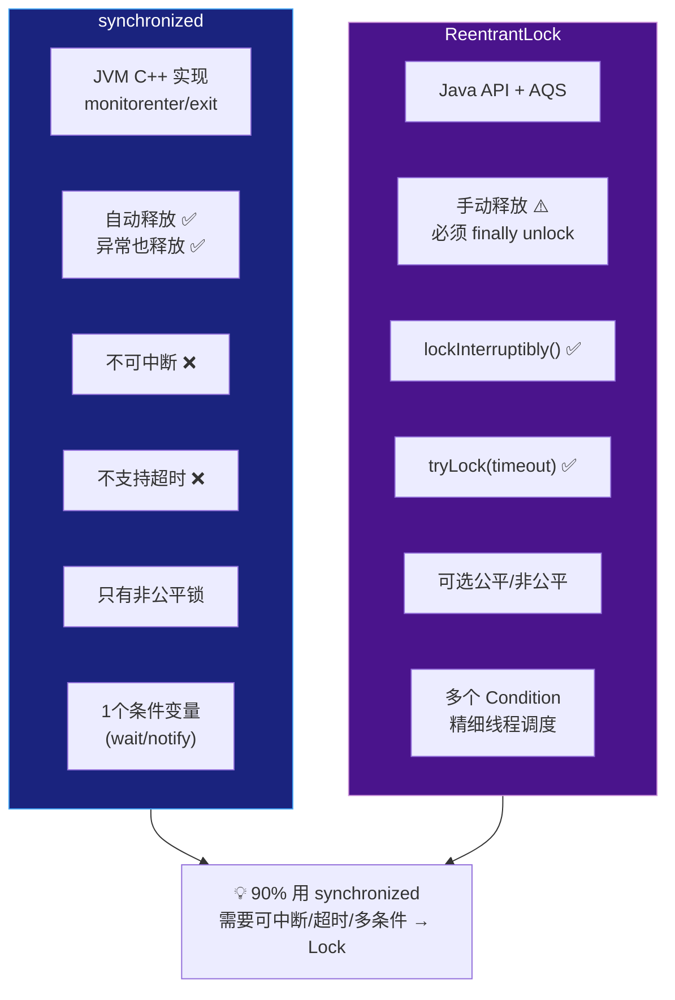

---

## 五、volatile + JMM

### JMM 内存模型

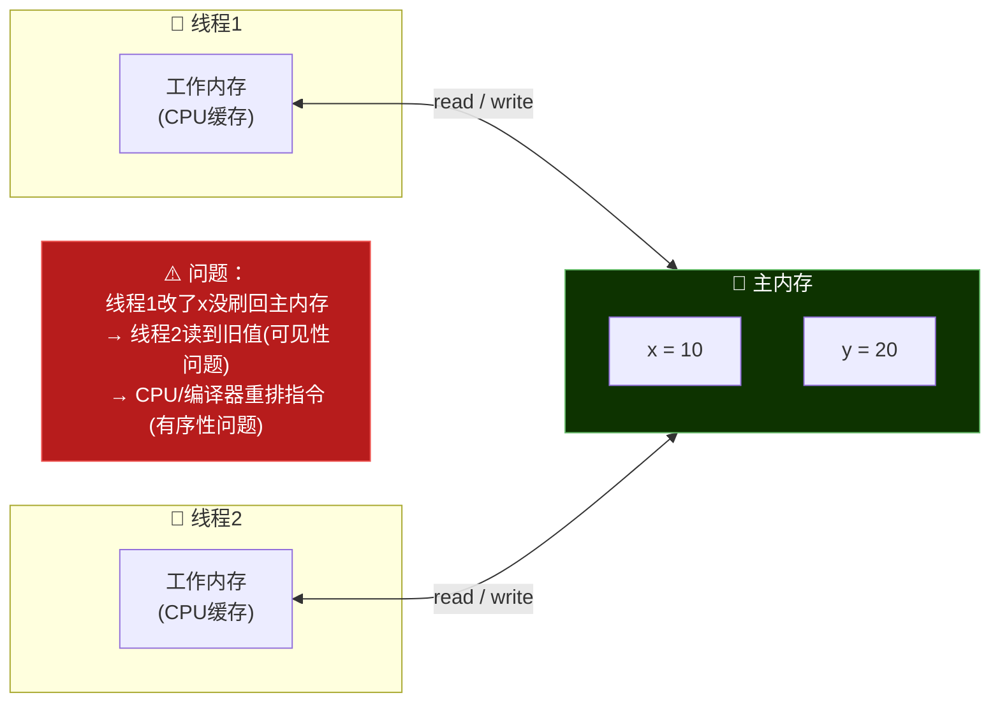

### 四种内存屏障

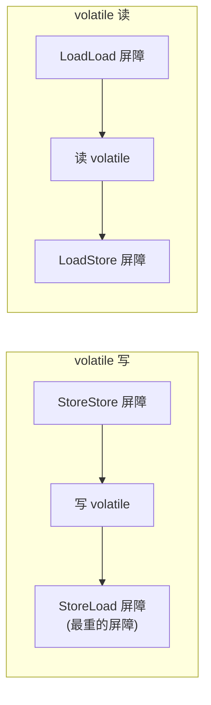

### DCL 为什么两次判空 + volatile

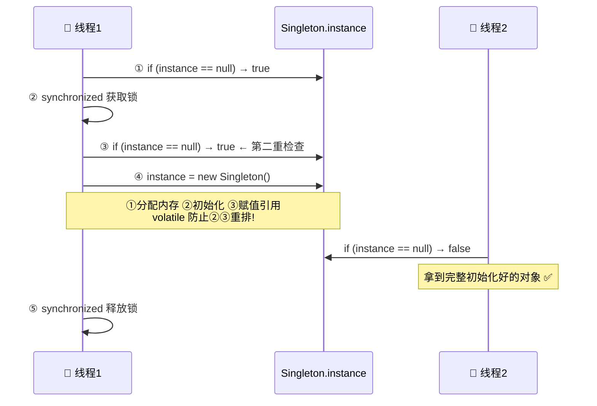

---

## 六、AQS — JUC 的地基

### CLH 队列结构

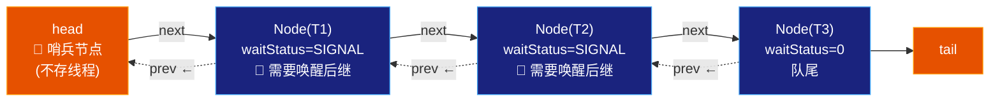

### 公平锁 vs 非公平锁

```mermaid
flowchart TD
    TRY["tryAcquire(1)"]
    TRY --> FAIR{"公平锁?"}
    FAIR -->|"✅ 公平"| CHECKQUEUE{"hasQueuedPredecessors()?<br/>队列里有人在等?"}
    CHECKQUEUE -->|"有人等"| FAIL["排队去"]
    CHECKQUEUE -->|"没人等"| CAS_FAIR["CAS state 0→1"]
    FAIR -->|"❌ 非公平"| CAS_UNFAIR["直接 CAS state 0→1"]
    CAS_FAIR --> SUCCESS["🔒 获得锁"]
    CAS_UNFAIR --> SUCCESS

    style FAIL fill:#4a0000,stroke:#ef5350,color:#fff
    style SUCCESS fill:#0d3300,stroke:#66bb6a,color:#fff
```

---

## 七、JVM GC — 从算法到 G1

### 四种 GC 算法

```mermaid
flowchart LR
    subgraph MS["标记-清除"]
        M1["██░░██░░░░██"] --> M2["██  ██    ██"]
        M3["碎片化 ❌"]
    end
    subgraph MC["标记-复制 (新生代)"]
        C1["Eden ░░░███░"] --> C2["空 | Survivor ████"]
        C3["无碎片 ✅ 浪费空间 ⚠️"]
    end
    subgraph MCP["标记-整理 (老年代)"]
        P1["██░░██░░░░██"] --> P2["████████░░░░"]
        P3["无碎片 ✅ 移动开销 ⚠️"]
    end

    style MS fill:#4a0000,stroke:#ef5350,color:#fff
    style MC fill:#0d3300,stroke:#66bb6a,color:#fff
    style MCP fill:#1a237e,stroke:#42a5f5,color:#fff
```

### 新生代 vs 老年代

```mermaid
flowchart TB
    subgraph HEAP["堆 Heap"]
        subgraph YOUNG["新生代 Young"]
            EDEN["Eden (80%)<br/>🆕 新对象出生地"]
            S0["S0 (10%)"]
            S1["S1 (10%)"]
        end
        OLD["老年代 Old<br/>🏛️ 长命对象<br/>GC 15次没死的"]

        EDEN -->|"Minor GC<br/>复制到 Survivor"| S0
        S0 -->|"多次 GC 仍存活<br/>晋升到老年代"| OLD
    end

    style EDEN fill:#0d3300,stroke:#66bb6a,color:#fff
    style OLD fill:#4a148c,stroke:#ce93d8,color:#fff
```

### G1 收集器核心

```mermaid
flowchart TB
    subgraph G1["G1 堆布局"]
        R1["Eden"]
        R2["Eden"]
        R3["Survivor"]
        R4["Old"]
        R5["Eden"]
        R6["Humongous<br/>(大对象)"]
        R7["Old"]
        R8["Eden"]

        GC["🔄 每次 GC：选垃圾最多的 Region 回收<br/>不要求一次回收整个老年代<br/>停顿时间可控 ✅"]
    end

    style R4 fill:#4a0000,stroke:#ef5350,color:#fff
    style R7 fill:#4a0000,stroke:#ef5350,color:#fff
    style R6 fill:#e65100,stroke:#ff9800,color:#fff
```

---

## 八、Spring IoC & AOP

### AOP 代理原理

```mermaid
flowchart TB
    TARGET["目标对象<br/>UserServiceImpl"]

    TARGET -->|"实现了接口"| JDK["JDK 动态代理<br/>$Proxy123 implements UserService"]
    TARGET -->|"没实现接口"| CGLIB["CGLIB 代理<br/>UserService$$Enhancer<br/>extends UserServiceImpl<br/>⚠️ final方法不能代理"]

    JDK --> AOP_CHAIN["AOP 调用链"]
    CGLIB --> AOP_CHAIN

    AOP_CHAIN --> BEFORE["@Before"]
    BEFORE --> TARGET_METHOD["执行业务方法"]
    TARGET_METHOD --> AFTER["@After"]
    AFTER --> AROUND["@Around"]

    style JDK fill:#0d3300,stroke:#66bb6a,color:#fff
    style CGLIB fill:#1a237e,stroke:#42a5f5,color:#fff
```

### @Transactional 失效两大场景

```mermaid
flowchart TD
    SCENE1["❌ 场景1: 同类方法调用<br/>this.methodB() 不经过代理"]
    SCENE2["❌ 场景2: 异常被 try-catch 吞了<br/>Spring 感知不到异常"]

    SCENE1 --> FIX1["✅ 解决: 注入自己<br/>或抽到另一个 Service"]
    SCENE2 --> FIX2["✅ 解决: catch 里手动回滚<br/>TransactionAspectSupport.currentTransactionStatus().setRollbackOnly()"]

    style SCENE1 fill:#b71c1c,stroke:#ef5350,color:#fff
    style SCENE2 fill:#b71c1c,stroke:#ef5350,color:#fff
    style FIX1 fill:#0d3300,stroke:#66bb6a,color:#fff
    style FIX2 fill:#0d3300,stroke:#66bb6a,color:#fff
```

---

## 九、RAG — 企业 AI 落地首选

### 完整流水线

```mermaid
flowchart TB
    subgraph OFFLINE["⚙️ 离线阶段：知识入库"]
        DOC["📄 PDF/Word/网页"]
        DOC --> LOAD["Loader 加载"]
        LOAD --> CHUNK["Chunking 切块<br/>每块 500-1000 字符<br/>重叠 10-20%"]
        CHUNK --> EMBED["Embedding 向量化<br/>文本 → 1536维向量"]
        EMBED --> STORE["向量数据库<br/>Chroma / Milvus / pgvector"]
    end

    subgraph ONLINE["⚡ 在线阶段：用户提问"]
        QUERY["❓ 用户问题<br/>'公积金怎么提取'"]
        QUERY --> QEMBED["问题 → 向量"]
        QEMBED --> SEARCH["🔍 向量相似度搜索<br/>Top-K 最相关文档"]
        SEARCH --> PROMPT["拼入 Prompt<br/>'参考以下文档回答...'"]
        PROMPT --> LLM["🤖 LLM 生成答案<br/>'根据规定，您需要...'"]
    end

    STORE -.->|"检索"| SEARCH

    style OFFLINE fill:#1a237e,stroke:#42a5f5,color:#fff
    style ONLINE fill:#0d3300,stroke:#66bb6a,color:#fff
    style LLM fill:#4a148c,stroke:#ce93d8,color:#fff
```

### RAG vs 微调

```mermaid
flowchart LR
    RAG["RAG<br/>✅ 秒级更新<br/>✅ 数据不出服务器<br/>✅ 幻觉低<br/>✅ 成本低<br/>✅ 90%企业首选"]
    FT["微调 Fine-tuning<br/>⚠️ 天级训练<br/>⚠️ 数据需外传<br/>⚠️ 仍可能编造<br/>⚠️ GPU成本高<br/>⚠️ 仅RAG不够时补充"]

    RAG -->|"首选"| CHOOSE["💡 企业选型"]
    FT -->|"补充"| CHOOSE

    style RAG fill:#0d3300,stroke:#66bb6a,color:#fff
    style FT fill:#e65100,stroke:#ff9800,color:#fff
```

---

## 十、Agent = LLM × 记忆 × 工具 × 规划

### 四层架构

```mermaid
flowchart TB
    USER["👤 用户给目标"] --> AGENT

    subgraph AGENT["🤖 AI Agent"]
        PLANNING["🧠 规划层<br/>ReAct推理 / 任务分解 / 反思"]
        MEMORY["💾 记忆层<br/>短期(对话上下文)<br/>长期(向量数据库)"]
        TOOLS["🔧 工具层<br/>Function Calling<br/>搜索 / 代码 / API"]
        LOOP["🔄 执行循环<br/>Observe → Think → Act"]
    end

    PLANNING <--> MEMORY
    PLANNING <--> TOOLS
    LOOP --> PLANNING

    style PLANNING fill:#4a148c,stroke:#ce93d8,color:#fff
    style MEMORY fill:#1a237e,stroke:#42a5f5,color:#fff
    style TOOLS fill:#0d3300,stroke:#66bb6a,color:#fff
    style LOOP fill:#e65100,stroke:#ff9800,color:#fff
```

### Function Calling 数据流

```mermaid
sequenceDiagram
    participant User as 👤 用户
    participant LLM as 🤖 LLM
    participant Code as ⚙️ 你的代码
    participant Tool as 🔧 真实工具

    User->>LLM: "帮我查张三的订单"
    LLM->>Code: 💭 返回 tool_calls:<br/>{function: "query_order",<br/> args: {user: "张三"}}
    Note over Code: LLM 不直接执行工具！<br/>只输出"想调用什么"
    Code->>Tool: SELECT * FROM orders<br/>WHERE user='张三'
    Tool-->>Code: [{id:123, amount:99, status:'已发货'}]
    Code-->>LLM: 工具结果返回给 LLM
    LLM->>User: "张三有一笔订单（编号123）<br/>金额99元，状态已发货"
```

### 三大架构模式

```mermaid
flowchart LR
    REACT["ReAct<br/>Thought→Action→Observe<br/>适合多步推理+工具调用"]
    PLAN["Plan-Execute<br/>先制定完整计划→逐步执行<br/>适合复杂可预测任务"]
    REFLECT["Reflection<br/>执行→自我评价→修正<br/>适合迭代优化（写代码）"]

    REACT --> CHOOSE["根据任务复杂度<br/>选择合适的模式"]
    PLAN --> CHOOSE
    REFLECT --> CHOOSE

    style REACT fill:#1a237e,stroke:#42a5f5,color:#fff
    style PLAN fill:#0d3300,stroke:#66bb6a,color:#fff
    style REFLECT fill:#4a148c,stroke:#ce93d8,color:#fff
```

---

## 十一、现场话术模板

### 自我介绍（60s）

> 「面试官好，我是 XXX，X 年 Java 后端开发。主要技术栈 Spring Boot + MySQL + Redis，熟悉并发编程和 JVM 调优。最近一年系统学习 AI/Agent，做过几个实战项目——用 Spring AI 集成智能问答、自建 RAG 知识库、DeepSeek API 项目。AI 不是取代 Java，而是给 Java 系统加一层智能能力。这个岗位正好是我在深入的方向。」

### 反问面试官

- 「团队目前 AI 在哪些场景落地了？」
- 「Java 系统接 AI，倾向 Spring AI 还是自研？」
- 「这个岗位未来一年最希望我在 AI 方向做到什么程度？」

---

## 十二、速查清单

### Java（必背 8 题）

- [ ] HashMap：位运算 + 扰动函数 + 红黑树 + 扩容免重 hash
- [ ] ConcurrentHashMap：CAS + synchronized 锁单桶 + 读无锁 + 分段计数
- [ ] 线程池：7 参数 + 执行流程 + Worker 取任务 + 拒绝策略
- [ ] synchronized：Mark Word + 锁升级四阶段
- [ ] volatile：可见性+有序性+内存屏障 + DCL
- [ ] AQS：state + CLH 队列 + 公平 vs 非公平
- [ ] JVM GC：四种算法 + Minor/Full GC + G1
- [ ] Spring AOP：JDK vs CGLIB + @Transactional 失效

### AI（加分 3 题）

- [ ] Agent = LLM + Memory + Tools + Planning
- [ ] RAG 离线+在线流水线 + RAG vs 微调
- [ ] Function Calling 数据流 + Spring AI 三大抽象

---

> 💪 你比 90% 候选人多的是：Java 八股有源码级理解 + AI 有真实项目。把图画到脑子里，面试时直接画给面试官看。
