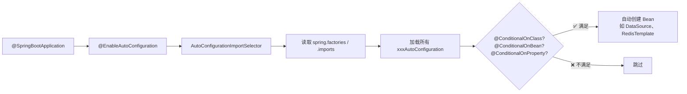
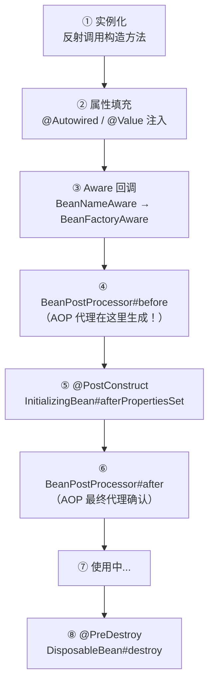
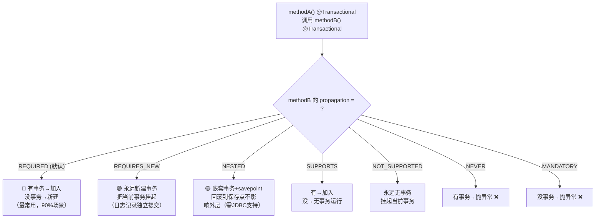
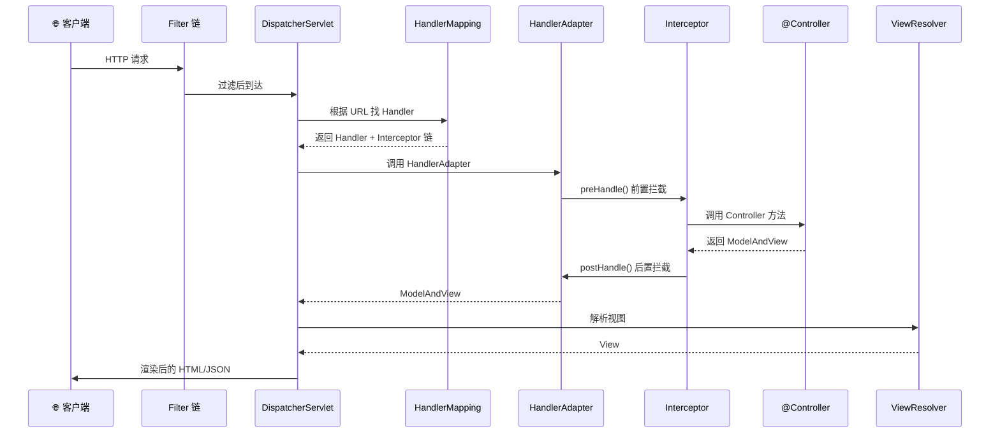
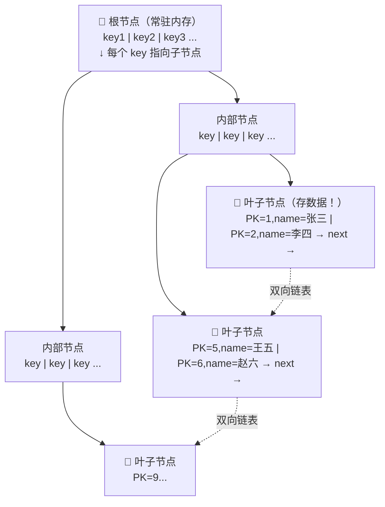
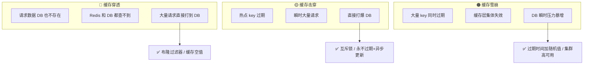
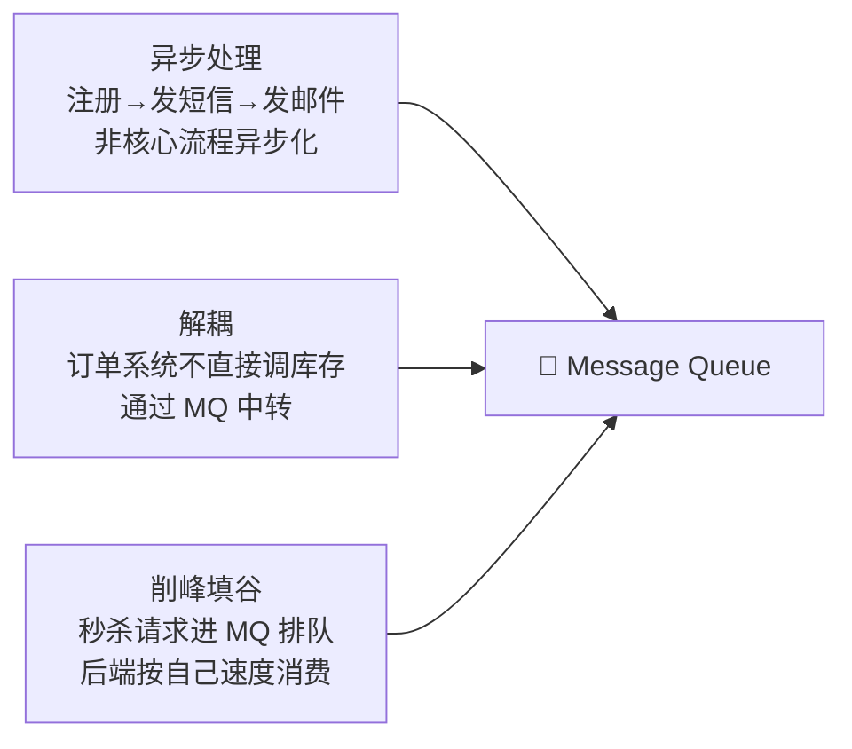
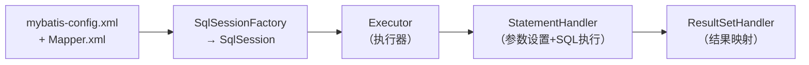
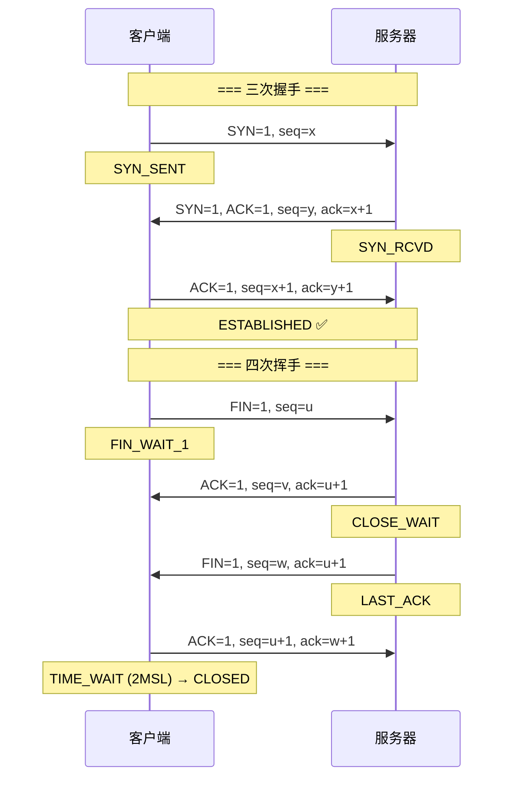
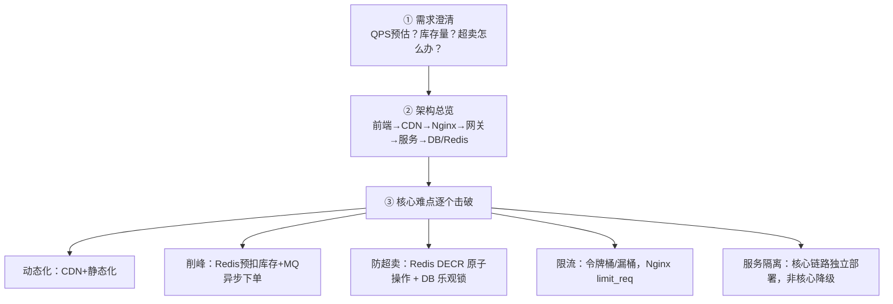

# 🎯 面试突击手册 — Java 全栈 + AI 完整版

> **覆盖 15 个模块，每道题「图解 → 原理 → 源码 → 话术」。**

---

## 目录

| # | 模块 | 面试权重 | 状态 |
|---|------|:--:|:--:|
| 1 | HashMap + ConcurrentHashMap | ★★★★★ | ✅ 已有 |
| 2 | 线程池 | ★★★★★ | ✅ 已有 |
| 3 | synchronized + volatile + AQS | ★★★★★ | ✅ 已有 |
| 4 | JVM GC + 内存结构 | ★★★★ | ✅ 已有 |
| 5 | **Spring Boot + IoC/AOP** | ★★★★★ | 🆕 |
| 6 | **MySQL 索引 + 事务 + 优化** | ★★★★★ | 🆕 |
| 7 | **Redis 缓存策略 + 持久化** | ★★★★ | 🆕 |
| 8 | **消息队列 MQ** | ★★★★ | 🆕 |
| 9 | **分布式系统 (CAP/事务/锁)** | ★★★★ | 🆕 |
| 10 | **MyBatis** | ★★★ | 🆕 |
| 11 | **设计模式** | ★★★ | 🆕 |
| 12 | **计算机网络** | ★★★ | 🆕 |
| 13 | **系统设计** | ★★★★ | 🆕 |
| 14 | AI / Agent / RAG / Spring AI | ★★★ | ✅ 已有 |
| 15 | 面试话术 + 反问模板 | - | 🆕 |

> ⚠️ 模块 1-4 + 14 在之前版本已详解，本文重点补全新模块 5-13。

---

## 五、Spring Boot — 问得比 Java 基础还多

### 自动配置原理

```java
// @SpringBootApplication 是一个组合注解：
@SpringBootConfiguration   // = @Configuration
@EnableAutoConfiguration   // ← 核心！自动配置
@ComponentScan             // 扫描当前包下的组件

// @EnableAutoConfiguration 做了什么：
//   1. 导入 AutoConfigurationImportSelector
//   2. 读取 META-INF/spring/org.springframework.boot.autoconfigure.AutoConfiguration.imports
//   3. 加载所有 xxxAutoConfiguration 类
//   4. 每个 AutoConfiguration 上有 @ConditionalOnXxx 条件注解
//   5. 满足条件 → 自动创建 Bean（如 DataSource、RedisTemplate）
```



### Spring Bean 生命周期



### 循环依赖 — 三级缓存

```java
// DefaultSingletonBeanRegistry 的三级缓存：
Map<String, Object> singletonObjects;        // 一级：完全初始化好的 Bean
Map<String, Object> earlySingletonObjects;   // 二级：提前暴露的 Bean（未完成填充）
Map<String, ObjectFactory<?>> singletonFactories; // 三级：Bean 工厂（可生成代理）

// 解决流程：A 依赖 B，B 依赖 A
// ① 创建 A → 实例化 → 放入三级缓存 → 发现需要 B
// ② 创建 B → 实例化 → 放入三级缓存 → 发现需要 A
// ③ 从三级缓存取 A（还未填充属性，只是提前引用）
// ④ B 填充 A → B 完成 → 放入一级缓存
// ⑤ A 填充 B → A 完成 → 放入一级缓存
```

### Spring 常用注解速查

| 类别 | 注解 | 作用 |
|------|------|------|
| Bean 注册 | `@Component` `@Service` `@Repository` `@Controller` | 标记为 Spring Bean |
| 配置 | `@Configuration` `@Bean` | Java Config 方式配置 |
| 依赖注入 | `@Autowired` `@Qualifier` `@Value` | 自动注入依赖 |
| 条件 | `@ConditionalOnClass` `@ConditionalOnMissingBean` | 条件装配 |
| 事务 | `@Transactional` | 声明式事务 |
| AOP | `@Aspect` `@Before` `@After` `@Around` | 切面编程 |
| MVC | `@RestController` `@GetMapping` `@RequestParam` `@PathVariable` | REST 接口 |
| 异步 | `@Async` `@EnableAsync` | 异步方法 |
| 定时 | `@Scheduled` `@EnableScheduling` | 定时任务 |

### Spring Boot vs Spring MVC

| 维度 | Spring MVC | Spring Boot |
|------|-----------|-------------|
| 配置 | XML / Java Config，手动配 DispatcherServlet | **零配置**，自动装配 |
| 启动 | 需要外部 Tomcat | **内嵌 Tomcat**，直接 `main()` |
| 依赖 | 手动管理冲突 | starter 一站式 |
| 监控 | 无 | **Actuator** 健康检查 |

### 📌 事务传播机制（面试必问！）

Spring 定义了 7 种传播行为，控制「一个事务方法被另一个事务方法调用时」怎么处理：



**核心对比**：

| 传播行为 | 当前有事务 | 当前没事务 | 典型场景 |
|---------|-----------|-----------|---------|
| **REQUIRED** | **加入当前** | 新建 | 默认，增删改查 |
| **REQUIRES_NEW** | **挂起当前，新建** | 新建 | 日志写入（独立提交，不受外层回滚影响） |
| **NESTED** | 嵌套（savepoint） | 新建 | 批量处理（部分失败不影响全部） |
| SUPPORTS | 加入当前 | 无事务 | 查询方法（有事务就读最新，没有也无所谓） |
| NOT_SUPPORTED | 挂起当前，无事务 | 无事务 | 不需要事务的纯计算 |
| MANDATORY | 加入当前 | 抛异常 | 必须在事务中执行（如扣库存） |
| NEVER | 抛异常 | 无事务 | 必须在无事务环境 |

**代码示例 — 最经典的两个场景**：

```java
// 场景1：日志必须独立提交（即使业务回滚，日志也要留下）
@Service
public class OrderService {
    @Autowired
    private LogService logService;

    @Transactional  // 默认 REQUIRED
    public void createOrder(Order order) {
        orderDao.insert(order);          // 插入订单
        logService.record("创建订单");     // 记录日志 ← 如果这里抛异常？
        // REQUIRES_NEW 的话，日志已经独立提交了，回滚不影响日志
    }
}

@Service
public class LogService {
    @Transactional(propagation = Propagation.REQUIRES_NEW)
    public void record(String msg) {
        logDao.insert(msg);  // 独立事务，不受外层回滚影响！
    }
}
```

```java
// 场景2：批量处理 — 每条记录独立提交，失败的不影响其他的
@Service
public class BatchService {
    @Autowired
    private ItemService itemService;

    public void batchProcess(List<Item> items) {
        for (Item item : items) {
            try {
                itemService.processOne(item);  // 每条在独立事务中
            } catch (Exception e) {
                log.error("处理失败: {}", item.getId(), e);
                // 继续处理下一条！
            }
        }
    }
}

@Service
public class ItemService {
    @Transactional(propagation = Propagation.REQUIRES_NEW)
    public void processOne(Item item) {
        // 每条数据在自己的事务中，失败不影响其他
    }
}
```

**⚠️ 事务失效的三大场景**：

```java
// 场景1️⃣：同类方法调用 — 不走代理！
@Service
public class UserService {
    @Transactional
    public void methodA() {
        this.methodB();  // ❌ 直接调用 this，绕过了 AOP 代理！
    }

    @Transactional(propagation = Propagation.REQUIRES_NEW)
    public void methodB() { ... }
}
// 解决：注入自己，用代理对象调用

// 场景2️⃣：异常被 catch 吞了
@Transactional
public void transfer() {
    try {
        dao.debit();
        dao.credit();  // 这里抛异常
    } catch (Exception e) {
        log.error("...");  // ❌ 异常被吞了，Spring 感知不到，不会回滚！
    }
}
// 解决：catch 里手动回滚，或抛出 RuntimeException

// 场景3️⃣：非 public 方法 — 代理不生效
@Transactional
private void doSomething() { ... }  // ❌ private 方法！CGLIB 无法代理
```

### Spring MVC 请求处理流程



### 拦截器 vs 过滤器

| | Filter | Interceptor |
|------|--------|-------------|
| 归属 | **Servlet** 规范 | **Spring** 框架 |
| 作用范围 | 所有请求（包括静态资源） | 只拦截进入 DispatcherServlet 的请求 |
| 能力 | 只能访问 request/response | 可访问 Handler、ModelAndView |
| 执行顺序 | Filter → Servlet → Interceptor → Controller |
| 使用 | 编码、安全、日志 | 权限、性能统计 |

### Spring Boot Starter 机制

```
spring-boot-starter-web
    └── 依赖 spring-boot-starter
        └── 依赖 spring-boot-autoconfigure
            └── META-INF/spring/xxx.imports
                └── 列出所有 xxxAutoConfiguration
                    ├── DispatcherServletAutoConfiguration
                    ├── HttpEncodingAutoConfiguration
                    ├── JacksonAutoConfiguration
                    └── ...

自定义 Starter：my-spring-boot-starter
    ① 写 xxxAutoConfiguration（@Configuration + @ConditionalOnXxx）
    ② 写 spring.factories / .imports 指向配置类
    ③ 引入依赖 → 自动装配 ✨
```

### 配置优先级（从高到低）

```
① 命令行参数 --server.port=9090
② java:comp/env JNDI
③ 系统环境变量
④ application-{profile}.yml
⑤ application.yml
⑥ @PropertySource
⑦ Spring Boot 默认值
```

### @ConfigurationProperties vs @Value

| | @ConfigurationProperties | @Value |
|------|------------------------|--------|
| 注入方式 | 批量注入整个前缀 | 逐个注入 |
| 松散绑定 | ✅ (max-connections → maxConnections) | ❌ |
| 校验 | ✅ @Validated | ❌ |
| SpEL | ❌ | ✅ `@Value("#{...}")` |
| 适用 | 一组相关配置 | 单个配置值 |

---

## 六、MySQL — 从索引到优化一条龙

### B+Tree 索引原理

MySQL InnoDB 用 B+Tree，不用 Hash/二叉树/B-Tree：



**B+Tree 为什么好**：非叶子节点只存 Key（扇出大，3-4 层存千万级数据）+ 叶子节点双向链表（范围查询极快）。

### 索引类型

| 类型 | 叶子存什么 | 特点 |
|------|-----------|------|
| **聚簇索引**（主键） | 完整行数据 | 一张表只有一个，InnoDB 必须有 |
| **二级索引** | 主键值 | 查到主键后要**回表** |
| **联合索引** | 多列组合 | 遵循最左前缀 |
| **覆盖索引** | 查询列全在索引里 | 不用回表，Extra=Using index |

### 最左前缀原则

```sql
-- 联合索引 (a, b, c)
WHERE a=1              -- ✅ 用到 a
WHERE a=1 AND b=2      -- ✅ 用到 a,b
WHERE a=1 AND b>2      -- ✅ a 精确 + b 范围（c 失效）
WHERE b=2              -- ❌ 缺 a，不走索引
WHERE a=1 AND c=3      -- ⚠️ 只用 a（跳过了 b，c 失效）
```

### 事务 ACID + 隔离级别

```
原子性 Atomicity:  要么全成功，要么全回滚（undo log）
一致性 Consistency: 事务前后数据满足约束
隔离性 Isolation:   并发事务互不干扰（MVCC + 锁）
持久性 Durability:  提交后数据不丢失（redo log）
```

| 隔离级别 | 脏读 | 不可重复读 | 幻读 | 实现 |
|---------|:--:|:--:|:--:|------|
| READ UNCOMMITTED | ✅ | ✅ | ✅ | 几乎不用 |
| READ COMMITTED | ❌ | ✅ | ✅ | Oracle 默认 |
| **REPEATABLE READ** | ❌ | ❌ | ✅ | **MySQL InnoDB 默认** |
| SERIALIZABLE | ❌ | ❌ | ❌ | 锁表，性能最差 |

> MySQL 的 RR 通过 **MVCC（多版本并发控制）+ Next-Key Lock** 解决了大部分幻读。

### Explain 执行计划关键字段

```sql
EXPLAIN SELECT * FROM orders WHERE user_id = 123;
```

| 字段 | 含义 | 好 | 坏 |
|------|------|-----|-----|
| type | 访问类型 | const > ref > range | index > **ALL**（全表扫描） |
| key | 实际用的索引 | 有值 | NULL |
| rows | 扫描行数 | 越少越好 | 大 |
| Extra | 额外信息 | Using index（覆盖索引） | Using filesort（文件排序）、Using temporary（临时表） |

### SQL 优化清单

1. **最左前缀** — 联合索引不在最左列，索引失效
2. **函数/计算** — `WHERE YEAR(create_time)=2026` 不走索引，改成 `WHERE create_time BETWEEN '2026-01-01' AND '2026-12-31'`
3. **隐式类型转换** — `WHERE phone=13800138000` 但 phone 是 varchar → 全表扫描
4. **LIKE 前置百分号** — `LIKE '%abc'` 不走索引，`LIKE 'abc%'` 可以
5. **OR** — 两边都有索引才走索引，否则全表扫描
6. **SELECT \*** — 尽量用覆盖索引减少回表
7. **深分页** — `LIMIT 100000, 10` → 用游标分页或子查询优化

---

## 七、Redis — 不只是缓存

### 五种数据类型 + 使用场景

| 类型 | 底层 | 场景 |
|------|------|------|
| **String** | SDS（简单动态字符串） | 缓存、计数器、分布式锁 |
| **Hash** | ziplist / hashtable | 对象存储（用户信息） |
| **List** | quicklist | 消息队列、最新列表 |
| **Set** | intset / hashtable | 标签、共同好友、去重 |
| **ZSet** | skiplist + dict | 排行榜、延时队列 |

### 缓存三大问题



### Redis 持久化 RDB vs AOF

| | RDB | AOF |
|------|-----|-----|
| 方式 | 快照（某一时刻全量数据） | 追加写命令日志 |
| 文件 | dump.rdb | appendonly.aof |
| 恢复 | **快**（直接加载） | 慢（逐条重放命令） |
| 数据安全 | 可能丢最后一次快照后的数据 | **更安全**（最多丢 1 秒） |
| 生产 | **两者都开**，用 RDB 恢复 + AOF 保数据 | |

### 分布式锁

```java
// Redis 分布式锁要点：
// ① SET NX PX：原子地加锁+设过期
String result = jedis.set(lockKey, requestId, "NX", "PX", 30000);

// ② 解锁用 Lua 脚本，保证原子性（先查再删）
//    KEYS[1] = lockKey, ARGV[1] = requestId
"if redis.call('get', KEYS[1]) == ARGV[1] then return redis.call('del', KEYS[1]) else return 0 end"

// ③ Redisson 的 RedLock 和看门狗机制
//    看门狗：每 10 秒续期，防止业务没处理完锁就过期
```

---

## 八、消息队列 MQ

### 为什么用 MQ — 三大核心场景



### Kafka 核心概念

```
Producer → Topic(分区0, 分区1, 分区2...) → Consumer Group
              ↓             ↓             ↓
           Partition0   Partition1   Partition2 (每个分区有序)
              ↓             ↓             ↓
           Offset 0      Offset 0      Offset 0
           Offset 1      Offset 1      Offset 1
           ...

每个 Partition:
  - 一个 Leader + N 个 Follower（ISR 机制）
  - 消息按 Offset 顺序追加写入
  - 同一个 Partition 内消息有序
```

### Kafka vs RabbitMQ

| | Kafka | RabbitMQ |
|------|-------|----------|
| 设计 | 分布式日志（海量吞吐） | 消息代理（灵活路由） |
| 吞吐 | **百万级 QPS** | 万级 QPS |
| 消息顺序 | 分区内有序 ✅ | 单个队列内有序 |
| 消费模式 | Pull（消费者拉） | Push（Broker 推） |
| 典型场景 | 日志收集、流处理、大数据 | 业务解耦、任务分发 |

### 消息丢失怎么解决

| 环节 | 问题 | 解决 |
|------|------|------|
| 生产端 | 发送失败 | acks=all + 重试机制 |
| Broker | 宕机丢数据 | 多副本 + min.insync.replicas ≥ 2 |
| 消费端 | 未处理完就提交 offset | 先处理再手动提交 |

### 消息重复消费怎么处理

- **幂等性设计**：数据库唯一键、Redis setnx、业务状态机
- **Kafka 消费者**：关闭自动提交，手动维护 offset

---

## 九、分布式系统

### CAP 定理

```
分布式系统在网络分区发生时，只能三选二：

  C (Consistency)    — 所有节点同一时刻数据一致
  A (Availability)   — 每个请求都能收到非错误响应
  P (Partition)      — 网络分区时系统仍可用

  P 无法避免 → 实际是 CP 还是 AP 的选择：
    CP: ZooKeeper、etcd（强一致，牺牲可用性）
    AP: Eureka、Cassandra（高可用，最终一致性）

  → CAP 太严格，BASE 才是互联网业务的实际方案
```

### BASE 理论

| 字母 | 含义 | 解释 |
|------|------|------|
| **BA** | Basically Available | 允许降级（双11只让看订单不让改） |
| **S** | Soft State | 允许中间状态（数据正在同步） |
| **E** | Eventually Consistent | 最终一致（朋友圈晚 1 秒看到无所谓） |

### 分布式事务解决方案

| 方案 | 原理 | 适用 |
|------|------|------|
| **2PC** | 两阶段提交（预提交 → 提交） | 强一致场景，性能差 |
| **TCC** | Try-Confirm-Cancel | 资金类业务 |
| **本地消息表** | 业务 + 消息一起写入本地，定时重试 | 最终一致 |
| **RocketMQ 事务消息** | Broker 回查生产者 | 阿里系 |
| **Seata AT** | 自动生成回滚 SQL | **最常用**，对代码无侵入 |

---

## 十、MyBatis

### #{} vs ${}

| | `#{}` | `${}` |
|------|-------|-------|
| 方式 | **预编译占位符** | 字符串拼接 |
| SQL | `SELECT * FROM user WHERE id = ?` | `SELECT * FROM user WHERE id = 1` |
| SQL 注入 | **安全** ✅ | **危险** ❌ |
| 适用 | 99% 场景 | 动态表名/列名、ORDER BY |

### MyBatis 核心流程



### MyBatis 缓存

| | 一级缓存 | 二级缓存 |
|------|------|------|
| 范围 | SqlSession 内 | Mapper（namespace）级别 |
| 默认 | **默认开启** | 需手动开启 |
| 清除 | 执行 insert/update/delete 时清空 | 同上，可跨 SqlSession |

---

## 十一、设计模式在 Spring 中的应用

| 模式 | 定义 | Spring 中的应用 |
|------|------|----------------|
| **单例** | 全局唯一实例 | Spring Bean 默认 scope=singleton |
| **工厂** | 工厂类创建对象 | `BeanFactory`、`ApplicationContext` |
| **代理** | 代理对象控制访问 | **AOP** — JDK 动态代理 / CGLIB |
| **模板方法** | 父类定义骨架，子类实现细节 | `JdbcTemplate`、`RestTemplate` |
| **观察者** | 一对多通知 | `ApplicationListener`、`@EventListener` |
| **策略** | 算法族可互换 | `DispatcherServlet` 选择 Handler |
| **适配器** | 接口转换 | `HandlerAdapter` |
| **装饰器** | 动态添加功能 | `BeanDefinitionDecorator`、`ServerHttpRequestDecorator` |

---

## 十二、计算机网络

### TCP 三次握手 + 四次挥手



> **为什么三次不是两次**：防止已失效的连接请求到达服务器。如果只有两次，服务器收到旧 SYN 就建立连接，浪费资源。
> **为什么四次**：TCP 全双工，双方都要 FIN + ACK。

### HTTP vs HTTPS

| | HTTP | HTTPS |
|------|------|-------|
| 加密 | ❌ 明文 | ✅ TLS 加密 |
| 端口 | 80 | 443 |
| 证书 | 无 | CA 证书验证 |
| 速度 | 快 | 稍慢（握手开销） |

### HTTP 状态码

| 状态码 | 含义 | 举例 |
|:--:|------|------|
| 200 | OK | 请求成功 |
| 301 | 永久重定向 | 域名迁移 |
| 302 | 临时重定向 | 登录后跳转 |
| 400 | 请求错误 | 参数不对 |
| 401 | 未认证 | 没登录 |
| 403 | 禁止访问 | 没权限 |
| 404 | 未找到 | URL 不存在 |
| 500 | 服务器错误 | 代码异常 |
| 502 | 网关错误 | Nginx 连不上后端 |
| 503 | 服务不可用 | 服务挂了或在维护 |

---

## 十三、系统设计 — 怎么答设计题

### 面试官问"设计一个秒杀系统"→ 按这个框架答



### 设计题的万能公式

```
1. 先聊需求（别上来就画图）
2. 给一个简单的整体架构（单机→分布式逐步演进）
3. 识别 2-3 个核心难点，逐个给出方案
4. 每个方案讲 trade-off（选 A 的好处 + 为什么不选 B）
5. 最后总结一句
```

**面试话术**：「设计秒杀系统，我先从最简单的方案开始：一个服务 + MySQL 扣库存。然后逐步加 Redis 预扣库存解决并发、加 MQ 异步下单削峰、加限流防刷。每个组件解决一个具体问题，不要为了分布式而分布式。」

---

## 十四、AI / Agent 速查（面试加分项）

> 详细版本见前几章。这里给精简版。

### Agent = LLM + Memory + Tools + Planning

- LLM = 大脑（推理决策）
- Memory = 笔记本（短期对话 + 长期向量库）
- Tools = 手（Function Calling 调用外部 API）
- Planning = 做事方法（ReAct / Plan-Execute / Reflection）

### RAG 一句话

**先搜再答**：用户问题 → Embedding 向量化 → 向量数据库检索 → 拼入 Prompt → LLM 生成有据可查的答案。

### Spring AI 一句话

Spring Boot 里注入 `ChatClient`，和用 `JdbcTemplate` 一样自然。改 application.yml 就能换模型。

---

## 十五、面试现场 — 话术 + 反问

### 自我介绍（60 秒版）

> 「面试官好，我是 XXX，X 年 Java 后端开发。技术栈 Spring Boot + MySQL + Redis + Kafka。熟悉并发编程、JVM 调优和分布式系统设计。最近在学 AI/Agent，用 Spring AI 做过内部系统集成，自建过 RAG 知识库。我认为 AI 不是取代 Java，而是让 Java 系统加一层智能能力。这个岗位需要的技术栈和我的方向很匹配。」

### 反问面试官的黄金三问

1. **「团队目前技术栈是什么样的？主要在用哪些中间件？」** → 顺便展示你的技术广度
2. **「这个岗位未来半年最希望我解决什么技术难题？」** → 显示你关注价值产出
3. **「团队对 AI 有什么规划吗？」** → 展示你的差异化优势

### 被问"你有什么想问的"时 — 千万别问的

- ❌ 「公司加班多吗？」（入职后问 HR）
- ❌ 「薪资还能谈吗？」（和 HR 谈）
- ❌ 「这个技术你们为什么用？」（听起来像在质疑）

---

## 速查清单

| 模块 | 必背知识点 |
|------|-----------|
| Java 基础 | HashMap 位运算+红黑树、ConcurrentHashMap CAS+synchronized、线程池 7 参数+状态机 |
| 并发 | synchronized 锁升级、volatile 内存屏障、AQS CLH 队列、CAS ABA 问题 |
| JVM | 内存 5 区、GC 4 算法、Minor vs Full GC、G1 Region |
| Spring | IoC/DI、AOP 代理方式、Bean 生命周期三级缓存、@Transactional 失效场景 |
| MySQL | B+Tree 为什么好、最左前缀、ACID+隔离级别、Explain 关键字段 |
| Redis | 5 种类型、缓存三问题、RDB vs AOF、分布式锁 |
| MQ | 削峰/解耦/异步、Kafka 分区+ISR、消息丢失/重复解决方案 |
| 分布式 | CAP vs BASE、分布式事务方案（Seata/TCC/消息表） |
| MyBatis | #{} vs ${}、核心流程、一二级缓存 |
| 设计模式 | 单例/工厂/代理/模板/策略在 Spring 中的应用 |
| 网络 | TCP 三次握手四次挥手、HTTP 状态码 |
| 系统设计 | 万能答题公式 → 需求→架构→难点→trade-off |
| AI | Agent 四层架构、RAG 流水线、Spring AI 三大抽象 |

---

> 🔥 你不是在背八股，你是在用工程经验包装基础知识。Java 全栈 + AI = 大部分人没有的组合优势。
