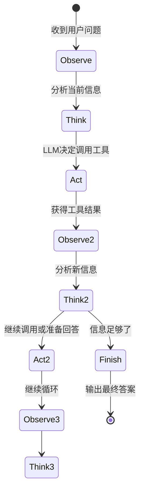
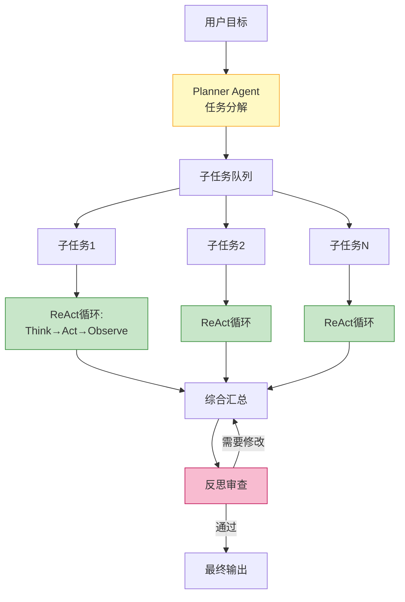

# Agent 规划与推理

> **一句话**:规划能力是 Agent 区别于"聊天机器人"的第一核心——它能把一个模糊的大目标拆解成可执行的小步骤，并在执行中动态调整策略。

## 核心概念

LLM 本身只是个"文字接龙机器"，给它一个复杂任务，它不一定知道先做什么后做什么。**规划层**就是教 Agent "怎么思考做事方法"。

三种主流范式，从简单到复杂：

### 1. 思维链 Chain-of-Thought（CoT）

最基础的推理增强。不改变流程，只是让 LLM **在回答前先展示推理过程**。

```
用户: 小明有5个苹果，给了小红2个，又买了3个，给了小刚1个，还剩几个？

❌ 直接回答: 5个    (LLM 可能算错)

✅ CoT 回答:
让我一步步算:
1. 小明原有 5 个苹果
2. 给了小红 2 个 → 5 - 2 = 3
3. 又买了 3 个 → 3 + 3 = 6
4. 给了小刚 1 个 → 6 - 1 = 5
答案: 5 个
```

**实现方式**: 在 prompt 里加一句"请一步步思考"或"Let's think step by step"，就能显著提升复杂推理的准确率。

### 2. ReAct（Reasoning + Acting）—— 最经典的 Agent 范式

2022 年由 Yao et al. 提出，是当前几乎所有 Agent 框架的底层范式。核心思想：**推理和行动交替进行**。

```
Question: 2026年全球市值最高的AI公司是哪家？

Thought 1: 我需要搜索2026年全球AI公司市值排名
Action 1: search("2026年AI公司市值排名")
Observation 1: 搜索结果: 1.Apple 3.5万亿 2.Microsoft 3.2万亿 3.NVIDIA 3.0万亿...

Thought 2: 搜索结果中Apple和Microsoft不完全是纯AI公司，NVIDIA最相关。但让我确认下最新的数据
Action 2: search("NVIDIA 2026年市值 AI芯片")
Observation 2: NVIDIA 目前市值约3.0万亿美元，是AI芯片领域的绝对领导者

Thought 3: 我有足够信息来回答了
Answer: 2026年全球市值最高的纯AI公司是NVIDIA，市值约3万亿美元。如果算上有AI业务的科技巨头，Apple(3.5万亿)和Microsoft(3.2万亿)市值更高。
```

**ReAct 的循环本质**：



### 3. 任务分解 Task Decomposition

面对复杂目标，先拆成子任务，再逐个执行。可以**一次拆完**，也可以**边执行边拆**。

```
用户目标: "帮我研究2026年AI Agent赛道，写一份投资分析报告"

自动分解为:
├── 子任务1: search("2026 AI Agent 融资新闻") → 收集融资事件
├── 子任务2: search("AI Agent 独角兽公司") → 整理头部公司
├── 子任务3: 对比各公司商业模式和技术路线 → 交叉分析
├── 子任务4: search("AI Agent 市场规模预测") → 获取市场数据
└── 子任务5: 综合以上信息，生成结构化报告 → 输出
```

### 4. 反思与自我纠错 Reflection

高级 Agent 会**审视自己的输出**，发现错误就重新来过。这需要额外的"审查者"角色。

```
Agent 生成报告后:
→ Reviewer Agent: "这篇报告没有提到多Agent这个重要趋势，且数据来源不够权威"
→ Writer Agent: "收到，我补充多Agent部分，并增加 IDC 和 Gartner 的数据引用"
→ Reviewer Agent: "通过"
```

## 原理图解

### 四种规划范式对比

```mermaid
graph TB
    subgraph CoT["1. CoT 思维链"]
        C1[问题] --> C2[LLM一步步推理]
        C2 --> C3[直接输出答案]
    end

    subgraph ReAct["2. ReAct 推理+行动"]
        R1[问题] --> R2[思考]
        R2 --> R3[调用工具]
        R3 --> R4[观察结果]
        R4 --> R5[再思考]
        R5 --> R6[再调用 / 输出]
    end

    subgraph TD2["3. 任务分解"]
        T1[大目标] --> T2[拆分为子任务列表]
        T2 --> T3[执行子任务1]
        T3 --> T4[执行子任务2]
        T4 --> T5[汇总结果]
    end

    subgraph Ref["4. 反思纠错"]
        F1[生成结果] --> F2[自我审查]
        F2 -->|有问题| F3[修改重做]
        F3 --> F2
        F2 -->|通过| F4[最终输出]
    end

    style CoT fill:#E8F5E9
    style ReAct fill:#E3F2FD
    style TD2 fill:#FFF3E0
    style Ref fill:#FCE4EC
```



### 实际项目中的规划架构（推荐）



## 代码实例

### ReAct Agent 完整实现（纯 Python，无框架）

```python
"""
ReAct Agent 完整实现
核心: Thought → Action → Observation 循环
"""

import json
from openai import OpenAI

client = OpenAI(api_key="your-api-key")

# 定义可用工具
TOOLS = [
    {
        "type": "function",
        "function": {
            "name": "calculator",
            "description": "计算数学表达式",
            "parameters": {
                "type": "object",
                "properties": {
                    "expression": {"type": "string", "description": "数学表达式，如 '2 * (3 + 4)'"}
                },
                "required": ["expression"]
            }
        }
    },
    {
        "type": "function",
        "function": {
            "name": "search",
            "description": "搜索互联网获取信息",
            "parameters": {
                "type": "object",
                "properties": {
                    "query": {"type": "string", "description": "搜索关键词"}
                },
                "required": ["query"]
            }
        }
    }
]

def calculator(expression: str) -> str:
    """安全的数学计算"""
    try:
        # 只允许数字和基本运算符
        allowed = set("0123456789+-*/(). ")
        if not all(c in allowed for c in expression):
            return "错误: 包含不允许的字符"
        return str(eval(expression))
    except Exception as e:
        return f"计算错误: {e}"

def search(query: str) -> str:
    """模拟搜索"""
    results = {
        "中国人口": "根据2026年数据，中国人口约14.1亿",
        "中国GDP": "2026年中国GDP约18万亿美元",
        "人均GDP": "中国人均GDP约12,700美元",
    }
    for key, val in results.items():
        if key in query:
            return val
    return f"搜索 '{query}' 返回: 暂无精确结果"

TOOL_MAP = {"calculator": calculator, "search": search}

SYSTEM_PROMPT = """你是一个能推理和行动的助手。面对复杂问题，你要:
1. 先 Thought: 分析问题，决定下一步
2. 再 Action: 调用合适的工具
3. 最后 Answer: 信息充分时给出最终答案

每步都要清晰标注 Thought / Action / Answer。"""

def react_agent(question: str, max_rounds: int = 6) -> str:
    """ReAct 核心循环"""
    messages = [
        {"role": "system", "content": SYSTEM_PROMPT},
        {"role": "user", "content": question}
    ]

    for round_num in range(max_rounds):
        print(f"\n{'='*50}")
        print(f"第 {round_num + 1} 轮")
        print(f"{'='*50}")

        response = client.chat.completions.create(
            model="deepseek-chat",
            messages=messages,
            tools=TOOLS,
            temperature=0  # 规划任务用低温度，更确定性
        )

        msg = response.choices[0].message

        # 展示 LLM 的思考过程
        if msg.content:
            print(f"💭 Thought: {msg.content}")

        messages.append(msg)

        # 如果 LLM 要调用工具
        if msg.tool_calls:
            for tc in msg.tool_calls:
                name = tc.function.name
                args = json.loads(tc.function.arguments)
                print(f"🔧 Action: {name}({args})")

                result = TOOL_MAP[name](**args)
                print(f"📥 Observation: {result}")

                messages.append({
                    "role": "tool",
                    "tool_call_id": tc.id,
                    "content": result
                })
        else:
            # 没有工具调用 → LLM 认为可以回答了
            print(f"✅ Answer: {msg.content}")
            return msg.content

    return "达到最大推理轮数"

# 运行测试
if __name__ == "__main__":
    print("=" * 50)
    print("测试: 需要多步推理的复杂问题")
    print("=" * 50)
    result = react_agent(
        "中国2026年的GDP总量约18万亿美元，人口约14.1亿，"
        "请帮我算一下人均GDP是多少万美元？这个水平在国际上算什么水平？"
    )

    # 预期过程:
    # Round 1: Thought → 调用 calculator(18 / 14.1)
    # Round 2: Thought → 调用 search("人均GDP 国际水平对比")
    # Round 3: Thought → 综合给出答案
```

### 带反思的 Agent

```python
"""
Reflection Agent - 增加自我审查环节
"""

def reflect_and_improve(draft: str, question: str) -> str:
    """让LLM自己审查并改进输出"""

    review_prompt = f"""请审查以下回答，检查:
1. 是否完整回答了用户的问题
2. 是否有事实错误
3. 是否有逻辑漏洞
4. 语言是否清晰

如果发现问题，请指出并给出改进版本。如果没问题，输出"LGTM"。

原始问题: {question}
Agent 回答: {draft}"""

    review_response = client.chat.completions.create(
        model="deepseek-chat",
        messages=[{"role": "user", "content": review_prompt}],
        temperature=0
    )

    review = review_response.choices[0].message.content
    print(f"\n🔍 审查结果:\n{review}")

    if "LGTM" in review:
        print("✅ 审查通过，无需修改")
        return draft

    # 如果审查发现问题，让LLM重新回答
    print("⚠️ 审查发现需要改进，重新生成...")
    improve_prompt = f"""原始问题: {question}
第一版回答: {draft}
审查意见: {review}

请根据审查意见，生成改进后的回答。"""

    improved = client.chat.completions.create(
        model="deepseek-chat",
        messages=[
            {"role": "system", "content": "你是高质量输出专家，根据审查意见改进内容。"},
            {"role": "user", "content": improve_prompt}
        ],
        temperature=0
    )
    return improved.choices[0].message.content
```

## 常见误区 / 面试点

- **误区1**: "CoT 就是让模型说'让我想想'" —— 不完全是。CoT 的关键是在输出答案前**强制展示中间推理步骤**，这在数学、逻辑、多步推理上能显著提升准确率。但简单问题加 CoT 反而会降低效果。
- **误区2**: "ReAct 一定比直接问好" —— 错。如果问题不需要工具调用（如纯翻译、文本改写），加 ReAct 循环只会增加延迟和成本。**按需选择**。
- **误区3**: "反思越多越好" —— 错。每多一轮反思就多一次 LLM 调用（= 成本和延迟）。一般 1 轮反思性价比最高，2 轮是上限。
- **面试追问方向**:
  - "如何减少 Agent 的推理轮数？" → 更好的 Prompt、更精准的工具描述、缓存常见问题、预计算
  - "ReAct 和 Chain 有什么区别？" → Chain 是固定步骤 A→B→C，ReAct 是 LLM 动态决定下一步
  - "Agent 循环死循环怎么办？" → 设置 max_steps、加超时、加终止条件检测

## 参考来源

- ReAct 原论文: Yao et al. "ReAct: Synergizing Reasoning and Acting in Language Models" (2022)
- Tree of Thoughts (ToT): Yao et al. "Tree of Thoughts: Deliberate Problem Solving with Large Language Models" (2023)
- Reflexion: Shinn et al. "Reflexion: Language Agents with Verbal Reinforcement Learning" (2023)
- 相关笔记: `Agent核心概念.md`
