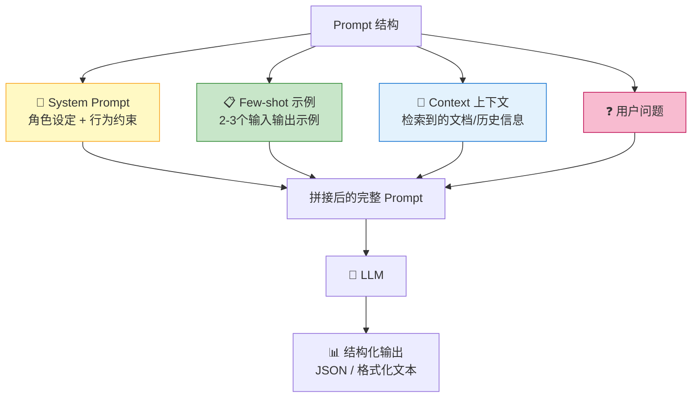
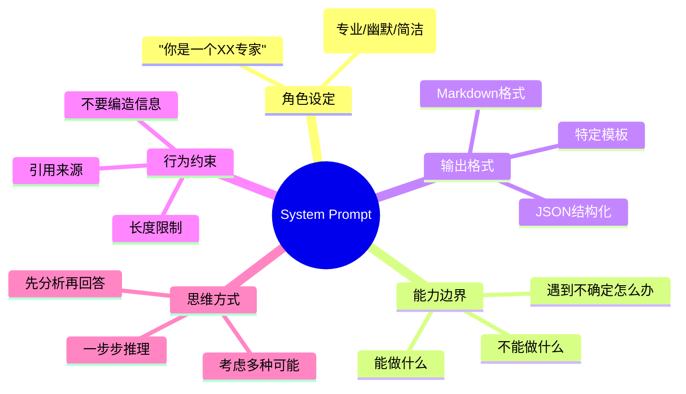

# Prompt 工程

> **一句话**:Prompt 工程不是"跟 AI 聊天"，而是**精确控制 LLM 输出的核心技术**——同样的模型、不同的 Prompt，效果可以天差地别。

## 核心概念

Prompt 工程是 Agent 开发中最容易被低估的技能。很多人以为用 Agent 框架就够了，但**框架只是骨架，Prompt 才是灵魂**。

### Prompt 的四个层次

| 层次 | 技术 | 效果提升 | 复杂度 |
|------|------|---------|--------|
| **直接提问** | 原始问题 | 基线 | ⭐ |
| **角色设定 + 指令** | System Prompt + 格式要求 | +20-30% | ⭐⭐ |
| **Few-shot 示例** | 给2-3个示例 | +30-50% | ⭐⭐⭐ |
| **思维链 + 结构化** | CoT + JSON输出约束 | +50-80% | ⭐⭐⭐⭐ |

## 原理图解

### 高质量 Prompt 的结构



### System Prompt 的关键要素



## 代码实例

### System Prompt 模板（可直接复用）

```python
"""
高质量 System Prompt 模板库
"""

# ====== 1. 通用助手（带约束）======
GENERAL_ASSISTANT = """你是一个专业、高效的AI助手。

## 角色定位
你是{role}，擅长{expertise}。

## 行为规则
1. 回答要准确、简洁、有条理
2. 如果不确定答案，明确说"我不确定"而不是编造
3. 涉及数据时，注明数据来源和时效性
4. 如果问题不完整，先追问再回答

## 输出格式
- 使用 Markdown 格式
- 列表优先于段落
- 代码要有注释
- 复杂问题先给结论再给分析过程
"""

# ====== 2. 信息提取 Agent ======
EXTRACTOR = """你是一个信息提取专家。从给定的文本中精准提取结构化信息。

## 提取规则
1. 只提取文本中明确出现的信息，不要推测
2. 如果某个字段在文本中找不到，填写 null
3. 数值信息保持原文格式
4. 时间统一转换为 YYYY-MM-DD 格式

## 输出格式（必须严格遵循）
```json
{
  "company_name": "公司全称",
  "founding_date": "成立日期",
  "industry": "所属行业",
  "products": ["产品1", "产品2"],
  "headquarters": "总部地址"
}
```

## 示例
输入: "阿里巴巴集团成立于1999年，由马云在杭州创立..."
输出:
```json
{"company_name": "阿里巴巴集团", "founding_date": "1999-01-01", "industry": "电子商务", "products": [], "headquarters": "杭州"}
```
"""

# ====== 3. 代码审查 Agent ======
CODE_REVIEWER = """你是一个资深代码审查专家，精通{language}。

## 审查维度
对每段代码，从以下维度审查:
1. 🐛 **Bug风险**: 是否有潜在的运行时错误、空指针、并发问题
2. 🏗️ **设计**: 是否符合 SOLID 原则、设计模式是否合理
3. ⚡ **性能**: 是否有明显性能瓶颈（N+1查询、大对象拷贝等）
4. 🔒 **安全**: 是否有注入、XSS、敏感信息泄露风险
5. 📖 **可读性**: 命名是否清晰、注释是否充分

## 输出格式
```
### 总体评价: ⭐⭐⭐⭐ (4/5)

#### 🐛 Bug风险
- [行号] 问题描述 → 建议修复方式

#### 🏗️ 设计建议
- 建议内容

#### ⚡ 性能
- 建议内容

#### ✅ 亮点
- 写得好的地方
```
"""

# ====== 4. Agent 规划器 ======
PLANNER = """你是一个任务规划专家。将用户的复杂目标分解为可执行的子任务。

## 规划原则
1. 每个子任务应该是独立的、可验证的
2. 任务之间有明确的先后依赖关系
3. 考虑可能的失败点和备选方案
4. 估算每个子任务的复杂度

## 输出格式
```json
{
  "goal": "最终目标",
  "tasks": [
    {
      "id": 1,
      "name": "子任务名称",
      "description": "具体做什么",
      "depends_on": [],
      "tools_needed": ["需要的工具"],
      "expected_output": "预期输出",
      "complexity": "low/medium/high"
    }
  ],
  "potential_risks": ["可能的风险"]
}
```
"""
```

### Few-shot 学习示例

```python
"""
Few-shot: 通过示例引导输出格式
"""

# ========== 情感分析 Few-shot ==========
sentiment_prompt = """判断以下文本的情感倾向。

示例:
输入: "这个产品用起来太方便了，强烈推荐！"
输出: {"sentiment": "positive", "confidence": 0.95, "reason": "用户使用了'太方便了''强烈推荐'等正面表达"}

输入: "质量太差了，用了一周就坏了，退货中"
输出: {"sentiment": "negative", "confidence": 0.92, "reason": "用户抱怨'质量差''坏了'并提到退货"}

输入: "包装还行，东西一般，价格偏贵"
输出: {"sentiment": "neutral", "confidence": 0.7, "reason": "用户评价褒贬参半，无强烈情绪"}

现在请分析:
输入: "客服态度很好，耐心解答了我所有问题，但物流太慢了，等了快两周"
输出:"""

# LLM 会模仿上面的格式输出:
# {"sentiment": "mixed", "confidence": 0.8, "reason": "用户对客服满意(正面)但对物流不满(负面)，整体褒贬参半"}
```

### 思维链 (Chain-of-Thought) 技巧

```python
"""
Chain-of-Thought 技巧汇总
"""

# ========== 技巧1: 直接加"一步步想" ==========
cot_basic = """问题: 一个笼子里有鸡和兔子共35只，脚共94只，鸡和兔子各多少？

请一步步推理。"""

# ========== 技巧2: 让 LLM 先想再给答案 ==========
cot_two_stage = """先独立思考，然后在"最终答案"标签中给出结论。

<思考>
(你的推理过程写在这里)
</思考>

<最终答案>
(你的结论写在这里)
</最终答案>"""

# ========== 技巧3: 自我验证 ==========
cot_verify = """请解决这个问题，然后自己验证答案是否正确。

如果验证不通过，请重新解答。"""

# ========== 技巧4: 多视角思考 ==========
cot_perspectives = """请从以下三个角度分别分析这个问题:
1. 乐观视角: 最好的情况是什么？
2. 悲观视角: 最坏的情况是什么？
3. 客观视角: 最可能的情况是什么？

综合三个视角给出建议。"""
```

## 常见误区 / 面试点

- **误区1**: "Prompt 越长越好" —— 错。过长的 Prompt 会：① 占用上下文窗口 ② 关键指令被淹没 ③ 增加成本。**简洁精确 > 冗长模糊**。实战数据：将 50 行 Prompt 压缩到 15 行后，模型合规率反而提升（因为关键约束不再被稀释）。
- **误区2**: "一次设计好 Prompt 就够了" —— 错。Prompt 需要持续迭代。用不同问题测试，发现 LLM 理解偏差就调整措辞。
- **误区3**: "只有英文 Prompt 效果才好" —— 不完全对。中文大模型（DeepSeek、Qwen、GLM）对中文 Prompt 理解很好。但 GPT-4 系列用英文 Prompt 效果确实略好（因为训练数据中英文占比大）。
- **面试追问方向**:
  - "如何让 LLM 输出严格的 JSON？" → ① 在 Prompt 中给出 JSON schema ② 用 response_format=json_mode（OpenAI 支持）③ 解析失败时重试
  - "Prompt 注入攻击怎么防？" → 输入过滤、指令和用户数据分层、输出校验
  - "什么是 Prompt Chaining？" → 把复杂任务拆成多步 Prompt，上一步的输出作为下一步的输入

## 实战经验（来自 AI 小说家项目）

> 以下 5 条经验来自 1800 行的 PyQt5 桌面 AI 写作工具实战。详见经验笔记：[Prompt工程实战](../../../05-经验日志/Prompt工程实战.md)。

### 经验 1：Few-shot 是性价比最高的改进

在大纲 Prompt 中加入一个完整的 JSON 示例后，模型输出格式合规率从 **~60% 提升到 ~95%**。示例比 10 条文字规则都有效。

```python
# ❌ 只写规则
"title 不要加'第X卷'/'第X章'等编号"

# ✅ 规则 + 示例
"示例: {\"volumes\":[{\"title\":\"废土觉醒\",\"chapters\":[{\"title\":\"辐射巢穴\",...}]}]}"
```

### 经验 2：首尾效应 — 最重要的约束放第一句和最后一句

模型对 Prompt 开头和结尾的内容注意力最高。在 AI 小说家中，将"无缝衔接"约束同时放在 System Prompt 第一句和末尾"重申"中，效果显著优于只放一遍。

### 经验 3：System Prompt 和 User Prompt 标签必须对齐

如果 System Prompt 写"你会收到【大纲】【前情提要】"，但 User Prompt 实际发的标签是 `📖 前情提要` 和 `## 大纲`，模型可能无法正确识别。**改了 Prompt 就全局搜索标签引用，统一格式。**

### 经验 4：接续锚点 — 给模型一个明确的"起跑线"

写作类任务中，即使发了完整的上一节全文，模型仍可能从错误位置接续。解决：在上下文末尾追加上一节最后 2-3 个完整段落，标注 `⚠️ 上一节结尾（请从这里接续）`，让模型有明确起点。

### 经验 5：修订 Prompt 用决策表代替模糊指令

不要写"尽量少改"——模型无法判断"多少算少"。用决策表：

| 意见类型 | 做法 |
|---------|------|
| 改名字/错别字 | 仅替换目标词 |
| 某段有问题 | 只改那一段 |
| 和前面脱节 | 改开头 1-2 段加过渡 |
| 全部重写 | 全文重写 |

## 参考来源

- OpenAI Prompt Engineering 指南: https://platform.openai.com/docs/guides/prompt-engineering
- Learn Prompting: https://learnprompting.org
- DeepSeek Prompt 指南: https://api-docs.deepseek.com/guides/reasoning_model
- 相关笔记: `规划与推理.md`
