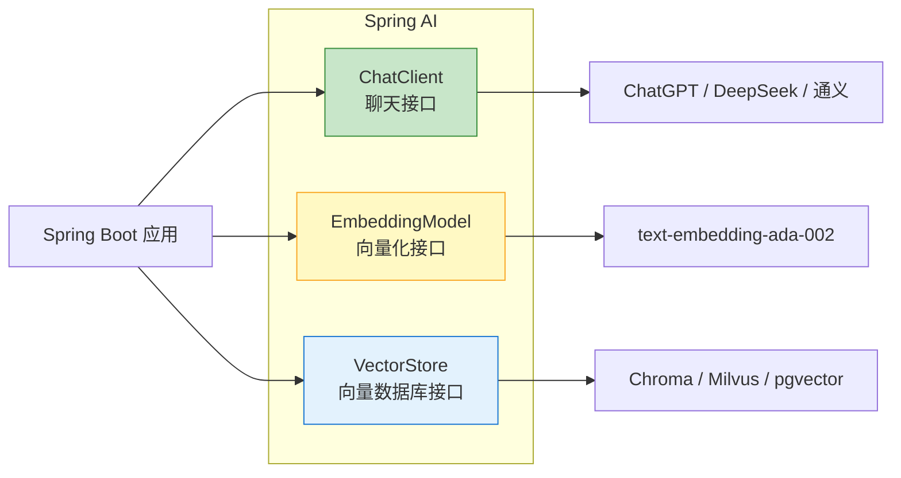

# Spring AI 实战

> **一句话**:Spring AI = 你用 Spring Boot 开发了十年的经验，现在直接用在 AI 开发上。**同样的配置方式、同样的依赖注入、同样的 MVC 分层，只是把数据库换成了大模型**。

## 核心概念

### Spring AI 的三大抽象



这三大接口的设计哲学和 Spring Data 如出一辙：

| Spring Data | Spring AI | 说明 |
|------------|-----------|------|
| `JpaRepository<User, Long>` | `ChatClient` | 框架替你实现，你只管注入 |
| `application.yml` 数据源配置 | `application.yml` AI 配置 | 改个配置就换数据库/模型 |
| `@Query` 自定义查询 | Prompt 模板 | 模板化 AI 输入 |
| `@Transactional` 事务 | RetryTemplate | 内置重试机制 |

## 代码实例

### 环境准备

```xml
<!-- pom.xml 依赖（Spring Boot 3.x + Spring AI）-->
<parent>
    <groupId>org.springframework.boot</groupId>
    <artifactId>spring-boot-starter-parent</artifactId>
    <version>3.4.0</version>
</parent>

<dependency>
    <groupId>org.springframework.ai</groupId>
    <artifactId>spring-ai-openai-spring-boot-starter</artifactId>
    <version>1.0.0</version>
</dependency>

<!-- 如果使用 DeepSeek（兼容 OpenAI 格式） -->
<dependency>
    <groupId>org.springframework.ai</groupId>
    <artifactId>spring-ai-openai-spring-boot-starter</artifactId>
    <version>1.0.0</version>
    <!-- DeepSeek 兼容 OpenAI 格式，只需改 base-url -->
</dependency>

<!-- 如果使用通义千问 -->
<!--
<dependency>
    <groupId>org.springframework.ai</groupId>
    <artifactId>spring-ai-qwen-spring-boot-starter</artifactId>
    <version>1.0.0</version>
</dependency>
-->
```

```yaml
# application.yml
spring:
  ai:
    openai:
      api-key: ${DEEPSEEK_API_KEY}
      base-url: https://api.deepseek.com
      chat:
        options:
          model: deepseek-chat
          temperature: 0
```

### 实战1: 基础聊天

```java
@RestController
@RequestMapping("/ai")
public class ChatController {

    private final ChatClient chatClient;

    // 方式A: 自动配置注入（推荐）
    public ChatController(ChatClient.Builder builder) {
        this.chatClient = builder.build();
    }

    // 方式B: 直接注入
    // @Autowired
    // private ChatClient chatClient;

    @GetMapping("/chat")
    public String chat(@RequestParam String message) {
        return chatClient.call(message);
    }

    @PostMapping("/chat-stream")
    public Flux<String> chatStream(@RequestBody String message) {
        // 流式输出（类似 SSE）
        return chatClient.stream(message);
    }

    @GetMapping("/chat-with-system")
    public String chatWithSystem(@RequestParam String question) {
        return chatClient.prompt()
                .system("你是一个 Java 技术专家，回答要简洁专业。")
                .user(question)
                .call()
                .content();
    }
}
```

### 实战2: 结构化输出

```java
// ===== 定义输出结构 =====
public record CompanyInfo(
    String name,
    String industry,
    Integer foundedYear,
    List<String> products
) {}

@RestController
@RequestMapping("/ai")
public class StructuredOutputController {

    private final ChatClient chatClient;

    @GetMapping("/extract")
    public CompanyInfo extract(@RequestParam String text) {
        return chatClient.prompt()
                .system("从文本中提取公司信息，返回结构化数据")
                .user(text)
                .call()
                .entity(CompanyInfo.class);  // 自动解析为 Java 对象！
    }

    // 复杂结构
    @GetMapping("/extract-list")
    public List<CompanyInfo> extractList(@RequestParam String text) {
        return chatClient.prompt()
                .user(text)
                .call()
                .entity(new ParameterizedTypeReference<>() {});  // 泛型
    }
}
```

### 实战3: Function Calling（工具调用）

```java
@Component
public class WeatherService {

    @Tool(name = "get_weather", description = "获取指定城市的天气情况")
    public String getWeather(String city) {
        // 实际调用天气 API
        return STR."\{city}今天: 晴转多云，25°C，湿度60%";
    }
}

@Component
public class CalculatorService {

    @Tool(name = "calculator", description = "执行数学计算")
    public String calculate(String expression) {
        try {
            // 注意：严格限制在沙箱中执行！
            ScriptEngine engine = new ScriptEngineManager()
                    .getEngineByName("JavaScript");
            Object result = engine.eval(expression);
            return result.toString();
        } catch (Exception e) {
            return "计算错误: " + e.getMessage();
        }
    }
}

@RestController
@RequestMapping("/ai")
public class ToolController {

    private final ChatClient chatClient;

    public ToolController(ChatClient.Builder builder,
                          WeatherService weather,
                          CalculatorService calc) {
        this.chatClient = builder
                .defaultTools(weather, calc)  // 注册工具
                .build();
    }

    @GetMapping("/agent")
    public String agent(@RequestParam String question) {
        return chatClient.prompt()
                .user(question)
                .call()
                .content();
        // Agent 会自动决定调用哪个 Tool ⭐
    }
}
```

### 实战4: RAG 知识库

```java
// pom.xml 额外依赖
// spring-ai-chroma-store-spring-boot-starter
// spring-ai-pdf-document-reader（PDF 解析）

@Service
public class RAGService {

    private final VectorStore vectorStore;
    private final ChatClient chatClient;

    // ===== 1. 文档导入 =====
    public void importDocument(String filepath) {
        // 读取文档
        var reader = new PagePdfDocumentReader(
                new FileSystemResource(filepath));
        List<Document> documents = reader.read();

        // 切分
        var splitter = new TokenTextSplitter(500, 100);
        List<Document> chunks = splitter.apply(documents);

        // 向量化并存入
        vectorStore.write(chunks);
    }

    // ===== 2. 问答 =====
    @GetMapping("/ask")
    public String ask(@RequestParam String question) {
        // 自动检索 + 生成
        return chatClient.prompt()
                .user(question)
                .advisors(new QuestionAnswerAdvisor(vectorStore))  // RAG！
                .call()
                .content();
        // 等效于 Python RAG 的全部流程！
    }
}
```

### 完整项目结构

```
src/main/java/com/example/aidemo/
├── controller/
│   ├── ChatController.java          # 基础聊天
│   ├── AgentController.java         # Function Calling Agent
│   └── RAGController.java           # RAG 知识库
├── service/
│   ├── WeatherService.java          # 自定义工具
│   ├── DatabaseService.java         # 数据库查询工具
│   └── DocumentService.java         # 文档处理
├── model/
│   ├── CompanyInfo.java             # 结构化输出模型
│   └── AgentMessage.java
├── config/
│   └── AIConfig.java                # 自定义配置
└── AiDemoApplication.java

src/main/resources/
├── application.yml                  # AI 配置
└── docs/                            # RAG 文档目录
```

## Spring AI vs Python LangChain 功能对照

| 功能 | Python LangChain | Java Spring AI | 对应篇目 |
|------|-----------------|---------------|---------|
| LLM 调用 | `ChatOpenAI().invoke()` | `chatClient.call()` | 本手册 08 |
| 流式输出 | `.stream()` | `.stream()` | 08 |
| 结构化输出 | `with_structured_output()` | `.entity(Class)` | 本手册 |
| Function Calling | `@tool` | `@Tool` | 本手册 |
| RAG | `RetrievalQA` | `QuestionAnswerAdvisor` | 05 |
| Prompt 模板 | `ChatPromptTemplate` | `PromptTemplate` | 06 |
| 向量数据库 | `Chroma.from_documents()` | `VectorStore.write()` | 03 |
| 多 Agent | CrewAI | 暂无（需组合） | 10 |
| 部署 | FastAPI | **Spring Boot ⭐** | 11 |

## 常见误区

- **误区1**: "Spring AI 还不成熟，不能上生产" —— 2025 年已发布 1.0 正式版，+ Spring 官方维护，可靠性比社区方案高。但功能确实比 LangChain 少（比如没有 LangGraph 等价物）。
- **误区2**: "Spring AI 只能调 OpenAI" —— 支持 OpenAI、DeepSeek、通义、智谱、Ollama、Azure、Bedrock、Vertex AI 等。**切换模型只需要改配置文件和依赖坐标**。
- **误区3**: "有了 Spring AI 就不用学 Python AI" —— 不对。生态里最前沿的功能（新框架、新工具）永远先在 Python 中出现。**双修是竞争力**。

## 参考来源

- Spring AI 官方 Reference: https://docs.spring.io/spring-ai/reference/
- Spring AI GitHub: https://github.com/spring-projects/spring-ai
- Spring AI 示例: https://github.com/spring-projects/spring-ai-examples
- 相关笔记: `Java AI开发生态概览.md`
