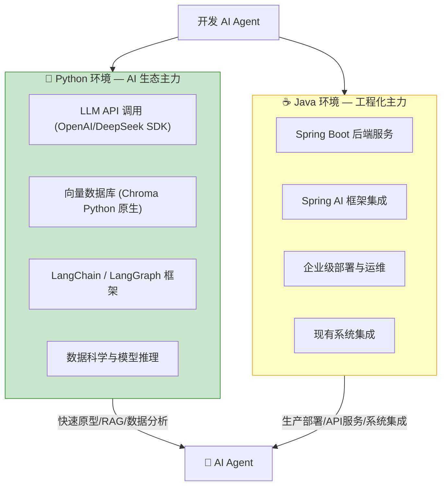
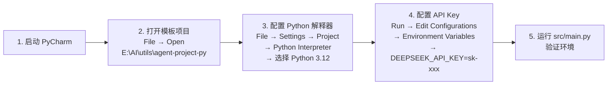
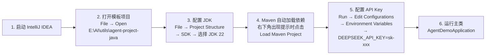

# AI Agent 开发环境搭建指南

> **一句话**:Agent 开发同时需要 Python（AI 生态主力语言）和 Java（你的主场 + Spring AI），本文手把手教你配好两个环境。

## 核心概念

### 为什么要配双环境？



| 你用 Python 做什么 | 你用 Java 做什么 |
|-------------------|----------------|
| 快速开发和验证 AI 原型 | 把 AI 能力集成到现有系统 |
| 调用 LLM API + Function Calling | 提供稳定的 API 服务 |
| RAG 知识库 / 数据分析 | 高并发 / 企业级部署 |
| 使用 LangChain / LangGraph | 使用 Spring AI / RestTemplate |

### 环境总览（你机器上的最终成果）

```
├── 🐍 Python 3.12.10
│   ├── PyCharm Community 2025.2.6
│   └── 模板项目: E:\AI\utils\agent-project-py\
│
├── ☕ JDK 22 + Maven 3.9.9
│   ├── IntelliJ IDEA Community 2025.2.6
│   └── 模板项目: E:\AI\utils\agent-project-java\
│
└── 📦 核心依赖都装了: openai / chromadb / httpx / python-dotenv
```

## 环境搭建完整流程

### 第1步：安装 Python 3.12

```bash
# 方法A: 使用 winget（推荐，已用此方式安装）
winget install --id Python.Python.3.12 --accept-source-agreements

# 方法B: 官网下载
# https://www.python.org/downloads/
# 安装时务必勾选 ✅ Add Python to PATH
```

**验证安装**：
```bash
python --version
# Python 3.12.10

pip --version
# pip 25.0.1
```

> ⚠️ **注意**: Windows 的 Microsoft Store 可能会拦截 `python` 命令。
> 如果输入 `python --version` 弹出商店或没反应，说明 PATH 被 Store 占位符抢了。
> **解决方案**：使用完整路径或修改 PATH 顺序。
>
> 安装路径: `C:\Users\Administrator\AppData\Local\Programs\Python\Python312\`

### 第2步：安装 AI Agent 核心依赖

```bash
# 核心依赖（轻量，全装 < 50MB）
pip install openai chromadb python-dotenv httpx aiohttp requests

# 可选依赖（按需安装）
# pip install langchain langchain-openai    # LangChain 框架
# pip install sentence-transformers          # 本地 Embedding（需 torch ~500MB）
# pip install fastapi uvicorn               # API 部署
```

验证依赖安装成功：
```bash
python -c "import openai; import chromadb; import httpx; print('✅ Agent 环境就绪')"
```

### 第3步：安装 PyCharm（Python IDE）

```bash
# 使用 winget 安装社区版（免费）
winget install --id JetBrains.PyCharm.Community --accept-source-agreements
```

**安装后配置**：



> **PyCharm 专业技巧**：
> - **Ctrl+Shift+F10**: 运行当前文件
> - **Alt+Enter**: 快速修复（自动安装缺失的包）
> - **Ctrl+Shift+A**: 搜索所有操作
> - **Python Console**: 底部的交互式 Python 终端

### 第4步：安装 IntelliJ IDEA（Java IDE）

```bash
# 使用 winget 安装社区版（免费）
winget install --id JetBrains.IntelliJIDEA.Community --accept-source-agreements
```

> **注意**: 这台机器原有一个旧版 IntelliJ IDEA，winget 会自动升级。

**安装后配置**：



> **IntelliJ IDEA 专业技巧**：
> - **Ctrl+Shift+F10**: 运行 main 方法
> - **Ctrl+B**: 跳到定义（JDK 源码也支持）
> - **Ctrl+Alt+L**: 格式化代码
> - **Alt+Insert**: 生成代码（getter/setter/构造器等）

### 第5步：配置 API Key

两个环境共用一个 API Key 配置，有**三种方式**：

```bash
# 方式1: 环境变量（推荐，全局生效）
# 打开 CMD（管理员），执行:
setx DEEPSEEK_API_KEY "sk-your-key-here" /M

# 方式2: IDE 运行配置（项目级别）
# PyCharm: Run → Edit Configurations → Environment Variables
# IntelliJ: Run → Edit Configurations → Environment Variables
# 填入: DEEPSEEK_API_KEY=sk-your-key-here

# 方式3: .env 文件（项目级别，不提交 Git）
# 在项目根目录创建 .env 文件:
echo DEEPSEEK_API_KEY=sk-your-key-here > .env
# 代码中用 python-dotenv 加载
```

> 💡 **国内推荐**: 使用 DeepSeek API（便宜、快、兼容 OpenAI 格式）
> - 注册: https://platform.deepseek.com
> - API 地址: `https://api.deepseek.com`
> - 模型: `deepseek-chat`（≈ GPT-4 水平，价格 1/10）

## 项目模板结构

### Python Agent 项目

```
E:\AI\utils\agent-project-py\
├── .env.example        ← 环境变量模板
├── requirements.txt    ← 依赖清单
├── README.md           ← 使用说明
└── src/
    ├── __init__.py
    └── main.py         ← 最小 Agent 示例 + 环境检测
```

**运行方式**：
```bash
cd E:\AI\utils\agent-project-py
python src/main.py
```

**内部实现了什么**——一个最小 Agent（20行核心代码，见 `Agent核心概念.md`）：

```python
import os, json
from openai import OpenAI

client = OpenAI(api_key=os.getenv("DEEPSEEK_API_KEY"),
                base_url="https://api.deepseek.com")

tools = [{
    "type": "function",
    "function": {
        "name": "calculator",
        "description": "执行数学计算",
        "parameters": {"type": "object", "properties": {
            "expression": {"type": "string"}
        }, "required": ["expression"]}
    }
}]

def agent(question: str) -> str:
    messages = [{"role": "user", "content": question}]
    for _ in range(5):
        resp = client.chat.completions.create(
            model="deepseek-chat", messages=messages, tools=tools)
        msg = resp.choices[0].message
        if not msg.tool_calls:
            return msg.content
        messages.append(msg)
        for tc in msg.tool_calls:
            args = json.loads(tc.function.arguments)
            messages.append({"role": "tool", "tool_call_id": tc.id,
                "content": f"结果: {eval(args['expression'])}"})
    return "超时"
```

### Java Agent 项目

```
E:\AI\utils\agent-project-java\
├── pom.xml                     ← Maven 配置 (Spring Boot 3.3)
└── src/main/
    ├── java/com/agent/demo/
    │   ├── AgentDemoApplication.java   ← 启动类
    │   ├── controller/
    │   │   ├── AIController.java       ← 基础聊天 API
    │   │   └── AgentController.java    ← Agent + Function Calling
    │   └── service/
    │       ├── LLMService.java         ← LLM API 封装
    │       └── AgentToolFunctions.java ← 工具定义 + 函数注册表
    └── resources/
        └── application.yml            ← 配置
```

**运行方式**：
```bash
cd E:\AI\utils\agent-project-java
mvn spring-boot:run
# 启动后访问: http://localhost:8080/ai/health
```

**API 端点**：

| 端点 | 方法 | 说明 |
|------|------|------|
| `/ai/health` | GET | 健康检查 |
| `/ai/chat?message=你好` | GET | 基础聊天 |
| `/agent/chat?message=现在几点` | GET | Agent 自动调用工具 |

## 常见问题排查

| 问题 | 原因 | 解决 |
|------|------|------|
| `python` 不是内部命令 | PATH 中 Store 占位符优先 | 去系统环境变量把 `Python312` 移到 `WindowsApps` 上面 |
| `pip install` 很慢 | 连接 PyPI 网络慢 | `pip config set global.index-url https://mirrors.aliyun.com/pypi/simple/` |
| Maven 找不到依赖 | 未配置仓库 | pom.xml 中已配置 `spring-milestones` 仓库 |
| IDEA 不识别项目 | 未导入 Maven 项目 | File → Open → 选择 pom.xml → Open as Project |
| API 调用 401 | API Key 未配置或错误 | 检查 `DEEPSEEK_API_KEY` 环境变量 |
| API 调用超时 | 网络代理或防火墙 | 检查是否能访问 `api.deepseek.com` |
| PyCharm 找不到 Python | 解释器路径未配置 | Settings → Project → Python Interpreter → 添加 Python 3.12 |

## 参考来源

- Python 官方: https://www.python.org
- PyCharm 下载: https://www.jetbrains.com/pycharm/download
- IntelliJ IDEA 下载: https://www.jetbrains.com/idea/download
- DeepSeek API: https://platform.deepseek.com
- Spring AI: https://spring.io/projects/spring-ai
- 模板项目: `E:\AI\utils\agent-project-py` 和 `E:\AI\utils\agent-project-java`
- 相关笔记: `../Python/` | `Spring AI实战.md`
