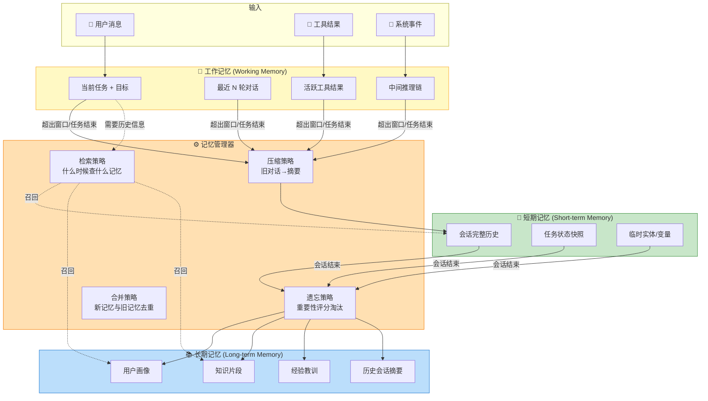
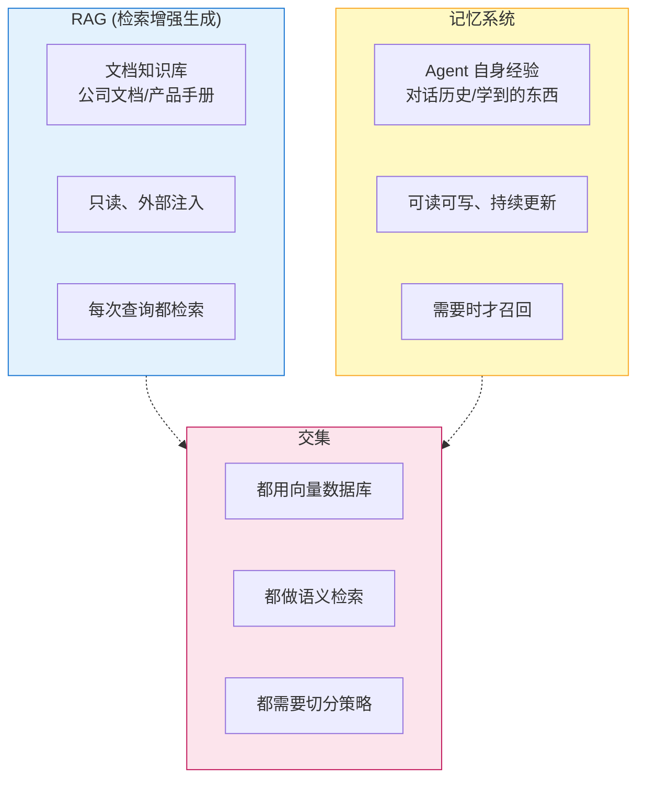

# 记忆系统设计实战

> **一句话**：记忆不是"接个 Chroma 就完事"。三层记忆各有设计要点，搞错任何一层，Agent 要么"健忘"要么"记忆混乱"。

## 核心问题

`记忆系统.md` 讲了三层记忆的**概念**。但实际设计中你会遇到这些问题：

| 概念好理解 | 实际难设计 |
|-----------|-----------|
| 工作记忆 = Prompt 上下文 | 上下文窗口有限，什么该留什么该丢？|
| 短期记忆 = 对话历史 | 多轮对话越来越长，怎么压缩？|
| 长期记忆 = 向量数据库 | 什么值得存？存了怎么检索？旧记忆怎么淘汰？|

**记忆系统设计的本质，就是在一个有限容器里，最大化有用信息的保留。**

## 记忆架构全景



## 设计一：工作记忆 —— 什么该留在上下文？

### 问题

GPT-4 上下文 128K token，DeepSeek V4 支持 1M token。**但塞满 ≠ 好用**：
- LLM 的注意力在长上下文中会分散（Lost in the Middle 效应）
- Token 就是钱（1M token 上下文 = 更高的 API 费用）
- 推理速度随上下文长度线性下降

### 解决方案：滑动窗口 + 分层保留

```
┌────────────────── 128K 上下文窗口 ──────────────────┐
│                                                     │
│  [系统 Prompt]  [核心指令]  [活跃窗口]  [摘要区]     │
│     2K            2K          8K         剩余空间    │
│   永远保留      永远保留    最近N轮    历史压缩版    │
│                                                     │
└─────────────────────────────────────────────────────┘
```

```python
"""
工作记忆管理器 —— 分层保留策略
"""

from dataclasses import dataclass, field
from typing import List, Dict
import tiktoken


@dataclass
class Message:
    role: str        # "user" | "assistant" | "tool" | "system"
    content: str
    importance: float = 1.0  # 重要性评分 (0-1)


class WorkingMemory:
    """工作记忆：管理 LLM 上下文窗口"""

    def __init__(self, max_tokens: int = 8000):
        self.max_tokens = max_tokens
        self.encoder = tiktoken.get_encoding("cl100k_base")

        # 四个区域
        self.system_prompt: List[Message] = []   # 永远保留
        self.core_instructions: List[Message] = [] # 永远保留
        self.active_window: List[Message] = []    # 最近 N 轮
        self.summaries: List[str] = []            # 历史摘要

    def add(self, msg: Message):
        """添加新消息，自动管理窗口"""
        self.active_window.append(msg)

        # 检查是否超出
        while self._total_tokens() > self.max_tokens:
            if len(self.active_window) > 6:
                # 压缩最旧的两条对话为摘要
                self._compress_oldest_pair()
            else:
                # 活跃窗口已经最小了，不再压缩
                break

    def _compress_oldest_pair(self):
        """把最旧的 user + assistant 对话压缩成一句话摘要"""
        if len(self.active_window) >= 2:
            old_user = self.active_window.pop(0)
            old_assistant = self.active_window.pop(0)
            summary = f"[历史] 用户问了'{old_user.content[:50]}...'，"
            summary += f"助手回答了'{old_assistant.content[:50]}...'"
            self.summaries.append(summary)

    def _total_tokens(self) -> int:
        total = 0
        for msg in (self.system_prompt + self.core_instructions +
                     self.active_window):
            total += len(self.encoder.encode(msg.content))
        for s in self.summaries:
            total += len(self.encoder.encode(s))
        return total

    def build_context(self) -> List[dict]:
        """构建最终发给 LLM 的 messages 列表"""
        messages = []

        # 1. 系统 Prompt
        for msg in self.system_prompt:
            messages.append({"role": msg.role, "content": msg.content})

        # 2. 历史摘要（如果有）
        if self.summaries:
            summary_text = "## 历史对话摘要\n" + "\n".join(
                f"- {s}" for s in self.summaries
            )
            messages.append({"role": "system", "content": summary_text})

        # 3. 核心指令
        for msg in self.core_instructions:
            messages.append({"role": msg.role, "content": msg.content})

        # 4. 活跃对话
        for msg in self.active_window:
            messages.append({"role": msg.role, "content": msg.content})

        return messages
```

### 关键设计决策

| 决策 | 选项 A | 选项 B | 推荐 |
|------|--------|--------|------|
| 超出窗口时？ | 丢掉最旧的 | 压缩为摘要 | **压缩**（保留信息） |
| 压缩多少？ | 一次压全部 | 一次压 2 轮 | **一次压 2 轮**（逐步淘汰） |
| 摘要存哪？ | 放上下文 | 存入长期记忆 | **都存**（上下文 + 向量库） |

## 设计二：长期记忆 —— 什么值得"记住"？

### 问题

Agent 运行久了会产生大量"记忆"：对话、工具结果、中间推理...全存向量库 = 噪音比信号多。

### 解决方案：重要性评分 + 记忆分层

```python
"""
长期记忆管理器 —— 三层存储 + 重要性评分
"""

from datetime import datetime, timedelta
import chromadb


class LongTermMemory:
    """长期记忆：三层存储架构"""

    def __init__(self):
        self.client = chromadb.PersistentClient(path="./agent_memory")

        # 三层存储
        self.user_profile = self.client.get_or_create_collection("user_profile")
        self.knowledge = self.client.get_or_create_collection("knowledge")
        self.experiences = self.client.get_or_create_collection("experiences")

    # ---------- 记忆分类 ----------

    def remember(self, content: str, memory_type: str, metadata: dict):
        """
        存入长期记忆
        memory_type: "profile" | "knowledge" | "experience"
        """
        importance = self._score_importance(content, metadata)
        if importance < 0.3:
            return  # 不重要的丢弃

        collections = {
            "profile": self.user_profile,     # 用户偏好/背景
            "knowledge": self.knowledge,      # 领域知识
            "experience": self.experiences,   # 经验教训
        }

        collections[memory_type].add(
            documents=[content],
            metadatas=[{**metadata, "importance": importance}],
            ids=[self._gen_id(content)]
        )

    def _score_importance(self, content: str, metadata: dict) -> float:
        """
        重要性评分算法
        因素：
        - 是否包含关键信息（偏好、决策、教训）
        - 是否被反复提及
        - 时间衰减
        """
        score = 0.5  # 基础分

        # +关键词加分
        keywords = ["偏好", "喜欢", "总是", "不要", "教训", "错误", "重要"]
        for kw in keywords:
            if kw in content:
                score += 0.1

        # +反复提及加分
        if metadata.get("mention_count", 0) > 3:
            score += 0.2

        # +时间衰减（超过 30 天的降分）
        days_old = (datetime.now() - metadata.get("timestamp", datetime.now())).days
        if days_old > 30:
            score -= 0.1 * (days_old / 30)

        return min(max(score, 0), 1.0)

    # ---------- 记忆检索 ----------

    def recall(self, query: str, memory_type: str = None, top_k: int = 5) -> str:
        """检索相关记忆"""
        collections = {
            "profile": self.user_profile,
            "knowledge": self.knowledge,
            "experience": self.experiences,
        }

        if memory_type:
            results = collections[memory_type].query(
                query_texts=[query], n_results=top_k
            )
        else:
            # 从所有记忆中检索
            all_results = []
            for col in collections.values():
                r = col.query(query_texts=[query], n_results=top_k)
                if r["documents"][0]:
                    all_results.extend(r["documents"][0])
            # 去重 + 截断
            results = {"documents": [list(set(all_results))[:top_k]]}

        if not results["documents"][0]:
            return ""
        return "\n".join(f"- {doc}" for doc in results["documents"][0])

    # ---------- 记忆淘汰 ----------

    def forget_old(self, days: int = 90):
        """淘汰过期低重要性记忆"""
        cutoff = datetime.now() - timedelta(days=days)
        for col in [self.knowledge, self.experiences]:
            # 查询低重要性的旧记忆
            results = col.get(
                where={"importance": {"$lt": 0.3}}
            )
            for doc_id, metadata in zip(results["ids"], results["metadatas"]):
                timestamp = datetime.fromisoformat(metadata.get("timestamp", "2000-01-01"))
                if timestamp < cutoff:
                    col.delete(ids=[doc_id])
```

### 三层记忆对比

| 层级 | 存什么 | 生命周期 | 检索方式 | 示例 |
|------|--------|---------|---------|------|
| **用户画像** | 偏好、背景、习惯 | 永久（除非变化） | 精确匹配 | "用户喜欢简短回答" |
| **知识片段** | 学到的知识点 | 长期（可更新） | 语义检索 | "HashMap JDK8 引入红黑树" |
| **经验教训** | 做过的任务、踩过的坑 | 中期（可淘汰） | 语义检索+时间 | "上次用 BeautifulSoup 解析失败，换 lxml" |

## 设计三：记忆与 RAG 的边界

很多人把记忆系统和 RAG 混为一谈。它们有交集但有明确边界：



| 维度 | RAG | 记忆系统 |
|------|-----|---------|
| 数据来源 | 外部文档（被动注入） | Agent 自身经验（主动积累） |
| 更新频率 | 跟随文档更新（天级） | 实时写入（每条对话都可能写入） |
| 数据量 | 大（万-百万级） | 中小（千-万级） |
| 检索精度要求 | 高（引用必须准确） | 中（回忆即可，不需要引用） |
| 淘汰策略 | 跟随文档版本 | 基于重要性+时间 |

## 完整记忆管理器示例

```python
"""
AgentMem — 完整三层记忆管理器
整合工作记忆、短期记忆、长期记忆
"""


class AgentMemory:
    """Agent 的完整记忆系统"""

    def __init__(self):
        self.working = WorkingMemory(max_tokens=8000)    # 工作记忆
        self.longterm = LongTermMemory()                  # 长期记忆

    def on_user_message(self, content: str):
        """处理用户消息"""
        # 1. 从长期记忆中召回相关信息
        relevant = self.longterm.recall(content)

        # 2. 把召回的记忆拼入工作记忆
        if relevant:
            self.working.add(Message(
                role="system",
                content=f"【相关历史记忆】\n{relevant}",
                importance=0.8
            ))

        # 3. 添加用户消息
        self.working.add(Message(role="user", content=content))

    def on_agent_reply(self, content: str):
        """处理 Agent 回复"""
        self.working.add(Message(role="assistant", content=content))

    def on_tool_result(self, tool_name: str, result: str):
        """处理工具调用结果"""
        self.working.add(Message(
            role="tool",
            content=f"[{tool_name}] {result}",
            importance=0.5
        ))

    def on_session_end(self):
        """
        会话结束：压缩短期记忆 → 存入长期记忆
        """
        # 生成会话摘要存入长期记忆
        summary = self._summarize_session()
        self.longterm.remember(
            content=summary,
            memory_type="experience",
            metadata={"timestamp": datetime.now()}
        )

        # 从对话中提取用户偏好
        preferences = self._extract_preferences()
        for pref in preferences:
            self.longterm.remember(
                content=pref,
                memory_type="profile",
                metadata={"timestamp": datetime.now()}
            )

    def _summarize_session(self) -> str:
        """用 LLM 总结本次会话的关键信息"""
        # 实际实现：取活跃窗口 + 摘要，用便宜模型做总结
        ...

    def _extract_preferences(self) -> list:
        """从对话中提取用户偏好"""
        ...

    def build_llm_context(self) -> List[dict]:
        """构建发给 LLM 的完整上下文"""
        return self.working.build_context()
```

## 常见误区

- **误区1**："记忆越多越好" → 错。记忆质量 > 数量。低质量记忆产生噪音，反而降低 Agent 表现。**宁可少记，不要乱记**。
- **误区2**："短期记忆全存向量库就是长期记忆" → 对话原文塞向量库 ≠ 长期记忆。需要有**摘要 + 结构化 + 重要性评估**。
- **误区3**："记忆系统 = 向量数据库" → 用户画像（"喜欢简短回答"）这种精确信息不适合语义检索，用 Redis/DB 存更快更准。
- **误区4**："RAG 就是记忆系统" → 见上文边界分析。简单说：RAG 是读文档，记忆是写经验。

## 参考来源

- 同目录 `记忆系统.md` — 三层记忆基础概念 + Chroma 入门
- 同目录 `RAG检索增强生成.md` — RAG 原理（长期记忆的技术基础）
- Mem0 (记忆层框架): https://github.com/mem0ai/mem0
- Letta (原 MemGPT): https://github.com/letta-ai/letta
