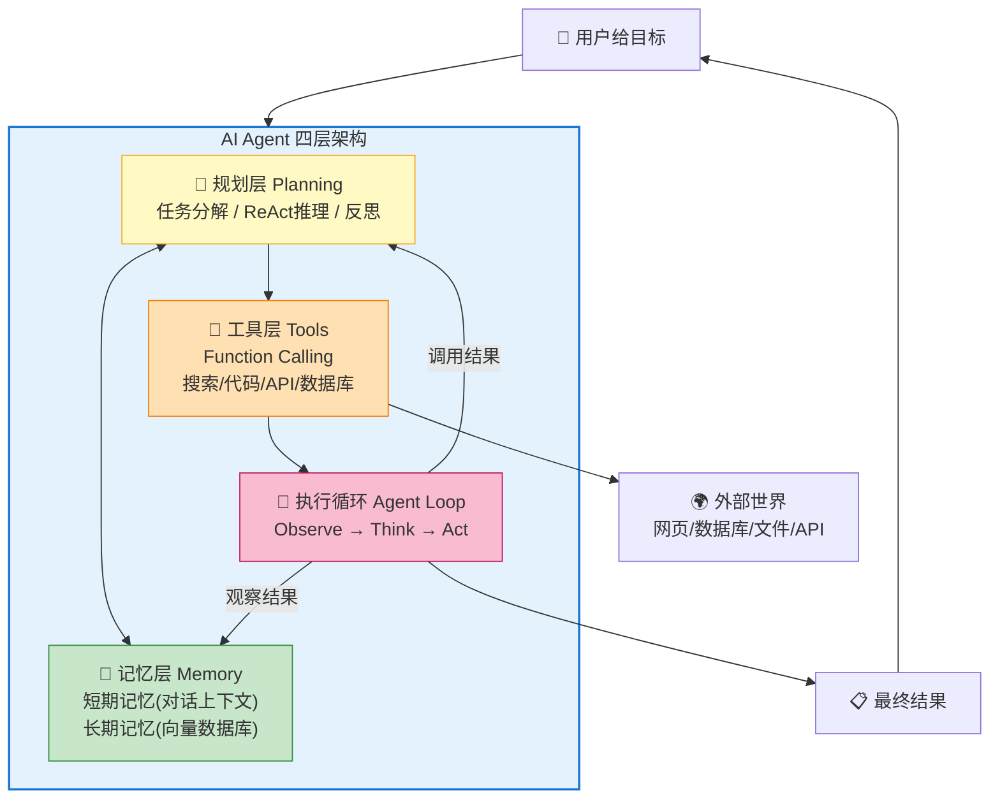
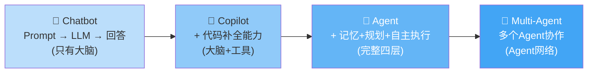
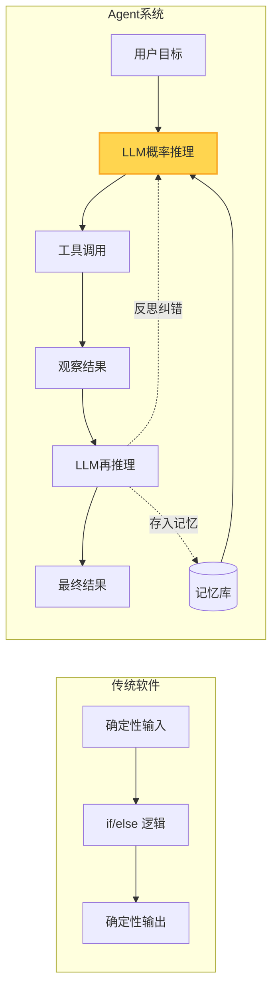

# AI Agent 核心概念与全景图

> **一句话**:AI Agent 是让大模型从"只会聊天"变成"能自主完成复杂任务"的技术体系。理解它是所有 Agent 框架和工具的根基。

## 核心概念

很多人把 Agent 等同于"ChatGPT 聊天机器人"，这是最大的认知误区。要理解 Agent，先搞清三个层级的区别：

| 层级 | 定义 | 特点 | 典型代表 |
|------|------|------|----------|
| **Chatbot（聊天机器人）** | 单轮/多轮问答 | 无状态、被动回答、不会"做事" | 早期 ChatGPT 对话 |
| **Copilot（副驾驶）** | LLM 建议，人类执行 | 主动提建议，但不能自主完成全流程 | GitHub Copilot、Cursor |
| **Agent（智能体）** | LLM 自主规划+执行+反思 | 能分解任务、调用工具、自我纠错、完成端到端目标 | AutoGPT、Devin |

**一句话定义 Agent**：

> **Agent = LLM（大脑）+ 记忆（经验）+ 工具（能力）+ 规划（策略）**，是一个能**自主感知环境、做出决策、调用工具、完成目标**的智能系统。

类比人类来理解：
- **LLM 大模型** = 人的大脑（负责思考、推理、决策）
- **Memory 记忆** = 人的经验和笔记本（知道之前做过什么）
- **Tools 工具** = 人的手和工具箱（能搜索、写代码、查数据库）
- **Planning 规划** = 人的做事方法（先做什么、后做什么、遇到问题怎么办）

## 原理图解

### Agent 的四层架构



### 从 Chatbot 到 Agent 的进化



### Agent 与传统软件的核心区别



## 代码实例

下面用 Python 展示一个**最小 Agent**，不依赖任何框架，让你理解底层原理：

```python
"""
最小 Agent 示例 - 不使用任何框架，纯手写
需要: pip install openai
"""

import json
from openai import OpenAI

# ========== 第1步: 定义工具 ==========
# 这就是 Agent 的"手" - 告诉LLM有哪些工具可用
tools = [
    {
        "type": "function",
        "function": {
            "name": "search_web",
            "description": "搜索互联网上的信息",
            "parameters": {
                "type": "object",
                "properties": {
                    "query": {"type": "string", "description": "搜索关键词"}
                },
                "required": ["query"]
            }
        }
    },
    {
        "type": "function",
        "function": {
            "name": "get_weather",
            "description": "获取指定城市的天气信息",
            "parameters": {
                "type": "object",
                "properties": {
                    "city": {"type": "string", "description": "城市名称"}
                },
                "required": ["city"]
            }
        }
    }
]

# ========== 第2步: 实现工具的实际逻辑 ==========
def search_web(query: str) -> str:
    """真实项目中这里会调用搜索API，这里模拟返回"""
    return f"搜索结果: {query} - 找到3条相关结果: 1. xxx 2. xxx 3. xxx"

def get_weather(city: str) -> str:
    """真实项目中这里会调用天气API"""
    return f"{city}今天: 晴转多云, 25°C, 湿度60%"

# 工具路由表: 名称 → 实际函数
tool_map = {
    "search_web": search_web,
    "get_weather": get_weather,
}

# ========== 第3步: Agent 主循环 ==========
client = OpenAI(api_key="your-api-key")  # 或用 DeepSeek/通义等

def run_agent(user_goal: str, max_steps: int = 5):
    """Agent 核心循环: Observe → Think → Act"""
    messages = [
        {"role": "system", "content": "你是一个有用的助手，可以使用工具来帮助用户。"},
        {"role": "user", "content": user_goal}
    ]

    for step in range(max_steps):
        print(f"\n--- 第 {step+1} 轮推理 ---")

        # 让 LLM 思考并决定下一步
        response = client.chat.completions.create(
            model="deepseek-chat",  # 或 gpt-4o / qwen-plus
            messages=messages,
            tools=tools,
            tool_choice="auto"  # 让LLM自己决定是否调用工具
        )

        msg = response.choices[0].message
        messages.append(msg)  # 把LLM的回复加入对话历史（短期记忆）

        # 情况1: LLM 决定调用工具 → 执行工具 → 把结果返回给LLM继续思考
        if msg.tool_calls:
            for tool_call in msg.tool_calls:
                func_name = tool_call.function.name
                func_args = json.loads(tool_call.function.arguments)

                print(f"  📞 调用工具: {func_name}({func_args})")

                # 执行工具
                result = tool_map[func_name](**func_args)
                print(f"  📥 工具返回: {result}")

                # 把工具结果回传给LLM
                messages.append({
                    "role": "tool",
                    "tool_call_id": tool_call.id,
                    "content": result
                })
            continue  # 继续循环，让LLM基于工具结果继续推理

        # 情况2: LLM 认为任务完成，直接回复
        print(f"  💬 Agent 回复: {msg.content}")
        return msg.content

    return "达到最大步数限制"

# ========== 运行 ==========
if __name__ == "__main__":
    # 测试1: 需要调用工具
    result = run_agent("今天北京天气怎么样？适合出门吗？")
    print(f"\n最终结果: {result}")

    # 预期执行过程:
    # --- 第 1 轮推理 ---
    #   📞 调用工具: get_weather({'city': '北京'})
    #   📥 工具返回: 北京今天: 晴转多云, 25°C, 湿度60%
    # --- 第 2 轮推理 ---
    #   💬 Agent 回复: 北京今天晴转多云，25度，湿度适中，很适合出门！
    # 最终结果: 北京今天晴转多云，25度，湿度适中，很适合出门！
```

**这个例子揭示了 Agent 的本质**：
1. **工具定义**（告诉LLM有哪些能力）
2. **循环推理**（LLM反复思考"我该做什么"）
3. **工具调用**（LLM决定调用 → 代码执行 → 结果返回）
4. **终止判断**（LLM认为任务完成就停止）

## 常见误区 / 面试点

- **误区1**: "Agent 就是套壳 ChatGPT" —— 实际上 Agent 的核心是**自主决策循环**，不是简单调用 API。套壳只是做了个聊天界面。
- **误区2**: "一定要用 GPT-4 才能做 Agent" —— 错。DeepSeek-V3、通义千问、智谱 GLM 都支持 Function Calling，都可以做 Agent。模型选择取决于任务复杂度和成本。
- **误区3**: "Agent 一定比人强" —— 目前 Agent 在**结构化任务**(搜索+整理+生成)上很高效，但复杂决策、创意工作还远不如人类。Agent 最适合**重复性信息处理任务**。
- **误区4**: "越复杂的 Agent 越好" —— 实际上简单任务用简单链式调用（Chain）就够，不需要完整 Agent Loop。过度设计会导致成本高、延迟大、更容易出错。
- **面试追问方向**:
  - "Agent 和 RAG 的关系是什么？" → RAG 是给 Agent 提供**长期记忆**的一种技术手段，RAG 本身不等于 Agent
  - "如何控制 Agent 不跑偏？" → Prompt 约束、最大步数限制、输出格式限制、人工审批节点
  - "Agent 的成本怎么优化？" → 缓存、小模型做大分类+大模型做复杂推理、减少不必要的工具调用

## 项目代码参考

本文概念在两个 Agent 项目中都有对应实现：

| 代码文件 | 对应函数/类 | 演示的概念 |
|---------|------------|-----------|
| `agent-project-py/src/agent_core.py` | `run_agent()` | 最小 Agent 循环 + 工具调用 |
| `agent-project-java/.../controller/AgentController.java` | `runAgent()` | Java版 ReAct Agent |

> 📍 完整映射见 `知识与代码双向映射.md`

## 参考来源

- OpenAI Function Calling 文档: https://platform.openai.com/docs/guides/function-calling
- DeepSeek API 文档: https://platform.deepseek.com/api-docs
- Lilian Weng 的经典 Agent 博客: https://lilianweng.github.io/posts/2023-06-23-agent/
