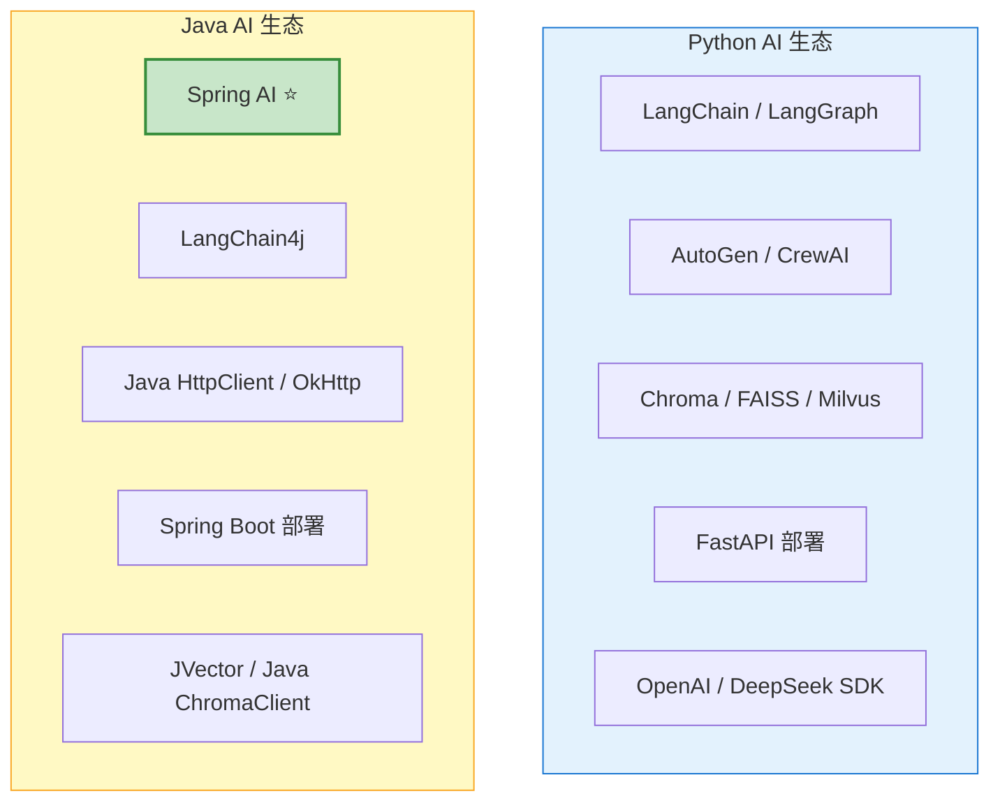
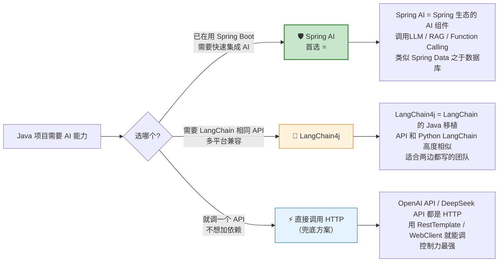
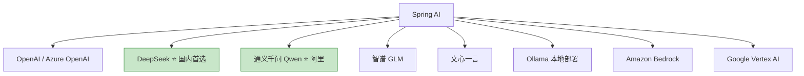

# Java AI 开发生态概览

> **一句话**:Java 做 AI 开发不是"能不能"的问题，是"怎么选"的问题——Spring AI 是王者，LangChain4j 是备选，直接调 API 是兜底方案。

## 核心概念

### Python vs Java AI 开发生态对比



| 维度 | Python | Java | 你的选择 |
|------|--------|------|---------|
| **框架成熟度** | LangChain 100k+ stars | Spring AI 15k+ stars（增长最快） | 双修 |
| **LLM SDK** | openai Python SDK 官方维护 | Spring AI + OkHttp | Spring AI 封装了 |
| **向量数据库** | Chroma Python 原生 | JVector / Java 客户端 | Chroma 有 HTTP API，语言无关 |
| **部署** | FastAPI + Docker | **Spring Boot + Docker（你的强项）** | 🔥 Spring Boot |
| **Function Calling** | 原生支持 | Spring AI 封装 | Spring AI 封装了 |
| **学习成本** | 需要学 Python + 新框架 | **复用 Java + Spring 经验** | ✅ 零成本入门 |

### Java AI 三大技术路线



### Spring AI 核心概念速查

Spring AI 是 Spring 生态最新成员（2024 年发布），设计哲学和 Spring Data 完全一致：**定义接口 → 配置实现 → 注入使用**。

```java
// Spring AI 的设计模式 = 你熟悉的 Spring 三板斧

// 1️⃣ 定义接口（Spring Data 的 CrudRepository → Spring AI 的 ChatClient）
@Autowired
private ChatClient chatClient;  // 注入 AI 聊天客户端

// 2️⃣ 配置实现（application.yml 里决定用哪个模型）
// spring.ai.openai.api-key=sk-xxx
// spring.ai.deepseek.api-key=sk-xxx

// 3️⃣ 使用（就像用 JdbcTemplate 一样简单）
String answer = chatClient.call("解释一下 HashMap 的原理");
```

## 三大路线对比

| 维度 | Spring AI ⭐ | LangChain4j | 直接调 API |
|------|------------|-------------|-----------|
| **维护方** | VMware/Spring 官方 | 社区 | 你自己 |
| **学习成本** | 低（你本来就会 Spring） | 中（需要理解 LangChain 概念） | 低 |
| **Spring Boot 集成** | **原生** | 需要手动配置 | 手动配置 |
| **Function Calling** | ✅ 原生支持 | ✅ 原生支持 | ❌ 手动实现 JSON 解析 |
| **RAG** | ✅ VectorStore + 文档处理 | ✅ 集成 Chroma/Weaviate | ❌ 自己动手 |
| **支持模型** | OpenAI、DeepSeek、通义、智谱、Ollama 等 | OpenAI、DeepSeek、Ollama 等 | 只要是 HTTP API 都行 |
| **生产级** | ✅ ErrorHandler、Retry、Metrics | ⚠️ 社区驱动 | ⚠️ 全靠你自己 |
| **版本** | 1.0+（2025 年发布正式版） | 1.0+（已正式发布） | N/A |

### Spring AI 支持的大模型



## 项目代码参考

| 代码文件 | 演示的概念 |
|---------|-----------|
| `agent-project-java/pom.xml` | Spring AI / RestTemplate 依赖配置 |
| `agent-project-java/.../controller/AgentController.java` | 纯 Java Agent 实现 |

## 参考来源

- Spring AI 官网: https://spring.io/projects/spring-ai
- Spring AI 文档: https://docs.spring.io/spring-ai/reference/
- LangChain4j 官网: https://docs.langchain4j.dev
- 相关笔记: `Spring AI实战.md`
