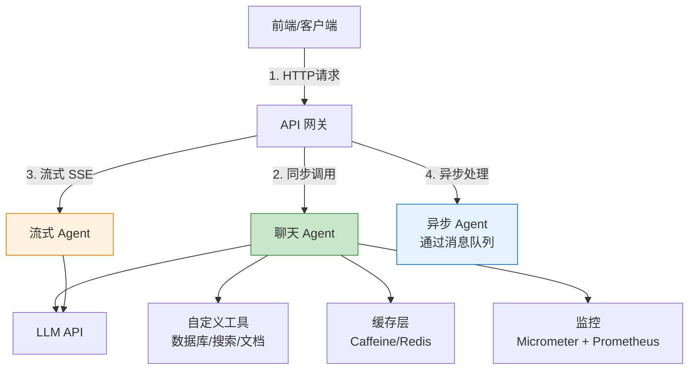

# Java AI 项目实战模式

> **一句话**:把 AI 能力集成到 Java 项目里有很多"套路"——SSE 流式、异步编排、重试降级、缓存优化，你之前做后端踩过的坑，在 AI 项目里一个都不会少。

## 核心概念

### Java AI 项目架构



### 你的 Java 经验可以直接复用的能力

| 你已有的 | AI 场景中直接用 |
|---------|--------------|
| Spring Boot MVC | 提供 AI API 接口 |
| RestTemplate / WebClient | 调 LLM API |
| @Retryable / Resilience4j | LLM 调用重试 + 熔断 |
| Caffeine / Redis 缓存 | 重复 AI 请求缓存 |
| 消息队列（RabbitMQ / Kafka） | 异步 AI 任务处理 |
| SSE（Server-Sent Events） | 流式输出 |
| 数据库（PostgreSQL / MySQL） | 存储对话历史 |
| Spring Security | AI API 鉴权 |
| Micrometer + Prometheus | AI 调用监控 |

## 代码实例

### 模式1: SSE 流式输出

```java
/**
 * 用 SSE 实现流式 AI 输出
 * 前端可以直接用 EventSource 接收
 */

@RestController
@RequestMapping("/ai")
public class StreamController {

    private final ChatClient chatClient;
    private final SseEmitter sseEmitter;

    // ===== 方案A: Spring AI 原生流式 =====
    @GetMapping(value = "/stream", produces = MediaType.TEXT_EVENT_STREAM_VALUE)
    public Flux<String> stream(@RequestParam String question) {
        return chatClient.prompt()
                .user(question)
                .stream()
                .content();  // 直接返回 Flux
    }

    // ===== 方案B: WebClient 手动实现（不依赖 Spring AI）=====
    @GetMapping(value = "/stream-manual", produces = MediaType.TEXT_EVENT_STREAM_VALUE)
    public SseEmitter streamManual(@RequestParam String question) {
        SseEmitter emitter = new SseEmitter(60_000L);  // 60秒超时

        WebClient.create("https://api.deepseek.com")
            .post()
            .uri("/v1/chat/completions")
            .headers(h -> h.setBearerAuth(System.getenv("DEEPSEEK_API_KEY")))
            .bodyValue(Map.of(
                "model", "deepseek-chat",
                "messages", List.of(Map.of("role", "user", "content", question)),
                "stream", true
            ))
            .retrieve()
            .bodyToFlux(String.class)
            .filter(line -> line.startsWith("data: "))
            .map(line -> {
                String data = line.substring(6);
                if ("[DONE]".equals(data)) return "";
                // 解析 delta.content...
                return parseContent(data);
            })
            .subscribe(
                token -> emitter.send(SseEmitter.event().data(token)),
                emitter::completeWithError,
                emitter::complete
            );

        return emitter;
    }

    // ===== 方案C: 传统 Controller 返回 SseEmitter =====
    @GetMapping("/chat-stream")
    public SseEmitter chatStream(@RequestParam String question) {
        SseEmitter emitter = new SseEmitter();
        // 在单独的线程中处理
        executorService.execute(() -> {
            try {
                // 模拟流式输出
                for (String token : new String[]{"你好", "，", "今天", "天气", "真", "好"}) {
                    emitter.send(token);
                    Thread.sleep(100);
                }
                emitter.complete();
            } catch (Exception e) {
                emitter.completeWithError(e);
            }
        });
        return emitter;
    }
}
```

### 模式2: 重试与熔断（Resilience4j）

```xml
<dependency>
    <groupId>org.springframework.boot</groupId>
    <artifactId>spring-boot-starter-aop</artifactId>
</dependency>
<dependency>
    <groupId>io.github.resilience4j</groupId>
    <artifactId>resilience4j-spring-boot3</artifactId>
    <version>2.2.0</version>
</dependency>
```

```yaml
# application.yml
resilience4j:
  retry:
    instances:
      llmCall:
        max-attempts: 3                # 最多重试 3 次
        wait-duration: 2s              # 间隔 2 秒
        retry-exceptions:
          - java.net.SocketTimeoutException
          - org.springframework.web.client.HttpServerErrorException
  circuitbreaker:
    instances:
      llmBreaker:
        sliding-window-size: 10        # 统计最近 10 次调用
        failure-rate-threshold: 50     # 失败率超过 50% 熔断
        wait-duration-in-open-state: 30s  # 熔断后 30 秒恢复
```

```java
@Service
public class ResilientLLMService {

    @Retry(name = "llmCall", fallbackMethod = "fallback")
    @CircuitBreaker(name = "llmBreaker")
    public String callLLM(String prompt) {
        // LLM API 调用
        return restTemplate.postForObject(url, request, String.class);
    }

    // 所有重试都失败后的兜底
    public String fallback(String prompt, Exception ex) {
        log.error("LLM 调用失败，使用兜底方案", ex);
        return "AI 服务暂时不可用，请稍后再试。错误: " + ex.getMessage();
    }
}
```

### 模式3: 缓存优化

```java
/**
 * AI 调用缓存 — 减少重复调用和成本
 */

// ===== 本地缓存（适合单机部署）=====
@Service
public class CachedLLMService {

    // 用 Caffeine 做本地缓存
    private final Cache<String, String> cache = Caffeine.newBuilder()
            .maximumSize(10_000)           // 最多缓存 1 万条
            .expireAfterWrite(24, TimeUnit.HOURS)  // 24 小时过期
            .recordStats()                 // 统计命中率
            .build();

    public String call(String prompt) {
        // 1. 算哈希作为缓存 key
        String key = md5(prompt);

        // 2. 查缓存
        String cached = cache.getIfPresent(key);
        if (cached != null) {
            return cached;
        }

        // 3. 调用 LLM
        String result = actualLLMCall(prompt);

        // 4. 写入缓存
        cache.put(key, result);
        return result;
    }

    @EventListener
    public void logStats(ApplicationReadyEvent event) {
        CacheStats stats = cache.stats();
        log.info("缓存命中率: {}", stats.hitRate());
    }
}

// ===== 语义缓存（Spring AI 官方支持）=====
// 基于语义相似度判断缓存命中
@Bean
public CacheManager cacheManager() {
    return new SemanticCacheManager(vectorStore, 0.9);
    // 当新问题和缓存的问题相似度 > 0.9 时，直接返回缓存答案
}
```

### 模式4: 异步任务处理

```java
/**
 * 异步 AI 任务 — 处理耗时操作
 */

@Service
public class AsyncAIService {

    // ===== 文档批量处理 =====
    @Async("aiTaskExecutor")
    public CompletableFuture<String> processDocument(Long docId) {
        // 1. 读取文档
        // 2. 切分
        // 3. 向量化
        // 4. 存入向量数据库
        return CompletableFuture.completedFuture("处理完成");
    }

    // ===== 批量生成 =====
    @Async
    public Future<List<String>> batchGenerate(List<String> prompts) {
        List<String> results = prompts.parallelStream()
                .map(this::callLLM)
                .toList();
        return new AsyncResult<>(results);
    }

    // ===== 处理 LLM 返回后存入数据库 =====
    @Async
    public void saveResult(String sessionId, String llmResponse) {
        // 异步保存对话记录
        chatHistoryRepository.save(new ChatHistory(sessionId, llmResponse));
    }
}

// 线程池配置
@Configuration
public class AsyncConfig {

    @Bean("aiTaskExecutor")
    public Executor aiTaskExecutor() {
        ThreadPoolTaskExecutor executor = new ThreadPoolTaskExecutor();
        executor.setCorePoolSize(5);
        executor.setMaxPoolSize(10);
        executor.setQueueCapacity(100);
        executor.setThreadNamePrefix("ai-async-");
        executor.setRejectedExecutionHandler(new CallerRunsPolicy());
        return executor;
    }
}
```

### 模式5: 完整 API 设计

```java
/**
 * AI API 的设计模式 — RESTful 风格
 */

@RestController
@RequestMapping("/api/v1/ai")
public class AIApiController {

    // ===== 同步对话 =====
    @PostMapping("/chat")
    public Result<ChatResponse> chat(@Valid @RequestBody ChatRequest request) {
        String answer = aiService.call(request.getMessage());
        return Result.success(new ChatResponse(answer));
    }

    // ===== 流式对话 =====
    @PostMapping(value = "/chat/stream", produces = MediaType.TEXT_EVENT_STREAM_VALUE)
    public Flux<String> chatStream(@RequestBody ChatRequest request) {
        return aiService.stream(request.getMessage());
    }

    // ===== 知识库问答 =====
    @PostMapping("/rag")
    public Result<RAGResponse> rag(@Valid @RequestBody RAGRequest request) {
        List<Document> docs = vectorStore.similaritySearch(
                SearchRequest.query(request.getQuestion()).withTopK(3));
        String answer = aiService.callWithContext(request.getQuestion(), docs);
        return Result.success(new RAGResponse(answer, docs));
    }

    // ===== 批量处理 =====
    @PostMapping("/batch")
    public Result<String> batch(@RequestBody List<ChatRequest> requests) {
        String batchId = UUID.randomUUID().toString();
        asyncService.batchProcess(requests, batchId);
        return Result.accepted("任务已提交", batchId);
        // 前端轮询 /batch/{id}/status 查进度
    }

    // ===== 请求/响应模型 =====
    public record ChatRequest(
        @NotBlank String message,
        String sessionId,
        @DefaultValue("0.0") Double temperature
    ) {}

    public record ChatResponse(
        String answer,
        String sessionId,
        Long timestamp
    ) {}

    public record Result<T>(
        int code,
        String message,
        T data
    ) {
        public static <T> Result<T> success(T data) {
            return new Result<>(200, "success", data);
        }
        public static <T> Result<T> accepted(String message, T data) {
            return new Result<>(202, message, data);
        }
    }
}
```

### 模式6: 对话历史管理

```java
/**
 * 多轮对话的会话管理
 */

@Entity
@Table(name = "chat_messages")
public class ChatMessage {
    @Id
    private String id;
    private String sessionId;
    private String role;       // user / assistant / system
    @Column(columnDefinition = "TEXT")
    private String content;
    private Integer tokenCount;
    private LocalDateTime createdAt;
}

@Service
public class SessionManager {

    private final ChatMessageRepository repository;

    // 每个会话保留最近 N 条消息（控制 token 成本）
    private static final int MAX_HISTORY = 20;

    public List<ChatMessage> getHistory(String sessionId) {
        return repository.findTopNBySessionIdOrderByCreatedAtDesc(
                sessionId, MAX_HISTORY);
    }

    public List<Map<String, String>> buildMessages(String sessionId, String userInput) {
        // 查询历史
        List<ChatMessage> history = getHistory(sessionId);

        // 构建 LLM 消息列表
        List<Map<String, String>> messages = new ArrayList<>();
        messages.add(Map.of("role", "system", "content", "你是一个智能助手"));

        // 反转时间顺序（最新的在最后）
        Collections.reverse(history);
        for (ChatMessage msg : history) {
            messages.add(Map.of("role", msg.getRole(), "content", msg.getContent()));
        }

        // 加上当前用户输入
        messages.add(Map.of("role", "user", "content", userInput));

        return messages;
    }
}
```

## 常见误区

- **误区1**: "AI 项目不需要 Java 设计模式" —— 错。AI 项目更需要好的架构设计，因为 LLM 调用天然不稳定（延迟高、可能失败），优雅的重试、降级、异步处理至关重要。
- **误区2**: "SSE 太复杂了，用轮询代替" —— 轮询能工作，但 SSE 的延迟更低（毫秒级推送 vs 秒级轮询）、服务端负担更小。Spring Boot 的 SseEmitter 用起来很简单。
- **误区3**: "缓存只对文本完全匹配有用" —— 语义缓存用向量相似度做 key，语义相同表述不同也能命中。这是 Java AI 中很值的优化。

## 参考来源

- Resilience4j 文档: https://resilience4j.readme.io
- Spring Boot SseEmitter: https://docs.spring.io/spring-framework/reference/web/webmvc/mvc-ann-async.html#mvc-ann-async-sse
- Caffeine Cache: https://github.com/ben-manes/caffeine
- 相关笔记: `Spring AI实战.md`
