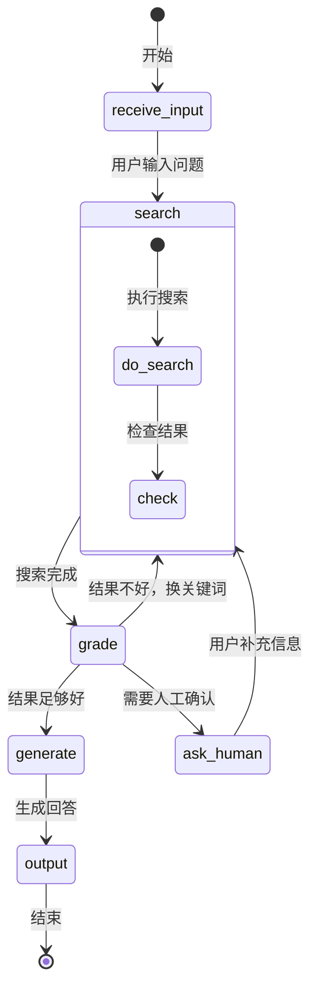
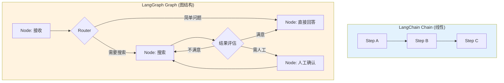

# LangGraph 状态机式 Agent

> **一句话**:当 Agent 流程不是简单的 A→B→C，而是需要"循环、条件分支、人工审批、回退"时，LangGraph 就是为你设计的。

## 核心概念

LangChain 的 Chain 是**线性的**（A→B→C），但真实 Agent 场景经常需要：

```
用户提问 → 搜索 → [结果好不好？]
  ├── 好 → 直接回答
  ├── 不好 → 换关键词重搜
  └── 还不好 → 让用户补充信息 → 再搜
```

这种**带循环和分支的流程**，用 LangChain 很难实现，用 **LangGraph** 轻松搞定。



### LangGraph 核心概念

| 概念 | 说明 | 类比 |
|------|------|------|
| **State** | 共享状态对象，在节点间传递 | Java 的 Request/Context |
| **Node** | 一个处理步骤（函数） | Controller 方法 |
| **Edge** | 节点间的连线 | 路由规则 |
| **Conditional Edge** | 根据条件动态选择下一个节点 | if/else 路由 |
| **Graph** | 完整的执行图 | Spring Flow / 有限状态机 |

## 原理图解

### LangGraph vs LangChain 对比



## 代码实例

### LangGraph 基础: 研究报告 Agent

```python
"""
LangGraph 实战: 带循环的 Agent
场景: 搜索信息 → 评估质量 → 够好就生成报告，不够就重搜
安装: pip install langgraph langchain-openai
"""

from typing import TypedDict, Annotated
from langgraph.graph import StateGraph, END
from langgraph.graph.message import add_messages
from langchain_openai import ChatOpenAI

# ========== 1. 定义 State ==========
class AgentState(TypedDict):
    """共享状态 — 所有节点都能读写"""
    messages: Annotated[list, add_messages]  # 对话历史
    query: str           # 用户原始问题
    search_results: str   # 搜索结果
    quality_score: int    # 结果质量评分 1-10
    report: str           # 最终报告
    search_count: int     # 搜索次数（防止死循环）
    max_searches: int     # 最大搜索次数

llm = ChatOpenAI(
    model="deepseek-chat",
    api_key="your-key",
    base_url="https://api.deepseek.com"
)

# ========== 2. 定义节点（每个节点是一个函数）==========

def search_node(state: AgentState) -> AgentState:
    """搜索节点: 根据问题搜索信息"""
    query = state["query"]
    # 真实项目这里调用搜索 API
    result = f"搜索 '{query}' 返回: [模拟结果1, 模拟结果2, 模拟结果3]"

    return {
        **state,
        "search_results": result,
        "search_count": state.get("search_count", 0) + 1
    }

def grade_node(state: AgentState) -> AgentState:
    """评估节点: LLM 判断搜索结果质量"""
    prompt = f"""评估以下搜索结果对回答问题的帮助程度。

问题: {state['query']}
搜索结果: {state['search_results']}
已搜索次数: {state.get('search_count', 1)}/{state.get('max_searches', 3)}

请打分(1-10)并说明理由。只输出一个数字。"""

    response = llm.invoke(prompt)
    score = int(response.content.strip()[0])  # 取第一个字符作为分数
    score = min(10, max(1, score))  # 确保在1-10范围

    return {**state, "quality_score": score}

def generate_node(state: AgentState) -> AgentState:
    """生成节点: 基于搜索结果生成回答"""
    prompt = f"""基于以下信息回答问题。

问题: {state['query']}
参考资料: {state['search_results']}

请给出结构化的回答:"""

    response = llm.invoke(prompt)

    return {**state, "report": response.content}

# ========== 3. 定义条件路由 ==========
def route_after_grade(state: AgentState) -> str:
    """评估后的路由决策"""
    score = state.get("quality_score", 5)
    count = state.get("search_count", 1)
    max_s = state.get("max_searches", 3)

    if score >= 7:
        return "generate"      # 质量够好，生成报告
    elif count >= max_s:
        return "generate"      # 达到最大搜索次数，强制生成
    else:
        return "search"       # 质量不够，重新搜索

# ========== 4. 构建图 ==========
graph = StateGraph(AgentState)

# 添加节点
graph.add_node("search", search_node)
graph.add_node("grade", grade_node)
graph.add_node("generate", generate_node)

# 添加边（线性边）
graph.set_entry_point("search")
graph.add_edge("search", "grade")

# 添加条件边（动态路由）
graph.add_conditional_edges(
    "grade",                     # 从哪个节点出发
    route_after_grade,           # 路由函数
    {
        "search": "search",      # 返回"search" → 回到搜索节点
        "generate": "generate",   # 返回"generate" → 去生成节点
    }
)

# 结束边
graph.add_edge("generate", END)

# ========== 5. 编译并运行 ==========
app = graph.compile()

result = app.invoke({
    "messages": [],
    "query": "2026年AI Agent技术有哪些重大突破？",
    "search_count": 0,
    "max_searches": 3,
})

print("最终报告:")
print(result["report"])
print(f"\n搜索次数: {result['search_count']}")
print(f"质量评分: {result['quality_score']}")
```

### LangGraph 带人工审批节点

```python
"""
LangGraph 人工审批示例
在某些关键步骤暂停，等待人工确认后再继续
"""

from langgraph.checkpoint.memory import MemorySaver
from langgraph.graph import StateGraph, END
from typing import TypedDict

class State(TypedDict):
    draft: str
    approved: bool

def write_draft(state: State) -> dict:
    return {"draft": "这是Agent生成的草稿内容（模拟）...", "approved": False}

def human_review(state: State) -> dict:
    """人工审批节点 — 在真实应用中这里会弹出UI等待用户操作"""
    print(f"\n📝 待审批草稿:\n{state['draft']}")
    user_input = input("是否批准？(yes/no): ")
    return {"approved": user_input.lower() == "yes"}

def publish(state: State) -> dict:
    if state["approved"]:
        print("✅ 草稿已发布！")
    else:
        print("❌ 草稿被拒绝，流程终止")
    return state

def route_after_review(state: State) -> str:
    return "publish"

graph = StateGraph(State)
graph.add_node("write", write_draft)
graph.add_node("review", human_review)
graph.add_node("publish", publish)

graph.set_entry_point("write")
graph.add_edge("write", "review")
graph.add_conditional_edges("review", route_after_review, {"publish": "publish"})
graph.add_edge("publish", END)

# MemorySaver 支持中断/恢复
app = graph.compile(checkpointer=MemorySaver())
app.invoke({"draft": "", "approved": False}, config={"thread_id": "review-001"})
```

## 常见误区 / 面试点

- **误区1**: "LangGraph 替代了 LangChain" —— 不准确。LangGraph 建立在 LangChain 之上，LangChain 提供组件（LLM、Tools、Retriever），LangGraph 提供编排（图、状态机、循环）。
- **误区2**: "状态机就是状态模式" —— 类比不精确。LangGraph 的状态是**一个共享 dict**，节点读写它，更像是在 actor 模型中传递消息。
- **面试追问方向**:
  - "checkpointer 是做什么的？" → 支持图的中断/恢复、持久化状态、实现人工审批、多轮对话
  - "如何防止 LangGraph 死循环？" → State 中设置计数器、max_steps、超时机制

## 参考来源

- LangGraph 文档: https://langchain-ai.github.io/langgraph/
- LangGraph 教程: https://langchain-ai.github.io/langgraph/tutorials/
- 相关笔记: `LangChain实战.md`
