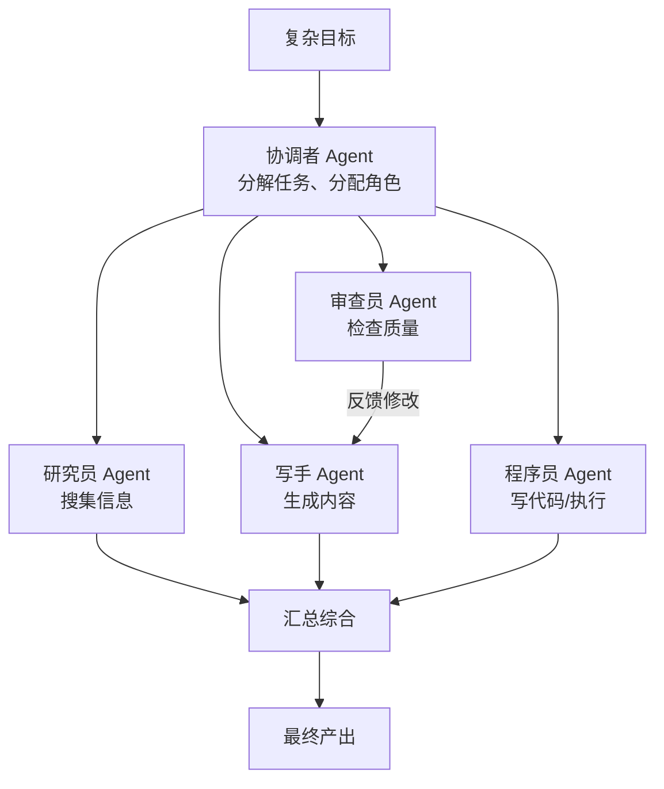
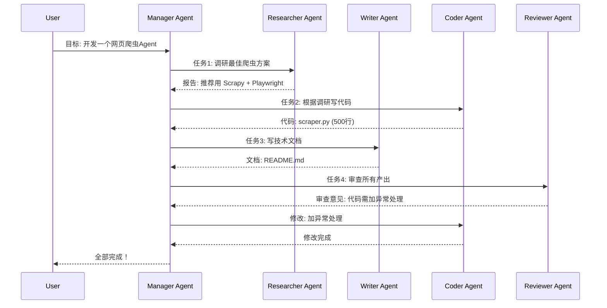
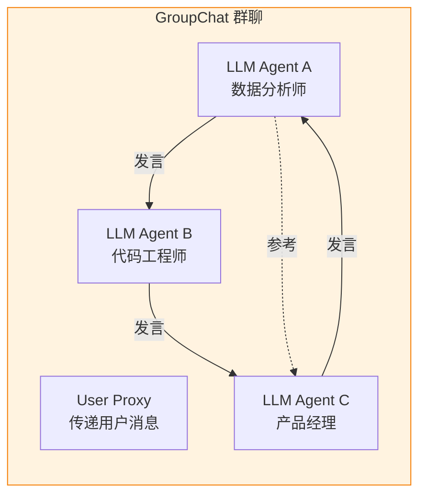
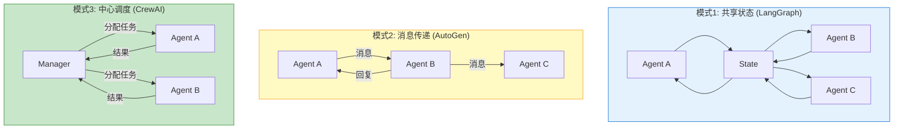

# Multi-Agent 多智能体协作

> **一句话**:当单个 Agent 搞不定时，让多个 Agent 组成"团队"——每个 Agent 扮演不同角色，像真正的团队一样讨论、分工、协作完成任务。

## 核心概念

单个 Agent 的能力有上限（上下文窗口、单次推理质量）。多 Agent 通过协作突破这个上限：



### 多 Agent 协作的四种模式

| 模式 | 结构 | 特点 | 代表框架 |
|------|------|------|---------|
| **顺序管道** | A→B→C | 简单，线性传递 | LangChain Chain |
| **层级管理** | 经理→员工 | 有管理者协调分配 | CrewAI(hierarchical) |
| **平等讨论** | A↔B↔C | 无中心，互相讨论 | AutoGen(groupchat) |
| **市场拍卖** | 投标→竞争 | 任务公开招标，Agent竞争接单 | AutoGen(magentic-one) |

## 原理图解

### CrewAI 角色协作架构



### AutoGen 群聊模式



## 代码实例

### AutoGen 多Agent讨论示例

```python
"""
AutoGen 多Agent 群聊示例
安装: pip install autogen-agentchat
"""

from autogen_agentchat.agents import AssistantAgent
from autogen_agentchat.conditions import MaxMessageTermination
from autogen_agentchat.teams import RoundRobinGroupChat
from autogen_ext.models.openai import OpenAIChatCompletionClient

# ========== 创建模型客户端 ==========
model_client = OpenAIChatCompletionClient(
    model="deepseek-chat",
    api_key="your-key",
    base_url="https://api.deepseek.com/v1",
)

# ========== 创建Agent角色 ==========

analyst = AssistantAgent(
    name="数据分析师",
    system_message="""你是一位资深数据分析师。
    你擅长从数据中提取洞察，关注数字、趋势和证据。
    讨论中你需要提供数据支撑观点。""",
    model_client=model_client,
)

engineer = AssistantAgent(
    name="技术架构师",
    system_message="""你是一位技术架构师，有15年经验。
    你擅长系统设计、技术选型和架构评审。
    讨论中你需要评估技术可行性。""",
    model_client=model_client,
)

pm = AssistantAgent(
    name="产品经理",
    system_message="""你是一位产品经理。
    你关注用户体验、市场需求和产品策略。
    讨论中你需要从用户角度提出需求和优先级。""",
    model_client=model_client,
)

# ========== 组建团队 ==========
team = RoundRobinGroupChat(
    agents=[analyst, engineer, pm],
    max_turns=6,  # 最多6轮发言（防止无限循环）
)

# ========== 运行讨论 ==========
topic = "我们要开发一个AI驱动的代码审查工具，请讨论技术方案和产品策略。"

result = await team.run(topic)

# 输出讨论过程（每位Agent依次发言，互相回应）
for message in result.messages:
    print(f"[{message.source}]: {message.content}\n")
```

## 常见误区 / 面试点

- **误区1**: "Agent 越多越好" —— 错。每多一个 Agent 就多一次 LLM 调用（= 成本和延迟）。2-4 个 Agent 是甜点，超过 5 个通常得不偿失。
- **误区2**: "多 Agent 一定比单 Agent 强" —— 不一定。简单任务单 Agent 更快更便宜。多 Agent 适合**需要多种专业视角**的复杂任务（如: 研究+写作+审查）。
- **面试追问方向**:
  - "多 Agent 通信用什么模式？" → 共享状态（LangGraph）、消息传递（AutoGen）、函数调用（CrewAI）
  - "如何防止 Agent 陷入死循环？" → 最大轮次限制、超时、终止条件、人类审批节点

## 参考来源

- AutoGen 文档: https://microsoft.github.io/autogen/
- CrewAI 文档: https://docs.crewai.com
- Magentic-One 论文: https://arxiv.org/abs/2410.03314
- 相关笔记: `框架对比与选型.md`

## 2026 年关键更新：MCP 与 A2A 协议

> 2026 年最大基础设施变化：MCP 和 A2A **双双捐给 Linux 基金会**，成为行业标准。

### 两大核心协议

| 协议 | 发起方 | 连接方向 | 定位 | 2026 状态 |
|------|--------|---------|------|----------|
| **MCP** | Anthropic | Agent ↓ 工具/数据 | AI 的"USB-C 接口" | 月下载 1.64 亿次，1万+ 公开服务器 |
| **A2A** | Google | Agent ↔ Agent | "智能体间的对讲机" | 50+ 启动伙伴，Microsoft 加入 |

### 协议栈全景

```
┌─────────────────────────────────────────┐
│  A2A (Agent ↔ Agent)    水平：委托协调    │
│  MCP (Agent ↓ Tool)     垂直：工具数据    │
│  AG-UI (Agent → User)   前端：可视化交互  │
└─────────────────────────────────────────┘
```

**生产部署模式**：先上 MCP（工具访问）→ 再加 A2A（多 Agent 协调）→ 最后加 AG-UI（用户界面）。

### MCP 2026 新特性
- 结构化工具输出（验证 JSON，不再是不透明字符串）
- Elicitation（服务器可暂停请求用户输入）
- OAuth 2.0 资源绑定
- 工具级安全扫描成为基线

### 什么时候不需要多 Agent？

| 场景 | 推荐 |
|------|------|
| 串行流水线（构思→大纲→写作） | **单体 Agent** — 不需要并行协作 |
| 不需要外部工具调用 | **单体 Agent** — MCP 是多余的 |
| 上下文能全塞进窗口（<1M tokens） | **单体 Agent** — 不需要 RAG |
| 单个开发者维护 | **单体 Agent** — 多 Agent 增加运维成本 |

**原则**：先有一个能用的单体 Agent，再考虑拆分成多 Agent。不要为了用框架而用框架。

## 深度实战：CrewAI 完整案例

### 场景：AI 驱动的技术文章生产流水线

```
需求: "写一篇关于 Redis 集群方案的深度技术文章"
```

```python
"""
CrewAI 完整案例 — 研究员 + 写手 + 审查员协同工作
pip install crewai langchain-openai
"""

from crewai import Agent, Task, Crew, Process
from langchain_openai import ChatOpenAI

llm = ChatOpenAI(
    model="deepseek-chat",
    api_key="your-key",
    base_url="https://api.deepseek.com"
)

# ========== 角色设计 ==========

researcher = Agent(
    role="技术研究员",
    goal="深度调研指定技术主题，提供准确、全面的技术资料",
    backstory="""你是一个资深技术研究员，有10年分布式系统经验。
    你擅长从官方文档、源码、论文中提取关键信息。
    你的输出必须标注信息来源。""",
    llm=llm,
    verbose=True
)

writer = Agent(
    role="技术写手",
    goal="基于研究资料撰写高质量、易读的技术文章",
    backstory="""你是一个技术作家，擅长把复杂概念用简洁的语言讲清楚。
    你的文章结构清晰：引言 → 核心概念 → 深入分析 → 实践建议 → 总结。
    你注重代码示例的准确性。""",
    llm=llm,
    verbose=True
)

reviewer = Agent(
    role="技术审查员",
    goal="审查文章的技术准确性和可读性",
    backstory="""你是严格的技术审查员，对任何不准确的内容零容忍。
    你检查：(1)技术事实是否正确 (2)代码是否能运行 (3)逻辑是否连贯
    (4)是否遗漏了关键信息。""",
    llm=llm,
    verbose=True
)

# ========== 任务设计 ==========

research_task = Task(
    description="""
    深入研究 Redis 集群方案，包括：
    1. Redis Cluster（官方方案）：架构、槽位分配、故障转移
    2. Codis：架构特点、与官方方案的对比
    3. Sentinel 哨兵模式：原理和局限
    4. 各方案的生产环境实践建议
    
    输出格式：结构化研究报告，每个方案包含架构图描述、核心机制、优缺点。
    """,
    agent=researcher,
    expected_output="一份结构化的技术研究报告，包含各方案的架构、机制、优缺点对比"
)

writing_task = Task(
    description="""
    基于研究员提供的报告，撰写一篇面向中高级工程师的技术文章。
    
    要求：
    - 文章长度：~3000 字
    - 结构：引言 → 为什么需要集群 → 三种方案详解 → 选型建议 → 总结
    - 每个方案至少一个架构图描述（用文字描述架构，后续可转为 Mermaid）
    - 包含至少 3 个代码/配置示例
    - 语言通俗但不失专业性
    """,
    agent=writer,
    expected_output="一篇完整的技术文章，3000字左右，结构清晰，包含代码示例",
    context=[research_task]  # 等研究任务完成后再执行
)

review_task = Task(
    description="""
    审阅写手完成的文章，检查：
    1. Redis Cluster 的槽位分配机制描述是否准确？
    2. Codis 和官方方案的对比是否客观？
    3. Sentinel 的故障转移流程是否正确？
    4. 代码/配置示例能否正常运行？
    5. 选型建议是否合理？
    
    如果有问题，给出具体修改意见，让写手修改后重新提交。
    """,
    agent=reviewer,
    expected_output="审查报告：逐项检查结果 + 修改建议",
    context=[writing_task]
)

# ========== 组建团队并运行 ==========

crew = Crew(
    agents=[researcher, writer, reviewer],
    tasks=[research_task, writing_task, review_task],
    process=Process.sequential,  # 顺序执行（研究员 → 写手 → 审查员）
    verbose=True
)

result = crew.kickoff()
print(result)
```

### 角色设计原则

| 原则 | 说明 | 反例 |
|------|------|------|
| **单一职责** | 每个 Agent 只做一件事 | 一个 Agent 既研究又写作又审查 |
| **明确边界** | 输入/输出格式清晰定义 | "你帮我做点什么" |
| **互补能力** | Agent 之间能力互补，不重叠 | 三个 Agent 都会写代码 |
| **递进依赖** | 下游 Agent 依赖上游输出 | 所有 Agent 都从同一个输入开始 |

## 多 Agent 通信协议深度对比

### 三种通信模式



| 模式 | 代表框架 | 优点 | 缺点 | 适合场景 |
|------|---------|------|------|---------|
| **共享状态** | LangGraph | 所有 Agent 看到全局，容易协调 | 状态冲突难处理 | 流水线式协作 |
| **消息传递** | AutoGen | 灵活，Agent 自主决定和谁对话 | 可能陷入无限对话 | 讨论/辩论场景 |
| **中心调度** | CrewAI | 有序可控，Manager 全局调度 | Manager 是单点瓶颈 | 层次化任务分解 |

## 冲突解决机制

多 Agent 协作中最常见的问题：**两个 Agent 给出矛盾的建议怎么办？**

```python
"""
多 Agent 冲突解决策略
"""

class ConflictResolver:
    """解决多 Agent 之间的分歧"""

    @staticmethod
    def majority_vote(opinions: list[dict]) -> str:
        """策略1: 多数投票 — 少数服从多数"""
        from collections import Counter
        votes = Counter(o["choice"] for o in opinions)
        return votes.most_common(1)[0][0]

    @staticmethod
    def weighted_vote(opinions: list[dict], weights: dict) -> str:
        """策略2: 加权投票 — 专家权重更高"""
        scores = {}
        for o in opinions:
            agent_name = o["agent"]
            weight = weights.get(agent_name, 1.0)
            scores[o["choice"]] = scores.get(o["choice"], 0) + weight
        return max(scores, key=scores.get)

    @staticmethod
    def escalate_to_judge(opinions: list[dict], judge_llm) -> str:
        """策略3: 升级裁判 — 让另一个 LLM 做最终裁决"""
        dispute = "\n".join(
            f"[{o['agent']}]: {o['choice']} (理由: {o['reason']})"
            for o in opinions
        )
        prompt = f"""以下 Agent 对一个问题有不同意见，请你作为裁判做出最终决定：

{dispute}

请做出最终裁决，并说明理由："""
        return judge_llm.chat(prompt)

    @staticmethod
    def human_escalation(opinions: list[dict]) -> str:
        """策略4: 升级人工 — 关键时刻让人决定"""
        dispute = "\n".join(
            f"[{o['agent']}]: {o['choice']} — {o['reason']}"
            for o in opinions
        )
        print(f"⚠️ Agent 产生分歧，需要人工决策：\n{dispute}")
        return input("请做出决定: ")
```

**选择建议**：

| 场景 | 推荐策略 |
|------|---------|
| 多个 Agent 评估同一内容 | 多数投票 |
| Agent 有明显能力差异 | 加权投票 |
| 关键决策，不能出错 | 升级裁判或人工 |

## 成本控制

多 Agent 最大的坑：**每个 Agent 都是独立的 LLM 调用，成本直接翻倍**。

```python
"""
多 Agent 成本优化
"""

class CostAwareAgent:
    """成本感知的 Agent — 自动选择便宜模型"""

    MODEL_TIERS = {
        "critical": "deepseek-chat",       # 关键推理
        "standard": "deepseek-chat",       # 标准任务
        "cheap": "qwen-turbo",             # 简单分类/格式化
    }

    @staticmethod
    def select_model(task_complexity: str) -> str:
        return CostAwareAgent.MODEL_TIERS.get(task_complexity, "deepseek-chat")

# 使用示例
researcher_llm = CostAwareAgent.select_model("standard")  # 研究用标准模型
classifier_llm = CostAwareAgent.select_model("cheap")    # 意图分类用便宜模型
reviewer_llm = CostAwareAgent.select_model("critical")   # 审查用关键模型
```

**省钱原则**：
1. **能省则省**：简单分类/格式化用便宜模型
2. **能并行不串行**：独立子任务并行执行
3. **能缓存就缓存**：相同任务不重复执行
4. **能单体不多体**：简单任务不要用多 Agent
