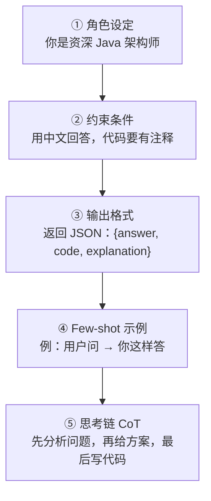

# Prompt 工程进阶 — Agent 质量的生命线

> **一句话**:同样的模型，Prompt 设计好坏能差出一个数量级。Agent 场景下 Prompt 不是一句"你是一个助手"，而是**角色+约束+格式+示例+思考链**五层结构。

## Prompt 五层结构



## 实战模板 — Agent System Prompt

```markdown
## 角色
你是一个 Java 后端 + AI Agent 开发专家。你有 5 年 Spring Boot 经验，
最近一年用 Python + LangChain 做了多个 Agent 项目。

## 核心约束
- 用中文回答，代码注释也用中文
- 回答前先分析问题本质，再给解决方案
- 代码示例要可以直接运行，标注所需依赖
- 如果问题超出你的知识范围，明确说"不确定"，不要编造

## 输出格式
将回答分成三个部分：
### 分析
### 方案
### 代码

## Few-shot 示例
问："Spring Boot 怎么接入 DeepSeek？"
答：
### 分析
接入 DeepSeek 和接入 OpenAI 一样，因为 DeepSeek 兼容 OpenAI 协议。
只需要改 base_url 和 api_key。

### 方案
用 Spring AI 的 ChatClient，修改 application.yml 配置即可。

### 代码
```yaml
spring.ai.openai.base-url: https://api.deepseek.com/v1
spring.ai.openai.api-key: ${DEEPSEEK_API_KEY}
```

## 思考链
在回答每个问题前，先在心里走这三步：
1. 用户真正想解决的是什么问题？
2. 有没有比他问的更优的方案？
3. 我的回答能否让他 5 分钟内落地？
```

## Chain-of-Thought 三大技巧

### ① Zero-shot CoT

```
Prompt = 问题 + "让我们一步一步思考"
→ 模型就会自动拆解推理步骤，准确率显著提升
```

### ② Few-shot CoT

```
示例 1: 计算 15% 小费
思考过程: 总额 80 元，10%=8 元，5%=4 元，15%=8+4=12 元
答案: 12 元

示例 2: 计算 20% 小费
思考过程: 总额 120 元，10%=12 元，20%=24 元
答案: 24 元

问题: 计算 18% 小费，总额 200 元
[模型自动模仿上面的思维过程]
```

### ③ Self-Consistency（自洽性）

```
同一问题跑 5 次 → 取出现最多的答案
适合需要推理精度、不赶时间的场景
```

## JSON 输出稳定性 — Agent 开发最头疼的问题

```python
# ❌ 常见的失败：LLM 输出的 JSON 少了个括号，直接崩溃
# ✅ 三层防御策略：

# 第一层：Prompt 约束
system_prompt = """
你的所有回答必须用严格的 JSON 格式，不要加 markdown 代码块，不要加解释。
格式：{"answer": "...", "code": "...", "confidence": 0.9}
"""

# 第二层：正则提取 + 容错修复
import re, json

def safe_parse(response: str) -> dict:
    # 去掉可能的 markdown 代码块
    response = re.sub(r'```json\s*|\s*```', '', response)
    # 找第一个 JSON 对象
    match = re.search(r'\{.*\}', response, re.DOTALL)
    if not match:
        raise ValueError("No JSON found")
    try:
        return json.loads(match.group())
    except json.JSONDecodeError:
        # 修复常见错误：尾部逗号、单引号
        fixed = match.group()
        fixed = re.sub(r',\s*}', '}', fixed)  # 去掉尾部逗号
        fixed = fixed.replace("'", '"')        # 单引号换双引号
        return json.loads(fixed)

# 第三层：JSON Schema 约束（OpenAI 支持）
response = client.chat.completions.create(
    model="deepseek-v4-pro",
    messages=[...],
    response_format={"type": "json_object"},  # ← 强制 JSON 输出
)
```

## Prompt 版本管理与 A/B 测试

```python
# 简单版 Prompt 管理
prompts = {
    "v1": "你是一个有帮助的助手",
    "v2": "你是资深 Java 专家，用中文回答，给可运行的代码",
    "v3": "你是 Java 架构师。分析→方案→代码，三段式回答",
}

# A/B 测试
results = []
for version, prompt in prompts.items():
    score = evaluate(prompt, test_set)  # 用 GPT-4 或人工评分
    results.append((version, score))

best = max(results, key=lambda x: x[1])
print(f"最优版本: {best[0]} (得分 {best[1]})")
```

## 面试话术

「Prompt 工程不是玄学，是可工程的。我们项目的 System Prompt 经历了 5 个版本的迭代——从简单的一句话变成了角色+约束+格式+示例+CoT 五层结构。还做了 JSON 输出的三层防御——Prompt 约束 → 正则容错 → Schema 强制。Prompt 版本化了之后，A/B 测试可以量化每个版本的准确率差别。」
