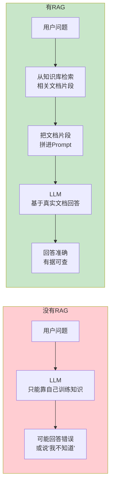
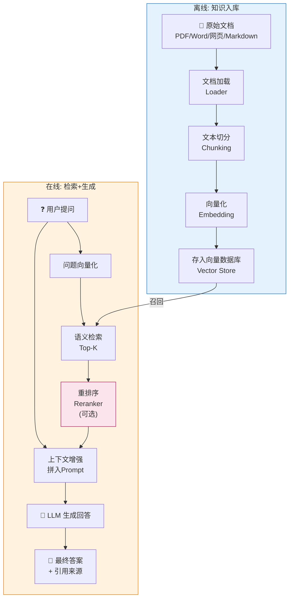
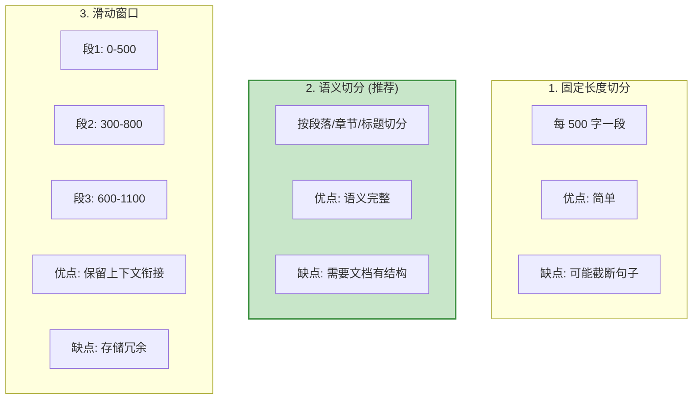
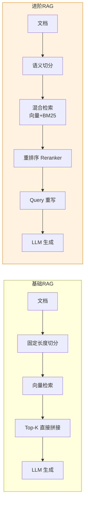
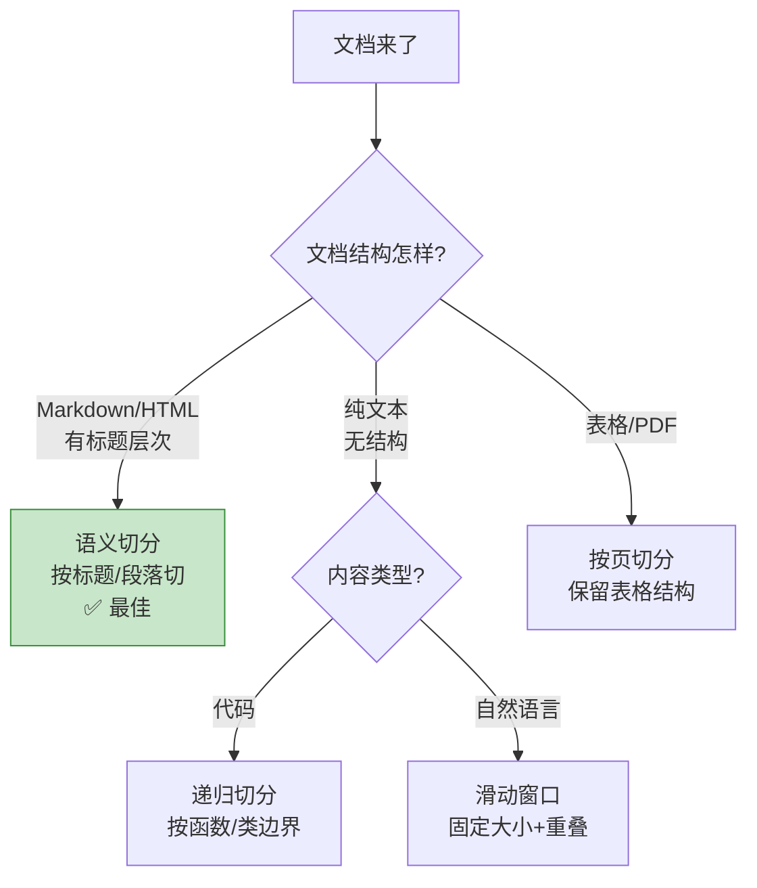
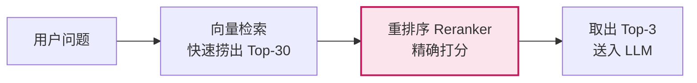

# RAG 检索增强生成

> **一句话**:RAG 让 Agent 拥有自己的知识库——把你的文档存进去，Agent 回答时先检索相关文档再生成答案，从此不再"一本正经地胡说八道"。

## 核心概念

LLM 有两个致命缺陷：
1. **知识有截止日期**（GPT-4 训练数据到 2024 年，不知道之后的事）
2. **不知道你的私有数据**（你的公司内部文档、产品手册、代码库）

RAG 解决这两个问题：**不靠 LLM 自己的记忆，而是每次回答前先从你的知识库中搜索相关内容，拼进 Prompt 里**。



**RAG vs 微调（Fine-tuning）**——企业最常问的问题：

| 维度 | RAG | 微调 |
|------|-----|------|
| 更新知识 | **秒级**，重新导入文档即可 | **天级**，需要重新训练 |
| 数据安全 | 文档不出你的服务器 | 需要发送数据给训练方 |
| 幻觉问题 | **低**，有文档依据 | 中等，模型仍可能编造 |
| 适用场景 | 知识问答、文档助手 | 改变输出风格/格式/专业术语 |
| 成本 | 低（只需向量数据库） | 高（训练计算资源） |
| 推荐度 | **90%的企业场景首选 RAG** | 只在 RAG 不够时补充 |

## 原理图解

### RAG 完整流水线



### 文档切分策略（关键细节）



| 切分策略 | Chunk 大小 | Overlap | 适用场景 |
|----------|-----------|---------|---------|
| 固定长度 | 500-1000 字符 | 50-100 | 文档无结构时 |
| 按段落 | 不固定 | 0 | 结构化文档（Markdown） |
| 递归切分 | 先按大标题→小标题→段落 | 每级 100-200 | **最常用** |
| 滑动窗口 | 500 | 200 | 需要上下文衔接时 |

## 代码实例

### 从零实现 RAG（不依赖框架）

```python
"""
最小 RAG 实现 - 理解原理
安装: pip install chromadb sentence-transformers openai
"""

import chromadb
from chromadb.utils import embedding_functions
from openai import OpenAI

# ========== 配置 ==========
client_llm = OpenAI(
    api_key="your-deepseek-api-key",
    base_url="https://api.deepseek.com"
)

# ========== 第1步: 准备知识文档 ==========
documents = [
    "HashMap是Java中最常用的Map实现。底层结构在JDK8中是数组+链表+红黑树。默认初始容量16，负载因子0.75。当链表长度超过8且数组长度超过64时，链表转为红黑树。put操作的时间复杂度平均O(1)，最坏O(log n)。",
    "ConcurrentHashMap是线程安全的HashMap。JDK7使用Segment分段锁，默认16个Segment。JDK8改为CAS+synchronized，锁粒度从Segment级别降到桶级别。Node数组+链表+红黑树。sizeCtl控制初始化和扩容。",
    "ArrayList是动态数组实现，默认初始容量10。扩容时新容量为旧容量的1.5倍(oldCapacity + oldCapacity >> 1)。add(E)均摊O(1)，add(index,E)最坏O(n)。不是线程安全的，需要外部同步。",
    "LinkedList是双向链表实现。每个节点包含prev和next指针。get(int)需要从头或尾遍历O(n)。add(E)和remove(E)在已知节点位置时O(1)。实现了Deque接口，可以作为队列或栈使用。",
    "Spring Boot自动装配的核心是@SpringBootApplication注解中的@EnableAutoConfiguration。它通过@Import导入AutoConfigurationImportSelector，该类读取META-INF/spring/org.springframework.boot.autoconfigure.AutoConfiguration.imports文件中的自动配置类全限定名，根据条件注解(@ConditionalOnClass等)决定是否加载。",
    "Spring IoC容器本质是一个大的Bean工厂。BeanDefinitionRegistry存储Bean定义，DefaultSingletonBeanRegistry存储单例Bean。BeanFactory是基础接口，ApplicationContext是高级接口(继承BeanFactory+消息+事件等)。",
]

# ========== 第2步: 文档切分 ==========
def split_text(text: str, chunk_size: int = 200, overlap: int = 50) -> list:
    """简单滑动窗口切分"""
    chunks = []
    start = 0
    while start < len(text):
        end = start + chunk_size
        chunks.append(text[start:end])
        start += chunk_size - overlap  # 滑动
    return chunks

all_chunks = []
for i, doc in enumerate(documents):
    chunks = split_text(doc)
    for j, chunk in enumerate(chunks):
        all_chunks.append({
            "text": chunk,
            "id": f"doc{i}_chunk{j}",
            "metadata": {"source_doc": i}
        })
print(f"切分后共 {len(all_chunks)} 个文本块")

# ========== 第3步: 向量化并存入数据库 ==========
chroma_client = chromadb.PersistentClient(path="./rag_demo_db")
ef = embedding_functions.SentenceTransformerEmbeddingFunction(
    model_name="all-MiniLM-L6-v2"
)
collection = chroma_client.get_or_create_collection(
    name="java_knowledge", embedding_function=ef
)

collection.add(
    documents=[c["text"] for c in all_chunks],
    ids=[c["id"] for c in all_chunks],
    metadatas=[c["metadata"] for c in all_chunks]
)
print(f"已存入向量数据库: {collection.count()} 条")

# ========== 第4步: 检索 + 生成 ==========
def rag_query(question: str, top_k: int = 3) -> str:
    """RAG 查询: 检索 → 拼Prompt → LLM生成"""

    # 4a. 语义检索
    results = collection.query(query_texts=[question], n_results=top_k)

    # 4b. 拼装 Prompt
    context_parts = []
    for i, doc in enumerate(results["documents"][0]):
        context_parts.append(f"[文档{i+1}] {doc}")
    context = "\n".join(context_parts)

    prompt = f"""根据以下参考资料回答问题。如果资料中没有相关信息，请明确说明。

参考资料:
{context}

问题: {question}

请基于参考资料回答，并在答案末尾标注引用了哪个文档。"""

    # 4c. LLM 生成
    response = client_llm.chat.completions.create(
        model="deepseek-chat",
        messages=[{"role": "user", "content": prompt}],
        temperature=0
    )

    return response.choices[0].message.content

# ========== 测试 ==========
if __name__ == "__main__":
    questions = [
        "HashMap的扩容机制是怎样的？",
        "ConcurrentHashMap在JDK8中做了什么改进？",
        "Spring Boot的自动装配原理是什么？",
    ]

    for q in questions:
        print(f"\n{'='*60}")
        print(f"问: {q}")
        print(f"{'='*60}")
        answer = rag_query(q)
        print(f"答: {answer}")
```

## 常见误区 / 面试点

- **误区1**: "RAG 就是向量搜索" —— 不完全是。向量搜索只是检索环节的一种方式。完整的 RAG 还包括文档处理、切分策略、重排序、答案生成等环节。
- **误区2**: "检索的文档越多越好" —— 错。塞太多文档会：① 超出上下文窗口 ② LLM 注意力分散反而降低质量。**Top-3 到 Top-5** 是经验甜点。
- **误区3**: "chunk 越大越好" —— 错。chunk 太大 → 检索不精准（一大段里只有一句有用）；chunk 太小 → 缺少上下文。**500-1000 token 是常用范围**。
- **面试追问方向**:
  - "如何评估 RAG 效果？" → 准确率、召回率、答案相关性（RAGAS 框架）
  - "检索不精准怎么办？" → ① 重排序（Reranker）② 混合检索（BM25 + 向量）③ 调整 chunk 大小
  - "RAG 和 Agent 的关系？" → RAG 是 Agent 记忆层的一种实现方式，Agent 可能用 RAG 检索知识，也可能用其他方式

## 项目代码参考

本文的 RAG 实现在 Python Agent 项目中：

| 代码文件 | 对应函数/类 | 演示的概念 |
|---------|------------|-----------|
| `agent-project-py/src/agent_rag.py` | `MiniRAG` | 完整 RAG 系统（文档→向量→检索→生成） |
| `agent-project-py/src/agent_rag.py` | `MiniRAG.query()` | 语义检索 + LLM 生成 |

> 📍 完整映射见 `知识与代码双向映射.md`

## 什么场景不需要 RAG

> 2026 年 DeepSeek V4 Pro 等模型已支持 **1M Token 上下文窗口**，很多原本需要 RAG 的场景可以直接全文塞入。

### 不需要 RAG 的场景（直接用上下文窗口）

| 场景 | 原因 | 实例 |
|------|------|------|
| 全文 < 500K tokens | 直接塞 context 比检索更准确 | AI 小说家把整卷（~110K 字）全文发给模型 |
| 需要全局一致性 | RAG 检索碎片化，模型看不到完整叙事弧 | 小说续写需要知道前文全部情节 |
| 串行创作任务 | 不需要随机检索，按顺序阅读 | 构思→大纲→写作流水线 |

### 仍然需要 RAG 的场景

| 场景 | 原因 |
|------|------|
| 知识库 > 1M tokens | 超出上下文窗口 |
| 需要检索特定片段 | 用户问"第三章主角说了什么" |
| 大量文档问答 | 几百份 PDF 不可能全塞进去 |
| 多轮对话需要精确引用 | 客服机器人回答"根据第X条政策..." |

### 决策树

```
数据量 < 1M tokens？ → YES → 直接塞 context（更简单、更准确）
## RAG 进阶：从"能用"到"好用"

基础的 RAG（文档→切分→向量化→检索→生成）能解决 70% 的问题。但想要更好的效果，需要掌握以下进阶技术：



### 1. 文档切分策略深度对比

切分是 RAG 中**最容易被低估、但影响最大**的一步。



```python
"""
四种切分策略对比 — 选对策略，检索准确率差 3 倍
"""

# ===== 策略 1: 固定长度切分（最差，但最简单）=====
chunks = [text[i:i+500] for i in range(0, len(text), 500)]
# ❌ 可能把一句话切成两半 → 检索到不完整的语义

# ===== 策略 2: 递归切分（推荐，LangChain 默认）=====
from langchain.text_splitter import RecursiveCharacterTextSplitter

splitter = RecursiveCharacterTextSplitter(
    chunk_size=500,        # 每段目标大小
    chunk_overlap=100,      # 重叠 100 token（保留上下文衔接）
    separators=["\n\n", "\n", "。", "！", "？", " ", ""]  # 优先在段落/句子边界切
)
chunks = splitter.split_text(text)
# ✅ 语义完整：不会在句子中间切断

# ===== 策略 3: 语义切分（最佳，按内容变化点自动切）=====
from langchain_experimental.text_splitter import SemanticChunker
from langchain_openai import OpenAIEmbeddings

semantic_splitter = SemanticChunker(
    embeddings=OpenAIEmbeddings(),
    breakpoint_threshold_type="percentile"  # 语义变化超过多少 percentile 就切
)
chunks = semantic_splitter.create_documents([text])
# ✅ 语义边界精准：内容主题变了就切，不变就不切

# ===== 策略 4: 按文档结构切分（Markdown 专用）=====
from langchain.text_splitter import MarkdownHeaderTextSplitter

headers_to_split_on = [
    ("#", "标题1"),
    ("##", "标题2"),
    ("###", "标题3"),
]
markdown_splitter = MarkdownHeaderTextSplitter(headers_to_split_on)
chunks = markdown_splitter.split_text(markdown_text)
# ✅ 保留标题层级，检索时可以按标题过滤
```

### 2. 混合检索（Hybrid Search）— 最易见效的优化

纯向量检索的弱点：**语义上相似但关键词不同时检索不准**。

```
用户搜: "HashMap 线程安全"
向量检索: → "ConcurrentHashMap 使用 synchronized" ✓
            → "ArrayList 扩容机制"               ← 语义相似(集合类)但无关
BM25检索:  → "HashMap 线程不安全 用 ConcurrentHashMap" ✓
            → "线程池 ThreadPoolExecutor"           ← 有关键词"线程"但无关

✅ 混合: 向量 + BM25 各取前几名，合并去重，效果最好
```

```python
"""
混合检索 — 向量 + BM25 互补
"""
from rank_bm25 import BM25Okapi  # pip install rank_bm25
import numpy as np

class HybridRetriever:
    """混合检索器：向量搜索 + 关键词搜索"""

    def __init__(self, vector_store, docs: list[str]):
        self.vector_store = vector_store
        self.docs = docs
        # BM25 需要原始文本
        tokenized = [doc.split() for doc in docs]
        self.bm25 = BM25Okapi(tokenized)

    def search(self, query: str, top_k: int = 5) -> list[str]:
        # 1. 向量检索
        vector_results = self.vector_store.similarity_search(query, k=top_k * 2)

        # 2. BM25 关键词检索
        bm25_scores = self.bm25.get_scores(query.split())
        bm25_top = np.argsort(bm25_scores)[-top_k * 2:][::-1]
        bm25_results = [self.docs[i] for i in bm25_top]

        # 3. 合并（RRF 融合算法）
        all_results = {}
        for i, doc in enumerate(vector_results):
            all_results[doc] = all_results.get(doc, 0) + 1 / (i + 60)
        for i, doc in enumerate(bm25_results):
            all_results[doc] = all_results.get(doc, 0) + 1 / (i + 60)

        # 按融合分数排序
        sorted_results = sorted(all_results.items(), key=lambda x: -x[1])
        return [doc for doc, _ in sorted_results[:top_k]]
```

### 3. 重排序（Reranker）— 性价比最高的优化

向量检索的 Top-K 结果不一定是最相关的。**Reranker 用更精确的模型（Cross-Encoder）对结果重新打分排序**。



```python
"""
重排序 — 将 Top-30 精确重排为 Top-3
"""

# ===== 方案 A: Cohere Rerank（付费，效果最好）=====
# pip install cohere
import cohere

co = cohere.Client("your-api-key")
results = co.rerank(
    model="rerank-multilingual-v3.0",  # 支持中文！
    query="HashMap 线程安全",
    documents=["文档1", "文档2", ...],
    top_n=3
)
for r in results.results:
    print(f"文档 #{r.index} 相关度: {r.relevance_score:.4f}")

# ===== 方案 B: BGE-Reranker（本地免费，效果不错）=====
# pip install torch transformers
from transformers import AutoModelForSequenceClassification, AutoTokenizer

model = AutoModelForSequenceClassification.from_pretrained(
    "BAAI/bge-reranker-v2-m3"  # 中文专用
)
tokenizer = AutoTokenizer.from_pretrained("BAAI/bge-reranker-v2-m3")

pairs = [[query, doc] for doc in candidates]
inputs = tokenizer(pairs, padding=True, truncation=True, return_tensors="pt")
scores = model(**inputs).logits.squeeze(-1).detach().numpy()

top_indices = scores.argsort()[-3:][::-1]
```

### 4. Query 转换 — 让用户的问题更精准

用户的原始问题往往不适合直接检索，需要**重写/扩展**：

```python
"""
Query 转换 — 用 LLM 优化搜索关键词
"""

from openai import OpenAI

def rewrite_query(original: str) -> str:
    """Query 重写：用户的自然语言 → 适合检索的关键词"""
    response = client.chat.completions.create(
        model="deepseek-chat",
        messages=[{"role": "user", "content": f"""将以下问题改写成适合搜索的关键词，只输出关键词：

原始问题: {original}
改写后的搜索词:"""}],
        temperature=0
    )
    return response.choices[0].message.content

# 示例:
# 用户: "HashMap 在并发情况下有什么问题？"
# 重写: "HashMap 线程安全 并发问题 ConcurrentHashMap"
```

**Query 转换的四种模式**：

| 模式 | 做法 | 效果 |
|------|------|------|
| **Query Rewrite** | LLM 把问题改写成搜索关键词 | 提升检索召回率 20-30% |
| **HyDE** | 先生成一个假设答案，用假设答案去检索 | 文档和答案的语义更接近 |
| **Multi-Query** | 生成 N 个不同角度的搜索词，全部去搜 | 覆盖更全面 |
| **Step-Back** | 把具体问题抽象成更通用的概念问题 | 适合需要推理的场景 |

### 5. RAG 评估指标

没有评估就没有优化。RAG 的核心指标：

```python
"""
RAG 评估框架 RAGAS — 量化你的 RAG 质量
pip install ragas
"""

from ragas import evaluate
from ragas.metrics import (
    faithfulness,    # 答案是否基于文档（有没有幻觉）
    answer_relevancy, # 答案是否回答了问题
    context_recall,   # 检索到的文档是否覆盖了需要的知识
    context_precision, # 检索到的文档中有多少是相关的
)

scores = evaluate(
    dataset=dataset,  # 测试数据集
    metrics=[faithfulness, answer_relevancy, context_recall, context_precision]
)
print(scores)
```

| 指标 | 测量什么 | 及格线 | 优秀线 |
|------|---------|--------|--------|
| **Faithfulness** | 答案是否基于文档（无幻觉） | 0.7 | 0.9+ |
| **Answer Relevancy** | 答案和问题的相关性 | 0.7 | 0.9+ |
| **Context Recall** | 检索到的文档是否覆盖了答案需要的知识 | 0.6 | 0.8+ |
| **Context Precision** | 检索到的文档中有多少是真正有用的 | 0.6 | 0.8+ |

### 6. 中文 RAG 的特殊坑

| 坑 | 原因 | 解决 |
|----|------|------|
| **切分切到中文句子中间** | 中文没有空格分隔词 | separators 加"。" "！" "？" |
| **Embedding 对中文效果差** | 很多模型英文训练为主 | 用 `BAAI/bge-large-zh-v1.5` 或 `m3e-base` |
| **PDF 中文乱码** | 扫描件 PDF | 用 OCR（PaddleOCR 中文效果好） |
| **检索不到同义词** | 向量模型不理解中文同义词 | 用 BGE-M3 多语言模型 |
| **切分太小语义不完整** | 中文一句话信息密度高 | chunk_size 可以设大一点（800-1000） |

## 项目代码参考

本文的进阶 RAG 实现在 Python Agent 项目中：

| 代码文件 | 对应函数/类 | 演示的概念 |
|---------|------------|-----------|
| `agent-project-py/src/agent_rag.py` | `HybridRAG` | 混合检索（向量+BM25）、Query 重写 |
| `agent-project-py/src/agent_rag.py` | `MixedRetriever` | 向量+BM25+Rerank 三重优化 |

> 📍 完整映射见 `知识与代码双向映射.md`

---

## 2026 年更新：GraphRAG 与动态 RAG 新时代

### 从静态 RAG → 动态 GraphRAG

基础 RAG 的问题：**文档之间没有关系**。"HashMap 和 ConcurrentHashMap 有什么区别"——基础 RAG 只能分别搜到两篇文档，找不到专门讲"对比"的内容。

GraphRAG 解决：**文档变知识图谱，实体之间有边相连**。

```
基础 RAG:  文档 → Chunk → 向量 → 检索 → 回答（Chunk 是孤岛）

GraphRAG:  文档 → 实体+关系 → 知识图谱 → 图遍历 → 回答
           ("HashMap" --[线程安全替代]--> "ConcurrentHashMap")
```

### 2026 年三大前沿

| 方向 | 代表技术 | 一句话 |
|------|---------|--------|
| **动态图构建** | Relink (AAAI 2026) | 不预建图谱，每次查询实时构建证据图 |
| **Agentic RAG** | PathRouter | RL 训练 Agent 探索图，自己找最佳路径 |
| **Token 级图** | TIGRAG | 滑动窗口 token 共现建图，免 LLM 提取 |

### 什么时候上 GraphRAG？

| 场景 | 基础 RAG | GraphRAG |
|------|---------|----------|
| 单文档问答 | ✅ | 过度设计 |
| 多文档对比 | ⚠️ 碎片化 | ✅ 实体关系清晰 |
| 多跳推理 A→B→C | ❌ 不会推理链 | ✅ 图遍历天然支持 |
| 全局摘要 | ❌ 只见树木 | ✅ 社区检测+摘要 |

> **原则**：基础 RAG 解决 80% 问题。需**多跳推理**或**全局理解**时才上 GraphRAG。不要为了新技术而用新技术。
