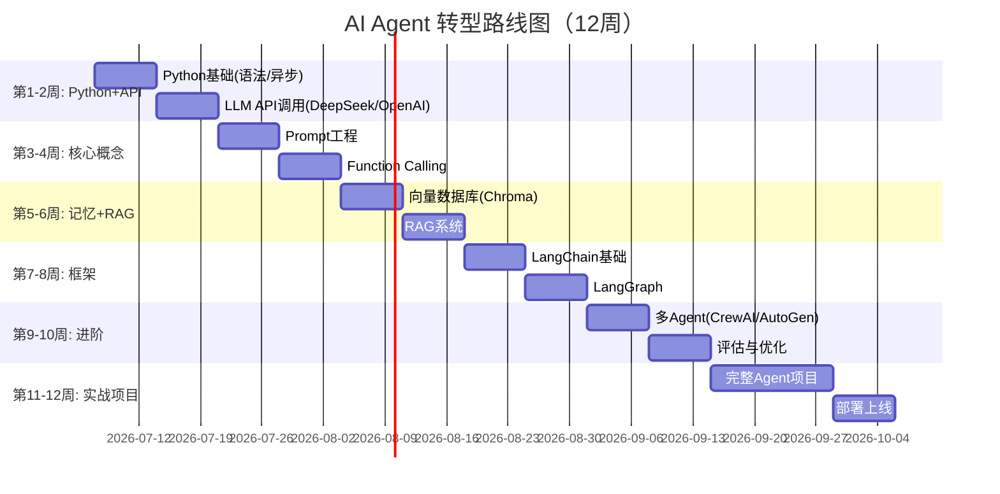

# AI Agent 学习路径与转型指南

> **一句话**:作为 Java 后端工程师转型 AI Agent 开发，你的优势是工程能力，短板是 Python 和 AI 概念——补短板只要 2-3 周，之后你的工程经验会加速你超过纯 AI 背景的人。

## 核心概念

### Java 工程师转 Agent 的优势与短板

```mermaid
graph LR
    subgraph 你已有的["✅ 你已有的能力（直接复用）"]
        E1["系统设计思维"]
        E2["API设计/RESTful"]
        E3["数据库经验"]
        E4["DevOps/部署"]
        E5["代码质量意识"]
        E6["架构思维"]
    end

    subgraph 需要补的["📝 需要新学的能力（2-3周）"]
        N1["Python 基础"]
        N2["LLM API 调用"]
        N3["Prompt 工程"]
        N4["向量数据库"]
        N5["异步编程(async/await)"]
    end

    subgraph 进阶能力["🚀 进阶能力（2-3个月）"]
        A1["RAG 系统"]
        A2["Agent 框架"]
        A3["多Agent协作"]
        A4["评估与优化"]
    end

    你已有的 --> 需要补的 --> 进阶能力

    style 你已有的 fill:#C8E6C9,stroke:#388E3C
    style 需要补的 fill:#FFF9C4,stroke:#F9A825
    style 进阶能力 fill:#E3F2FD,stroke:#1976D2
```



**关键认知转换**：

| Java 后端思维 | Agent 开发思维 | 原因 |
|--------------|---------------|------|
| 确定性逻辑（if/else） | 概率性输出（LLM 有随机性） | LLM 不是函数，同一个输入可能有不同输出 |
| 编写所有逻辑 | 写 Prompt + 提供工具，让 LLM 决策 | Agent 自主决策，你提供能力和约束 |
| 函数确定返回值 | LLM 可能返回格式错乱的内容 | 需要 OutputParser、重试、容错 |
| 关注 QPS/延迟 | 关注**准确率/幻觉率** | Agent 质量比性能更重要 |
| 单体服务 → 微服务 | 单Agent → 多Agent协作 | 多 Agent 类比分布式系统的协调问题 |

## 学习路线图

### 12 周系统学习计划



### 每周具体任务

**第 1-2 周：Python + LLM API**
- [ ] Python 语法（用 Java 类比快速学）：列表推导、装饰器、类型注解、异步 async/await
- [ ] 安装 uv（新一代包管理器）和 IDE（VSCode + Python 插件）
- [ ] 注册 DeepSeek API（国内首选，便宜）和 OpenAI API
- [ ] 调用 API 完成基础对话、流式输出、温度控制
- [ ] 用 Python 重写一个简单的 HTTP 客户端（对比 Java 的 HttpURLConnection）

**第 3-4 周：Prompt + Function Calling**
- [ ] 学会写高质量 System Prompt（角色/约束/格式）
- [ ] 练习 Few-shot 和 Chain-of-Thought
- [ ] 实现 Function Calling：定义 3-5 个工具，让 LLM 自主调用
- [ ] 用 JSON Schema 约束 LLM 输出结构化数据

**第 5-6 周：向量数据库 + RAG**
- [ ] 学 Chroma 向量数据库：增删改查、语义搜索
- [ ] 实现 RAG：文档加载 → 切分 → 向量化 → 存储 → 检索 → 生成
- [ ] 对比不同切分策略（固定长度 vs 语义切分）的效果
- [ ] 用你已有的 Java 知识库文档作为 RAG 数据源

**第 7-8 周：LangChain + LangGraph**
- [ ] LangChain 核心概念：Model、PromptTemplate、OutputParser、Chain、Tool
- [ ] 实现 3 个 Chain：信息提取、RAG 问答、自定义工具 Agent
- [ ] LangGraph：实现一个带循环/条件分支的 Agent
- [ ] 理解 State、Node、Edge、Conditional Edge

**第 9-10 周：多 Agent + 评估**
- [ ] CrewAI：实现 3 个角色的协作（研究+写作+审查）
- [ ] AutoGen：体验群聊模式
- [ ] Agent 评估：准确率、延迟、成本

**第 11-12 周：完整项目**
- [ ] 从零做一个完整的 Agent 产品
- [ ] FastAPI 部署 + Docker 容器化
- [ ] 写项目文档，整理到 GitHub

## Python 速查（给 Java 工程师）

```python
# ===== 变量 =====
# Java: String name = "hello";
name: str = "hello"          # 类型注解（可选，不是强制的）
age: int = 25

# ===== 列表 vs Java ArrayList =====
# Java: List<String> list = new ArrayList<>();
#      list.add("a"); list.get(0);
items: list[str] = ["a", "b", "c"]
items.append("d")             # list.add()
first = items[0]              # list.get(0)

# 列表推导式（Java 没有的）
squares = [x**2 for x in range(10)]  # [0, 1, 4, 9, 16, ...]

# ===== 字典 vs Java HashMap =====
# Java: Map<String,Integer> map = new HashMap<>();
#      map.put("a", 1); map.get("a");
data: dict[str, int] = {"a": 1, "b": 2}
data["c"] = 3                  # map.put()
val = data.get("a", 0)        # map.getOrDefault()

# ===== 函数 =====
# Java: public String greet(String name) { return "Hi " + name; }
def greet(name: str) -> str:   # -> 类型 等于 Java 的返回类型
    return f"Hi {name}"        # f-string 等于 Java 的字符串拼接

# ===== 类 =====
# Java: public class User { private String name; public User(String name) { this.name = name; } }
class User:
    def __init__(self, name: str):  # 构造方法
        self.name = name             # self = this

    def greet(self) -> str:
        return f"Hi, I'm {self.name}"

# ===== 异步 =====
# Java: CompletableFuture.supplyAsync(() -> fetch())
async def fetch_data(url: str) -> str:
    # 等价于 await CompletableFuture
    import aiohttp
    async with aiohttp.ClientSession() as session:
        async with session.get(url) as resp:
            return await resp.text()

# 并发执行多个异步任务（等价于 CompletableFuture.allOf）
import asyncio
results = await asyncio.gather(
    fetch_data("url1"),
    fetch_data("url2"),
    fetch_data("url3"),
)

# ===== 装饰器（Java 的注解 + AOP）=====
def log(func):
    def wrapper(*args):
        print(f"调用 {func.__name__}")
        result = func(*args)
        print(f"完成 {func.__name__}")
        return result
    return wrapper

@log  # 等价于 Java 的 @Log 注解 + AOP
def process(data: str) -> str:
    return data.upper()
```

## 推荐学习资源

| 资源 | 类型 | 推荐度 | 说明 |
|------|------|--------|------|
| DeepSeek API | API 服务 | ⭐⭐⭐⭐⭐ | 国内首选，便宜，兼容 OpenAI 格式 |
| **吴恩达 DeepLearning.AI** | 免费课程 | ⭐⭐⭐⭐⭐ | 每门课1-2小时，AI Agent/ChatGPT/RAG 系列 |
| LangChain 官方教程 | 文档+代码 | ⭐⭐⭐⭐ | 最权威的 LangChain 参考 |
| Lilian Weng 博客 | 技术博客 | ⭐⭐⭐⭐⭐ | OpenAI 技术成员，Agent 原理讲得最透 |
| Coze 扣子 | 低代码平台 | ⭐⭐⭐⭐ | 国内零代码体验 Agent 开发 |
| Dify | 开源低代码 | ⭐⭐⭐⭐ | 可自部署，适合企业内部 |

## 常见误区 / 面试点

- **误区1**: "要精通数学/机器学习才能做 Agent" —— 错。**应用型 Agent 开发不需要手推公式**。你调用的是现成的 API（LLM、Embedding），需要的是工程能力（Prompt、编排、集成）。
- **误区2**: "要先学完 Python 再开始" —— 不需要。Python 很简单，**边做 Agent 项目边学 Python**，一周就够用。
- **误区3**: "AI 岗位要 AI 专业/硕士才能进" —— Agent 开发更偏**工程**而非研究。Java 后端转 Agent 开发，你的工程优势（系统设计、API、部署）反而是亮点。
- **面试准备**:
  - "你为什么从 Java 转 AI Agent？" → 我看到 Agent 是下一代软件范式的趋势，而 Java 后端的工程经验在 Agent 部署、系统集成上非常关键
  - "做过哪些 Agent 项目？" → 至少准备 2-3 个（RAG 知识库问答、带工具调用的 Agent、多 Agent 协作）
  - "Agent 怎么处理幻觉？" → RAG 检索增强 + Prompt 约束 + 输出校验 + 人工审核

## 参考来源

- 吴恩达课程: https://www.deeplearning.ai/short-courses/
- Lilian Weng Agent 博客: https://lilianweng.github.io/posts/2023-06-23-agent/
- LangChain 学习路径: https://python.langchain.com/docs/tutorials/
- DeepSeek API: https://platform.deepseek.com
- 本手册完整目录: `README.md`
