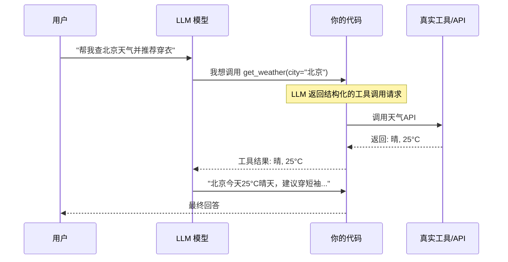
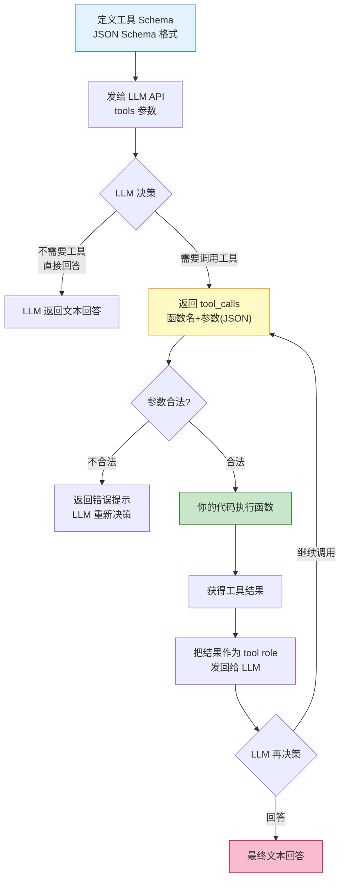

# Agent 工具调用 (Function Calling)

> **一句话**:Function Calling 是让 Agent 从"只会说"变成"能做事"的关键技术——定义好工具，LLM 自己决定何时调用、传什么参数，你的代码负责执行。

## 核心概念

LLM 本质上只能生成文本。它不能上网搜索、不能查数据库、不能发邮件。**Function Calling** 解决这个问题：

> 你告诉 LLM "你有这些工具可以用"，LLM 在推理过程中**自主决定**调用哪个工具、传什么参数，然后你的代码执行真实函数，把结果返回给 LLM 继续推理。



**关键点**：LLM 并不直接执行工具，它只**输出"想调用什么"**，真正的执行由你的代码完成。这保证了安全性——你可以控制哪些工具可用、参数是否合法。

## 主流模型的 Function Calling 支持

| 模型 | 支持 Function Calling | 备注 |
|------|----------------------|------|
| OpenAI GPT-4o | ✅ 原生支持，最成熟 | 定义工具用 `tools` 参数 |
| DeepSeek-V3 | ✅ 兼容 OpenAI 格式 | 便宜，推荐国内使用 |
| 通义千问 Qwen | ✅ 兼容 OpenAI 格式 | 阿里云，免费额度大 |
| 智谱 GLM-4 | ✅ 兼容 OpenAI 格式 | ZCode 用的模型 |
| Claude (Anthropic) | ✅ 支持 | 格式略有不同，用 `tool_use` |

## 原理图解

### Function Calling 的完整数据流



### 工具 Schema 的 JSON 格式

```json
{
    "type": "function",
    "function": {
        "name": "database_query",           // 工具名称（唯一标识）
        "description": "查询数据库",        // 描述（LLM 据此判断何时调用）
        "parameters": {                     // 参数定义（JSON Schema）
            "type": "object",
            "properties": {
                "table": {
                    "type": "string",
                    "description": "要查询的表名",
                    "enum": ["users", "orders", "products"]  // 限定可选值
                },
                "conditions": {
                    "type": "object",
                    "description": "查询条件",
                    "properties": {
                        "field": {"type": "string"},
                        "operator": {"type": "string", "enum": ["=", ">", "<", "LIKE"]},
                        "value": {"type": "string"}
                    },
                    "required": ["field", "operator", "value"]
                }
            },
            "required": ["table"]            // 必填参数
        }
    }
}
```

## 代码实例

### 完整 Function Calling 示例（DeepSeek，国内可用）

```python
"""
Function Calling 完整示例 — 使用 DeepSeek API
安装: pip install openai
DeepSeek API 兼容 OpenAI 格式，只需改 base_url 和 api_key
"""

from openai import OpenAI
import json

# DeepSeek API（兼容 OpenAI SDK）
client = OpenAI(
    api_key="your-deepseek-api-key",
    base_url="https://api.deepseek.com"  # 换成 DeepSeek 的端点
)

# ========== 1. 定义工具 ==========
tools = [
    {
        "type": "function",
        "function": {
            "name": "get_stock_price",
            "description": "获取股票的实时价格信息",
            "parameters": {
                "type": "object",
                "properties": {
                    "symbol": {
                        "type": "string",
                        "description": "股票代码，如 AAPL(苹果), MSFT(微软), 600519.SH(贵州茅台)"
                    },
                    "period": {
                        "type": "string",
                        "description": "查询周期",
                        "enum": ["realtime", "daily", "weekly", "monthly"],
                        "default": "realtime"
                    }
                },
                "required": ["symbol"]
            }
        }
    },
    {
        "type": "function",
        "function": {
            "name": "calculate",
            "description": "执行数学计算",
            "parameters": {
                "type": "object",
                "properties": {
                    "expression": {
                        "type": "string",
                        "description": "数学表达式，如 '(100 * 1.05) / 12'"
                    }
                },
                "required": ["expression"]
            }
        }
    },
    {
        "type": "function",
        "function": {
            "name": "send_email",
            "description": "发送邮件给指定收件人",
            "parameters": {
                "type": "object",
                "properties": {
                    "to": {"type": "string", "description": "收件人邮箱"},
                    "subject": {"type": "string", "description": "邮件主题"},
                    "body": {"type": "string", "description": "邮件正文"}
                },
                "required": ["to", "subject", "body"]
            }
        }
    }
]

# ========== 2. 实现工具逻辑 ==========
def get_stock_price(symbol: str, period: str = "realtime") -> str:
    """模拟股票查询"""
    prices = {"AAPL": 198.5, "MSFT": 420.3, "600519.SH": 1680.0}
    price = prices.get(symbol, 100.0)
    return f"股票 {symbol} 当前价格: {price} USD (模拟数据)"

def calculate(expression: str) -> str:
    try:
        result = eval(expression)
        return f"计算结果: {expression} = {result}"
    except Exception as e:
        return f"计算错误: {e}"

def send_email(to: str, subject: str, body: str) -> str:
    """模拟发送邮件"""
    # 真实项目这里调用 SMTP 或邮件 API
    return f"邮件已发送到 {to}，主题: {subject}（模拟）"

# 工具路由
TOOL_MAP = {
    "get_stock_price": get_stock_price,
    "calculate": calculate,
    "send_email": send_email,
}

# ========== 3. Agent 循环 ==========
def agent_loop(user_message: str):
    messages = [
        {"role": "system", "content": "你是一个智能助手，可以查询股票、做计算、发邮件。"},
        {"role": "user", "content": user_message}
    ]

    while True:
        response = client.chat.completions.create(
            model="deepseek-chat",
            messages=messages,
            tools=tools,
            tool_choice="auto"
        )

        msg = response.choices[0].message

        # 没有工具调用 → 直接输出
        if not msg.tool_calls:
            print(f"\n💬 {msg.content}")
            return msg.content

        messages.append(msg)

        # 有工具调用 → 执行
        for tc in msg.tool_calls:
            func_name = tc.function.name
            func_args = json.loads(tc.function.arguments)
            print(f"\n🔧 调用: {func_name}({func_args})")

            result = TOOL_MAP[func_name](**func_args)
            print(f"📥 结果: {result}")

            messages.append({
                "role": "tool",
                "tool_call_id": tc.id,
                "content": result
            })

# ========== 运行 ==========
if __name__ == "__main__":
    # 测试: 需要连续调用多个工具的复杂请求
    agent_loop("帮我查下苹果(AAPL)股票价格，然后算一下如果我买100股需要多少钱，最后发邮件给investor@example.com告诉他这个信息")
```

### 工具定义的最佳实践

```python
"""
Function Calling 的工具定义最佳实践
"""
# ✅ 好的工具描述: 具体、清晰，告诉LLM什么时候该用
good_tool = {
    "name": "search_company_info",
    "description": """搜索公司的工商注册信息。
    当用户询问某公司的注册资本、法人、成立时间、经营范围等工商信息时使用此工具。
    不要用此工具搜索股票价格或新闻。""",
    "parameters": {
        "type": "object",
        "properties": {
            "company_name": {
                "type": "string",
                "description": "公司全称，如'北京字节跳动科技有限公司'"
            }
        },
        "required": ["company_name"]
    }
}

# ❌ 差的工具描述: 模糊，LLM 不知道什么时候该用
bad_tool = {
    "name": "search",
    "description": "搜索信息",  # 太模糊了！什么信息？什么时候用？
    "parameters": {
        "type": "object",
        "properties": {
            "query": {"type": "string", "description": "搜索词"}  # 搜什么？格式要求？
        },
        "required": ["query"]
    }
}

# ✅ 用 enum 限定 LLM 的选择范围（防止幻觉）
tool_with_enum = {
    "name": "get_database_record",
    "parameters": {
        "type": "object",
        "properties": {
            "table": {
                "type": "string",
                "description": "数据库表名",
                "enum": ["users", "orders", "products", "logs"]
                # LLM 只能从这些选项中选，不会瞎编一个表名
            },
            "action": {
                "type": "string",
                "enum": ["select", "count", "exists"]
            }
        },
        "required": ["table", "action"]
    }
}
```

## 常见误区 / 面试点

- **误区1**: "Function Calling 是 LLM 自己去执行函数" —— 错。LLM 只返回"我想调用X函数，参数是Y"，**真正的执行由你的代码完成**。这是安全性的关键设计。
- **误区2**: "工具定义越多越好" —— 错。工具越多，LLM 选错工具的概率越高。**10-20个工具是甜点区**，超过30个就考虑用工具分类/分层来管理。
- **误区3**: "只需要定义函数签名就行" —— 错。description 字段极其重要——LLM 完全靠它判断何时调用。description 写得差，Agent 就会乱调或漏调。
- **面试追问方向**:
  - "如何防止 LLM 注入攻击？" → 工具参数白名单、SQL 参数化查询、不执行任意代码
  - "tool_choice 参数有哪些选项？" → `"auto"`(LLM自决定)、`"required"`(必须调用)、`"none"`(禁止调用)、指定某个工具名(强制调用它)
  - "并行工具调用怎么做？" → GPT-4o 支持一次返回多个 tool_calls，可以并行执行

## 项目代码参考

本文概念在两个 Agent 项目中都有对应实现：

| 代码文件 | 对应函数/类 | 演示的概念 |
|---------|------------|-----------|
| `agent-project-py/src/agent_core.py` | `TOOLS` / `TOOL_MAP` | 工具定义 JSON、路由表 |
| `agent-project-java/.../service/AgentToolFunctions.java` | `TOOL_DEFINITIONS` / `TOOLS` | Java 版工具注册表 |
| `agent-project-java/.../controller/AgentController.java` | `runAgent()` | Java 版 Function Calling 循环 |

> 📍 完整映射见 `知识与代码双向映射.md`

## 参考来源

- OpenAI Function Calling 指南: https://platform.openai.com/docs/guides/function-calling
- DeepSeek API 文档: https://platform.deepseek.com/api-docs
- JSON Schema 规范: https://json-schema.org
- 相关笔记: `Agent核心概念.md`
