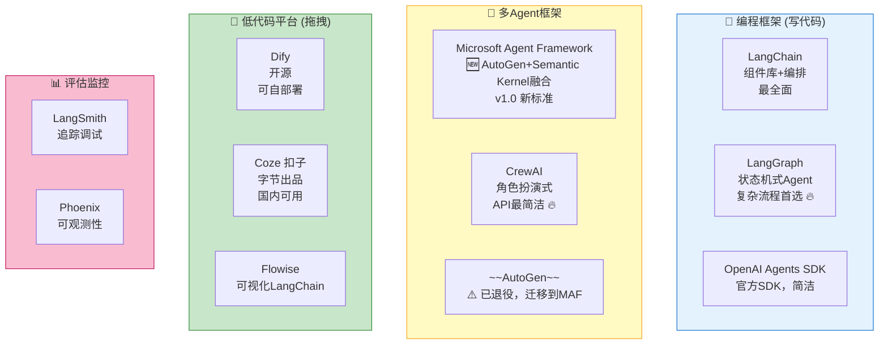
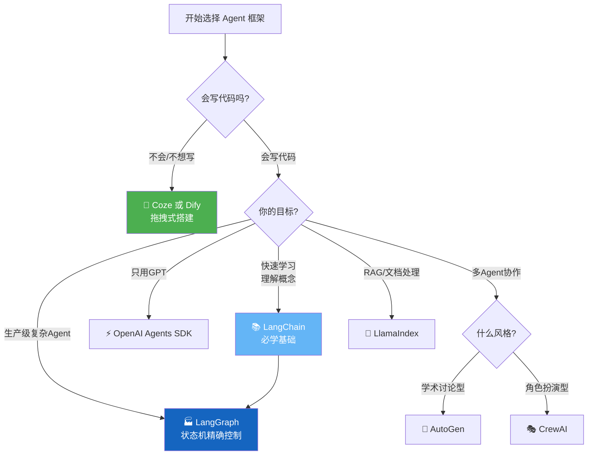

# AI Agent 主流框架对比与选型

> **一句话**:不要纠结选哪个框架，先理解它们的定位。2026 年最大变化：**AutoGen 退役，Microsoft Agent Framework (MAF) 接班**。

## 核心概念

2024-2026 年 Agent 框架百花齐放，但按**抽象层级**分为四类。⚠️ **AutoGen 已进入维护模式，新项目用 MAF**：



## 详细对比

| 框架                    | 语言        | GitHub Stars | 学习曲线 | 核心优势                          | 主要局限               | 适合谁          |
| --------------------- | --------- | ------------ | ---- | ----------------------------- | ------------------ | ------------ |
| **LangChain**         | Python/JS | 100k+        | ⭐⭐⭐  | 生态最大，组件最多，教程最多                | 过度抽象，调试困难，版本频繁变动   | 学习、原型开发      |
| **LangGraph**         | Python    | 15k+         | ⭐⭐⭐⭐ | 状态机式精确控制，支持复杂分支/循环            | 概念多，需要先理解LangChain | **生产级Agent** |
| **OpenAI Agents SDK** | Python    | 5k+          | ⭐⭐   | 官方出品，极简API，原生Function Calling | 只支持OpenAI模型        | 接GPT的快速开发    |
| **AutoGen**           | Python    | 40k+         | ⭐⭐⭐  | 多Agent对话，代码执行，人机协作            | 生态不如LangChain      | 多Agent研究     |
| **CrewAI**            | Python    | 30k+         | ⭐⭐   | 角色设定简洁，上手极快                   | 功能相对简单             | 快速搭多Agent    |
| **Dify**              | 低代码       | 60k+         | ⭐    | 可视化，可自部署，支持RAG                | 定制灵活性受限            | 不想写代码        |
| **Coze 扣子**           | 低代码       | N/A          | ⭐    | 中文友好，免费，插件丰富                  | 国内服务，出海受限          | 国内快速验证       |

## 选型决策树



## 各框架快速体验

### LangChain 核心概念

```python
"""
LangChain 核心概念速览 (v0.2+)
安装: pip install langchain langchain-openai
"""

from langchain_openai import ChatOpenAI
from langchain_core.messages import HumanMessage, SystemMessage

# LangChain 的核心是 Model → Prompt → Parser 链
llm = ChatOpenAI(model="gpt-4o", api_key="your-key")

# 基础调用
messages = [
    SystemMessage(content="你是一个Java专家"),
    HumanMessage(content="解释一下HashMap的原理")
]
response = llm.invoke(messages)
print(response.content)

# LangChain 的重要抽象:
# - ChatModel: LLM封装
# - PromptTemplate: Prompt模板
# - OutputParser: 输出解析器
# - Tool: 工具封装
# - Chain: 执行链
# - Agent: 带工具调用的自主循环
# - Retriever: 检索器(RAG用)
```

### CrewAI 多Agent（最简洁的多Agent框架）

```python
"""
CrewAI 多Agent示例 - 3个角色协作完成研究报告
安装: pip install crewai
"""

from crewai import Agent, Task, Crew, Process

# 定义角色
researcher = Agent(
    role="研究员",
    goal="收集AI Agent领域的最新信息和数据",
    backstory="你是一位资深技术研究员，擅长信息搜集和分析。",
    llm="deepseek-chat",
    verbose=True
)

writer = Agent(
    role="技术写手",
    goal="将研究材料整理成清晰易懂的技术文章",
    backstory="你是一位技术写作专家，能把复杂技术讲得通俗易懂。",
    llm="deepseek-chat",
    verbose=True
)

reviewer = Agent(
    role="技术审稿人",
    goal="审查文章的技术准确性和可读性",
    backstory="你是一位资深技术架构师，有20年经验。",
    llm="deepseek-chat",
    verbose=True
)

# 定义任务
research_task = Task(
    description="研究2026年AI Agent的主要技术趋势",
    expected_output="一份技术趋势总结，包含3-5个核心趋势",
    agent=researcher
)

writing_task = Task(
    description="根据研究员的材料写一篇1000字的技术文章",
    expected_output="Markdown格式的技术文章",
    agent=writer
)

review_task = Task(
    description="审查文章并给出修改意见",
    expected_output="审查意见和最终版本",
    agent=reviewer
)

# 组建团队并执行
crew = Crew(
    agents=[researcher, writer, reviewer],
    tasks=[research_task, writing_task, review_task],
    process=Process.sequential  # 顺序执行; hierarchical 是层级式
)

result = crew.kickoff()
print(result)
```

### Coze 扣子（零代码方案）

Coze 不需要写代码，在网页上操作：

```
1. 打开 coze.cn（国内版）/ coze.com（国际版）
2. 创建 Bot → 设定人设/System Prompt
3. 添加插件（搜索、代码执行、知识库等）
4. 添加知识库 → 上传文档 → 自动切分+向量化
5. 设定工作流（可视化拖拽）
6. 发布 → API调用 / 嵌入网页 / 微信公众号
```

**Coze 适合的场景**：

- 快速验证想法（30分钟搭一个 Bot）
- 给非技术人员用（运营、产品经理）
- 企业内部知识问答（上传内部文档）
- 微信/飞书/Discord 机器人

## 常见误区 / 面试点

- **误区1**: "LangChain 已经过时了" —— 不准确。LangChain 作为基础组件库仍然有用，但复杂 Agent 场景确实在向 LangGraph 迁移。**LangChain 是必修课，LangGraph 是进阶课**。
- **误区2**: "一定要用框架才能做 Agent" —— 错。如 `Agent核心概念.md` 所示，纯 Python + OpenAI SDK 就能做 Agent。框架只是加速开发。**AI 小说家项目用 1800 行 PyQt5 + 原生 sqlite3，没有任何 Agent 框架，效果良好。**
- **误区3**: "国产框架比不过国外的" —— 不准确。Dify（60k stars）和 Coze 在国内生态很好，且 Coze 有大量现成插件。国内项目优先考虑这些。
- **面试追问方向**:
  - "LangChain 和 LangGraph 的区别？" → LangChain 是线性链（A→B→C），LangGraph 是图/状态机（可循环、可分支、可人工审批）
  - "什么时候不用框架？" → 简单的 1-2 步工具调用、对延迟敏感的场景、需要精细控制时。**串行流水线任务也通常不需要多 Agent 框架。**

## 2026 年关键更新：MCP 与 A2A 协议

> 2026 年被认为是从"单体智能"迈向"多智能体协作"的分水岭。详见经验笔记：[Agent框架选型-2026](../../04-Archives/Agent框架选型-2026.md)。

### 两大核心协议（互补，不是二选一）

| 协议 | 发起方 | 连接对象 | 比喻 |
|------|--------|---------|------|
| **MCP** (Model Context Protocol) | Anthropic | 模型 ↔ 工具/数据 | AI 的"USB-C 接口" |
| **A2A** (Agent-to-Agent) | Google | Agent ↔ Agent | "智能体间的对讲机" |

### 什么时候需要这些协议

| 场景 | 推荐 |
|------|------|
| 单体 Agent + Prompt（如 AI 小说家） | **不需要任何协议** |
| 需要调用外部 API/工具 | MCP 封装工具 |
| 多个 Agent 协作 | A2A 通信 |
| 跨厂商 Agent 互操作 | MCP + A2A 双协议 |

## 参考来源

- LangChain 官网: https://python.langchain.com
- LangGraph 文档: https://langchain-ai.github.io/langgraph/
- CrewAI 文档: https://docs.crewai.com
- Dify 官网: https://dify.ai
- Coze 官网: https://coze.cn
- 相关笔记: `Agent核心概念.md`

---

## 2026 年更新：框架版图变化

### ⚠️ AutoGen 退役，MAF 接班

Microsoft 于 2025 年底宣布 AutoGen 进入**维护模式**（最终版 v0.7.5），不再添加新功能。替代者是 **Microsoft Agent Framework (MAF) v1.0**，融合了 AutoGen 的多 Agent 对话能力和 Semantic Kernel 的企业特性。

**如果你在用 AutoGen**：参考官方迁移指南迁移到 MAF。
**新项目 Microsoft 技术栈**：直接用 MAF。

### 2026 框架选型速查

| 需求 | 推荐 | 原因 |
|------|------|------|
| 复杂长链路、可审计 | **LangGraph** | 图状态机 + 持久化检查点，token 效率最高 |
| 角色分工、快速原型 | **CrewAI** | 直觉化的 Agent 定义，最快速上线 |
| Azure 原生、.NET | **MAF** | 企业治理 + Azure AI Foundry 深度集成 |
| 简单工具调用 | **OpenAI SDK 直调** | 不需要框架，50 行代码搞定 |

### 混合架构新趋势

2026 年 IEEE Access 论文验证了 **LangGraph + CrewAI 混合架构**：
- 简单任务 → CrewAI（快速便宜）
- 复杂任务 → LangGraph（持久可控）
- 实测 96.1% 成功率 + 76.2% token 节省

### 成本参考（1000 任务/天）

| 框架 | 日均成本 |
|------|---------|
| LangGraph | $12-18 |
| CrewAI | $18-28 |
| 选错框架可能让成本翻 2-4 倍 |

> 📍 完整更新见 `../05-实战与运维/2026-AI技术前沿与生态更新.md`
