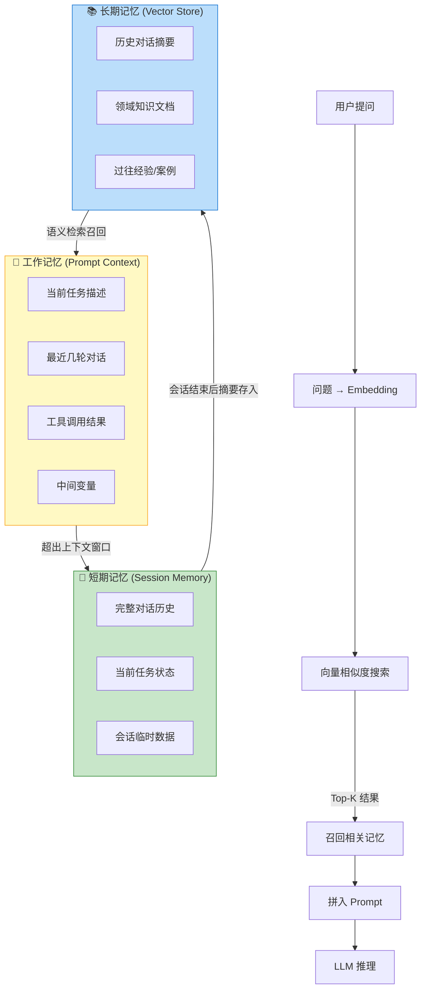
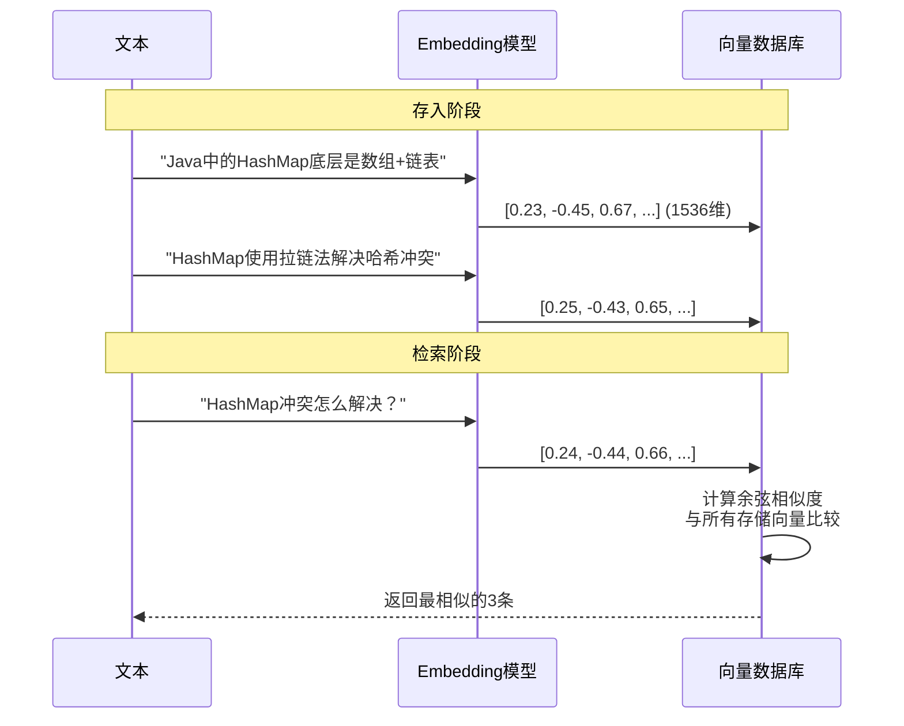
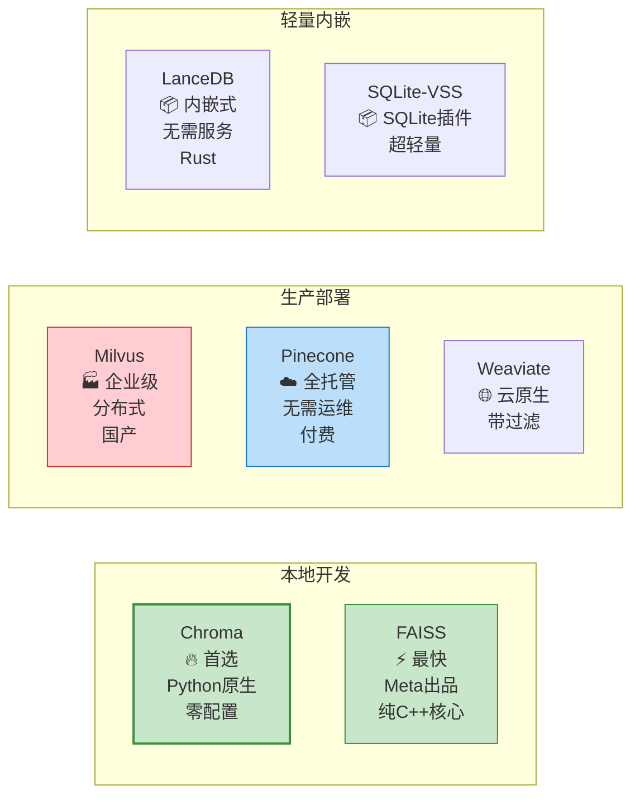

# Agent 记忆系统

> **一句话**:没有记忆的 Agent 只能处理单次对话，加上记忆系统后 Agent 才能"记住"之前做过什么、学到了什么，这是企业级 Agent 和玩具 Demo 的分水岭。

## 核心概念

Agent 的记忆分三层，类比人类：

| 记忆类型 | 类比人类 | 存储位置 | 生命周期 | 典型容量 |
|----------|---------|----------|---------|---------|
| **工作记忆** | 当前正在想的事 | Prompt 中的上下文 | 单次对话 | 几千~几万 token |
| **短期记忆** | 这几天发生的事 | 对话历史/会话管理 | 一个会话周期 | 几万~几十万 token |
| **长期记忆** | 过去的经验和知识 | 向量数据库/知识图谱 | 永久 | 理论上无限 |

### 为什么需要向量数据库？

LLM 只理解文本，不能"像人一样回忆"。但文本可以转换成**高维向量**（Embedding），语义相近的文本在向量空间中距离也近。

```
"今天天气真好"  → [0.12, -0.34, 0.56, ..., 0.78]  (1536维向量)
"阳光明媚"      → [0.11, -0.33, 0.55, ..., 0.77]  ← 距离很近！(语义相似)
"股票跌了"      → [0.89, 0.12, -0.67, ..., 0.01]  ← 距离很远！(语义不同)
```

**核心流程**：
1. 把文档切成小段
2. 每段通过 Embedding 模型转成向量
3. 存入向量数据库
4. 用户提问时，把问题也转成向量
5. 在数据库中找**最近的向量**（语义最相似的段落）
6. 把这些段落作为上下文给 LLM

这就是 **RAG（检索增强生成）** 的基础，详见 `RAG检索增强生成.md`。

## 原理图解

### Agent 记忆系统全貌



### Embedding 向量化原理



### 向量数据库选型对比



| 数据库 | 类型 | 性能 | 易用性 | 成本 | 推荐场景 |
|--------|------|------|--------|------|----------|
| **Chroma** | 本地 | 中 | ⭐⭐⭐⭐⭐ | 免费 | **学习/原型首选** |
| **FAISS** | 本地库 | ⭐⭐⭐⭐⭐ | ⭐⭐⭐ | 免费 | 大规模离线检索 |
| **Milvus** | 分布式 | ⭐⭐⭐⭐⭐ | ⭐⭐⭐ | 自建服务器 | 企业级生产 |
| **Pinecone** | 云服务 | ⭐⭐⭐⭐ | ⭐⭐⭐⭐⭐ | 按量付费 | 不想运维 |
| **LanceDB** | 内嵌 | ⭐⭐⭐⭐ | ⭐⭐⭐⭐ | 免费 | 移动端/嵌入式 |
| **Qdrant** | 分布式 | ⭐⭐⭐⭐ | ⭐⭐⭐⭐ | 免费/Rust | 对性能和过滤有要求 |

## 代码实例

### Chroma 入门（最推荐的本地向量数据库）

```python
"""
Chroma 向量数据库完整入门
安装: pip install chromadb
"""

import chromadb
from chromadb.utils import embedding_functions

# ========== 1. 创建客户端 ==========
# 持久化存储（数据保存到磁盘，下次启动还在）
client = chromadb.PersistentClient(path="./my_chroma_db")

# 或内存模式（重启就没了，适合测试）
# client = chromadb.Client()

# ========== 2. 使用 Embedding 模型 ==========
# 方式A: 使用本地模型（离线可用，推荐学习用）
# 需要先: pip install sentence-transformers
local_ef = embedding_functions.SentenceTransformerEmbeddingFunction(
    model_name="all-MiniLM-L6-v2"  # 轻量英文模型，首次运行自动下载(~80MB)
)

# 方式B: 使用 OpenAI Embedding（效果好，需联网，付费）
# openai_ef = embedding_functions.OpenAIEmbeddingFunction(
#     api_key="your-key",
#     model_name="text-embedding-3-small"
# )

# ========== 3. 创建集合（类似数据库中的表）==========
collection = client.get_or_create_collection(
    name="knowledge_base",
    embedding_function=local_ef
)

# ========== 4. 添加文档 ==========
documents = [
    "HashMap底层是数组+链表/红黑树，初始容量16，负载因子0.75",
    "ConcurrentHashMap使用分段锁，JDK8后改为CAS+synchronized",
    "ArrayList底层是动态数组，默认初始容量10，扩容1.5倍",
    "LinkedList底层是双向链表，随机访问慢O(n)，增删快O(1)",
    "HashSet底层是HashMap，只存Key，Value是固定的PRESENT对象",
]

# 每条文档的ID（唯一标识）
ids = ["doc_1", "doc_2", "doc_3", "doc_4", "doc_5"]

# 元数据（可以加标签，方便后续过滤）
metadatas = [
    {"topic": "HashMap", "type": "数据结构"},
    {"topic": "ConcurrentHashMap", "type": "并发"},
    {"topic": "ArrayList", "type": "数据结构"},
    {"topic": "LinkedList", "type": "数据结构"},
    {"topic": "HashSet", "type": "数据结构"},
]

collection.add(
    documents=documents,
    ids=ids,
    metadatas=metadatas
)
print(f"已添加 {collection.count()} 条文档")

# ========== 5. 语义搜索 ==========
results = collection.query(
    query_texts=["哈希冲突怎么解决？"],
    n_results=3  # 返回最相似的3条
)

print("\n搜索结果:")
for i, (doc, distance, metadata) in enumerate(zip(
    results["documents"][0],
    results["distances"][0],
    results["metadatas"][0]
)):
    print(f"\n  [{i+1}] 相似度: {1-distance:.4f}")
    print(f"  主题: {metadata['topic']}")
    print(f"  内容: {doc}")

# 预期输出:
# [1] 相似度: 0.8521
#     主题: HashMap
#     内容: HashMap底层是数组+链表/红黑树，初始容量16，负载因子0.75
# [2] 相似度: 0.7234
#     主题: ConcurrentHashMap
#     内容: ConcurrentHashMap使用分段锁，JDK8后改为CAS+synchronized
# ...

# ========== 6. 带过滤条件搜索 ==========
filtered_results = collection.query(
    query_texts=["数据结构"],
    n_results=2,
    where={"type": "数据结构"}  # 只在"数据结构"类型中搜索
)

# ========== 7. 删除和更新 ==========
collection.delete(ids=["doc_5"])  # 删除

collection.upsert(  # 更新（有则更新，无则插入）
    ids=["doc_1"],
    documents=["HashMap: 数组+链表+红黑树，JDK8引入红黑树优化链表过长问题"]
)
```

### 在 Agent 中集成长期记忆

```python
"""
Agent 长期记忆集成示例
场景: Agent 能记住之前对话中学到的信息
"""

import chromadb
from chromadb.utils import embedding_functions

class AgentMemory:
    """Agent 的记忆管理器"""

    def __init__(self, persist_dir="./agent_memory"):
        self.client = chromadb.PersistentClient(path=persist_dir)
        ef = embedding_functions.SentenceTransformerEmbeddingFunction(
            model_name="all-MiniLM-L6-v2"
        )

        # 两个集合: 对话记忆 + 知识记忆
        self.chat_memory = self.client.get_or_create_collection(
            name="chat_history", embedding_function=ef
        )
        self.knowledge = self.client.get_or_create_collection(
            name="knowledge", embedding_function=ef
        )

    def save_chat(self, user_msg: str, agent_reply: str, session_id: str):
        """保存对话到短期记忆"""
        self.chat_memory.add(
            documents=[
                f"用户: {user_msg}",
                f"助手: {agent_reply}"
            ],
            ids=[f"{session_id}_u_{user_msg[:20]}", f"{session_id}_a_{agent_reply[:20]}"],
            metadatas=[{"session": session_id, "role": "user"},
                       {"session": session_id, "role": "assistant"}]
        )

    def save_knowledge(self, fact: str, source: str):
        """保存学到的新知识到长期记忆"""
        import hashlib
        fact_id = hashlib.md5(fact.encode()).hexdigest()[:12]
        self.knowledge.upsert(
            documents=[fact],
            ids=[fact_id],
            metadatas=[{"source": source}]
        )

    def recall_relevant(self, query: str, n: int = 5) -> str:
        """检索与当前问题相关的历史记忆"""
        results = self.knowledge.query(query_texts=[query], n_results=n)
        if not results["documents"][0]:
            return ""
        return "\n".join(f"- {doc}" for doc in results["documents"][0])


# 使用示例
memory = AgentMemory()

# 对话1中 Agent 学到了用户的信息
memory.save_knowledge("用户是Java后端工程师，正在学习AI Agent开发", "用户自述")

# 对话2中（可能是几天后），Agent 能回忆起来
relevant = memory.recall_relevant("用户的技术背景是什么？")
print(f"召回的记忆: {relevant}")
# 召回的记忆: - 用户是Java后端工程师，正在学习AI Agent开发
```

## 常见误区 / 面试点

- **误区1**: "向量数据库就是搜索引擎" —— 不完全是。传统搜索靠关键词匹配（BM25），向量搜索靠**语义相似度**。"苹果手机"搜"iPhone"关键词搜不到，但向量搜索能找到。
- **误区2**: "一定要用专门的向量数据库" —— 数据量小（<1万条）时，Chroma 甚至直接用 NumPy 暴力搜索就够了。不要过度设计。
- **误区3**: "Embedding 模型越大越好" —— 错。小模型（如 all-MiniLM-L6-v2，80MB）在大多数任务上够用。大模型（如 text-embedding-3-large）在语义细微差别上更准，但成本高10倍。按需选择。
- **面试追问方向**:
  - "向量相似度用什么度量？" → 余弦相似度（最常用）、欧氏距离、点积
  - "如何处理文档更新？" → upsert（有则更新无则插入）
  - "向量数据库的性能瓶颈在哪？" → 大规模时的 ANN（近似最近邻）算法选择、内存占用
  - "Chroma 和 FAISS 的区别？" → Chroma 是完整数据库（有增删改查），FAISS 是纯搜索库（需要自己管存储）

## 参考来源

- Chroma 官方文档: https://docs.trychroma.com
- FAISS GitHub: https://github.com/facebookresearch/faiss
- Milvus 文档: https://milvus.io/docs
- 相关笔记: `RAG检索增强生成.md`

## 实战：结构化状态持久化

> 来自 AI 小说家项目 — 1800 行 PyQt5 桌面端。

### 树形 vs 平铺表设计

```sql
-- ❌ 树形（自引用）：查询递归、孤儿数据难清理
CREATE TABLE nodes (id, parent_id, level, title);

-- ✅ 平铺：固定层级直接用列
CREATE TABLE nodes (
  volume_title TEXT, chapter_title TEXT,
  section_order INTEGER, section_title TEXT,
  sort_order INTEGER  -- 全局排序
);
```

**原则**：只有真正需要无限深度的场景（文件夹、组织架构）才用自引用表。固定三层（卷→章→节）直接用平铺列。

### 排序铁律：永远用整数 sort_order

| 排序方式 | 典型问题 |
|---------|------|
| 字母序 | "第10章"排在"第2章"前面 |
| ID 序 | 插入顺序 ≠ 逻辑顺序 |
| 时间戳 | 并发写入可能同值 |
| **sort_order** | **零歧义，一条 ORDER BY 搞定** |

**教训**：为排序迭代了 5 次，最终发现加一列 `sort_order INTEGER` 是最简单的解法。成本是一次 ALTER TABLE，不加的成本是 5 次 Debug。

---

## 2026 年更新：专业记忆层工具崛起

### 不用自己造轮子了

以前做记忆系统只能自己拿 Chroma 搭。2026 年有了专业工具：

| 工具 | 定位 | 一句话 |
|------|------|--------|
| **Mem0** | 即插即用记忆层 | `pip install mem0`，3 行代码加记忆 |
| **Letta (MemGPT)** | OS 风格三层记忆 | Agent 自己管理 Core/RAM/Archival |
| **Zep** | 双时序知识图谱 | 需要时效性保证的企业场景 |
| **agentmemory** | 编程 Agent 专用 | MCP 服务器，自动捕获上下文 |

### Mem0 快速上手

```python
# pip install mem0ai
from mem0 import Memory

m = Memory()
m.add("用户是Java后端工程师，喜欢简短回答", user_id="user_1")
results = m.search("用户的技术背景？", user_id="user_1")
# → [{"memory": "用户是Java后端工程师"}, ...]
```

### 2026 年记忆评估四维标准

| 维度 | 测什么 | 关键发现 |
|------|--------|---------|
| **Recall** | 能否找到正确事实 | Mem0 49% vs agentmemory 95% (LongMemEval) |
| **Freshness** | 更新后是否用最新版本 | 大部分工具不保证 |
| **Contradiction** | 矛盾事实选哪个 | 仅 Minta 工具明确处理 |
| **Forgetting** | 过期信息真删了没 | 跨租户泄露是 P0 风险 |

> 📍 完整更新见 `../05-实战与运维/2026-AI技术前沿与生态更新.md`
