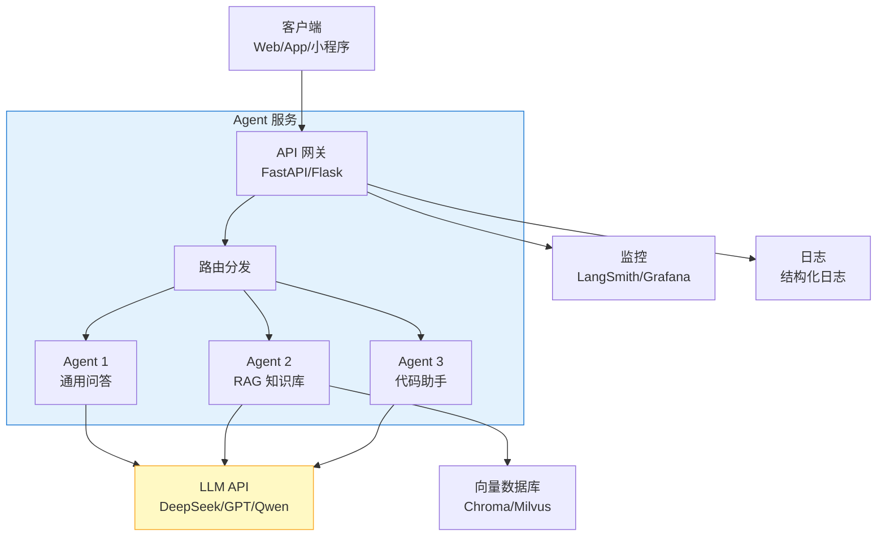

# Agent 部署与运维

> **一句话**:Agent 不只是跑在本地的 demo，上线后才是真正的考验——API 服务化、Docker 部署、监控追踪、成本控制，每一项都是生产环境必须面对的问题。

## 核心概念

### 部署架构全景



### 成本构成

| 成本项 | 说明 | 优化策略 |
|--------|------|---------|
| **LLM API 调用** | 按 token 计费 | 缓存、小模型分流、Prompt 精简 |
| **向量数据库** | 存储 + 查询 | 本地 Chroma(免费)、按量付费云服务 |
| **Embedding** | 文档向量化 | 批量处理、缓存已向量化文档 |
| **服务器** | Agent 服务运行 | Docker 容器化、自动扩缩 |
| **监控平台** | 可观测性 | LangSmith(免费额度)、自建 |

## 代码实例

### 用 FastAPI 部署 Agent 服务

```python
"""
Agent API 服务 - FastAPI
安装: pip install fastapi uvicorn langchain langchain-openai
"""

from fastapi import FastAPI, HTTPException
from fastapi.responses import StreamingResponse
from pydantic import BaseModel
from langchain_openai import ChatOpenAI
from langchain_core.messages import HumanMessage
import json

app = FastAPI(title="Agent API", version="1.0")

llm = ChatOpenAI(
    model="deepseek-chat",
    api_key="your-key",
    base_url="https://api.deepseek.com",
    temperature=0
)

# ========== 请求/响应模型 ==========
class ChatRequest(BaseModel):
    message: str
    system_prompt: str = "你是一个有用的助手"
    stream: bool = False

class ChatResponse(BaseModel):
    response: str
    tokens_used: int = 0
    model: str = "deepseek-chat"

# ========== 普通调用 ==========
@app.post("/chat", response_model=ChatResponse)
async def chat(req: ChatRequest):
    messages = [
        {"role": "system", "content": req.system_prompt},
        {"role": "user", "content": req.message}
    ]
    response = llm.invoke(messages)
    return ChatResponse(response=response.content)

# ========== 流式调用（SSE）==========
@app.post("/chat/stream")
async def chat_stream(req: ChatRequest):
    messages = [
        {"role": "system", "content": req.system_prompt},
        {"role": "user", "content": req.message}
    ]

    async def event_generator():
        async for chunk in llm.astream(messages):
            if chunk.content:
                yield f"data: {json.dumps({'content': chunk.content})}\n\n"
        yield "data: [DONE]\n\n"

    return StreamingResponse(event_generator(), media_type="text/event-stream")

# ========== Dockerfile ==========
# Docker 部署配置
DOCKERFILE = """
FROM python:3.11-slim
WORKDIR /app
COPY requirements.txt .
RUN pip install --no-cache-dir -r requirements.txt
COPY . .
EXPOSE 8000
CMD ["uvicorn", "main:app", "--host", "0.0.0.0", "--port", "8000"]
"""

if __name__ == "__main__":
    import uvicorn
    uvicorn.run(app, host="0.0.0.0", port=8000)
```

### Docker Compose 完整部署（Agent + 向量数据库 + 前端）

```yaml
# docker-compose.yml
version: '3.8'

services:
  agent-api:
    build: ./agent-service
    ports:
      - "8000:8000"
    environment:
      - LLM_API_KEY=your-key
      - LLM_BASE_URL=https://api.deepseek.com
      - CHROMA_PERSIST_DIR=/app/data/chroma
    volumes:
      - ./data:/app/data
    depends_on:
      - chroma

  chroma:
    image: chromadb/chroma:latest
    ports:
      - "8001:8000"
    volumes:
      - chroma-data:/chroma/chroma
    environment:
      - IS_PERSISTENT=TRUE
      - ANONYMIZED_TELEMETRY=FALSE

  web:
    image: nginx:alpine
    ports:
      - "80:80"
    volumes:
      - ./frontend:/usr/share/nginx/html

volumes:
  chroma-data:
```

## 常见误区 / 面试点

- **误区1**: "Agent 服务和普通 API 一样部署" —— 不完全是。Agent 服务的**延迟波动很大**（LLM 响应时间 0.5s-30s 不等），需要设置合理的超时和重试策略。
- **误区2**: "上线就不用管 Prompt 了" —— 错。上线后要持续监控输出质量，根据 bad case 调整 Prompt。这是 Agent 运维的核心工作。
- **面试追问方向**:
  - "如何优化 LLM 调用成本？" → 缓存重复查询、简单问题用小模型、Prompt 精简、批量处理
  - "Agent 服务的 SLA 怎么定？" → 考虑 LLM 的不确定性，一般用 P90 延迟而非平均值

## 参考来源

- FastAPI 文档: https://fastapi.tiangolo.com
- Docker 部署: https://docs.docker.com
- LangSmith 监控: https://smith.langchain.com
- 相关笔记: `LangChain实战.md`
