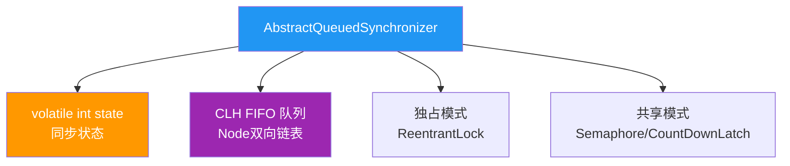
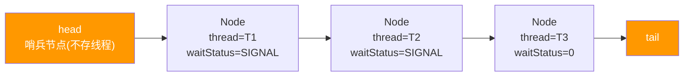
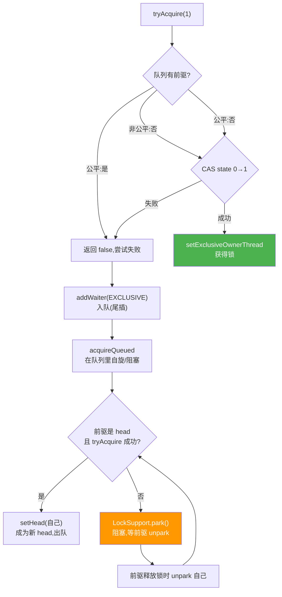
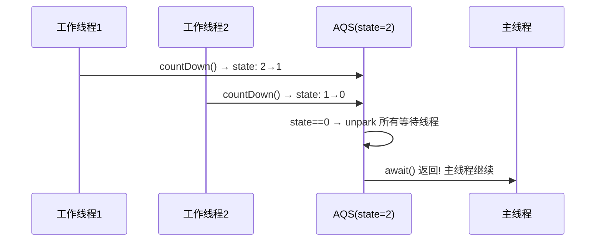

# AQS 抽象队列同步器

> **一句话**:AQS 是 JUC 锁和同步器的**地基** —— ReentrantLock、Semaphore、CountDownLatch、ReentrantReadWriteLock 全都基于它实现。

## 核心概念

### AQS 核心思想

AQS 维护一个 **volatile int state**(同步状态)和一个 **CLH 双向队列**(等待线程队列)。

- `state > 0`:表示锁被占用(可重入则 state 递增)
- `state = 0`:表示锁空闲
- 线程抢锁失败 → 进入队列排队 → 前驱释放锁时唤醒后继



### 独占 vs 共享

| 模式 | 含义 | 典型实现 |
|------|------|---------|
| **独占(Exclusive)** | 同一时刻只有一个线程持有 | ReentrantLock |
| **共享(Shared)** | 多个线程可同时持有 | Semaphore、CountDownLatch、ReentrantReadWriteLock 的读锁 |

### CLH 队列结构



> head 是哨兵(不代表任何线程),真正的第一个等待线程在 head.next。释放锁时 head 出队,head.next 成新 head。

## 原理图解

### ReentrantLock 的公平锁获取流程(基于 AQS)



### CountDownLatch 的共享获取(基于 AQS)



> `CountDownLatch(2)`:初始 state=2,每次 countDown() state-1,state 到 0 时唤醒所有 await 的线程。

## 代码实例

### 实例 1:CountDownLatch —— 等多个任务完成

```java
import java.util.concurrent.CountDownLatch;

public class LatchDemo {
    public static void main(String[] args) throws Exception {
        CountDownLatch latch = new CountDownLatch(3);  // 3个任务

        for (int i = 0; i < 3; i++) {
            new Thread(() -> {
                try {
                    Thread.sleep((long)(Math.random() * 2000));
                    System.out.println("任务" + Thread.currentThread().getId() + " 完成");
                } catch (InterruptedException e) {} finally {
                    latch.countDown();  // 任务完成,计数-1
                }
            }).start();
        }

        System.out.println("主线程等待3个任务...");
        latch.await();  // 阻塞直到 count=0
        System.out.println("全部完成,主线程继续!");
    }
}
// 输出:
// 主线程等待3个任务...
// 任务14 完成
// 任务15 完成
// 任务16 完成
// 全部完成,主线程继续!
```

### 实例 2:Semaphore —— 限流

```java
import java.util.concurrent.Semaphore;

public class SemaphoreDemo {
    public static void main(String[] args) {
        Semaphore sem = new Semaphore(3);  // 同时最多3个线程进入
        for (int i = 1; i <= 10; i++) {
            new Thread(() -> {
                try {
                    sem.acquire();  // 获取许可(如果已满,排队等待)
                    System.out.println("线程" + Thread.currentThread().getId() + " 进入(当前可用:" + sem.availablePermits() + ")");
                    Thread.sleep(2000);  // 模拟业务
                } catch (InterruptedException e) {} finally {
                    sem.release();  // 释放许可
                    System.out.println("线程" + Thread.currentThread().getId() + " 退出");
                }
            }).start();
        }
    }
}
// 同时最多3个线程在运行,其余排队
```

## 常见误区 / 面试点

- **误区:AQS 是锁** → 不是。AQS 是同步器框架,ReentrantLock 是锁(用 AQS 实现的)。AQS 提供了 `tryAcquire/tryRelease` 等模板方法,子类实现具体语义。
- **面试追问:AQS 的 state 在不同实现里含义一样吗?** → 不一样。ReentrantLock 里 state=重入次数;Semaphore 里 state=许可数量;CountDownLatch 里 state=剩余计数;ReentrantReadWriteLock 里 state 高 16 位=读锁次数,低 16 位=写锁次数。
- **面试追问:为什么 AQS 用 CLH 变体而不是原始 CLH?** → 原始 CLH 每个节点只依赖前驱的标志位,不适合用于独占锁的"唤醒后继"。AQS 的变体让每个节点显式记录前驱/后继,支持 unpark 精确唤醒。
- **面试追问:公平锁和非公平锁的 AQS 区别?** → 公平锁 `tryAcquire` 先检查队列有没有人在等(`hasQueuedPredecessors()`),有就直接失败排队;非公平锁上来就 CAS 抢,抢不到再排队。

## 参考来源

- JavaGuide: `docs/java/concurrent/java-lock.md`(含 AQS 章节)
- JavaGuide: `docs/java/concurrent/java-concurrent-collections.md`
- 相关: [synchronized与Lock](synchronized与Lock.md)、[线程池](线程池.md)(ThreadPoolExecutor 内部用 AQS)
