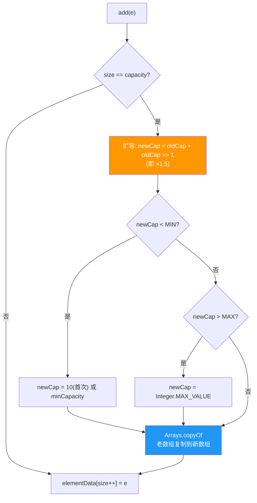
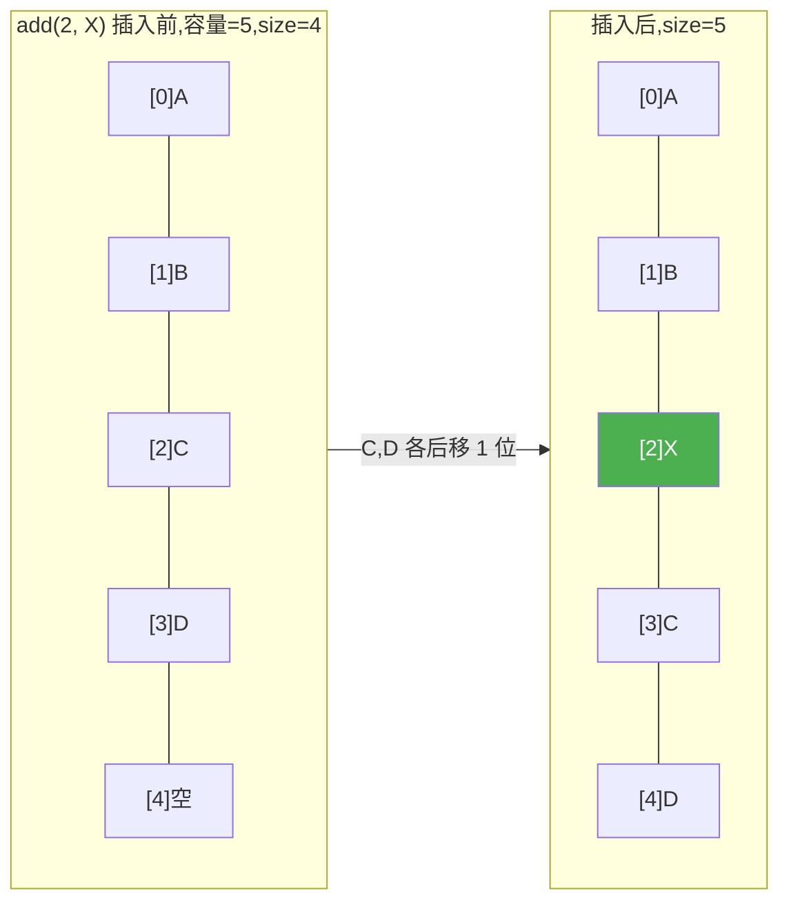

# ArrayList 源码与原理

> **一句话**:ArrayList 底层是动态数组,随机访问 O(1),尾部增删 O(1),中间插入/删除 O(n)(需移动元素)。是 Java 最常用的 List 实现。

## 核心概念

### 底层结构

```java
// JDK 源码核心字段
transient Object[] elementData;  // 存数据的数组
int size;                        // 实际元素个数(不是数组长度)
```

- **默认初始容量**:10(第一次 add 时才分配,默认是空数组 `{}`)
- **扩容**:当 `size == elementData.length` 时,扩容为 `旧容量 × 1.5`(右移 1 位)
- **最大容量**:`Integer.MAX_VALUE - 8`(数组有 JVM 元数据开销)

### 关键操作的复杂度

| 操作 | 时间复杂度 | 原因 |
|------|-----------|------|
| `get(i)` 随机访问 | O(1) | 数组下标直接定位 |
| `add(e)` 尾部添加 | 均摊 O(1) | 偶尔扩容 O(n),均摊 O(1) |
| `add(i, e)` 中间插入 | O(n) | i 后面的元素全部后移 |
| `remove(i)` 删除 | O(n) | i 后面的元素全部前移 |
| `set(i, e)` 修改 | O(1) | 数组下标直接定位 |
| `contains(e)` 查找 | O(n) | 逐个遍历 |

### ArrayList vs LinkedList

| 维度 | ArrayList | LinkedList |
|------|-----------|------------|
| 底层 | 数组 | 双向链表 |
| 随机访问 get | **O(1)** | O(n) |
| 中间插入 | O(n)(移元素) | **O(1)**(改指针) |
| 尾部添加 | 均摊 O(1) | O(1) |
| 内存占用 | 紧凑(连续内存) | 穿插(每节点额外 prev/next 指针) |
| CPU 缓存友好 | **好**(连续内存命中率高) | 差(节点分散) |

> **实测:ArrayList 在大多数场景下都比 LinkedList 快**(包括中间插入),因为 CPU 缓存对连续内存友好。LinkedList 的理论 O(1) 插入在实际中常被 CPU 缓存 miss 拖慢。除非频繁在**头尾**操作,否则优先用 ArrayList。

## 原理图解

### 扩容过程



### 中间插入的元素移动



## 代码实例

### 实例 1:验证扩容

```java
import java.lang.reflect.Field;
import java.util.ArrayList;

public class ArrayListDemo {
    public static void main(String[] args) throws Exception {
        ArrayList<Integer> list = new ArrayList<>();  // 默认容量0,空数组

        // 反射查看内部数组长度
        Field data = ArrayList.class.getDeclaredField("elementData");
        data.setAccessible(true);

        for (int i = 1; i <= 15; i++) {
            list.add(i);
            if (i <= 12 || i == 15) {
                int cap = ((Object[]) data.get(list)).length;
                System.out.println("添加第" + i + "个元素, 内部数组容量=" + cap);
            }
        }
    }
}
```

**输出**:
```
添加第1个元素, 内部数组容量=10    ← 首次 add 触发分配,默认 10
添加第2个元素, 内部数组容量=10
...
添加第11个元素, 内部数组容量=15   ← 10 不够,扩容 10×1.5=15
添加第12个元素, 内部数组容量=15
添加第15个元素, 内部数组容量=22   ← 15 不够,扩容 15×1.5=22(取整)
```

### 实例 2:ArrayList 的删除陷阱(并发修改)

```java
ArrayList<Integer> list = new ArrayList<>(Arrays.asList(1, 2, 3, 4, 5));

// ❌ foreach 删除 → ConcurrentModificationException
for (Integer i : list) {
    if (i == 3) list.remove(i);  // 迭代器检查 modCount,抛异常
}

// ✅ 用 Iterator 删除
Iterator<Integer> it = list.iterator();
while (it.hasNext()) {
    if (it.next() == 3) it.remove();  // 调迭代器的 remove,OK
}

// ✅ 倒序 for 删除
for (int i = list.size() - 1; i >= 0; i--) {
    if (list.get(i) == 3) list.remove(i);  // 从后往前删,不影响未遍历的下标
}
```

> **fail-fast**:ArrayList 的迭代器在遍历时记录 expectedModCount,每次 next() 检查是否和 list.modCount 一致,不一致就抛 `ConcurrentModificationException`。这是**快速失败**,不是线程安全保证。

## 常见误区 / 面试点

- **误区:ArrayList 初始化就是容量 10** → 不是。`new ArrayList<>()` 内部是空数组 `{}`,**第一次 add 时**才分配容量 10。想预分配用 `new ArrayList<>(100)` 避免多次扩容。
- **误区:LinkedList 中间插入比 ArrayList 快** → 理论 O(1) vs O(n),但实际 CPU 缓存让 ArrayList 的连续内存复制很快,LinkedList 反而慢。除非在**已知节点**位置插入(已有 Node 引用),否则 LinkedList 没优势。
- **面试追问:ArrayList 线程安全吗?** → 不安全。多线程用 `CopyOnWriteArrayList`(读多写少)或 `Collections.synchronizedList`。`CopyOnWriteArrayList` 写时复制整个数组,读无锁,适合读远多于写的场景。
- **面试追问:subList 返回的视图修改会影响原 List 吗?** → 会!`subList` 返回的是原 List 的**视图**(共享底层数组),修改子列表会影响原列表,反之亦然。

## 参考来源

- JavaGuide: `docs/java/collection/arraylist-source-code.md`
- JavaGuide: `docs/java/collection/java-collection-precautions-for-use.md`
