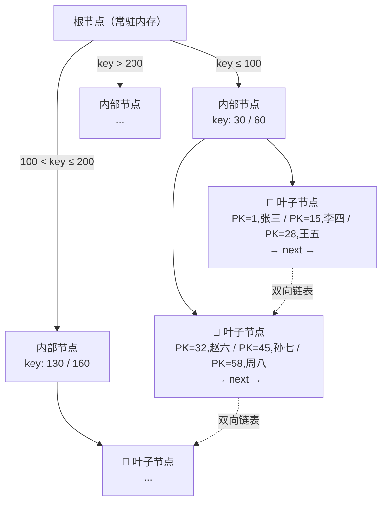

# B+Tree 索引原理详解

> **一句话**：MySQL 选 B+Tree 不选二叉树/Hash/B-Tree——因为它「矮胖」（3-4 层存千万级）+「叶子链表」（范围查询极快）。

> 📌 关联阅读：[索引(MySQL)](索引.md) · [红黑树原理详解](红黑树原理详解.md) · [MySQL 事务与锁](MySQL%20事务与锁.md)

## 结构图解



## B+Tree vs 其他数据结构

| 数据结构 | 致命缺陷 | 为什么不用 |
|---------|---------|-----------|
| **Hash** | ❌ 不支持范围查询 `BETWEEN`、`>` | MySQL 常用范围查询 |
| **二叉搜索树** | ❌ 退化链表 O(n)，树高几十层 | 树太高 = 磁盘 IO 多 |
| **B-Tree** | ⚠️ 非叶子节点存数据，扇出小 | 同样高度存的 key 更少 |
| **红黑树** | ❌ 二叉树，树高 log₂N 太大 | 100 万数据高度≈20，20 次 IO |
| **跳表** | ⚠️ 内存结构，磁盘 IO 不友好 | Redis ZSet 用，MySQL 不用 |
| **B+Tree** | ✅ | **矮胖 + 叶子链表 = 完美** |

## 为什么 B+Tree 树很矮

```
B+Tree 非叶子节点只存 key，不存数据 → 一个 16KB 页可以存几百个 key
  3 层 B+Tree ≈ 几百²² ≈ 千万级数据
  3 次磁盘 IO 搞定！

MySQL InnoDB 一页 = 16KB
  一个 key(8B) + 子节点指针(6B) = 14B
  一页能存 ≈ 16KB/14B ≈ 1170 个 key
  3 层：1170² = 130万（最底层叶子存数据，每页 16KB ÷ 行大小）
  实际 3-4 层可以存千万到亿级
```

## 聚簇索引 vs 二级索引


- 聚簇索引：一张表只有一个，叶子节点存**完整行**
- 二级索引：叶子存**主键值**，查到主键后还要回表
- **覆盖索引**：查询的列全在索引里 → 不查表，Extra=Using index

## 为什么推荐自增主键

```
UUID 主键：随机插入 → 页分裂频繁 → 索引碎片 → 慢
自增主键：顺序追加 → 只在最后插入 → 页分裂最少 → 快

页分裂：一个 16KB 的页满了，要拆成两页，数据搬一半
```

## 面试追问

**Q: B+Tree 为什么叶子节点要链表？**
A: 范围查询——`WHERE id BETWEEN 100 AND 200` 定位到 100 后顺着链表走就行了，不用回到上层节点。

**Q: 为什么不用 B-Tree 非要 B+Tree？**
A: B-Tree 的节点也存数据，同等高度下存的 key 更少 → 树更高 → IO 更多。B+Tree 只有叶子存数据，中间节点全用来做索引。
