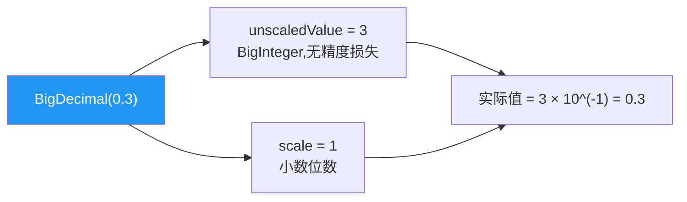

# BigDecimal 精度运算

> **一句话**:float/double 有精度丢失问题,涉及金额、精确计算的场景必须用 BigDecimal。

## 核心概念

### 为什么 float/double 不精确

计算机用二进制浮点数(IEEE 754)存小数,很多十进制小数无法精确表示(如 0.1 在二进制是无限循环)。导致运算出现匪夷所思的结果:

```java
System.out.println(0.1 + 0.2);  // 0.30000000000000004  不是 0.3!
System.out.println(1.0 - 0.9);  // 0.09999999999999998  不是 0.1!
```

金额计算如果用 double,`0.1 + 0.2 ≠ 0.3`,累计几万笔后偏差会很大。**金融场景必须用 BigDecimal**。

### BigDecimal 核心用法

```java
// ✅ 正确:用字符串构造
BigDecimal a = new BigDecimal("0.1");
BigDecimal b = new BigDecimal("0.2");
System.out.println(a.add(b));  // 0.3  精确!

// ❌ 错误:用 double 构造(已经丢失精度了)
BigDecimal c = new BigDecimal(0.1);   // 0.1000000000000000055511151231257827021181583404541015625
BigDecimal d = BigDecimal.valueOf(0.1);  // ✅ valueOf 用 Double.toString,精度OK
```

| 运算 | 方法 | 说明 |
|------|------|------|
| 加 | `add()` | |
| 减 | `subtract()` | |
| 乘 | `multiply()` | |
| 除 | `divide(除数, 精度位数, 舍入模式)` | **必须指定精度和舍入模式,否则可能 ArithmeticException** |

### 八种舍入模式(常用 3 种)

| 模式 | 含义 | 场景 |
|------|------|------|
| `HALF_UP`(四舍五入) | ≥0.5 进位 | **金额计算首选** |
| `DOWN`(直接截断) | 丢弃多余位 | 不会多付钱 |
| `CEILING`(向正无穷) | 向大取整 | 优惠分摊(多让利) |

## 原理图解

### BigDecimal 的内部结构



> BigDecimal 内部存一个 BigInteger(去掉小数点的整数)和一个 scale(小数位数),运算全程用整数运算,不丢失精度。

## 代码实例

### 实例:金额计算最佳实践

```java
import java.math.BigDecimal;
import java.math.RoundingMode;

public class MoneyDemo {
    public static void main(String[] args) {
        BigDecimal price = new BigDecimal("19.99");
        BigDecimal quantity = new BigDecimal("3");
        BigDecimal discount = new BigDecimal("0.85");

        // 1. 乘法:单价 × 数量
        BigDecimal subtotal = price.multiply(quantity);
        System.out.println("小计: " + subtotal);  // 59.97

        // 2. 打折
        BigDecimal discounted = subtotal.multiply(discount);
        System.out.println("折后: " + discounted.setScale(2, RoundingMode.HALF_UP));  // 50.97

        // 3. 除法:必须指定精度和舍入模式!
        BigDecimal avg = subtotal.divide(quantity, 2, RoundingMode.HALF_UP);
        System.out.println("均价: " + avg);  // 19.99

        // 4. 比较:千万不要用 equals! scale 不同就 false
        BigDecimal a = new BigDecimal("1.0");
        BigDecimal b = new BigDecimal("1.00");
        System.out.println(a.equals(b));      // false! scale 不同(1 vs 2)
        System.out.println(a.compareTo(b));  // 0(相等,只比数值不看 scale)  ← 用这个
    }
}
```

### 比较 equals vs compareTo

```java
new BigDecimal("1.0").equals(new BigDecimal("1.00"));      // false
new BigDecimal("1.0").compareTo(new BigDecimal("1.00"));    // 0 (相等)
```

`equals` 要求值和 scale 都相同;`compareTo` 只比较数值。**金额比较永远用 compareTo**。

## 常见误区 / 面试点

- **误区:new BigDecimal(0.1) 能解决精度问题** → 不能,0.1 这个 double 本身已经丢失精度。必须用字符串 `new BigDecimal("0.1")` 或 `BigDecimal.valueOf(0.1)`。
- **误区:divide 结果不指定精度** → 除不尽时抛 `ArithmeticException`。必须 `divide(x, 2, RoundingMode.HALF_UP)`。
- **面试追问:数据库里的 DECIMAL 对应 Java 什么?** → MyBatis 映射为 BigDecimal。`DECIMAL(10,2)` 表示最多 10 位数字、2 位小数,适合金额字段。
- **面试追问:为什么金额用 BigDecimal 而不是 long(存分)?** → 两种方案都行。long 存分(1 元 = 100 分)更轻量,但要注意不要用 float/double 乘除转换。BigDecimal 更直观但占更多内存。团队约定一致即可。

## 参考来源

- JavaGuide: `docs/java/basis/bigdecimal.md`
