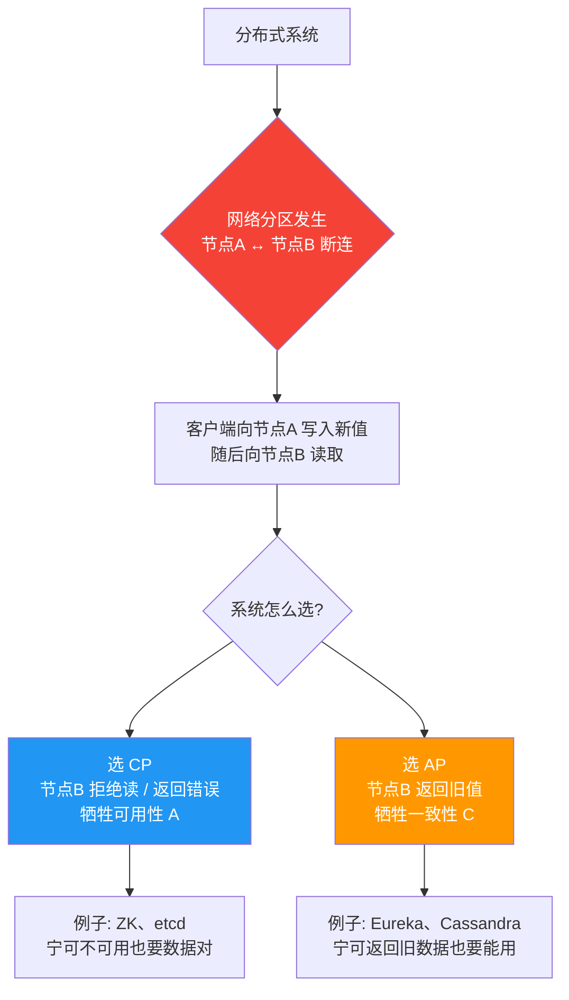
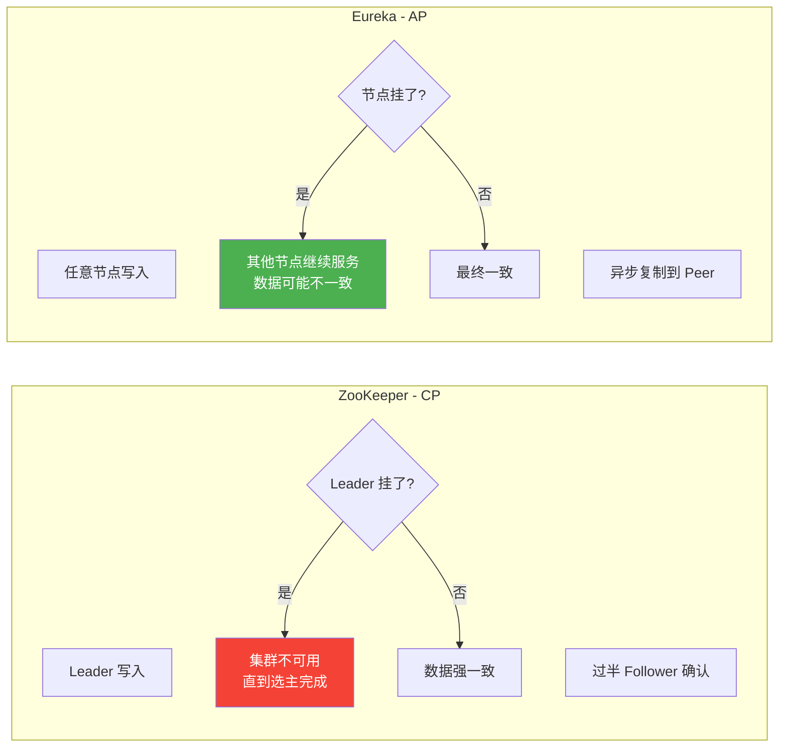
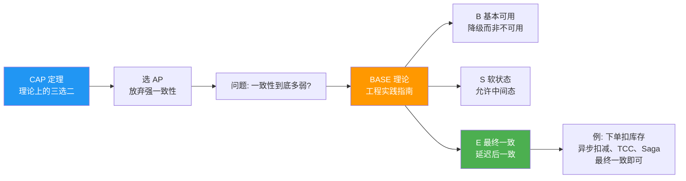

# CAP 定理与 BASE 理论

> **一句话**:分布式系统在一致性(C)、可用性(A)、分区容错(P)三选二中只能满足两个;CAP 太严格,实际多用 BASE 在一致性和可用性间权衡。

## 核心概念

### CAP 定理

由 Eric Brewer 提出,2002 年 Gilbert & Lynch 证明。分布式系统在**网络分区发生时**,只能同时满足以下三者中的两个:

| 属性 | 全称 | 含义 |
|------|------|------|
| **C** | Consistency 一致性 | 所有节点同一时刻看到的数据相同(读到最新写) |
| **A** | Availability 可用性 | 每个请求都能收到**非错误**响应(不保证是最新数据) |
| **P** | Partition tolerance 分区容错 | 网络分区(节点间通信失败)时系统仍能运作 |

**关键理解**:P 在分布式系统中**几乎不可选** —— 网络分区是客观存在的(网线断了、交换机故障),你只能选择 C 还是 A。所以实际是 **CP 还是 AP** 的二选一。

> 注意:CAP 的 C 是**强一致性/线性一致性**,不是 ACID 里的 C(事务一致性),也不是最终一致性。三者同名但概念不同,别混。

### 三种选择

| 选择 | 舍弃 | 典型系统 | 适用场景 |
|------|------|---------|---------|
| **CP** | A | ZooKeeper、etcd、HBase、MongoDB(默认) | 配置中心、分布式锁,数据正确性高于一切 |
| **AP** | C | Eureka、Cassandra、DynamoDB | 注册中心、高并发互联网应用,可用性优先 |
| **CA** | P | 单机 MySQL、单机 Redis | 不是分布式,没分区问题 |

> 严格说单机系统谈不上 CAP(没有分区问题),CA 只在理论中存在。

### BASE 理论

CAP 中选 AP 后,一致性被牺牲到什么程度?BASE 给了答案 —— **eBay 架构师 Dan Pritchett** 提出,是大规模互联网系统的实践总结:

- **B**asically **A**vailable(基本可用):允许损失部分可用性(响应时间变长、降级服务),但系统核心仍可用。
- **S**oft state(软状态):允许存在中间状态(数据正在同步中),不要求时刻一致。
- **E**ventually consistent(最终一致性):系统保证**最终**数据一致,但不保证实时一致。

> BASE 是 **AP 的具体落地**。绝大多数互联网业务(电商、社交)都用最终一致性:你发条朋友圈,有的好友晚 1 秒看到,无伤大雅,但不能让整个系统不能用。

### 一致性谱系(从强到弱)

```
强一致性(线性) > 顺序一致性 > 因果一致性 > 读己写 > 单调读 > 最终一致性
```

- **强一致**: ZooKeeper 的 znode 写入后,后续所有读立即看到。代价:性能低。
- **最终一致**: DNS、MySQL 主从异步复制。延迟后一致,但可用性和性能好。

## 原理图解

### CAP 三选二(分区发生时的抉择)



### CAP 在注册中心上的真实差异



> 这就是为什么 **Spring Cloud Netflix 用 Eureka 而不是 ZooKeeper 做服务注册中心** —— 服务发现要的是可用性(发现不到服务比系统崩溃严重得多),临时不一致能接受。

### BASE 与 CAP 的关系



## 代码实例

### 实例:不同一致性下的注册中心查询(伪代码对比)

```java
// 场景:服务注册中心。某服务实例 Node3 宕机了,
// 注册中心如何处理对 Node3 的查询?

// ===== CP 风格(如 ZooKeeper):强一致,但可能不可用 =====
public class CpRegistry {
    // 写入需要过半节点确认,期间对外不可读
    public void register(ServiceInstance inst) {
        // 等待 Leader + 过半 Follower 同步
        // 网络分区时少数派分区直接不可用
        quorumWrite(inst);  // 可能超时失败
    }
    public ServiceInstance get(String name) {
        // 强制返回最新一致的数据;如果正在同步/选主,抛异常或阻塞
        return readWithSync();  // 可能抛 ConnectionLoss
    }
}

// ===== AP 风格(如 Eureka):高可用,数据可能旧 =====
public class ApRegistry {
    public void register(ServiceInstance inst) {
        // 写本地 + 异步复制,立即成功
        localWrite(inst);
        asyncReplicate(inst);  // 不等待,立即返回
    }
    public ServiceInstance get(String name) {
        // 直接返回本地数据,可能是过期的;但有界(几秒内会同步)
        ServiceInstance cached = localCache.get(name);
        return cached;  // 可能返回已下线的实例(旧数据)
    }
}
```

### 实例:客户端容错配合(实战)

```java
// 注册中心是 AP(可能返回已死实例),客户端必须自己容错
public class ServiceConsumer {
    public Response callService(String serviceName) {
        List<ServiceInstance> instances = registry.get(serviceName);  // 可能含死实例

        // 轮询 + 重试 + 熔断,容忍个别实例不可用
        for (ServiceInstance inst : instances) {
            try {
                return httpClient.call(inst.getAddress(), timeout);
            } catch (Exception e) {
                log.warn("调用 {} 失败,尝试下一个", inst);
                // 继续下一个
            }
        }
        throw new ServiceUnavailableException("全部实例不可用");
    }
}
```

> **这就是 BASE「基本可用」的体现**:注册中心可能短暂返回旧数据,但配合客户端重试/熔断,整体仍可用,不会雪崩。

## 常见误区 / 面试点

- **误区:CAP 是"三选二",平时任选两个** → 错。P 是分布式不可避免的,实际只能 CP 或 AP。CA 只在单机存在。
- **误区:CAP 的 C = 数据库事务的 C(一致性)** → 完全不同。CAP 的 C 是**多副本间的线性一致性**(所有节点读到的数据一样);ACID 的 C 是**事务前后数据约束正确**(如外键、唯一约束)。同名不同义。
- **误区:ZooKeeper 是 CP,所以它不好** → 看场景。配置管理、分布式锁、选主这些场景**数据正确性是第一位的**(锁不能两个客户端同时拿到),CP 是对的。服务发现才更适合 AP。
- **误区:最终一致 = 不一致** → 不。"最终"有明确保证:在**没有新写入**的前提下,经过有限时间后所有副本终将一致。配合 **Read Repair / Anti-Entropy / 版本向量**等机制保证收敛。
- **面试追问:为什么服务注册中心更适合 AP?** → 服务发现的核心需求是"能找到可用实例"。CP 系统分区时少数派不可用,会让大量请求失败;AP 系统即使数据旧一点,配合客户端重试和心跳剔除(默认 90s 没心跳才剔除),仍能对外服务。短暂返回已下线实例,由客户端重试兜底,远比整个注册中心不可用好。
- **面试追问:CAP 可以动态切换吗?** → 可以。现代系统常根据业务和分区情况在 CP/AP 间权衡。如 CockroachDB、Spanner 在网络正常时接近 CA,分区时降级;TCC/Saga 等分布式事务模式是"业务层最终一致性"的体现。

## 参考来源

- JavaGuide: `docs/distributed-system/distributed-process-coordination/`(分布式协调,含 CAP 实践)
- JavaGuide: `docs/distributed-system/protocol/`(一致性协议:Raft、Paxos、Gossip)
- 经典论文: Brewer's CAP Theorem (2000), Gilbert & Lynch 证明 (2002)
- BASE 原文: Dan Pritchett, "BASE: An ACID Alternative" (2008)
