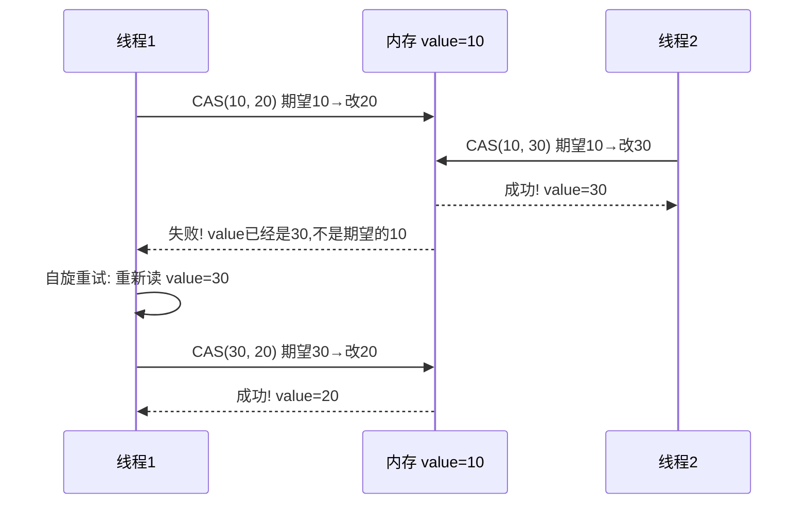
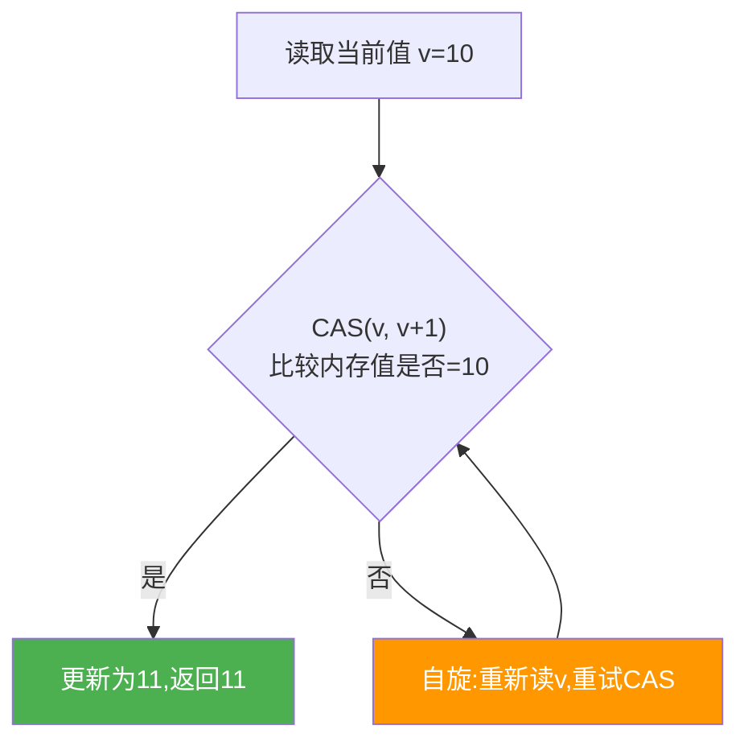

# CAS 与原子类

> **一句话**:CAS(Compare-And-Swap)是乐观锁的底层原理,无锁并发,靠 CPU 指令原子地"比较值→相等才更新"。AtomicInteger 等原子类就是 CAS 的封装。

## 核心概念

### CAS 原理

```
CAS(V, Expected, New)
V: 内存中的值
Expected: 期望值(线程认为现在应该是多少)
New: 要改成的新值

if V == Expected → V = New, 返回 true (成功)
else → 返回 false (失败,说明被其他线程改了)
```

CAS 是**CPU 原子指令**(x86 的 `cmpxchg`),由硬件保证原子性,不需要锁。

### 乐观锁 vs 悲观锁

| | 悲观锁 | 乐观锁(CAS) |
|---|---|---|
| 假设 | 总会冲突,先锁住 | 不会冲突,先试再处理 |
| 实现 | synchronized / Lock | CAS + 自旋重试 |
| 适用 | 高竞争 | **低竞争**(大部分情况) |
| 阻塞 | 线程阻塞/唤醒 | 自旋(空转等) |
| 问题 | 死锁、性能差 | **ABA 问题**、自旋 CPU 浪费 |

### CAS 的三大问题

| 问题 | 说明 | 解决 |
|------|------|------|
| **ABA** | V=A→B→A,CAS 以为没变过,实际变过 | AtomicStampedReference(带版本号) |
| **自旋开销** | 长时间自旋浪费 CPU | 限制自旋次数 / 阻塞 |
| **只能保证单个变量** | 多变量不能一起 CAS | AtomicReference 封装成对象 |

## 原理图解

### CAS 执行流程



### AtomicInteger 的 incrementAndGet



## 代码实例

### 实例 1:Atomic 类基本用法

```java
import java.util.concurrent.atomic.*;

public class AtomicDemo {
    public static void main(String[] args) throws Exception {
        AtomicInteger count = new AtomicInteger(0);

        Thread[] threads = new Thread[10];
        for (int i = 0; i < 10; i++) {
            threads[i] = new Thread(() -> {
                for (int j = 0; j < 10000; j++) {
                    count.incrementAndGet();  // CAS 自旋,线程安全
                }
            });
            threads[i].start();
        }
        for (Thread t : threads) t.join();
        System.out.println("count = " + count.get());  // 100000

        // 其他常用方法
        count.getAndIncrement();     // i++
        count.getAndAdd(5);          // count += 5
        count.compareAndSet(100, 0); // 如果是100就改为0,返回true/false
        count.updateAndGet(x -> x * 2);  // 函数式更新
    }
}
```

### 实例 2:ABA 问题与 AtomicStampedReference

```java
AtomicStampedReference<Integer> ref = new AtomicStampedReference<>(100, 0);

// 线程1: 先 CAS 失败(被线程2 ABA),再用版本号成功
new Thread(() -> {
    int stamp = ref.getStamp();  // 版本号=0
    try { Thread.sleep(100); } catch (Exception e) {}
    boolean ok = ref.compareAndSet(100, 200, stamp, stamp + 1);
    System.out.println("线程1 CAS: " + ok);  // false! 版本号变了
}).start();

// 线程2: A→B→A,版本号变了
new Thread(() -> {
    ref.compareAndSet(100, 101, 0, 1);  // 100→101, 版本0→1
    System.out.println("A→B: " + ref.getReference());  // 101
    ref.compareAndSet(101, 100, 1, 2);  // 101→100, 版本1→2
    System.out.println("B→A: " + ref.getReference());  // 100
}).start();
```

> `AtomicStampedReference` 用**版本号**解决 ABA:每次修改版本号+1,CAS 同时比较值和版本号,只有都匹配才更新。

## 常见误区 / 面试点

- **误区:CAS 比 synchronized 一定快** → 不是。高竞争时 CAS 自旋空转浪费 CPU,反而不如直接阻塞(synchronized 升级为重量级锁)。**低中竞争用 CAS,高竞争用锁**。
- **面试追问:LongAdder 比 AtomicLong 快在哪?** → AtomicLong 所有线程 CAS 同一个变量,竞争激烈。LongAdder 把计数分散到多个 Cell(分段 CAS),求和时再加起来,大幅减少竞争。适合高并发计数场景。
- **面试追问:ConcurrentHashMap 的 size() 为什么用 LongAdder?** → 和上面同理。多线程并发 put 时,用单个 AtomicLong 所有线程争一个变量,CAS 大量失败。LongAdder 分散到 Cell,性能好得多。

## 参考来源

- JavaGuide: `docs/java/concurrent/cas.md`
- JavaGuide: `docs/java/concurrent/atomic-classes.md`
- 相关: [synchronized与Lock](synchronized与Lock.md)
