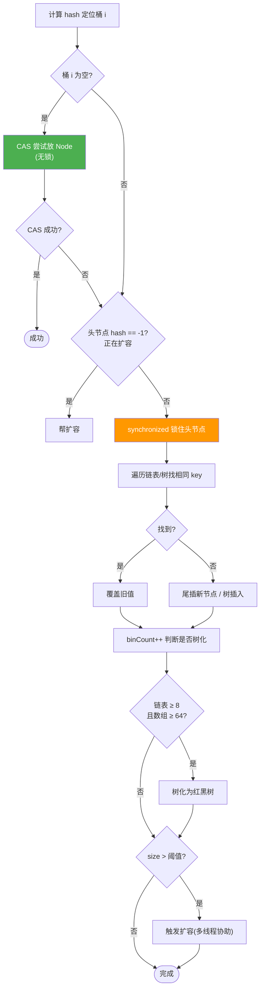
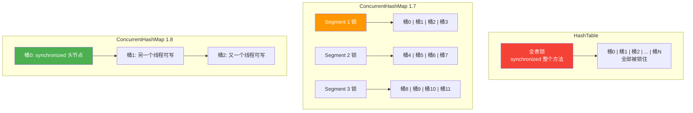

# ConcurrentHashMap 原理

> **一句话**:HashMap 线程不安全,HashTable 全表锁太慢;ConcurrentHashMap 用分段锁/CAS+ synchronized 锁单个桶,实现高并发安全。

> 📌 本文涉及：[CAS与Atomic](CAS与Atomic.md) · [红黑树原理](红黑树原理详解.md) · [synchronized](synchronized与Lock.md) · [HashMap](HashMap.md)

## 核心概念

### JDK 1.7 vs 1.8+ 的变化

| 版本 | 锁策略 | 结构 |
|------|--------|------|
| **1.7** | Segment 分段锁(继承 ReentrantLock),每段锁一把 | Segment 数组 → 每段一个 HashEntry 数组+链表 |
| **1.8+** | CAS + synchronized 锁**单个桶的头节点**,锁粒度更细 | 和 HashMap 一样:数组+链表+红黑树 |

> 1.8 改进后锁粒度从"段"降到"桶",并发度从默认 16 段提升到数组长度(默认 16 → 扩容后更多),理论上同一时刻可以有更多线程并发写不同桶。

### JDK 1.8+ 的 put 流程



### 读操作不加锁

```java
// JDK 1.8 get 方法:完全无锁!
static final Node<K,V> getNode(int hash, Object key) {
    Node<K,V>[] tab; Node<K,V> first, e; int n; K k;
    if ((tab = table) != null && (n = tab.length) > 0 &&
        (first = tab[(n - 1) & hash]) != null) {
        // 直接读 volatile 的 Node 引用
        if (first.hash == hash && ((k = first.key) == key || ...))
            return first;
        if ((e = first.next) != null) {
            if (first instanceof TreeNode) return ...; // 树查找
            do { if (e.hash == hash && ...) return e; } while ((e = e.next) != null);
        }
    }
    return null;
}
```

**为什么无锁还能保证读到最新值?**
- Node 的 `val` 和 `next` 都是 `volatile`,保证可见性
- Node 本身不可变(只替换,不修改内部字段),配合 volatile 引用

## 原理图解

### 锁粒度对比



## 代码实例

### 实例:ConcurrentHashMap vs HashTable vs synchronized HashMap

```java
import java.util.*;
import java.util.concurrent.*;

public class CHMDemo {
    static Map<String, Integer> map = new ConcurrentHashMap<>();
    static int THREADS = 10, OPS = 100000;

    public static void main(String[] args) throws Exception {
        // 10 个线程并发写入
        long start = System.currentTimeMillis();
        CountDownLatch latch = new CountDownLatch(THREADS);
        for (int t = 0; t < THREADS; t++) {
            new Thread(() -> {
                for (int i = 0; i < OPS; i++) {
                    map.put("key" + i % 1000, i);  // 1000 个 key 热点
                }
                latch.countDown();
            }).start();
        }
        latch.await();
        long cost = System.currentTimeMillis() - start;
        System.out.println("ConcurrentHashMap " + THREADS + "线程 × " + OPS + "次: " + cost + "ms, size=" + map.size());
    }
}
```

**对比结果**(近似,10线程×10万次):
```
ConcurrentHashMap: ~800ms
Collections.synchronizedMap: ~2000ms
HashTable: ~2500ms
```

> ConcurrentHashMap 因为锁粒度细(CAS+桶级锁),并发写性能远优于全表锁。

## 常见误区 / 面试点

- **误区:ConcurrentHashMap 的 put 完全无锁** → 不是。桶为空时用 CAS 无锁;桶不为空时用 synchronized 锁头节点。两种策略结合,根据是否冲突自动选择。
- **误区:ConcurrentHashMap 的 get 需要加锁** → 不需要。1.8 的 get 完全无锁,靠 volatile 语义保证可见性。
- **面试追问:ConcurrentHashMap 1.7 为什么废弃 Segment?** → ① 锁粒度仍粗(一段锁住多个桶);② 内存浪费(每个 Segment 有独立的数组、modCount 等字段);③ Hash 碰撞严重时链表长,查询慢(1.8 加了红黑树)。
- **面试追问:size() 方法怎么保证准确?** → 1.8 用 `longAdder` 分散计数到多个 Cell,求和时CAS竞争比单个 AtomicLong 更少。但精确 size 在并发场景下可能短暂不一致(刚 put 完可能还没计数),可接受。
- **面试追问:ConcurrentHashMap 能保证复合操作原子吗?** → 不能!`if (!map.containsKey(k)) map.put(k, v)` 不是原子的。需要用 `putIfAbsent` / `computeIfAbsent` 等原子方法。

## 参考来源

- JavaGuide: `docs/java/collection/concurrent-hash-map-source-code.md`
- JavaGuide: `docs/java/concurrent/java-concurrent-collections.md`
