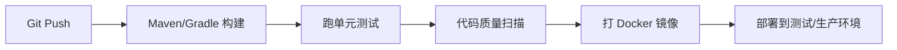

# DevOps 部署运维基础

> **一句话**:Java 开发日常必会的 DevOps 三板斧——Git 分支管理、Docker 容器化、Linux 常用命令。

## Git 分支策略

### GitFlow（传统企业常用）

```
main ───●──────────●──────────●── (生产)
         \        / \        /
develop ──●──●──●───●──●──●── (开发主线)
           \    /     \    /
feature/A ──●──●     feature/B ──●
```

| 分支 | 用途 | 来源 | 合并到 |
|------|------|------|--------|
| main | 生产代码 | - | - |
| develop | 开发主线 | - | - |
| feature/* | 新功能 | develop | develop |
| release/* | 发布准备 | develop | main + develop |
| hotfix/* | 紧急修复 | main | main + develop |

### 常用 Git 操作

```bash
# 合并 vs Rebase（面试必问）
git merge feature/A    # 保留完整历史，会产生一个 merge commit
git rebase main        # 把当前分支的 commit 移到 main 顶端，历史更整洁

# 实际项目多用：feature 分支上 rebase main，合入时 merge
git checkout feature/A
git rebase main        # 先把自己移到最新 main 上
git checkout main
git merge feature/A    # 再 merge 进去，历史很干净

# 回退
git reset --soft HEAD~1   # 撤销 commit，保留改动
git reset --hard HEAD~1   # 撤销 commit + 丢弃改动（危险！）
git revert HEAD           # 生成一个新 commit 来撤销（安全，推荐）

# 暂存
git stash              # 暂存当前改动
git stash pop          # 恢复
git cherry-pick <SHA>  # 挑一个 commit 到当前分支
```

---

## Docker 基础

### 核心概念

```
Dockerfile → build → Image → run → Container
```

```dockerfile
# 一个 Spring Boot 项目的 Dockerfile
FROM openjdk:17-slim
WORKDIR /app
COPY target/app.jar app.jar
EXPOSE 8080
ENTRYPOINT ["java", "-jar", "app.jar"]
```

```bash
# 常用命令
docker build -t my-app:v1.0 .
docker run -d -p 8080:8080 --name my-app my-app:v1.0
docker ps                  # 运行中的容器
docker logs -f my-app      # 看日志
docker exec -it my-app bash # 进容器
docker stop my-app && docker rm my-app  # 停止并删除
docker-compose up -d       # 一键启动多个服务
```

### docker-compose.yml 示例

```yaml
version: '3.8'
services:
  app:
    build: .
    ports: ["8080:8080"]
    environment: {SPRING_PROFILES_ACTIVE: prod}
    depends_on: [mysql, redis]
  mysql:
    image: mysql:8.0
    environment: {MYSQL_ROOT_PASSWORD: root123}
    volumes: [./data:/var/lib/mysql]
  redis:
    image: redis:7-alpine
```

---

## Linux 常用命令

| 场景 | 命令 | 说明 |
|------|------|------|
| 查日志 | `tail -f /var/log/app.log` | 实时跟踪 |
| 查日志 | `grep "ERROR" app.log \| tail -20` | 搜错误 |
| 查磁盘 | `df -h` | 磁盘用量 |
| 查内存 | `free -m` | 内存用量 |
| 查端口 | `netstat -tlnp \| grep 8080` | 谁占用 8080 |
| 查进程 | `ps aux \| grep java` | Java 进程 |
| 文件操作 | `find /app -name "*.log" -mtime +7 -delete` | 删 7 天前日志 |
| 权限 | `chmod +x deploy.sh` | 加执行权限 |
| 压缩 | `tar -czf app.tar.gz app/` | 打包压缩 |
| 网络 | `curl -X POST http://localhost:8080/api -d '{}'` | 测试接口 |

### 排查常用组合拳

```bash
# 看谁占了最多 CPU
top -c -b -n 1 | head -20

# 看当前目录下所有日志里 ERROR 的数量
grep -r "ERROR" *.log | wc -l

# 杀进程
kill -9 <PID>             # 强制杀（不建议，不给清理机会）
kill -15 <PID>            # 优雅杀（推荐）
```

---

## CI/CD 概念



| 概念 | 干什么的 |
|------|---------|
| Jenkins | CI/CD 老大哥，脚本灵活但维护复杂 |
| GitLab CI | `.gitlab-ci.yml` 配置，和 GitLab 一体 |
| GitHub Actions | `.github/workflows/` 下配 YAML，开源项目首选 |
| 灰度发布 | 先 1-2 台 → 观察 → 全量 |
| 蓝绿部署 | 两套环境，流量一键切 |

### 面试话术

「CI/CD 我用得最多的是 GitLab CI——提交代码自动跑单测和 Sonar 扫描，通过后打 Docker 镜像推到 Harbor，再部署到 K8s。灰度发布的核心思路是不要让有问题的代码一次性影响所有用户。」

---

## Nginx 基础

```nginx
# 反向代理
server {
    listen 80;
    server_name api.example.com;
    location / {
        proxy_pass http://localhost:8080;
    }
}

# 负载均衡
upstream backend {
    server 192.168.1.10:8080 weight=3;
    server 192.168.1.11:8080 weight=1;
    # weight：权重，比例 3:1
}
```

| 概念 | 说明 |
|------|------|
| 反向代理 | 客户端→Nginx→后端，隐藏后端 |
| 负载均衡 | 轮询、加权、IP hash |
| 限流 | `limit_req_zone` 防刷 |
