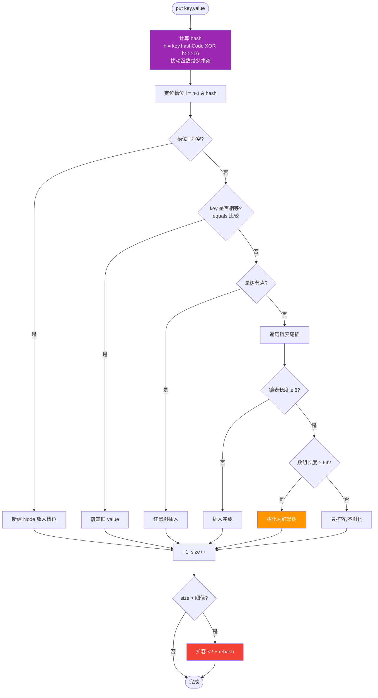
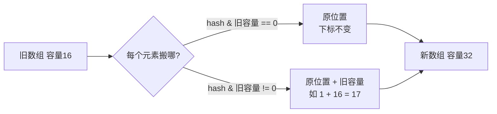

# HashMap 源码与原理

> **一句话**:HashMap 用"数组 + 链表 + 红黑树"存键值对,通过 hash 定位槽位,用拉链法解决冲突,是 Java 里用得最多的 Map 实现。

## 核心概念

### 数据结构演进

- **JDK 1.7**:`数组 + 链表`,hash 冲突时往链表头部插入(头插法,并发扩容可能成环导致死循环)。
- **JDK 1.8+**:`数组 + 链表 + 红黑树`。链表长度 ≥ 8 且数组长度 ≥ 64 时转红黑树(查找从 O(n) 降到 O(log n));红黑树节点 ≤ 6 时退化回链表。改为**尾插法**,并发扩容不会成环(但仍非线程安全)。

### 关键设计

| 概念 | 说明 |
|------|------|
| 默认初始容量 | 16(必须是 2 的幂,方便用 `(n-1) & hash` 取模) |
| 默认负载因子 | 0.75(空间和时间的折中) |
| 扩容阈值 | `容量 × 负载因子`,如 16 × 0.75 = 12,超过就扩容 |
| 扩容方式 | 容量翻倍(×2),rehash 到新数组 |
| 树化阈值 | 链表 ≥ 8 且数组 ≥ 64 → 红黑树 |
| 退化阈值 | 红黑树节点 ≤ 6 → 链表 |

### 为什么容量必须是 2 的幂

计算槽位用 `(n - 1) & hash` 代替 `hash % n`。位与运算比取模快,且 n 是 2 的幂时,`n-1` 的二进制全是 1(如 16-1=15=`1111`),保证 hash 的低位都被用到,分布均匀。

## 原理图解

### 整体结构

```mermaid
graph TB
    subgraph HashMap
        T0[table 桶数组<br/>Node&#91;&#93;]
        T0 --> I0["下标0"]
        T0 --> I1["下标1"]
        T0 --> I2["下标2 ..."]
        T0 --> I15["下标15"]

        I1 --> N1["Node(k1,v1)"]
        N1 --> N2["Node(k2,v2)"]  <!-- hash冲突,拉链 -->
        N2 --> N3["... → 树化(≥8)"]

        I15 --> T15a["TreeNode<br/>红黑树节点"]
        T15a --> T15b["TreeNode..."]
    end

    style T0 fill:#2196F3,color:#fff
    style T15a fill:#FF9800,color:#fff
    style N1 fill:#4CAF50,color:#fff
```

### put 流程(JDK 1.8 核心)



### 扩容时元素怎么搬



> JDK 1.8 的妙处:扩容后元素要么留原地,要么"原下标 + 旧容量",**不用重新计算 hash**,只需判断 `hash & oldCap` 这一位是 0 还是 1。

## 代码实例

### 实例 1:观察 hash 分布

```java
import java.lang.reflect.Field;
import java.util.HashMap;

public class HashMapDemo {
    public static void main(String[] args) throws Exception {
        HashMap<String, Integer> map = new HashMap<>(16);
        // 故意构造 hash 冲突:这些 key 落到同一桶
        for (int i = 0; i < 10; i++) {
            map.put("key" + i, i);
        }
        System.out.println("size = " + map.size());

        // 通过反射看内部桶数组长度和某个桶的链表长度
        Field tableField = HashMap.class.getDeclaredField("table");
        tableField.setAccessible(true);
        Object[] table = (Object[]) tableField.get(map);
        System.out.println("桶数组长度 = " + table.length);
        for (int i = 0; i < table.length; i++) {
            if (table[i] != null) {
                int len = 0;
                Object node = table[i];
                while (node != null) {
                    len++;
                    Field next = node.getClass().getDeclaredField("next");
                    next.setAccessible(true);
                    node = next.get(node);
                }
                System.out.println("桶[" + i + "] 链表长度 = " + len);
            }
        }
    }
}
```

**运行输出**(分布情况取决于实际 hash,这里示意):
```
size = 10
桶数组长度 = 16
桶[0] 链表长度 = 1
桶[3] 链表长度 = 1
桶[7] 链表长度 = 2
...
```

### 实例 2:多线程下的安全问题

```java
import java.util.HashMap;

public class HashMapUnsafeDemo {
    // HashMap 多线程 put 可能丢数据,演示用,别在生产写
    public static void main(String[] args) throws Exception {
        for (int round = 0; round < 10; round++) {
            HashMap<Integer, Integer> map = new HashMap<>();
            Thread t1 = new Thread(() -> {
                for (int i = 0; i < 1000; i++) map.put(i, i);
            });
            Thread t2 = new Thread(() -> {
                for (int i = 1000; i < 2000; i++) map.put(i, i);
            });
            t1.start(); t2.start();
            t1.join(); t2.join();
            System.out.println("第" + round + "轮 size = " + map.size() +
                    (map.size() != 2000 ? " ← 数据丢了!" : ""));
        }
    }
}
```

**运行输出**(经常会出现 size < 2000):
```
第0轮 size = 2000
第1轮 size = 1847 ← 数据丢了!
第2轮 size = 2000
...
```

> **结论**:并发用 `HashMap` 会丢数据甚至死循环(1.7)。多线程场景用 `ConcurrentHashMap`(详见 [并发篇](../03-并发))。

## 常见误区 / 面试点

- **误区:HashMap 链表长度到 8 就一定树化** → 还要求数组长度 ≥ 64,否则只扩容。这是常被忽略的条件。
- **误区:负载因子设小点能提升性能** → 0.75 是空间和时间的平衡点。调小(如 0.5)会频繁扩容浪费空间;调大(如 1.0)hash 冲突概率上升,链表变长,查找变慢。
- **面试追问:为什么用红黑树不用 AVL 树?** → 红黑树插入/删除时旋转次数更少(最多 3 次),AVL 更严格平衡但维护成本高。HashMap 增删频繁,红黑树更合适。
- **面试追问:`HashMap` 的 key 用自定义对象要注意什么?** → 必须**同时重写 `hashCode()` 和 `equals()`**,且两个方法必须一致(equals 相等的对象 hashCode 必须相等)。否则会出现"put 进去 get 不出来"。
- **面试追问:扩容为什么是 2 倍?** → 保持容量为 2 的幂,`n-1 & hash` 才有效;且 rehash 时只需看最高位,高效。

## 参考来源

- JavaGuide: `docs/java/collection/hashmap-source-code.md`(HashMap 源码分析,只读借鉴)
- JavaGuide: `docs/java/collection/concurrent-hash-map-source-code.md`(ConcurrentHashMap)
- 官方源码: `java.util.HashMap`(JDK 1.8+)
