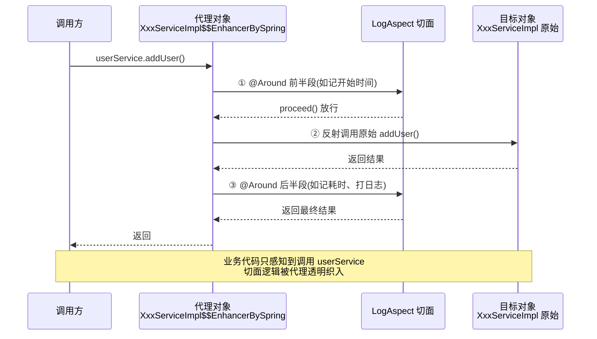
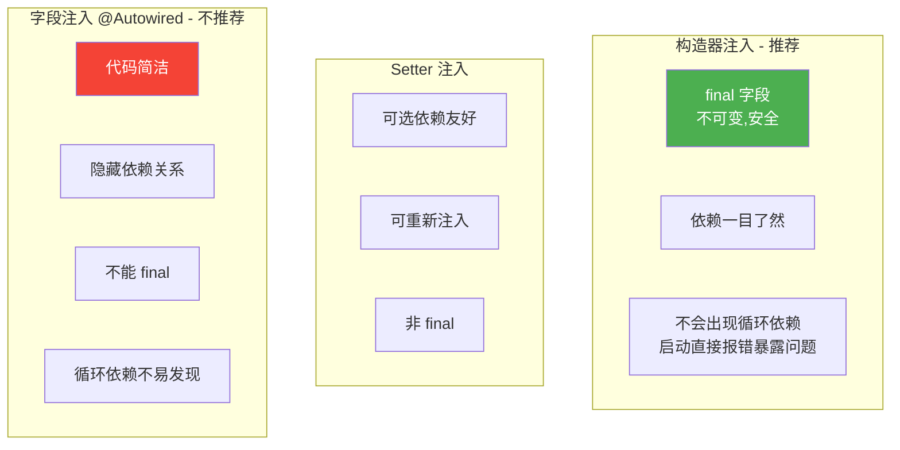

# Spring IoC 与 AOP

> **一句话**:IoC(控制反转)把对象的创建和依赖交给 Spring 容器,解耦代码;AOP(面向切面)把日志、事务等横切关注点从业务代码抽出来。两者是 Spring 的灵魂。

## 核心概念

### IoC(控制反转)与 DI(依赖注入)

**IoC 不等于 DI**:
- **IoC 是思想**:对象不再自己 `new` 依赖,而是被动接收 —— 创建对象的**控制权反转**了(从代码转到容器)。
- **DI(依赖注入)是实现**:容器在运行时把依赖的对象塞进去(setter 注入、构造器注入、字段注入)。

**通俗理解**:没有 Spring 时,A 需要 B 就 `B b = new B()`,A 和 B 耦死。有了 IoC,A 只要声明"我需要 B",Spring 容器帮你创建 B 并塞给 A。A 不关心 B 是怎么 new 出来的、是不是代理对象。

### Bean 的生命周期(简化)

```
实例化(构造方法)→ 属性赋值(注入依赖)→ 初始化(BeanPostProcessor 前置 → init-method → 后置)→ 使用 → 销毁
```

### AOP(面向切面编程)

把**横切关注点**(cross-cutting concern)—— 日志、事务、权限、性能监控 —— 从业务方法里抽出来,集中管理。业务代码只写业务,AOP 自动在方法前后织入这些通用逻辑。

**核心术语**(面试必背):

| 术语 | 含义 | 例子 |
|------|------|------|
| **切面 Aspect** | 横切逻辑的类 | `LogAspect` 日志切面 |
| **切点 Pointcut** | 在哪些方法上生效(表达式) | `execution(* com.xxx.service.*.*(..))` |
| **通知 Advice** | 在切点处做什么、何时做 | `@Before` / `@After` / `@Around` |
| **织入 Weaving** | 把切面应用到目标对象 | Spring 用运行时动态代理 |
| **目标对象 Target** | 被增强的原始对象 | `UserService` |
| **代理对象 Proxy** | 增强后的对象 | Spring 用 JDK 动态代理或 CGLIB 生成 |

### Spring 用哪种代理

| 代理方式 | 条件 | 原理 |
|---------|------|------|
| **JDK 动态代理** | 目标类**实现了接口**(默认) | 基于 `Proxy.newProxyInstance`,生成接口的实现类 |
| **CGLIB 代理** | 目标类**没实现接口**,或强制开启 | 生成目标类的**子类**,final 方法不能代理 |

> SpringBoot 2.x 起 `spring.aop.proxy-target-class=true`(默认用 CGLIB)。

## 原理图解

### IoC 容器启动与 Bean 装配

```mermaid
flowchart TD
    START([启动 Spring 容器]) --> READ[读取配置<br/>@ComponentScan / XML / @Configuration]
    READ --> SCAN[扫描 @Component/@Service/@Repository 标注的类]
    SCAN --> PARSE[解析为 BeanDefinition<br/>记录类名、作用域、依赖等元信息]
    PARSE --> REG[注册到 BeanDefinitionRegistry]
    REG --> INST[实例化: 反射调用构造方法]
    INST --> INJ[依赖注入: @Autowired/@Resource/@Value]
    INJ --> INIT[初始化: BeanPostProcessor 增强处理]
    INIT --> AOP{需要 AOP?}
    AOP -- 是 --> PROXY[生成代理对象<br/>JDK动态代理/CGLIB]
    AOP -- 否 --> ORIG[原始对象]
    PROXY --> CACHE[放入单例池 singletonObjects]
    ORIG --> CACHE
    CACHE --> READY([Bean 就绪,可使用])

    style READ fill:#2196F3,color:#fff
    style INST fill:#4CAF50,color:#fff
    style PROXY fill:#FF9800,color:#fff
    style CACHE fill:#9C27B0,color:#fff
```

> **关键**:`@Autowired` 注入的是 Bean 在初始化阶段经过 BeanPostProcessor 处理后的对象 —— 如果配了 AOP,注入的就是代理对象,不是原始对象。

### AOP 调用过程(JDK 动态代理)



### 三种注入方式对比



## 代码实例

### 实例 1:IoC 基础 —— 接口 + 实现 + 注入

```java
// 1. 定义接口
public interface MessageService {
    String send(String msg);
}

// 2. 实现类,注册为 Bean
@Service
public class EmailService implements MessageService {
    @Override
    public String send(String msg) {
        return "邮件发送: " + msg;
    }
}

// 3. 使用方,声明依赖,不关心具体实现
@Service
public class NotificationService {
    private final MessageService messageService;

    // ✅ 推荐构造器注入(Spring 4.3+ 单构造器可省略 @Autowired)
    public NotificationService(MessageService messageService) {
        this.messageService = messageService;
    }

    public void notify(String msg) {
        System.out.println(messageService.send(msg));
    }
}
```

> 想换成短信发送?写个 `SmsService implements MessageService`,加 `@Primary` 或 `@Qualifier("smsService")`,**NotificationService 一行代码都不用改**。这就是 IoC 带来的解耦。

### 实例 2:AOP 实战 —— 方法耗时统计

```java
import org.aspectj.lang.ProceedingJoinPoint;
import org.aspectj.lang.annotation.*;
import org.springframework.stereotype.Component;

@Aspect       // 声明切面
@Component    // 注册为 Bean
public class TimeAspect {

    // 切点:service 包下所有方法
    @Around("execution(* com.example.demo.service.*.*(..))")
    public Object recordTime(ProceedingJoinPoint pjp) throws Throwable {
        long start = System.currentTimeMillis();
        String method = pjp.getSignature().toShortString();

        try {
            Object result = pjp.proceed();   // 放行原方法
            return result;
        } finally {
            long cost = System.currentTimeMillis() - start;
            System.out.println(method + " 耗时 " + cost + "ms");
        }
    }
}

// 业务代码完全不用改
@Service
public class OrderService {
    public void createOrder() {
        // 业务逻辑...
        Thread.sleep(50);  // 模拟耗时
    }
}

// 调用 createOrder() 时控制台输出:
// OrderService.createOrder() 耗时 51ms
```

### 实例 3:五种通知类型

```java
@Aspect
@Component
public class LogAspect {

    @Pointcut("execution(* com.example..*Service.*(..))")
    public void servicePointcut() {}  // 切点定义,复用

    @Before("servicePointcut()")               // 方法前
    public void before() { System.out.println("前置通知"); }

    @After("servicePointcut()")                // 方法后(无论成功失败)
    public void after() { System.out.println("后置通知"); }

    @AfterReturning("servicePointcut()")       // 成功返回后
    public void afterReturning() { System.out.println("返回通知"); }

    @AfterThrowing("servicePointcut()")        // 抛异常后
    public void afterThrowing() { System.out.println("异常通知"); }

    @Around("servicePointcut()")               // 环绕(最强大,能控制是否执行)
    public Object around(ProceedingJoinPoint pjp) throws Throwable {
        System.out.println("环绕-前");
        Object result = pjp.proceed();
        System.out.println("环绕-后");
        return result;
    }
}
```

**执行顺序**(正常情况):
```
环绕-前 → 前置通知 → [原方法] → 返回通知 → 后置通知 → 环绕-后
```

## 常见误区 / 面试点

- **误区:`@Autowired` 是按类型注入,有多个同类型 Bean 就报错** → 不完全对。多个时先按类型找,再按字段名/参数名作为 Bean 名匹配,还不行才报错(可用 `@Qualifier` 指定)。
- **误区:Spring 用 JDK 动态代理** → 只有目标类实现了接口才默认用 JDK 动态代理;没接口用 CGLIB。SpringBoot 2.x 默认强制 CGLIB(`proxy-target-class=true`)。
- **误区:AOP 注入的是原始对象** → 错。配了 AOP 后,容器里和 `@Autowired` 注入的是**代理对象**。这就是为什么 `this.method()` 调用同类方法时 AOP 不生效(走的是原始对象,没经过代理)—— **同类内部调用绕过了代理**。
- **面试追问:为什么构造器注入不能解决循环依赖,而 setter 可以?** → 构造器注入需要在实例化时就拿到依赖,而实例化和属性赋值是两个阶段。Spring 用"三级缓存"提前暴露半成品对象解决 setter/字段注入的单例循环依赖;构造器注入没有这个提前暴露的机会,所以循环依赖直接报错。
- **面试追问:Spring 三级缓存是什么?** → `singletonObjects`(成品)、`earlySingletonObjects`(半成品)、`singletonFactories`(对象工厂)。A 实例化后把工厂放进第三级,A 注入 B、B 注入 A 时从第三级拿到 A 的早期引用(可能已经是代理),解决循环。
- **面试追问:`@Bean` 方法之间互相调用,得到的是同一个单例吗?** → 是。Spring 用 CGLIB 增强 `@Configuration` 类,`@Bean` 方法调用会被拦截,直接返回容器里的单例,不会重复 new。普通 `@Component` 里的 `@Bean` 方法则不会拦截,调用会 new 新对象。

## 参考来源

- JavaGuide: `docs/system-design/framework/spring/ioc-and-aop.md`(Spring IoC & AOP 详解)
- JavaGuide: `docs/system-design/framework/spring/spring-transaction.md`(Spring 事务,基于 AOP)
- JavaGuide: `docs/system-design/framework/spring/spring-common-annotations.md`(Spring 常用注解)
- 官方文档: [Spring Framework Core](https://docs.spring.io/spring-framework/reference/core.html)
