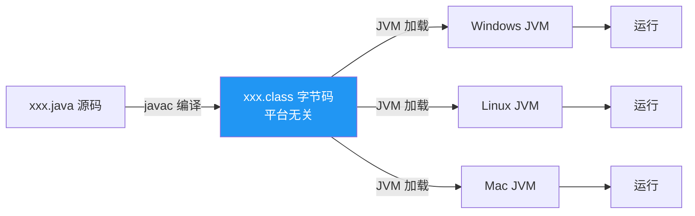
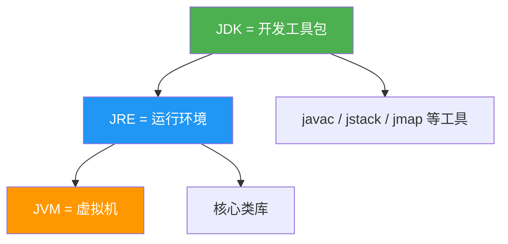
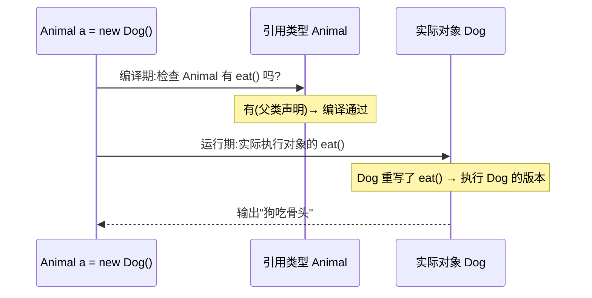

# Java 基础核心知识

> **一句话**:Java 入门必懂的十几个高频考点 —— 平台特性、基础语法、面向对象、关键字。面试和日常都会反复用到。

## 核心概念

### Java 为什么能跨平台

Java 源码 `.java` 先编译成**字节码** `.class`(平台无关),再由各平台的 **JVM** 解释/编译执行。一次编写,到处运行的核心就是 JVM 屏蔽了操作系统差异。



### JDK / JRE / JVM 的关系

| 名称 | 全称 | 包含 |
|------|------|------|
| **JVM** | Java Virtual Machine | 字节码执行引擎,跨平台的关键 |
| **JRE** | Java Runtime Environment | JVM + 核心类库(rt.jar/java.base),**运行**Java 程序的最小集 |
| **JDK** | Java Development Kit | JRE + 编译器(javac)+ 工具(jstack/jmap),**开发**用的完整集 |



### 面向对象三大特性

| 特性 | 含义 | 关键词 |
|------|------|--------|
| **封装** | 隐藏内部细节,对外提供方法 | `private` + getter/setter |
| **继承** | 子类复用父类的字段和方法 | `extends`,单继承 |
| **多态** | 同一调用,不同对象表现不同行为 | 父类引用指向子类对象 + 方法重写 |

> 多态的三个前提:① 继承/实现;② 方法重写;③ 父类引用指向子类对象(`Animal a = new Dog();`)。

### == 与 equals 的区别

- `==`:**基本类型**比较值;**引用类型**比较内存地址。
- `equals`:默认(Object 里)也是比较地址;但 String、Integer 等重写了 equals 来比较**内容**。

```java
String a = new String("abc");
String b = new String("abc");
System.out.println(a == b);       // false  不同对象,地址不同
System.out.println(a.equals(b));  // true   String 重写了 equals,比内容

// 但字符串常量池的特例
String c = "abc";
String d = "abc";
System.out.println(c == d);       // true   常量池同一引用
```

### String / StringBuilder / StringBuffer

| 类 | 可变性 | 线程安全 | 性能 | 场景 |
|----|--------|---------|------|------|
| **String** | 不可变(每次修改新建对象) | 安全(不可变) | 低 | 少量字符串操作 |
| **StringBuilder** | 可变 | **不安全** | 最高 | 单线程拼接(首选) |
| **StringBuffer** | 可变 | 安全(synchronized) | 中 | 多线程拼接(罕见) |

> String 不可变的好处:① 线程安全;② 可缓存 hashCode;③ 字符串常量池复用。

### 接口 vs 抽象类

| 维度 | 抽象类 | 接口 |
|------|--------|------|
| 关系 | `extends`(单继承) | `implements`(多实现) |
| 字段 | 可有普通成员变量 | 只能 `public static final` 常量 |
| 方法 | 可有具体方法 | JDK8 前 全抽象;JDK8+ 可有 default/static;JDK9+ 可有 private |
| 构造方法 | 有 | 无 |
| 设计语义 | "是什么"(is-a,有亲缘关系) | "能做什么"(has-a,行为契约) |

### 重载 vs 重写

| | 重载 Overload | 重写 Override |
|---|---|---|
| 发生在 | 同一个类 | 父子类之间 |
| 方法名 | 相同 | 相同 |
| 参数列表 | **必须不同** | **必须相同** |
| 返回值 | 无要求 | 相同或协变返回 |
| 访问修饰符 | 无要求 | 不能比父类更严 |
| 绑定时机 | 编译时(静态分派) | 运行时(动态分派) |

## 原理图解

### 多态的方法调用(动态分派)



> **编译看左边,运行看右边**:编译期按引用类型检查方法是否存在,运行期按实际对象决定执行哪个版本。

## 代码实例

### 实例 1:多态完整示例

```java
abstract class Animal {
    public abstract void eat();
}

class Dog extends Animal {
    @Override
    public void eat() { System.out.println("狗吃骨头"); }
}

class Cat extends Animal {
    @Override
    public void eat() { System.out.println("猫吃鱼"); }
}

public class PolymorphismDemo {
    // 多态:参数是父类,可接收任何子类
    public static void feed(Animal a) { a.eat(); }

    public static void main(String[] args) {
        feed(new Dog());  // 狗吃骨头
        feed(new Cat());  // 猫吃鱼
    }
}
```

### 实例 2:StringBuilder 性能对比

```java
public class StringPerfDemo {
    public static void main(String[] args) {
        int n = 100000;

        // String:每次 + 都新建对象,极慢
        long s = System.currentTimeMillis();
        String str = "";
        for (int i = 0; i < n; i++) str += i;
        System.out.println("String: " + (System.currentTimeMillis() - s) + "ms");

        // StringBuilder:可变,极快
        s = System.currentTimeMillis();
        StringBuilder sb = new StringBuilder();
        for (int i = 0; i < n; i++) sb.append(i);
        System.out.println("StringBuilder: " + (System.currentTimeMillis() - s) + "ms");
    }
}
// 运行输出(数量级):
// String: 4500ms
// StringBuilder: 5ms
```

## 常见误区 / 面试点

- **误区:Java 是纯面向对象** → 不是。基本类型(int/long 等)不是对象(虽然有自动装箱)。Java 是"绝大多数面向对象"。
- **误区:`Integer a = 127, b = 127; a == b` 是 true,128 就 false** → IntegerCache 缓存了 [-128, 127],这个范围内返回同一对象,超出则 new 新对象。Integer 比较永远用 equals。
- **面试追问:JDK、JRE、JVM 必须都装吗?** → 运行 Java 程序只需 JRE;开发需要 JDK。现代 JDK 已不单独分发 JRE(JDK 11+),JDK 直接含运行环境。
- **面试追问:Java 是编译型还是解释型?** → 两者都有。先 javac 编译成字节码(编译),JVM 解释执行字节码(解释);HotSpot 的 JIT 还会把热点代码编译成本地机器码。所以是"编译+解释+JIT"混合。
- **面试追问:自动装箱拆箱的坑?** → `Integer i = 100` 实际是 `Integer.valueOf(100)`(装箱),`int n = i` 是 `i.intValue()`(拆箱)。拆箱时若对象为 null 会 NPE;大量装箱拆箱有性能损耗。

## 参考来源

- JavaGuide: `docs/java/basis/java-basic-questions-01.md` / `02.md` / `03.md`
- JavaGuide: `docs/java/basis/java-keyword-summary.md`
