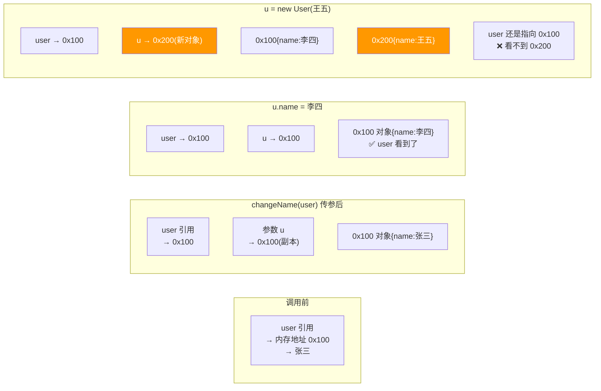

# Java 只有值传递

> **一句话**:Java 方法传参,永远都是"值传递"。传基本类型是传值的副本,传引用类型是传地址值的副本 —— 所以能改对象内容,但换不了引用指向。

## 核心概念

### 什么是值传递

方法调用时,参数传递的是**值的拷贝**,不是变量本身。原变量的修改不会影响拷贝,反之亦然。

### 基本类型:传值的副本

```java
void change(int x) { x = 100; }

int a = 1;
change(a);
System.out.println(a);  // 还是 1,没变
// 因为传的是 a 的副本,x 和 a 是两个独立变量
```

### 引用类型:传地址值的副本

```java
void changeName(User u) { u.name = "李四"; }  // 能改对象属性!
void changeRef(User u) { u = new User("王五"); }  // 不能换引用指向!

User user = new User("张三");
changeName(user);
System.out.println(user.name);  // 李四  ← 改了,因为 u 和 user 指向同一个对象

changeRef(user);
System.out.println(user.name);  // 还是李四 ← 没变,因为 u 是引用地址的副本,换指向不影响原引用
```

## 原理图解

### 引用传递的真相(值传递地址副本)



> 本质:传的是"地址值"的拷贝。两个引用(原变量和参数)共享同一对象 → 能改对象内容;但参数换指向 ≠ 原变量换指向。

## 代码实例

```java
public class PassByValueDemo {
    static void swap(int a, int b) {
        int temp = a; a = b; b = temp;  // 交换的是副本,原值不变
    }

    static void swapRef(Integer a, Integer b) {
        Integer temp = a; a = b; b = temp;  // 交换的是引用副本的指向,原引用不变
    }

    public static void main(String[] args) {
        int x = 1, y = 2;
        swap(x, y);
        System.out.println(x + "," + y);  // 1,2  没换成功

        Integer a = 1, b = 2;
        swapRef(a, b);
        System.out.println(a + "," + b);  // 1,2  也没换成功!
    }
}
```

> **无论传什么,Java 都是值传递**。基本类型传值副本,引用类型传地址副本。想交换两个变量?装进数组或用 AtomicReference/返回值/包装类。

## 常见误区 / 面试点

- **误区:Java 传对象是引用传递** → 不是。传的是引用的**副本**(值传递)。如果真的是引用传递,swapRef 能成功交换 —— 但不能。
- **面试追问:String 为什么"看起来"不可变?** → String 底层是 `final byte[] value`,且没有修改 value 内容的方法(所有"修改"都返回新对象)。加上 final 类不能被继承,所以 String 天然线程安全、不可变。
- **面试追问:那怎么在方法里"修改"调用方的变量?** → 用数组/容器/AtomicReference 包装,或用返回值。

## 参考来源

- JavaGuide: `docs/java/basis/why-there-only-value-passing-in-java.md`
