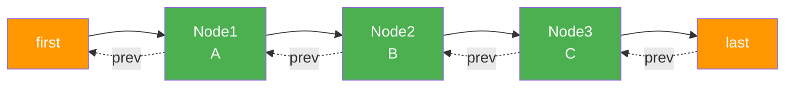
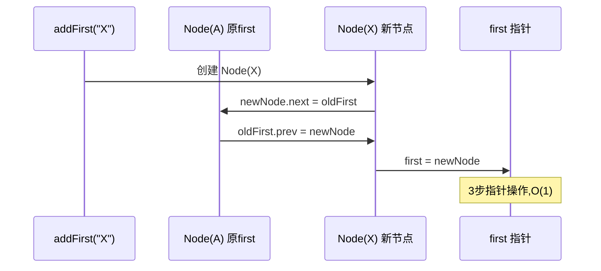
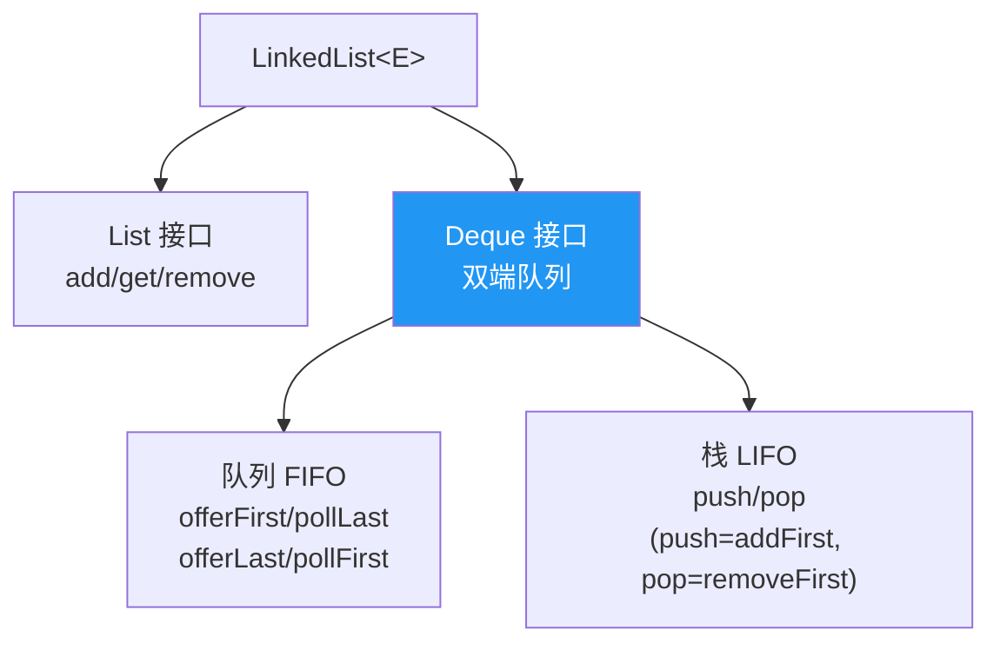

# LinkedList 与双向链表

> **一句话**:LinkedList 底层是双向链表,在头尾增删 O(1),随机访问 O(n)。同时实现了 List 和 Deque 接口,可当队列/栈用。

## 核心概念

### 底层结构

```java
// JDK 源码核心
private static class Node<E> {
    E item;           // 数据
    Node<E> next;     // 后继
    Node<E> prev;     // 前驱
}
transient Node<E> first;  // 头节点
transient Node<E> last;   // 尾节点
int size;
```

### 双向链表的优势

- **头尾增删 O(1)**:改一下 first/last 的指向即可
- **实现了 Deque**:可用作队列(FIFO)、栈(LIFO)、双端队列
- **不需要连续内存**:不存在扩容问题

### 代价

- **随机访问 O(n)**:没有下标,必须从头/尾遍历到目标位置
- **每节点额外 2 个指针**(prev/next),内存开销比 ArrayList 大
- **CPU 缓存不友好**:节点分散在堆中,缓存命中率低

## 原理图解

### 链表结构



### 头部插入 O(1)



### 作为队列/栈使用



## 代码实例

### 实例:LinkedList 作队列和栈

```java
import java.util.LinkedList;

public class LinkedListDemo {
    public static void main(String[] args) {
        // 作队列 FIFO
        LinkedList<String> queue = new LinkedList<>();
        queue.offerLast("A");  // 入队
        queue.offerLast("B");
        System.out.println(queue.pollFirst());  // A  出队
        System.out.println(queue.pollFirst());  // B

        // 作栈 LIFO
        LinkedList<String> stack = new LinkedList<>();
        stack.push("X");  // push = addFirst
        stack.push("Y");
        System.out.println(stack.pop());  // Y  pop = removeFirst
        System.out.println(stack.pop());  // X

        // 作双端队列
        LinkedList<String> deque = new LinkedList<>();
        deque.offerFirst("左1");
        deque.offerLast("右1");
        System.out.println(deque.pollFirst());  // 左1
        System.out.println(deque.pollLast());   // 右1
    }
}
```

## 常见误区 / 面试点

- **误区:频繁插入用 LinkedList 就对了** → 不一定。如果插入位置不是头尾(而是中间某下标),LinkedList 还是要遍历到那个位置(O(n)),ArrayList 虽然要移动元素也是 O(n) 但 CPU 缓存友好。实测大多数场景 ArrayList 更快。
- **面试追问:LinkedList 的 get(index) 怎么找?** → `index < size/2` 从头往后遍历,否则从尾往前。O(n/2) = O(n)。
- **面试追问:为什么 LinkedList 实现了 Deque 而不只是 List?** → 链表天然适合头尾操作,Deque 把这个能力暴露出来,让一个数据结构既能当列表又能当队列和栈。

## 参考来源

- JavaGuide: `docs/java/collection/linkedlist-source-code.md`
- 相关: [ArrayList](ArrayList.md)(对比阅读)
