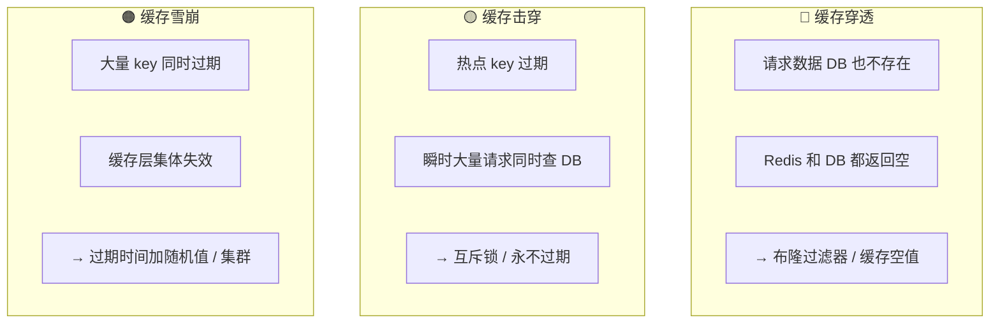

# Redis 缓存策略与分布式锁

> **一句话**:Redis 不只是缓存——五种数据类型覆盖计数器/排行榜/消息队列，缓存三问题各有解法，分布式锁靠 SET NX PX + Lua。

## 五种数据类型

| 类型 | 底层 | 典型场景 |
|------|------|---------|
| String | SDS 动态字符串 | 缓存对象、计数器、分布式锁 |
| Hash | ziplist / hashtable | 用户信息、购物车 |
| List | quicklist | 消息队列、最新列表 |
| Set | intset / hashtable | 标签、共同好友、抽奖去重 |
| ZSet | skiplist + dict | 排行榜、延时队列 |

## 缓存三问题



## RDB vs AOF

| | RDB | AOF |
|------|-----|-----|
| 方式 | 快照（某时刻全量） | 追加写命令日志 |
| 恢复速度 | **快** | 慢（逐条重放） |
| 数据安全 | 可能丢最后一次快照后的 | **更安全**（最多丢 1 秒） |
| 生产建议 | **两者都开** | RDB 快速恢复 + AOF 保数据 |

## 分布式锁

```java
// 加锁：SET key value NX PX 30000（原子操作）
String result = jedis.set("lock:order:123", requestId, "NX", "PX", 30000);

// 解锁：Lua 脚本（原子性——先查是不是自己加的再删）
String script = "if redis.call('get', KEYS[1]) == ARGV[1] then " +
                "return redis.call('del', KEYS[1]) else return 0 end";
```

**Redisson 看门狗**：每 10 秒自动续期，防业务没执行完锁过期。

## 缓存一致性

| 策略 | 做法 | 推荐 |
|------|------|:--:|
| 先删缓存再更新 DB | 并发时可能读到旧数据写回缓存 | ❌ |
| **先更新 DB 再删缓存** | + MQ 重试保证删除成功 | ✅ |
| Canal + MQ | 监听 binlog → 异步更新 | 最可靠但复杂 |

## 面试追问

**Q: Redis 为什么快？**
A: ①内存操作 ②单线程（避免上下文切换，6.0+ IO 多线程） ③IO 多路复用 ④高效数据结构

**Q: 缓存和 DB 双写一致性？**
A: 先更新 DB，再删缓存。加 MQ 重试保证删除一定成功。
