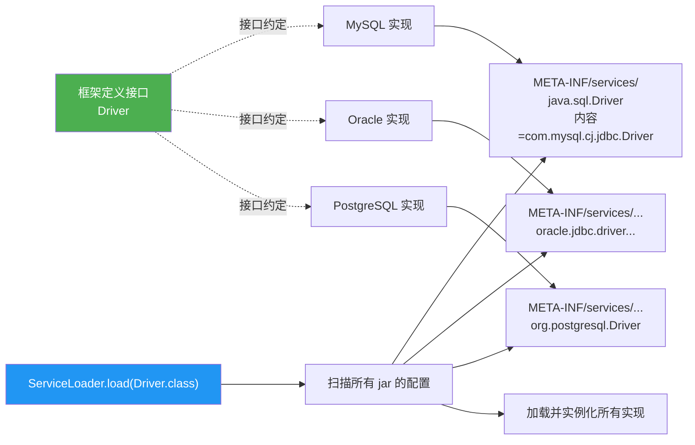
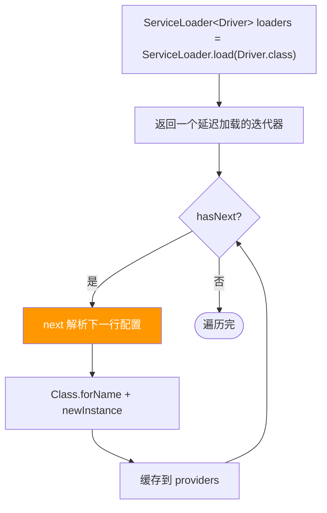

# SPI 机制(Service Provider Interface)

> **一句话**:SPI 让框架定义接口、由第三方写实现并在配置文件里声明,框架运行时自动发现并加载 —— 实现解耦和可插拔扩展。

## 核心概念

### API vs SPI

| | API | SPI |
|---|---|---|
| 角色 | 实现方提供 | 调用方(框架)定义,实现方提供 |
| 控制 | 实现方决定行为 | 接口归框架,行为由扩展方注入 |
| 例子 | 你调用 ArrayList 的 add | JDBC 定义 Driver 接口,MySQL/Oracle 各写实现 |

### Java SPI 工作原理

1. 框架定义接口(如 `com.mysql.Driver`)
2. 实现方在自己的 jar 里,在 `META-INF/services/接口全限定名` 文件里写实现类全限定名
3. 调用方用 `ServiceLoader.load(接口.class)` 扫描所有 jar 的该文件,加载所有实现



### 主流 SPI 的差异

| SPI | 发现机制 | 典型用户 |
|-----|---------|---------|
| **Java SPI**(JDK) | `META-INF/services/` + `ServiceLoader` | JDBC、SLF4J(早期) |
| **Dubbo SPI** | `META-INF/dubbo/` + 自定义 ExtensionLoader | Dubbo(增强:支持按 key 取、依赖注入、AOP 包装) |
| **Spring SPI** | `META-INF/spring.factories`(Boot 2.7+)`META-INF/spring/...imports` | SpringBoot 自动装配 |

> Dubbo SPI 增强了 Java SPI:① Java SPI 会一次性加载所有实现(浪费),Dubbo 按 key 按需加载;② 支持 IOC(实现里能注入其他扩展);③ 支持 AOP(自动套 Wrapper)。

## 原理图解

### ServiceLoader 的懒加载



> ServiceLoader 是**懒加载**:调用 `next()` 才真正加载下一个实现,不是 load 时全加载(但 Java SPI 仍会全遍历,无法按需取一个)。

## 代码实例

### 实例:自定义 SPI 完整流程

```java
// 1. 框架定义接口
package com.example.spi;
public interface Payment {
    void pay(double amount);
}
```

```java
// 2. 实现方 A(支付宝)
package com.example.impl;
public class AlipayPayment implements Payment {
    public void pay(double amount) { System.out.println("支付宝支付 " + amount); }
}
```

```
# 3. 实现方 A 的资源文件:src/main/resources/META-INF/services/com.example.spi.Payment
com.example.impl.AlipayPayment
```

```java
// 4. 调用方用 ServiceLoader 加载(完全不知道具体实现是谁)
public class SpiDemo {
    public static void main(String[] args) {
        ServiceLoader<Payment> loader = ServiceLoader.load(Payment.class);
        for (Payment p : loader) {        // 自动发现所有实现
            p.pay(100.0);                  // 支付宝支付 100.0
        }
    }
}
```

> 新增"微信支付"实现?写个类 + 配置文件丢进 classpath,**SpiDemo 一行代码不用改**就自动支持。这就是 SPI 的可插拔扩展能力。

### 实战:JDBC 注册驱动的真相

```java
// 你以为的
DriverManager.getConnection("jdbc:mysql://...", "root", "pwd");

// 实际底层(JDK 6 前)
Class.forName("com.mysql.cj.jdbc.Driver");  // 触发 Driver 的 static 块
// static { DriverManager.registerDriver(new Driver()); }

// JDK 6+ 用 SPI 自动发现,forName 都不用了
// DriverManager 的 static 块里:
//   ServiceLoader<Driver> loader = ServiceLoader.load(Driver.class);
//   自动扫描所有 jar 的 META-INF/services/java.sql.Driver
// 所以只要把 mysql-connector-java.jar 放进 classpath,Driver 自动注册
```

## 常见误区 / 面试点

- **误区:SPI 就是简单的反射加载类** → 它是一套**约定大于配置**的发现机制。核心不在反射(那只是手段),而在"配置文件位置 + 文件名约定"这套标准,让第三方实现能被自动发现。
- **误区:Java SPI 比 Dubbo SPI 差** → 各有定位。Java SPI 简单通用(JDK 自带);Dubbo SPI 针对高性能 RPC 场景做了大量增强(IOC/AOP/自适应扩展),但需要 Dubbo 自己的框架支持。
- **面试追问:SpringBoot 的 @EnableAutoConfiguration 算 SPI 吗?** → 算变体。SpringBoot 通过 `spring.factories` / `spring/...imports` 文件发现自动配置类,本质和 SPI 思路一致,只是用了 Spring 自己的加载器。
- **面试追问:为什么不直接 new 实现类?** → 解耦。框架不知道(也不该知道)用户会用哪个实现。SPI 让框架只依赖接口,实现可插拔。

## 参考来源

- JavaGuide: `docs/java/basis/spi.md`
- JavaGuide: `docs/system-design/framework/spring/spring-boot-auto-assembly-principles.md`(SpringBoot SPI 自动装配)
