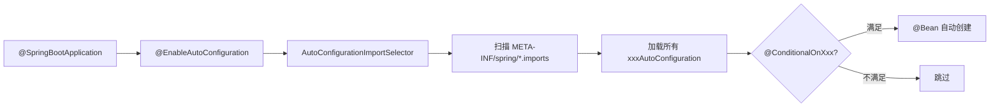

# Spring Boot 自动配置原理

> **一句话**:@SpringBootApplication 中 @EnableAutoConfiguration 触发自动装配——扫描 classpath 下所有 AutoConfiguration 类，满足 @Conditional 条件就自动创建 Bean。

## 核心原理



## 常用条件注解

| 注解 | 条件 |
|------|------|
| @ConditionalOnClass | classpath 有指定类 |
| @ConditionalOnMissingClass | classpath 没有指定类 |
| @ConditionalOnBean | 容器中有指定 Bean |
| @ConditionalOnMissingBean | 容器中没有指定 Bean |
| @ConditionalOnProperty | 配置项有指定值 |
| @ConditionalOnWebApplication | 是 Web 应用 |

## @SpringBootApplication 拆解

```java
@SpringBootConfiguration   // = @Configuration，标记为配置类
@EnableAutoConfiguration   // ← 核心！触发自动装配
@ComponentScan             // 扫描当前包及子包的 @Component
public @interface SpringBootApplication {}
```

## 配置优先级（从高到低）

1. 命令行参数 `--server.port=9090`
2. 环境变量
3. `application-{profile}.yml`
4. `application.yml`
5. `@PropertySource` 引入的配置
6. Spring Boot 默认值

## @ConfigurationProperties vs @Value

| | @ConfigurationProperties | @Value |
|------|------------------------|--------|
| 注入 | 批量（按前缀） | 单个 |
| 松散绑定 | ✅ | ❌ |
| JSR303 校验 | ✅ | ❌ |
| SpEL | ❌ | ✅ |
| 适用 | 一组配置（如数据源） | 单个值（如端口） |

## 面试追问

**Q: Spring Boot 比 Spring MVC 好在哪里？**
A: 两个核心——**自动配置**（不用手动配 DispatcherServlet、数据源等）+ **内嵌 Tomcat**（直接 main() 启动，部署打 jar 包即可）。还有 starter 一站式依赖管理。

**Q: 怎么自定义一个 Starter？**
A: 三步：写一个 AutoConfiguration 类（@Configuration + @Conditional）+ 在 spring.factories 中注册 + 打包。别人引入你的 starter 后自动装配。
