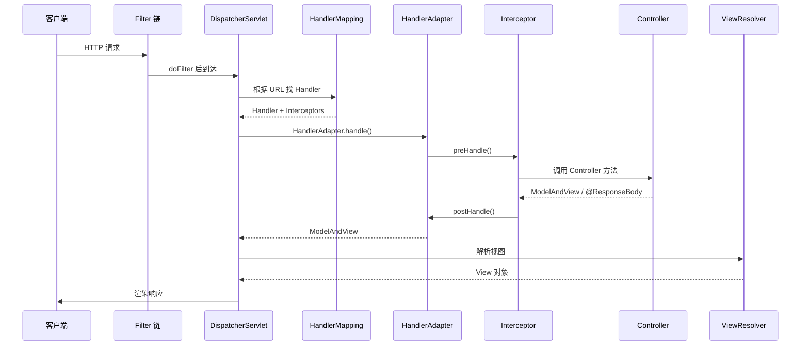

# Spring MVC 请求处理流程

> **一句话**:客户端 HTTP 请求 → Filter 链 → DispatcherServlet → HandlerMapping 找 Handler → HandlerAdapter 执行 → Controller 返回 → 视图渲染。

## 完整链路



## 核心组件

| 组件 | 作用 |
|------|------|
| DispatcherServlet | 前端总控，所有请求入口 |
| HandlerMapping | 根据 URL 找对应的 Controller 方法 |
| HandlerAdapter | 真正调用 Controller 方法（适配器模式） |
| HandlerInterceptor | 前置/后置拦截 |
| ViewResolver | 逻辑视图名 → 物理视图 |
| HttpMessageConverter | @ResponseBody 时把对象转 JSON |

## Filter vs Interceptor

| | Filter | Interceptor |
|------|--------|-------------|
| 规范 | Servlet | Spring |
| 容器 | Servlet 容器管理 | Spring IOC 管理 |
| 范围 | 所有请求 | 只拦截进入 DispatcherServlet 的 |
| 能力 | 只能操作 request/response | 可访问 Handler、ModelAndView |

执行顺序：`Filter → DispatcherServlet → Interceptor → Controller`

## @ResponseBody 怎么变成 JSON？

```java
@RestController  // = @Controller + @ResponseBody
public class OrderController {
    @GetMapping("/order/{id}")
    public Order getOrder(@PathVariable Long id) {
        return orderService.getById(id);
        // 返回值 Order 对象 → HttpMessageConverter → JSON 字符串
    }
}
// 流程：Controller 方法返回对象
// → AbstractMessageConverterMethodProcessor
// → 遍历 HttpMessageConverter 列表
// → MappingJackson2HttpMessageConverter 匹配
// → ObjectMapper.writeValueAsString() → JSON
```

## @RestController vs @Controller

| | @Controller | @RestController |
|------|------------|----------------|
| 返回值 | 视图名（页面跳转） | JSON（REST API） |
| @ResponseBody | 需要手动加 | 自动包含 |
| 使用 | SSR 页面渲染 | **前后端分离（主流）** |
