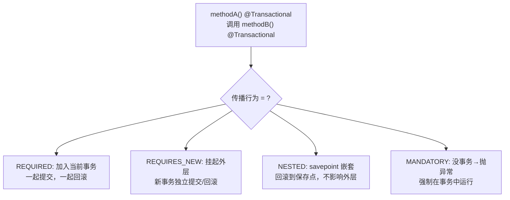

# Spring 事务传播机制

> **一句话**:传播行为控制「一个事务方法被另一个事务方法调用时」怎么处理——加入已有事务、新建事务、还是抛异常。

## 七种传播行为

| 传播行为 | 当前有事务 | 当前没事务 | 典型场景 |
|---------|-----------|-----------|---------|
| **REQUIRED**（默认） | **加入当前** | 新建 | 增删改查，90%场景 |
| **REQUIRES_NEW** | **挂起当前，新建** | 新建 | 日志独立提交 |
| **NESTED** | 嵌套（savepoint） | 新建 | 批量处理，部分失败不影响全部 |
| SUPPORTS | 加入 | 无事务 | 查询（有就读最新） |
| NOT_SUPPORTED | 挂起，无事务 | 无事务 | 纯计算 |
| MANDATORY | 加入 | **抛异常** | 必须在事务中（扣库存） |
| NEVER | **抛异常** | 无事务 | 必须在无事务环境 |

## 代码实战

### 场景1：日志必须独立提交

```java
@Service
public class OrderService {
    @Autowired private LogService logService;

    @Transactional  // REQUIRED
    public void createOrder(Order order) {
        orderDao.insert(order);
        logService.record("创建订单");  // 即使外层回滚，日志也保留了
    }
}

@Service
public class LogService {
    @Transactional(propagation = Propagation.REQUIRES_NEW)
    public void record(String msg) {
        logDao.insert(msg);  // 独立事务！外层回滚不影响
    }
}
```

### 场景2：批量处理，失败不连坐

```java
@Service
public class ItemService {
    @Transactional(propagation = Propagation.REQUIRES_NEW)
    public void processOne(Item item) {
        // 每条独立事务，失败不影响其他
    }
}
```

## 事务失效三大场景

| 场景 | 原因 | 解决 |
|------|------|------|
| `this.methodB()` | 绕过了 AOP 代理 | 注入自己，用代理对象调 |
| catch 吞异常 | Spring 感知不到异常 | 手动回滚或抛出 RuntimeException |
| private 方法 | CGLIB 无法代理私有方法 | 改为 public |

## 原理图解



## 面试追问

**Q: REQUIRES_NEW 和 NESTED 的区别？**
A: REQUIRES_NEW 是独立事务，外层和内层完全无关（各管各的 commit/rollback）。NESTED 依赖 savepoint，外层回滚会连累内层。

**Q: 为什么同类方法调用 @Transactional 不生效？**
A: Spring AOP 代理是方法级别的。`this.methodB()` 绕过了代理对象，直接调用了原始 Bean 的方法。注入自己用 `self.methodB()` 或抽到另一个 Service。

## 参考来源

- 面试突击手册 Spring 章节
- JavaGuide: `docs/system-design/framework/spring/spring-transaction.md`
