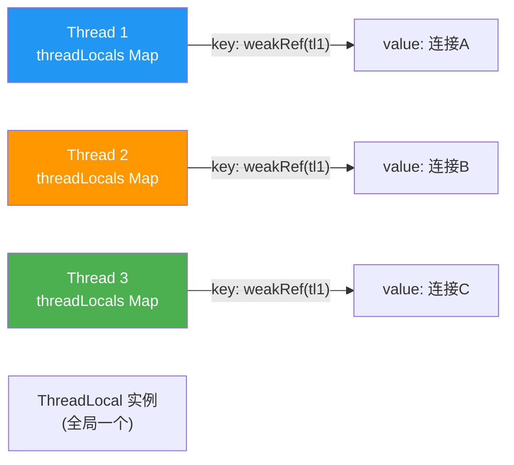

# ThreadLocal 线程本地变量

> **一句话**:ThreadLocal 让每个线程拥有自己独立的变量副本,线程间互不干扰。常用于:数据库连接、事务、日期格式化、用户上下文等。

## 核心概念

### 工作原理



> **关键**:ThreadLocal 自己**不存数据**。数据存在每个线程的 `ThreadLocalMap` 里(Thread 的成员变量)。ThreadLocal 实例只是 Map 的 **key**(弱引用),value 才是真正的数据。

### 存储结构

每个 Thread 对象内部有一个 `ThreadLocal.ThreadLocalMap`:
```
Thread
└── threadLocals: ThreadLocalMap
    ├── Entry(ThreadLocal<?> key, Object value)   // key 是弱引用
    ├── Entry(...)
    └── ...
```

### 内存泄漏风险

| 引用关系 | 类型 | 影响 |
|---------|------|------|
| Thread → ThreadLocalMap | 强引用 | 线程存活期间 Map 不回收 |
| Entry.key → ThreadLocal | **弱引用** | ThreadLocal 没有强引用时可被 GC |
| Entry.value → Object | **强引用** | key 被 GC 后 value 不会被自动回收! |

```mermaid
flowchart TD
    START["ThreadLocal tl = new ThreadLocal()"] --> USE["tl.set(value)"]
    USE --> REF["外部强引用指向 tl"]
    REF --> ALIVE["key=弱引用(tl)→ tl 存活 → value 也存活"]
    REF -->|tl = null(外部置空)| GC["TL 被 GC 回收"]
    GC --> LEAK["key=null, value 仍在!<br/>内存泄漏!"]
    LEAK --> FIX{调用 remove()?}
    FIX -- 是 --> CLEAN["Entry 被清理"]
    FIX -- 否 --> LEAK2["线程不销毁就永远泄漏<br/>(线程池场景尤其危险!)"]
    style LEAK fill:#F44336,color:#fff
    style CLEAN fill:#4CAF50,color:#fff
```

## 原理图解

### get/set 内部逻辑

```mermaid
sequenceDiagram
    participant T as 当前线程
    participant MAP as ThreadLocalMap
    participant TL as ThreadLocal 实例

    Note over T,MAP: tl.set(value)
    T->>MAP: 获取当前线程的 threadLocals Map
    MAP->>MAP: 以 TL 为 key 查找 Entry
    MAP-->>MAP: 找到 → 更新 value;没找到 → 新建 Entry
    MAP-->>T: 设置完成

    Note over T,MAP: tl.get()
    T->>MAP: 获取当前线程的 threadLocals Map
    MAP->>MAP: 以 TL 为 key 查找 Entry
    MAP-->>T: 返回 value(属于当前线程的副本)
```

## 代码实例

### 实例 1:数据库连接管理(经典场景)

```java
public class ConnectionManager {
    // 每个线程有自己的连接,互不干扰
    private static ThreadLocal<Connection> connHolder = new ThreadLocal<>();

    public static Connection get() {
        Connection conn = connHolder.get();
        if (conn == null) {
            conn = DriverManager.getConnection("jdbc:mysql://...");
            connHolder.set(conn);
        }
        return conn;  // 当前线程始终拿到同一个连接
    }

    // 用完必须 remove!
    public static void close() {
        Connection conn = connHolder.get();
        if (conn != null) {
            conn.close();
            connHolder.remove();  // ★ 关键! 防止线程池复用时泄漏
        }
    }
}
```

### 实例 2:SimpleDateFormat 线程安全方案

```java
// SimpleDateFormat 不是线程安全的!
// 错误: static SimpleDateFormat sdf = new SimpleDateFormat("yyyy-MM-dd");

// 方案1: ThreadLocal(每次创建新实例,线程安全但略浪费)
private static ThreadLocal<SimpleDateFormat> sdf =
    ThreadLocal.withInitial(() -> new SimpleDateFormat("yyyy-MM-dd"));

// 方案2: 用 DateTimeFormatter(Java 8+,线程安全,推荐)
private static DateTimeFormatter fmt = DateTimeFormatter.ofPattern("yyyy-MM-dd");
```

### 实例 3:验证线程隔离

```java
public class ThreadLocalDemo {
    static ThreadLocal<Integer> tl = new ThreadLocal<>();

    public static void main(String[] args) throws Exception {
        tl.set(100);
        System.out.println("主线程: " + tl.get());  // 100

        new Thread(() -> {
            tl.set(200);
            System.out.println("子线程: " + tl.get());  // 200,互不影响
        }).start();

        Thread.sleep(100);
        System.out.println("主线程: " + tl.get());  // 还是 100
    }
}
```

## 常见误区 / 面试点

- **误区:ThreadLocal 本身存数据** → 不存。数据在 `Thread.threadLocals` 这个 Map 里,ThreadLocal 只是 Map 的 key。每个线程有自己独立的 Map。
- **误区:线程池里用 ThreadLocal 不用 remove 也没事** → **大错**。线程池的线程是复用的,上一次请求的 ThreadLocal 值会被下一次请求读到!且线程不销毁,value 永远不会 GC → 内存泄漏。**必须在 finally 里 remove**。
- **面试追问:为什么 Entry 的 key 设计成 WeakReference?** → 让 ThreadLocal 在没有外部强引用时能被 GC,避免 ThreadLocal 本身泄漏。但 value 是强引用,key 被回收后 value 仍泄漏,所以还是得手动 remove。
- **面试追问:InheritableThreadLocal 是什么?** → 父线程创建子线程时,自动复制父线程的 ThreadLocal 值给子线程。但有坑:线程池复用线程时,后续提交的子线程"父线程"其实是线程池线程,InheritableThreadLocal 的值是错的。阿里开源的 TransmittableThreadLocal(TTL) 解决了线程池场景的传递问题。

## 参考来源

- JavaGuide: `docs/java/concurrent/threadlocal.md`
