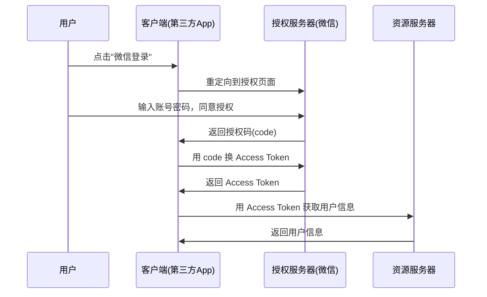

# Web 安全基础

> **一句话**:安全面试不考你写加密算法，考你**常见攻击怎么防**——SQL 注入、XSS、CSRF、JWT。

## SQL 注入

### 怎么防

```java
// ❌ 拼接 SQL → 注入漏洞
String sql = "SELECT * FROM user WHERE name = '" + userName + "'";
// 输入 ' OR '1'='1' -- 
// → SELECT * FROM user WHERE name = '' OR '1'='1' --'   ← 查出了所有用户！

// ✅ 预编译（PreparedStatement）
String sql = "SELECT * FROM user WHERE name = ?";
PreparedStatement ps = conn.prepareStatement(sql);
ps.setString(1, userName);  // 参数化，注入不了

// ✅ MyBatis 用 #{} 不用 ${}
@Select("SELECT * FROM user WHERE name = #{userName}")  // #{}
```

**面试话术**：「SQL 注入的本质是数据和代码没有分离。预编译把 SQL 结构固定下来，用户输入只能作为参数值填入，永远不能改变 SQL 语义。」

---

## XSS（跨站脚本攻击）

### 三种类型

| 类型 | 攻击方式 | 防护 |
|------|---------|------|
| **反射型** | URL 参数嵌 `<script>` 标签 | 输出编码 |
| **存储型** | 评论区存恶意脚本，其他人浏览时触发 | 输出编码 + CSP |
| **DOM 型** | JS 直接操作 DOM 插入恶意内容 | 前端过滤 |

### 防护措施

```java
// 后端：输出时 HTML 转义
String safe = HtmlUtils.htmlEscape(userInput);
// <script>alert(1)</script> → &lt;script&gt;alert(1)&lt;/script&gt;

// 前端：避免 innerHTML，用 textContent
element.textContent = userInput;     // ✅ 安全
element.innerHTML = userInput;       // ❌ 危险
```

---

## CSRF（跨站请求伪造）

```
攻击原理：
  你登录了 bank.com（Cookie 在浏览器里）
  → 访问了 evil.com（恶意网站）
  → evil.com 发了一个隐藏表单 POST bank.com/transfer?to=hacker&amount=10000
  → 浏览器带着你的 Cookie 发出请求
  → bank.com 以为是你本人操作！
```

### 防护

| 方案 | 原理 |
|------|------|
| **CSRF Token** | 服务端生成随机 token，前端请求时带上，服务端校验 |
| **SameSite Cookie** | `Set-Cookie: SameSite=Strict`，跨站请求不带 Cookie |
| **Referer 校验** | 检查请求来源是否是本站 |
| **验证码** | 敏感操作加验证码 |

```java
// Spring Security 默认开启 CSRF 保护
// 前后端分离的话可以关掉 CSRF（改用 Token 鉴权）：
http.csrf().disable();
```

---

## JWT（JSON Web Token）

### 结构

```
eyJhbGciOiJIUzI1NiJ9.eyJ1c2VySWQiOjEyM30.签名
       ↑                    ↑             ↑
    Header                 Payload      Signature
  (算法类型)            (用户数据)    (防篡改)
```

### JWT vs Session

| | JWT | Session |
|------|-----|---------|
| 存储 | **客户端**（浏览器存） | **服务端**（Redis/内存） |
| 扩展 | **天然支持分布式** | 需要共享 Session |
| 注销 | 麻烦（未过期前一直有效） | 删掉就行 |
| 大小 | 有上限（Header 4KB） | 无限制 |
| 安全 | Payload Base64 编码（**明文！**别存敏感信息） | 服务端存，客户端只有 SessionId |

### 使用注意

```java
// ❌ JWT 里别存敏感信息！
// Payload 只是 Base64 编码，不是加密！
{"userId": 123, "role": "admin"}  // 任何人都能解码看到

// ✅ 只存不敏感标识
{"userId": 123}

// ✅ 配合短过期时间 + Refresh Token
Access Token:  15 分钟过期
Refresh Token: 7 天过期（存 Redis，可主动失效）
```

---

## OAuth 2.0



| 模式 | 适用 |
|------|------|
| **授权码模式** | 有后端的应用（最安全） |
| 密码模式 | 自家 App |
| 客户端模式 | 服务间调用 |
| 简化模式 | 纯前端（已不推荐） |

### 面试话术

「安全方面我主要关注 SQL 注入和 XSS——这两个是 OWASP Top 10 的头两号。防注入的核心是用预编译，防 XSS 的核心是对所有用户输入做输出编码。JWT 我们用 Access Token + Refresh Token 双 token 方案，Access Token 15 分钟过期降低泄露风险。」

---

## 常见面试追问

**Q: 密码怎么存？**
A: **只存加密后的**，用 BCrypt（自带盐值，慢 hash 防暴力破解）。千万别存明文，也别用 MD5（太快了，彩虹表秒破）。

```java
String hashed = BCrypt.hashpw(password, BCrypt.gensalt());  // 存这个
boolean match = BCrypt.checkpw(inputPassword, hashed);       // 验证
```

**Q: HTTPS 怎么防中间人攻击？**
A: ① CA 证书验证服务器身份 ② 非对称加密交换对称密钥 ③ 之后用对称加密通信。
