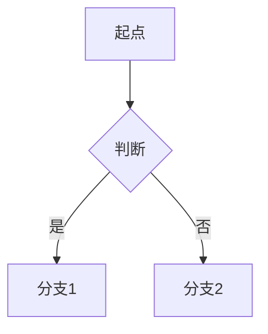

# 文章标题

> **一句话**:这个知识点解决什么问题?为什么要学它?

## 核心概念

（讲透原理,重点是 why。不要罗列八股,要让读者理解机制。）

## 原理图解



（图的类型按内容选:flowchart 流程图 / sequenceDiagram 时序图 / stateDiagram 状态图 / classDiagram 类图 / graph 通用图。每个图都要有简短说明。）

## 代码实例

```java
// 完整可运行的代码 + 关键注释
public class Demo {
    public static void main(String[] args) {
        // 步骤说明
    }
}
// 运行输出:
// xxx
```

（代码要能直接跑,有注释,有预期输出。复杂场景给最小可复现例子。）

## 常见误区 / 面试点

- **误区1**:xxx —— 实际上是 yyy
- **面试追问**:被问到这个知识点时,面试官常追问的方向

## 参考来源

- JavaGuide: `docs/xxx/xxx.md`(借鉴的原篇,只读)
- 官方文档:<链接>
- 相关笔记:`../经验笔记/xxx.md`(如有关联)
