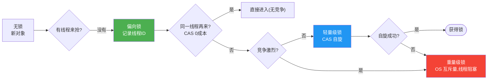
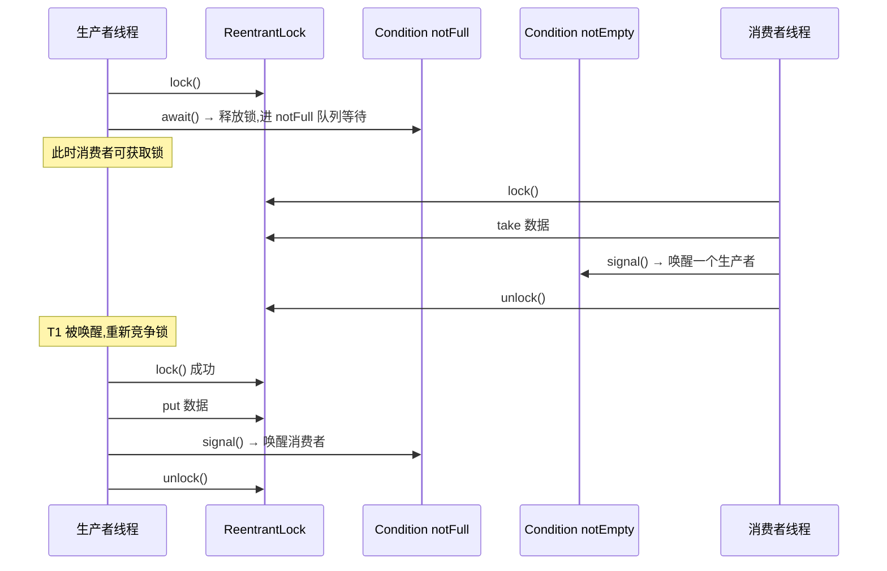

# synchronized 与 Lock

> **一句话**:synchronized 是 Java 内置的关键字锁(简单但不灵活),ReentrantLock 是 API 层面的锁(灵活强大)。两者都是可重入锁,大多数场景 synchronized 够用。

## 核心概念

### synchronized

**JVM 层面**的锁,通过 `monitorenter`/`monitorexit` 字节码指令实现。JDK 1.6 后做了大量优化(锁升级),性能和 ReentrantLock 接近。

用法三种:

```java
// 1. 实例方法:锁的是 this
public synchronized void method() { ... }

// 2. 静态方法:锁的是 Class 对象
public static synchronized void method() { ... }

// 3. 代码块:锁指定对象
synchronized (obj) { ... }
```

### ReentrantLock

**API 层面**的锁(JUC 包),基于 AQS 实现。必须手动加锁/解锁,通常配合 try-finally。

```java
ReentrantLock lock = new ReentrantLock();
lock.lock();
try {
    // 临界区
} finally {
    lock.unlock();  // 必须在 finally 里解锁!
}
```

### 两者对比

| 维度 | synchronized | ReentrantLock |
|------|---------------|---------------|
| 实现层面 | JVM(monitorenter) | Java API(AQS) |
| 锁释放 | 自动(JVM 保证,即使异常) | **手动**(必须 finally unlock) |
| 可中断 | 不可(死等) | `lockInterruptibly()` 可响应中断 |
| 超时 | 不支持 | `tryLock(timeout)` |
| 公平/非公平 | 只能非公平 | 可选 `new ReentrantLock(true)` 公平锁 |
| 条件变量 | 只有一个(wait/notify) | 多个 `newCondition()` |
| 性能 | 1.6 后优化后接近 | 略优(低竞争时) |

## 原理图解

### synchronized 锁升级(1.6+ 优化)



> **偏向锁**:假设只有一个线程用锁,记录线程 ID,后续该线程直接进入,零成本。
> **轻量级锁**:有竞争但短,用 CAS 自旋等待(不阻塞线程,省线程上下文切换)。
> **重量级锁**:竞争激烈,自旋没意义,交由 OS 互斥量,线程挂起/唤醒(开销大)。

> JDK 15 起偏向锁默认禁用(JEP 374),因为现代 JVM 锁竞争模式变了,偏向锁收益下降。

### Lock 的 Condition 精确等待/唤醒



## 代码实例

### 实例 1:synchronized 实现线程安全计数

```java
public class SafeCounter {
    private int count = 0;

    // synchronized 修饰方法,锁 this
    public synchronized void increment() {
        count++;
    }

    public synchronized int getCount() {
        return count;
    }

    public static void main(String[] args) throws Exception {
        SafeCounter c = new SafeCounter();
        Thread[] threads = new Thread[10];
        for (int i = 0; i < 10; i++) {
            threads[i] = new Thread(() -> {
                for (int j = 0; j < 10000; j++) c.increment();
            });
            threads[i].start();
        }
        for (Thread t : threads) t.join();
        System.out.println("count = " + c.getCount());  // 100000
    }
}
```

### 实例 2:ReentrantLock 实现超时获取 + 可中断

```java
ReentrantLock lock = new ReentrantLock();

// tryLock:等 3 秒,拿不到就放弃
if (lock.tryLock(3, TimeUnit.SECONDS)) {
    try {
        // 拿到锁,执行业务
    } finally {
        lock.unlock();
    }
} else {
    System.out.println("3秒没拿到锁,放弃");
}

// lockInterruptibly:等待时其他线程 interrupt 它,立刻抛异常退出
try {
    lock.lockInterruptibly();
    try { /* 业务 */ } finally { lock.unlock(); }
} catch (InterruptedException e) {
    System.out.println("等锁时被中断,优雅退出");
}
```

> synchronized 等锁时不可中断 —— 可能永久阻塞。ReentrantLock 的 tryLock/lockInterruptibly 解决了这个问题。

## 常见误区 / 面试点

- **误区:synchronized 就是慢,ReentrantLock 就是快** → 1.6 后 synchronized 锁升级优化后,两者性能接近。低竞争时 synchronized 甚至更快(JVM 内置,无 API 调用开销)。优先用 synchronized,需要超时/中断/多条件才用 ReentrantLock。
- **误区:锁同一个对象的不同方法会互相阻塞** → 看 synchronized 锁的是什么。实例方法锁 this(不同对象实例不互斥),静态方法锁 Class(全局互斥),代码块锁指定对象。
- **面试追问:synchronized 锁升级过程?** → 无锁 → 偏向锁(单线程) → 轻量级锁(CAS 自旋) → 重量级锁(OS 互斥)。升级不可逆。
- **面试追问:什么是死锁?怎么避免?** → 两个线程互相持有对方需要的锁,都等对方释放,永远等下去。避免:① 固定加锁顺序;② tryLock 超时;③ jstack/VisualVM 检测。
- **面试追问:ReentrantLock 的公平性?** → 公平锁按等待队列顺序获锁(先到先得),非公平锁新来的线程直接 CAS 抢(可能插队)。非公平锁性能更好(减少线程切换),默认非公平。

## 参考来源

- JavaGuide: `docs/java/concurrent/java-lock.md`
- JavaGuide: `docs/java/concurrent/optimistic-lock-and-pessimistic-lock.md`
