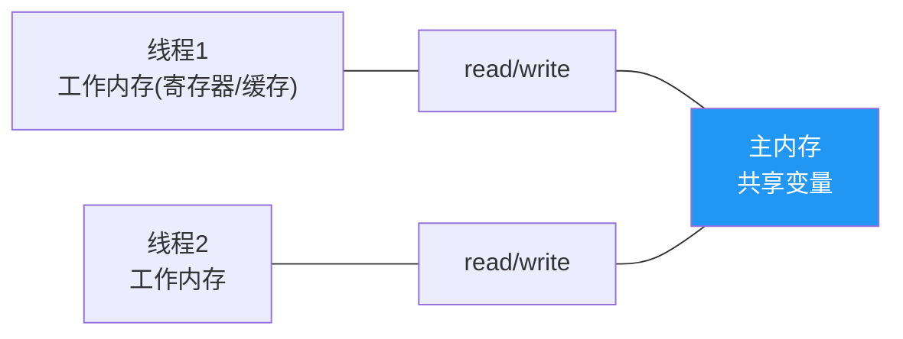
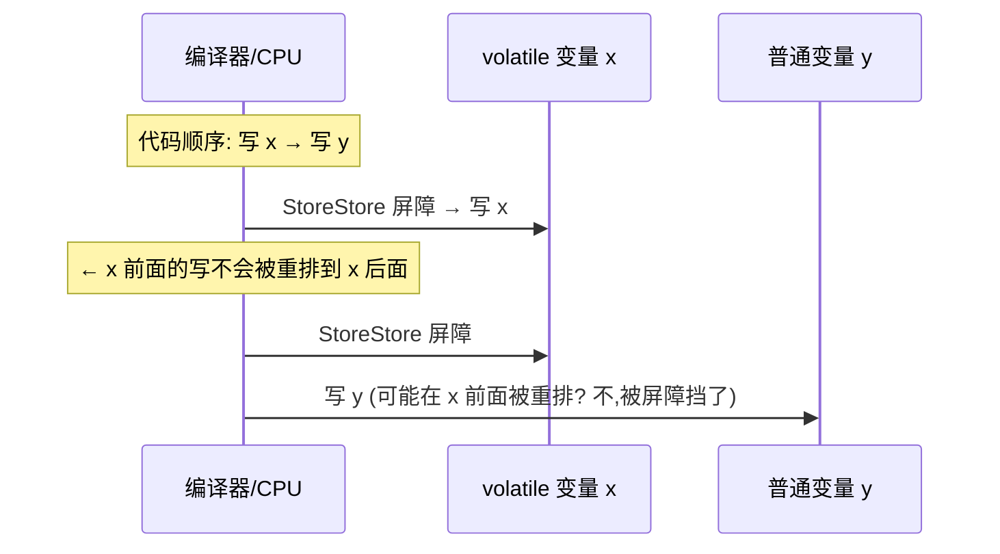
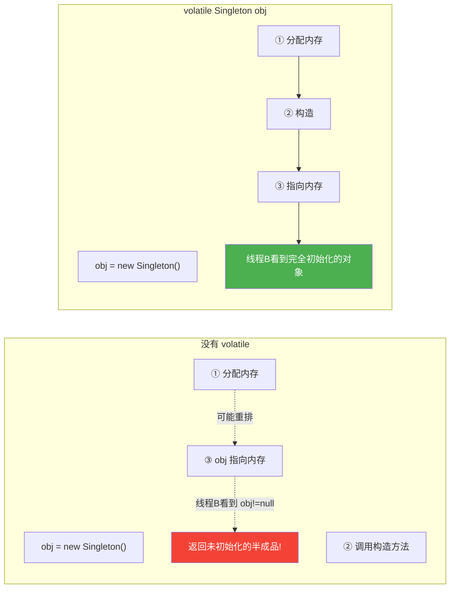

# volatile 与 Java 内存模型

> **一句话**:volatile 保证变量的**可见性**(一个线程改了,其他线程立即可见)和**有序性**(禁止指令重排),但不保证原子性(`count++` 仍不安全)。

## 核心概念

### JMM(Java Memory Model)

JMM 规定了线程如何与主内存交互:



**问题**:线程读变量到自己的工作内存(缓存),修改后不立即写回主内存 → 其他线程看到的还是旧值(**可见性问题**)。JVM/CPU 还会重排指令 → **有序性问题**。

### 三大特性

| 特性 | 含义 | volatile | synchronized | Lock | Atomic |
|------|------|----------|-------------|------|--------|
| **原子性** | 操作不可分割 | ✗(除 long/double) | ✅ | ✅ | ✅(CAS) |
| **可见性** | 线程间修改立即可见 | ✅ | ✅ | ✅ | ✅ |
| **有序性** | 禁止指令重排 | ✅ | ✅ | ✅ | - |

### volatile 的两大语义

1. **可见性**:写 volatile 变量时,立即刷新到主内存;读 volatile 变量时,从主内存读(不使用线程缓存)。
2. **有序性**:插入**内存屏障**(Memory Barrier),禁止编译器/CPU 重排 volatile 前后的指令。

### volatile 不保证原子性!

```java
volatile int count = 0;

// 线程1 执行 count++,实际是3步:
// 1. 读 count (从主内存)
// 2. +1
// 3. 写 count (回主内存)
// 步骤2不是原子操作!两个线程同时读到 count=5,各自+1,都写6,丢失一次

// 正确方案:AtomicInteger 或 synchronized
```

## 原理图解

### 指令重排与内存屏障



> volatile 写前面插入 StoreStore 屏障(保证前面的写先完成),后面插入 StoreLoad 屏障(保证后面的读看到最新值)。

### 单例模式(DCL)的 volatile 必要性



## 代码实例

### 实例 1:volatile 保证可见性

```java
public class VolatileDemo {
    // 没有 volatile,程序可能永远不会退出(主线程看不到 flag 变化)
    volatile boolean flag = false;

    public static void main(String[] args) throws Exception {
        VolatileDemo d = new VolatileDemo();
        new Thread(() -> {
            while (!d.flag) { /* 空转 */ }
            System.out.println("检测到 flag=true,退出");
        }).start();

        Thread.sleep(100);
        d.flag = true;
        System.out.println("主线程设 flag=true");
    }
}
// 输出:
// 主线程设 flag=true
// 检测到 flag=true,退出
```

### 实例 2:DCL 双重检查锁单例(volatile 关键)

```java
public class Singleton {
    // volatile 必须!防止指令重排导致返回半初始化对象
    private static volatile Singleton instance;

    public static Singleton getInstance() {
        if (instance == null) {                   // 第一次检查(无锁,快速返回)
            synchronized (Singleton.class) {
                if (instance == null) {            // 第二次检查(锁内,防止重复创建)
                    instance = new Singleton();   // ← volatile 防止这里重排
                }
            }
        }
        return instance;
    }
}
```

## 常见误区 / 面试点

- **误区:volatile 变量的复合操作是原子的** → 不是。`count++`、`if(count==0) count=1` 都不是原子操作。需要用 Atomic 或锁。
- **误区:volatile 能代替 synchronized** → 不能。volatile 只保证单个读/写操作的可见性和有序性,不保证复合操作的原子性。
- **面试追问:什么场景用 volatile?** → ① 状态标志(如 `volatile boolean running`);② DCL 单例;③ `AtomicInteger` 内部也用 volatile。
- **面试追问:happens-before 原则是什么?** → JMM 定义的一组规则,保证操作 A 先于操作 B 执行时的可见性。8 条规则,最常用:① volatile 写 → volatile 读;② unlock → lock;③ 线程 start → 线程操作;④ Thread.join() 返回 → 之前所有操作。

## 参考来源

- JavaGuide: `docs/java/concurrent/jmm.md`
- JavaGuide: `docs/java/concurrent/cas.md`
