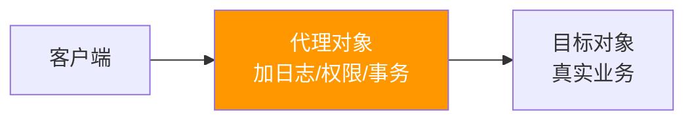
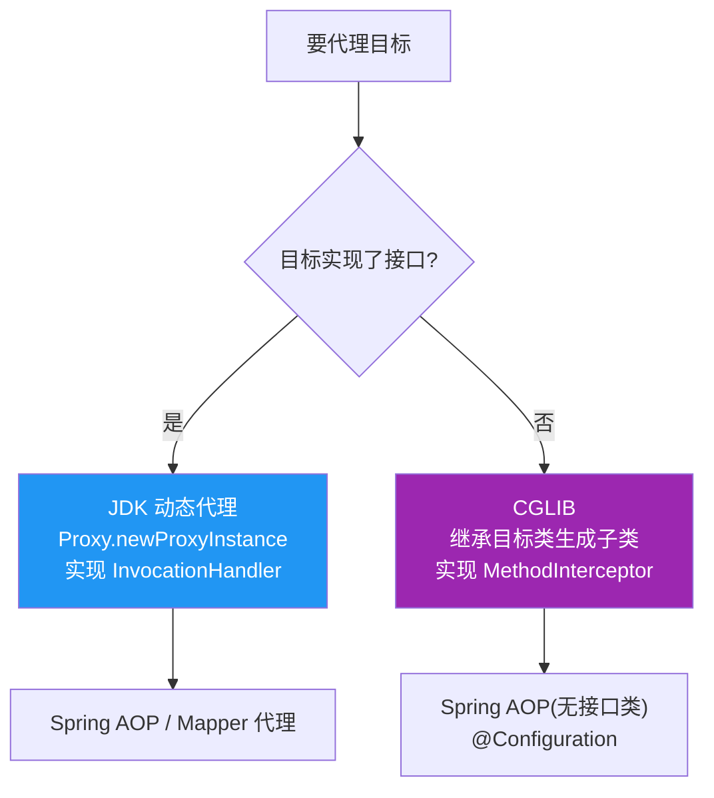
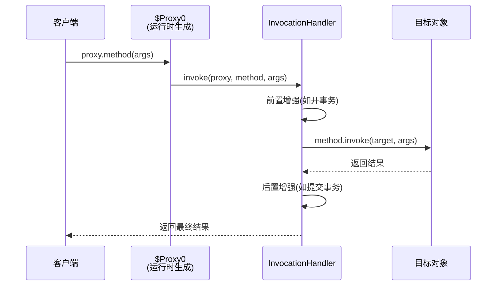

# 代理模式

> **一句话**:代理在不改变原对象代码的前提下,包一层"增强逻辑"。Spring AOP、MyBatis Mapper、RPC 远程调用都靠它。

## 核心概念

### 代理的本质



客户端不直接访问目标,而是通过代理 —— 代理在调用目标前后做增强(日志、事务、权限、缓存等)。**目标对象代码完全不用改**。

### 三种代理实现

| 类型 | 原理 | 要求 | 典型场景 |
|------|------|------|---------|
| **静态代理** | 手写代理类,实现同接口 | 接口 | 演示理解(实战不用) |
| **JDK 动态代理** | `Proxy.newProxyInstance` 运行时生成接口的实现类 | **目标必须有接口** | Spring AOP(默认) |
| **CGLIB 代理** | 运行时生成目标类的**子类** | 不需要接口,但 final 类/方法不能代理 | Spring AOP(无接口时)、MyBatis |

### JDK 动态代理 vs CGLIB



## 原理图解

### JDK 动态代理的调用链



> 运行时 JVM 生成 `$Proxy0` 类,它实现了目标的所有接口,每个方法都调用 `InvocationHandler.invoke`。

## 代码实例

### 实例 1:静态代理(理解原理)

```java
interface UserService {
    void save();
}

class UserServiceImpl implements UserService {
    public void save() { System.out.println("保存用户"); }
}

// 手写代理类:实现同接口,持有目标引用,加增强
class UserServiceProxy implements UserService {
    private UserService target;
    public UserServiceProxy(UserService target) { this.target = target; }
    public void save() {
        System.out.println("[代理] 开启事务");
        target.save();                                  // 调用真实对象
        System.out.println("[代理] 提交事务");
    }
}

public class StaticProxyDemo {
    public static void main(String[] args) {
        UserService proxy = new UserServiceProxy(new UserServiceImpl());
        proxy.save();
    }
}
// 输出:
// [代理] 开启事务
// 保存用户
// [代理] 提交事务
```

**缺点**:每个目标类都要手写一个代理类,接口方法一多就爆炸。

### 实例 2:JDK 动态代理(一个 handler 代理所有接口)

```java
import java.lang.reflect.*;

class LogHandler implements InvocationHandler {
    private Object target;  // 被代理的原始对象
    public LogHandler(Object target) { this.target = target; }

    @Override
    public Object invoke(Object proxy, Method method, Object[] args) throws Throwable {
        System.out.println("[日志] 调用 " + method.getName());
        long start = System.currentTimeMillis();
        Object result = method.invoke(target, args);   // 真实调用
        System.out.println("[日志] 耗时 " + (System.currentTimeMillis() - start) + "ms");
        return result;
    }
}

public class JdkProxyDemo {
    public static void main(String[] args) {
        UserService target = new UserServiceImpl();
        UserService proxy = (UserService) Proxy.newProxyInstance(
                target.getClass().getClassLoader(),      // 类加载器
                target.getClass().getInterfaces(),       // 目标实现的接口
                new LogHandler(target));                 // 调用处理器
        proxy.save();
    }
}
```

> 同一个 `LogHandler` 可以代理任何接口(只要传不同 target),解决了静态代理的代码爆炸。

### 实例 3:CGLIB 代理(不依赖接口)

```java
import net.sf.cglib.proxy.*;

class LogInterceptor implements MethodInterceptor {
    @Override
    public Object intercept(Object obj, Method method, Object[] args, MethodProxy proxy) throws Throwable {
        System.out.println("[CGLIB] 调用 " + method.getName());
        return proxy.invokeSuper(obj, args);  // 调用父类(原目标)方法
    }
}

public class CglibDemo {
    public static void main(String[] args) {
        Enhancer enhancer = new Enhancer();
        enhancer.setSuperclass(OrderService.class);    // 目标类作为父类
        enhancer.setCallback(new LogInterceptor());
        OrderService proxy = (OrderService) enhancer.create();  // 生成子类
        proxy.createOrder();
    }
}
```

> CGLIB 生成的是目标类的**子类**,所以 final 类、final 方法无法代理(不能继承)。

## 常见误区 / 面试点

- **误区:动态代理性能比静态代理差** → CGLIB 用 FastClass 机制避免反射调用,性能接近甚至超过 JDK 动态代理。现代 Spring AOP 中 CGLIB 是首选(因为 SpringBoot 默认开 `proxy-target-class=true`)。
- **误区:JDK 动态代理必须实现接口** → 正确。它生成的是接口实现类,没接口就没法代理。这也是为什么有 CGLIB 补充。
- **面试追问:Spring AOP 同类内部调用为什么失效?** → 因为内部调用是 `this.method()`,绕过了代理对象,AOP 增强不生效。解决:注入自己的代理(`@Autowired` 自己,或 `AopContext.currentProxy()`)。
- **面试追问:CGLIB 为什么不能代理 final 方法?** → CGLIB 靠继承重写方法加增强,final 方法不能被子类重写,所以无法代理。

## 参考来源

- JavaGuide: `docs/java/basis/proxy.md`
- 相关: [IoC与AOP](../03-框架/01-Spring/IoC与AOP.md)(AOP 的底层就是动态代理)
