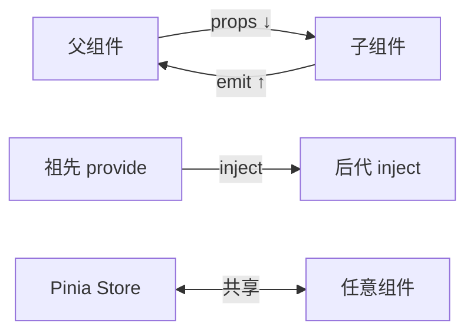

# 全栈开发面试基础 — Vue3 + TypeScript

> **一句话**:全栈面试前端考得不深，但必须有——Vue3 响应式原理、组件通信、TypeScript 类型体操、HTTP/REST 设计。

## Vue3 响应式原理

### Vue2 vs Vue3

| | Vue2 | Vue3 |
|------|------|------|
| 实现 | `Object.defineProperty` | **Proxy** |
| 数组监听 | 需要重写数组方法（push/pop等） | 原生支持 |
| 新增属性 | `$set()` 手动添加 | 自动追踪 |
| 性能 | 递归遍历所有属性 | 懒代理（用到才代理） |

```typescript
// Vue3 响应式核心原理（简化版）
function reactive<T extends object>(obj: T): T {
    return new Proxy(obj, {
        get(target, key, receiver) {
            track(target, key);  // 收集依赖
            return Reflect.get(target, key, receiver);
        },
        set(target, key, value, receiver) {
            const result = Reflect.set(target, key, value, receiver);
            trigger(target, key);  // 触发更新
            return result;
        }
    });
}
// track: 记录「谁在用这个数据」
// trigger: 数据变了→通知所有使用者更新
```

### ref vs reactive

| | ref | reactive |
|------|-----|----------|
| 包装类型 | 基本类型 + 对象 | 只限对象 |
| 访问 | `.value` | 直接访问 |
| 解构 | 不丢响应式 | **会丢**！需 `toRefs()` |
| 使用 | 简单场景 | 复杂对象 |

### computed vs watch

| | computed | watch |
|------|----------|------|
| 用途 | **派生状态**（依赖变化自动算） | **副作用**（数据变化后做事） |
| 缓存 | ✅ 依赖不变不重新算 | 无缓存 |
| 异步 | ❌ 不支持 | ✅ 支持 |

```typescript
// computed：计算总价
const total = computed(() => items.value.reduce((s, i) => s + i.price, 0));

// watch：搜索关键词变化时调接口
watch(keyword, async (newVal) => {
    results.value = await searchAPI(newVal);
});
```

## 组件通信



| 方式 | 场景 |
|------|------|
| props + emit | 父子组件直接通信 |
| provide/inject | 跨层级（祖先→后代），不经过中间组件 |
| **Pinia / Vuex** | 全局状态（用户信息、购物车） |
| eventBus（不推荐） | Vue3 已废弃 |

## Vue3 生命周期

```typescript
// Composition API（setup 里直接用）
onBeforeMount(() => { /* 挂载前 */ });
onMounted(() => { /* 挂载后 → 调接口 */ });
onBeforeUpdate(() => { /* 更新前 */ });
onUpdated(() => { /* 更新后 */ });
onBeforeUnmount(() => { /* 卸载前 → 清理定时器 */ });
onUnmounted(() => { /* 卸载后 */ });
```

## Vite vs Webpack

| | Webpack | Vite |
|------|---------|------|
| 启动 | 慢（打包整个项目） | **秒启**（ESM 按需编译） |
| HMR | 随项目变大变慢 | 极快（只替换改动的模块） |
| 构建 | Webpack/Babel | **esbuild**（Go 写的，快 10-100x） |
| 生态 | 巨无霸 | 快速增长，Vue 官方推荐 |

## TypeScript 面试要点

### 常用工具类型

```typescript
// Partial：所有属性变可选
type PartialUser = Partial<User>;  // { id?: number; name?: string }

// Pick：挑几个属性
type UserBrief = Pick<User, 'id' | 'name'>;  // { id: number; name: string }

// Omit：删掉几个属性
type UserWithoutPassword = Omit<User, 'password'>;

// Record：构造 key-value 类型
type Cache = Record<string, User>;

// ReturnType：取函数返回值类型
type Result = ReturnType<typeof getUser>;

// 泛型约束
function getProperty<T, K extends keyof T>(obj: T, key: K): T[K] {
    return obj[key];
}
```

### interface vs type

| | interface | type |
|------|-----------|------|
| 合并声明 | ✅ 同名自动合并 | ❌ |
| 继承 | `extends` | `&` 交叉类型 |
| 联合类型 | ❌ | ✅ `type Status = 'on' \| 'off'` |
| 使用 | **优先 interface** | 需要联合类型/元组时用 type |

---

## HTTP/REST API 设计

### RESTful 规范

```
GET    /api/v1/users          # 列表
GET    /api/v1/users/123      # 详情
POST   /api/v1/users          # 创建
PUT    /api/v1/users/123      # 全量更新
PATCH  /api/v1/users/123      # 部分更新
DELETE /api/v1/users/123      # 删除
```

### 统一响应格式

```typescript
interface ApiResponse<T> {
    code: number;      // 0 成功，非 0 失败
    message: string;
    data: T;
    timestamp: number;
}
```

### 分页参数

```
GET /api/v1/orders?page=1&size=20&sort=create_time,desc
```

### 状态码使用

| 方法 | 成功 | 失败 |
|------|:--:|------|
| GET | 200 | 404 |
| POST | **201** Created | 400 |
| PUT | 200 | 400/404 |
| DELETE | **204** No Content | 404 |

---

## 前端性能优化

| 优化 | 原理 | 工具 |
|------|------|------|
| **路由懒加载** | 首屏只加载当前页面 | `() => import('./Page.vue')` |
| **组件异步** | 大组件按需加载 | `defineAsyncComponent` |
| **虚拟列表** | 只渲染可视区域 | vue-virtual-scroller |
| **图片懒加载** | 滚到才加载 | `loading="lazy"` |
| **CDN** | 静态资源就近访问 | 阿里云 CDN |

---

## 面试话术

「我前端主要用 Vue3 + TypeScript + Pinia + Vite，后端 Java Spring Boot。全栈的优势是理解前后端全链路——设计接口时就知道前端怎么用、数据怎么展示，不会设计出前端没法用的接口。另外 TypeScript 的类型系统让前后端共享类型定义，减少联调时的字段对不上问题。」
